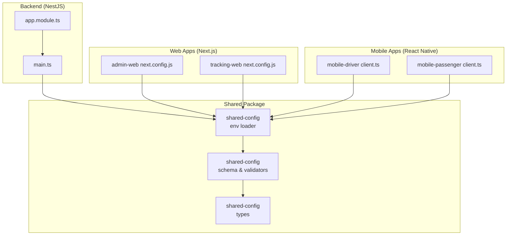
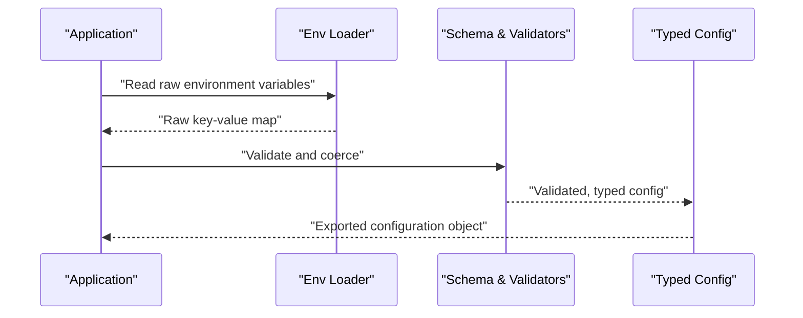
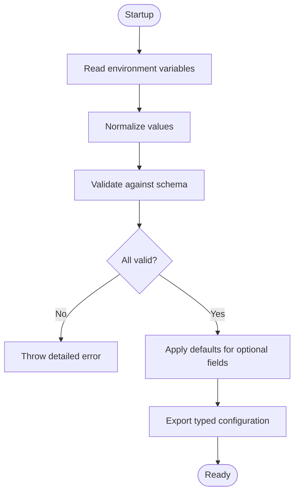
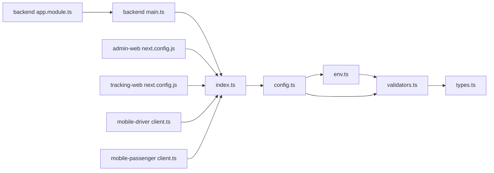

# Configuration Management

<cite>
**Referenced Files in This Document**
- [package.json](file://packages/shared-config/package.json)
- [src/index.ts](file://packages/shared-config/src/index.ts)
- [src/config.ts](file://packages/shared-config/src/config.ts)
- [src/env.ts](file://packages/shared-config/src/env.ts)
- [src/validators.ts](file://packages/shared-config/src/validators.ts)
- [src/types.ts](file://packages/shared-config/src/types.ts)
- [apps/backend/src/main.ts](file://apps/backend/src/main.ts)
- [apps/backend/src/app.module.ts](file://apps/backend/src/app.module.ts)
- [apps/admin-web/next.config.js](file://apps/admin-web/next.config.js)
- [apps/tracking-web/next.config.js](file://apps/tracking-web/next.config.js)
- [apps/mobile-driver/src/api/client.ts](file://apps/mobile-driver/src/api/client.ts)
- [apps/mobile-passenger/src/api/client.ts](file://apps/mobile-passenger/src/api/client.ts)
</cite>

## Table of Contents
1. [Introduction](#introduction)
2. [Project Structure](#project-structure)
3. [Core Components](#core-components)
4. [Architecture Overview](#architecture-overview)
5. [Detailed Component Analysis](#detailed-component-analysis)
6. [Dependency Analysis](#dependency-analysis)
7. [Performance Considerations](#performance-considerations)
8. [Troubleshooting Guide](#troubleshooting-guide)
9. [Conclusion](#conclusion)
10. [Appendices](#appendices)

## Introduction
This document explains the configuration management package used across the repository’s applications and services. It covers environment variable handling, configuration validation, default value management, schema enforcement, type safety, error handling strategies, security considerations for sensitive data, and environment-specific overrides. It also provides examples of how different apps consume configuration values.

## Project Structure
The configuration management is implemented as a shared package consumed by multiple applications:
- Backend (NestJS): loads configuration at startup and injects it into modules.
- Web apps (Next.js): read environment variables via Next.js runtime APIs.
- Mobile apps (React Native): read environment variables via React Native APIs.

**Diagram sources**
- [src/index.ts](file://packages/shared-config/src/index.ts)
- [src/config.ts](file://packages/shared-config/src/config.ts)
- [src/env.ts](file://packages/shared-config/src/env.ts)
- [src/validators.ts](file://packages/shared-config/src/validators.ts)
- [src/types.ts](file://packages/shared-config/src/types.ts)
- [apps/backend/src/main.ts](file://apps/backend/src/main.ts)
- [apps/backend/src/app.module.ts](file://apps/backend/src/app.module.ts)
- [apps/admin-web/next.config.js](file://apps/admin-web/next.config.js)
- [apps/tracking-web/next.config.js](file://apps/tracking-web/next.config.js)
- [apps/mobile-driver/src/api/client.ts](file://apps/mobile-driver/src/api/client.ts)
- [apps/mobile-passenger/src/api/client.ts](file://apps/mobile-passenger/src/api/client.ts)

**Section sources**
- [package.json](file://packages/shared-config/package.json)
- [src/index.ts](file://packages/shared-config/src/index.ts)

## Core Components
- Environment loader: reads raw environment variables and normalizes them to typed values.
- Schema and validators: define required fields, types, constraints, and derive defaults.
- Types: TypeScript interfaces that enforce compile-time safety.
- Public API: exports a single configuration object with validated, typed values.

Key responsibilities:
- Centralize all configuration access.
- Fail fast on missing or invalid configuration.
- Provide sensible defaults where appropriate.
- Keep secrets out of logs and non-secret code paths.

**Section sources**
- [src/env.ts](file://packages/shared-config/src/env.ts)
- [src/validators.ts](file://packages/shared-config/src/validators.ts)
- [src/types.ts](file://packages/shared-config/src/types.ts)
- [src/config.ts](file://packages/shared-config/src/config.ts)
- [src/index.ts](file://packages/shared-config/src/index.ts)

## Architecture Overview
The configuration system follows a layered approach:
- Raw env layer: reads process/environment variables.
- Validation layer: enforces schema, coerces types, applies defaults.
- Typed config layer: exposes a strongly-typed configuration object.
- App integration: backend uses dependency injection; web and mobile apps import the shared package or use platform-specific env readers.

**Diagram sources**
- [src/env.ts](file://packages/shared-config/src/env.ts)
- [src/validators.ts](file://packages/shared-config/src/validators.ts)
- [src/config.ts](file://packages/shared-config/src/config.ts)
- [src/index.ts](file://packages/shared-config/src/index.ts)

## Detailed Component Analysis

### Environment Variable Handling
- Reads environment variables from the runtime context.
- Normalizes values (e.g., trimming whitespace, converting booleans).
- Supports environment-specific overrides through environment names or prefixes.

Typical usage patterns:
- Backend: load early during application bootstrap.
- Web apps: read via framework-provided environment APIs.
- Mobile apps: read via platform-specific environment APIs.

Security notes:
- Avoid logging full configuration objects.
- Mask or omit secret values when debugging.

**Section sources**
- [src/env.ts](file://packages/shared-config/src/env.ts)
- [apps/backend/src/main.ts](file://apps/backend/src/main.ts)
- [apps/admin-web/next.config.js](file://apps/admin-web/next.config.js)
- [apps/tracking-web/next.config.js](file://apps/tracking-web/next.config.js)
- [apps/mobile-driver/src/api/client.ts](file://apps/mobile-driver/src/api/client.ts)
- [apps/mobile-passenger/src/api/client.ts](file://apps/mobile-passenger/src/api/client.ts)

### Configuration Validation and Defaults
- Defines a schema describing required keys, allowed types, and constraints.
- Applies defaults for optional fields.
- Throws descriptive errors when validation fails, including which field failed and why.

Best practices:
- Prefer explicit defaults over implicit coercion.
- Validate before using any configuration value.
- Group related settings under logical namespaces.

**Section sources**
- [src/validators.ts](file://packages/shared-config/src/validators.ts)
- [src/config.ts](file://packages/shared-config/src/config.ts)

### Type Safety and Schema
- Strongly-typed interfaces ensure compile-time checks.
- Mismatched types are caught during build time rather than runtime.
- The public API returns a single typed object to avoid scattered imports.

Benefits:
- Reduces runtime errors.
- Improves developer experience with autocomplete and inline documentation.

**Section sources**
- [src/types.ts](file://packages/shared-config/src/types.ts)
- [src/index.ts](file://packages/shared-config/src/index.ts)

### Error Handling Strategies
- Fail-fast on startup if critical configuration is missing or invalid.
- Provide actionable error messages indicating the exact field and expected format.
- Separate transient vs. fatal configuration errors to guide recovery.

Operational guidance:
- Treat missing secrets as fatal.
- Allow non-critical features to degrade gracefully when optional settings are absent.

**Section sources**
- [src/validators.ts](file://packages/shared-config/src/validators.ts)
- [src/config.ts](file://packages/shared-config/src/config.ts)

### Security and Sensitive Data Handling
- Secrets should be sourced from secure environments (e.g., secret managers, OS-level secrets).
- Do not hardcode secrets in source control.
- Avoid printing secrets in logs; mask or redact when necessary.
- Use separate configuration sections for secrets and public settings.

Environment-specific overrides:
- Use environment names (development, staging, production) to override values.
- Apply precedence rules: explicit env > environment file > defaults.

**Section sources**
- [src/env.ts](file://packages/shared-config/src/env.ts)
- [src/validators.ts](file://packages/shared-config/src/validators.ts)

### Accessing Configuration in Applications

#### Backend (NestJS)
- Load configuration at application bootstrap.
- Inject configuration into modules via providers or a dedicated configuration module.
- Use typed getters to access specific settings.

Example references:
- Bootstrap entry point: [apps/backend/src/main.ts](file://apps/backend/src/main.ts)
- Module wiring: [apps/backend/src/app.module.ts](file://apps/backend/src/app.module.ts)

**Section sources**
- [apps/backend/src/main.ts](file://apps/backend/src/main.ts)
- [apps/backend/src/app.module.ts](file://apps/backend/src/app.module.ts)

#### Web Apps (Next.js)
- Read environment variables using Next.js runtime APIs.
- Ensure only intended variables are exposed to the browser.
- Configure app behavior based on environment.

Example references:
- Admin web configuration: [apps/admin-web/next.config.js](file://apps/admin-web/next.config.js)
- Tracking web configuration: [apps/tracking-web/next.config.js](file://apps/tracking-web/next.config.js)

**Section sources**
- [apps/admin-web/next.config.js](file://apps/admin-web/next.config.js)
- [apps/tracking-web/next.config.js](file://apps/tracking-web/next.config.js)

#### Mobile Apps (React Native)
- Read environment variables using React Native APIs.
- Build-time vs. runtime considerations apply; prefer runtime for secrets.
- Initialize API clients with base URLs and tokens from configuration.

Example references:
- Driver app API client: [apps/mobile-driver/src/api/client.ts](file://apps/mobile-driver/src/api/client.ts)
- Passenger app API client: [apps/mobile-passenger/src/api/client.ts](file://apps/mobile-passenger/src/api/client.ts)

**Section sources**
- [apps/mobile-driver/src/api/client.ts](file://apps/mobile-driver/src/api/client.ts)
- [apps/mobile-passenger/src/api/client.ts](file://apps/mobile-passenger/src/api/client.ts)

### Conceptual Overview
The following conceptual flow illustrates how configuration is loaded and validated across environments:

[No sources needed since this diagram shows conceptual workflow, not actual code structure]

## Dependency Analysis
The shared configuration package defines internal dependencies between its modules and is consumed by multiple applications.

**Diagram sources**
- [src/env.ts](file://packages/shared-config/src/env.ts)
- [src/validators.ts](file://packages/shared-config/src/validators.ts)
- [src/types.ts](file://packages/shared-config/src/types.ts)
- [src/config.ts](file://packages/shared-config/src/config.ts)
- [src/index.ts](file://packages/shared-config/src/index.ts)
- [apps/backend/src/main.ts](file://apps/backend/src/main.ts)
- [apps/backend/src/app.module.ts](file://apps/backend/src/app.module.ts)
- [apps/admin-web/next.config.js](file://apps/admin-web/next.config.js)
- [apps/tracking-web/next.config.js](file://apps/tracking-web/next.config.js)
- [apps/mobile-driver/src/api/client.ts](file://apps/mobile-driver/src/api/client.ts)
- [apps/mobile-passenger/src/api/client.ts](file://apps/mobile-passenger/src/api/client.ts)

**Section sources**
- [src/index.ts](file://packages/shared-config/src/index.ts)
- [src/config.ts](file://packages/shared-config/src/config.ts)
- [src/env.ts](file://packages/shared-config/src/env.ts)
- [src/validators.ts](file://packages/shared-config/src/validators.ts)
- [src/types.ts](file://packages/shared-config/src/types.ts)

## Performance Considerations
- Load and validate configuration once at startup; cache the result.
- Avoid repeated parsing or network calls for configuration.
- Defer heavy initialization until after configuration is validated.
- For web and mobile apps, minimize the number of environment variables exposed to the client.

[No sources needed since this section provides general guidance]

## Troubleshooting Guide
Common issues and resolutions:
- Missing required environment variable: check environment setup and ensure the variable exists with the correct name and value.
- Invalid type or format: verify the value matches the expected type and constraints defined in the schema.
- Secret not found: confirm secrets are provided via secure channels and not committed to source control.
- Unexpected defaults: review which fields are optional and what defaults are applied.

Operational tips:
- Enable verbose startup logs that exclude secrets.
- Add health checks that depend on configuration validity.
- Use linting and type checks to catch misconfiguration early.

**Section sources**
- [src/validators.ts](file://packages/shared-config/src/validators.ts)
- [src/config.ts](file://packages/shared-config/src/config.ts)

## Conclusion
The configuration management package centralizes environment handling, enforces a strict schema, and provides type-safe access to configuration values across the backend, web, and mobile applications. By validating early, applying sensible defaults, and treating secrets securely, the system ensures robustness and maintainability across environments.

[No sources needed since this section summarizes without analyzing specific files]

## Appendices

### Example Usage References
- Backend bootstrap: [apps/backend/src/main.ts](file://apps/backend/src/main.ts)
- Backend module wiring: [apps/backend/src/app.module.ts](file://apps/backend/src/app.module.ts)
- Admin web configuration: [apps/admin-web/next.config.js](file://apps/admin-web/next.config.js)
- Tracking web configuration: [apps/tracking-web/next.config.js](file://apps/tracking-web/next.config.js)
- Driver app API client: [apps/mobile-driver/src/api/client.ts](file://apps/mobile-driver/src/api/client.ts)
- Passenger app API client: [apps/mobile-passenger/src/api/client.ts](file://apps/mobile-passenger/src/api/client.ts)

**Section sources**
- [apps/backend/src/main.ts](file://apps/backend/src/main.ts)
- [apps/backend/src/app.module.ts](file://apps/backend/src/app.module.ts)
- [apps/admin-web/next.config.js](file://apps/admin-web/next.config.js)
- [apps/tracking-web/next.config.js](file://apps/tracking-web/next.config.js)
- [apps/mobile-driver/src/api/client.ts](file://apps/mobile-driver/src/api/client.ts)
- [apps/mobile-passenger/src/api/client.ts](file://apps/mobile-passenger/src/api/client.ts)