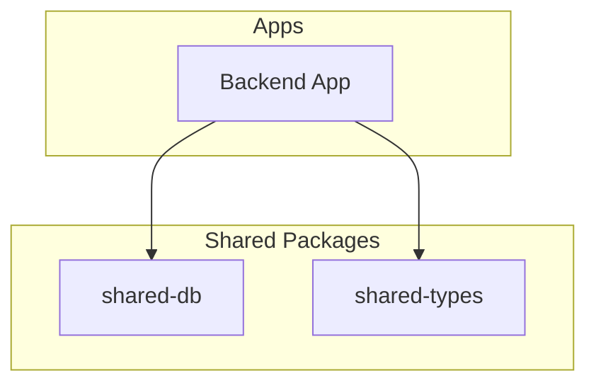
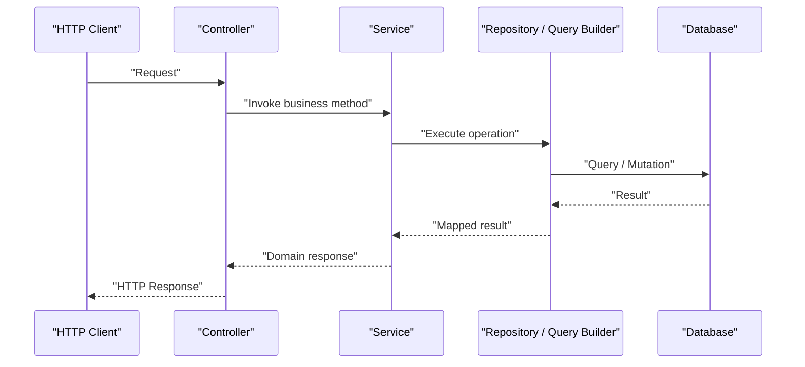
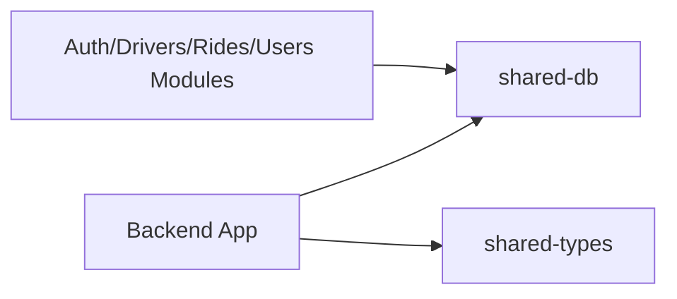

# Database Utilities

<cite>
**Referenced Files in This Document**
- [package.json](file://packages/shared-db/package.json)
- [README.md](file://README.md)
- [app.module.ts](file://apps/backend/src/app.module.ts)
- [main.ts](file://apps/backend/src/main.ts)
- [auth.controller.ts](file://apps/backend/src/modules/auth/auth.controller.ts)
- [auth.service.ts](file://apps/backend/src/modules/auth/auth.service.ts)
- [drivers.controller.ts](file://apps/backend/src/modules/drivers/drivers.controller.ts)
- [drivers.service.ts](file://apps/backend/src/modules/drivers/drivers.service.ts)
- [rides.controller.ts](file://apps/backend/src/modules/rides/rides.controller.ts)
- [rides.service.ts](file://apps/backend/src/modules/rides/rides.service.ts)
- [users.controller.ts](file://apps/backend/src/modules/users/users.controller.ts)
- [users.service.ts](file://apps/backend/src/modules/users/users.service.ts)
</cite>

## Table of Contents
1. [Introduction](#introduction)
2. [Project Structure](#project-structure)
3. [Core Components](#core-components)
4. [Architecture Overview](#architecture-overview)
5. [Detailed Component Analysis](#detailed-component-analysis)
6. [Dependency Analysis](#dependency-analysis)
7. [Performance Considerations](#performance-considerations)
8. [Troubleshooting Guide](#troubleshooting-guide)
9. [Conclusion](#conclusion)
10. [Appendices](#appendices)

## Introduction
This document provides comprehensive documentation for the database utilities package and its usage across the application. It covers connection management, query building, migrations, common operations, ORM integrations, transactions, connection pooling, repository patterns, custom queries, testing utilities, seed data, performance optimization, security, connection string management, and multi-database support where applicable. The goal is to help developers understand how to use the shared database layer effectively and consistently across modules.

## Project Structure
The repository is a monorepo with multiple apps and shared packages. The database utilities are centralized under the shared-db package and consumed by backend services. Backend modules (auth, drivers, rides, users) implement controllers and services that interact with the database via repositories or direct access through the shared-db utilities.

[No sources needed since this diagram shows conceptual structure]

**Section sources**
- [README.md](file://README.md)
- [package.json](file://packages/shared-db/package.json)

## Core Components
The database utilities package typically includes:
- Connection management and configuration
- Query builder abstractions
- Migration utilities
- Transaction helpers
- Repository base classes or patterns
- Testing utilities and seeders

These components are used by backend services to perform CRUD operations, complex queries, and transactional workflows.

**Section sources**
- [package.json](file://packages/shared-db/package.json)

## Architecture Overview
At runtime, the backend app initializes the database connection using configuration from environment variables. Services call repository methods or query builders to execute operations. Transactions wrap related operations to ensure consistency. Migrations manage schema evolution.

[No sources needed since this diagram shows conceptual workflow]

## Detailed Component Analysis

### Database Connection Management
- Configuration loading: Environment-based configuration for host, port, credentials, and database name.
- Connection lifecycle: Initialize on app startup, reuse connections, handle graceful shutdown.
- Pooling: Configure pool size, idle timeouts, and retry policies.
- Multi-database: Optional support for multiple databases via named connections.

Best practices:
- Use environment variables for secrets.
- Validate configuration at startup.
- Expose health checks for connectivity.

Security:
- Avoid logging sensitive connection details.
- Prefer secret managers for production.

**Section sources**
- [main.ts](file://apps/backend/src/main.ts)
- [app.module.ts](file://apps/backend/src/app.module.ts)

### Query Builders and Common Operations
- Fluent API for constructing SELECT, INSERT, UPDATE, DELETE statements.
- Type-safe parameter binding to prevent injection.
- Pagination, sorting, filtering helpers.
- Raw SQL fallback when necessary.

Common operations:
- Create, read, update, delete entities.
- Batch operations.
- Upsert logic.

**Section sources**
- [package.json](file://packages/shared-db/package.json)

### Migration Utilities
- Schema versioning and incremental changes.
- Rollback strategies.
- Dry-run and validation modes.
- Seed data integration post-migration.

Operational notes:
- Run migrations before starting the service.
- Keep migration files idempotent where possible.

**Section sources**
- [package.json](file://packages/shared-db/package.json)

### ORM Integrations
- Integration points with popular ORMs (e.g., type-safe wrappers).
- Entity mapping and relationship handling.
- Hooks for auditing and soft deletes.

Usage guidance:
- Prefer repository pattern over direct ORM calls in services.
- Centralize entity definitions in shared types.

**Section sources**
- [package.json](file://packages/shared-db/package.json)

### Transaction Handling
- Begin, commit, rollback helpers.
- Nested transaction support if available.
- Automatic cleanup on errors.

Patterns:
- Wrap related writes in a single transaction.
- Use savepoints for complex flows.

**Section sources**
- [package.json](file://packages/shared-db/package.json)

### Connection Pooling Strategies
- Pool sizing based on workload.
- Idle timeout and max lifetime settings.
- Backoff and retry on transient failures.

Tuning tips:
- Monitor active/idle connections.
- Adjust pool size according to CPU and I/O capacity.

**Section sources**
- [package.json](file://packages/shared-db/package.json)

### Implementing Repositories and Data Access Patterns
- Define repository interfaces per domain.
- Implement repository methods using query builders.
- Inject repositories into services.

Example references:
- Auth module controller and service demonstrate typical request-to-database flow.
- Drivers, Rides, Users modules follow similar patterns.

**Section sources**
- [auth.controller.ts](file://apps/backend/src/modules/auth/auth.controller.ts)
- [auth.service.ts](file://apps/backend/src/modules/auth/auth.service.ts)
- [drivers.controller.ts](file://apps/backend/src/modules/drivers/drivers.controller.ts)
- [drivers.service.ts](file://apps/backend/src/modules/drivers/drivers.service.ts)
- [rides.controller.ts](file://apps/backend/src/modules/rides/rides.controller.ts)
- [rides.service.ts](file://apps/backend/src/modules/rides/rides.service.ts)
- [users.controller.ts](file://apps/backend/src/modules/users/users.controller.ts)
- [users.service.ts](file://apps/backend/src/modules/users/users.service.ts)

### Custom Queries
- Use parameterized queries for safety.
- Leverage query builder composition for readability.
- Provide typed result mappers.

Guidelines:
- Keep raw SQL minimal and well-documented.
- Add indexes for frequently used filters.

**Section sources**
- [package.json](file://packages/shared-db/package.json)

### Testing Utilities and Seed Data
- In-memory or test database fixtures.
- Test helpers for transactions and rollbacks.
- Seed scripts for consistent test data.

Recommendations:
- Isolate tests with fresh schemas.
- Use deterministic seeds.

**Section sources**
- [package.json](file://packages/shared-db/package.json)

### Performance Optimization Techniques
- Indexing strategy aligned with query patterns.
- Select only required fields.
- Use pagination and cursors for large datasets.
- Cache hot reads where appropriate.

Monitoring:
- Track slow queries and connection metrics.
- Profile N+1 issues.

**Section sources**
- [package.json](file://packages/shared-db/package.json)

### Security and Connection String Management
- Store secrets securely; never hardcode credentials.
- Validate and sanitize inputs.
- Enforce least privilege database accounts.
- Enable TLS for connections in production.

**Section sources**
- [main.ts](file://apps/backend/src/main.ts)
- [app.module.ts](file://apps/backend/src/app.module.ts)

### Multi-Database Support
- Named connection factories.
- Routing logic to select the correct connection.
- Consistent abstraction across databases.

Use cases:
- Tenant isolation.
- Read replicas.

**Section sources**
- [package.json](file://packages/shared-db/package.json)

## Dependency Analysis
The backend depends on the shared-db package for all database interactions. Controllers delegate to services, which use repositories or query builders provided by shared-db.

[No sources needed since this diagram shows conceptual dependencies]

**Section sources**
- [package.json](file://packages/shared-db/package.json)

## Performance Considerations
- Right-size connection pools.
- Optimize queries with proper indexing.
- Avoid unnecessary joins and selects.
- Use batch operations for bulk writes.
- Monitor and alert on latency spikes.

[No sources needed since this section provides general guidance]

## Troubleshooting Guide
Common issues and resolutions:
- Connection failures: Verify environment variables and network reachability.
- Deadlocks: Review transaction boundaries and lock ordering.
- Slow queries: Analyze execution plans and add indexes.
- Pool exhaustion: Increase pool size or optimize long-running transactions.

Operational checks:
- Health endpoints for DB connectivity.
- Log aggregation for error correlation.

**Section sources**
- [main.ts](file://apps/backend/src/main.ts)
- [app.module.ts](file://apps/backend/src/app.module.ts)

## Conclusion
The database utilities package centralizes connection management, query building, migrations, transactions, and testing helpers, enabling consistent and secure data access across modules. By following repository patterns, optimizing queries, and managing connections carefully, teams can build reliable and performant applications.

[No sources needed since this section summarizes without analyzing specific files]

## Appendices

### Example Flows Across Modules
- Authentication flow: Controller receives request, service performs user lookup and credential verification via repository/query builder.
- Ride management: Controller handles ride CRUD, service orchestrates business rules and persistence.
- Driver operations: Controller exposes driver endpoints, service manages driver state and related records.

**Section sources**
- [auth.controller.ts](file://apps/backend/src/modules/auth/auth.controller.ts)
- [auth.service.ts](file://apps/backend/src/modules/auth/auth.service.ts)
- [drivers.controller.ts](file://apps/backend/src/modules/drivers/drivers.controller.ts)
- [drivers.service.ts](file://apps/backend/src/modules/drivers/drivers.service.ts)
- [rides.controller.ts](file://apps/backend/src/modules/rides/rides.controller.ts)
- [rides.service.ts](file://apps/backend/src/modules/rides/rides.service.ts)
- [users.controller.ts](file://apps/backend/src/modules/users/users.controller.ts)
- [users.service.ts](file://apps/backend/src/modules/users/users.service.ts)