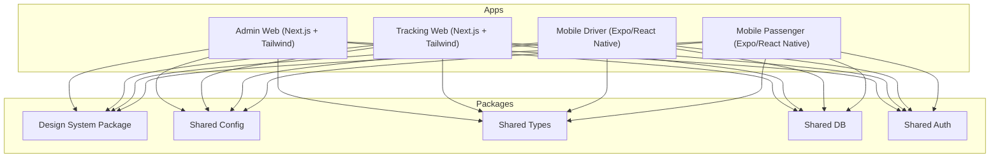
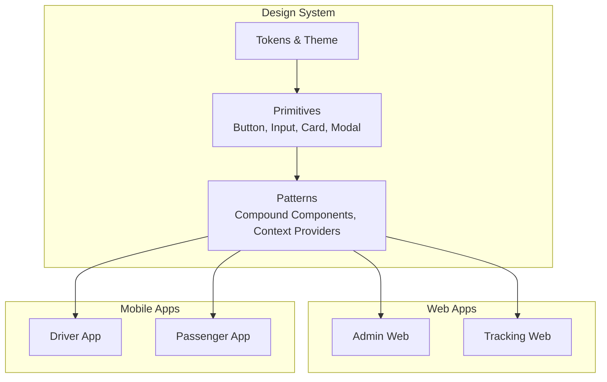
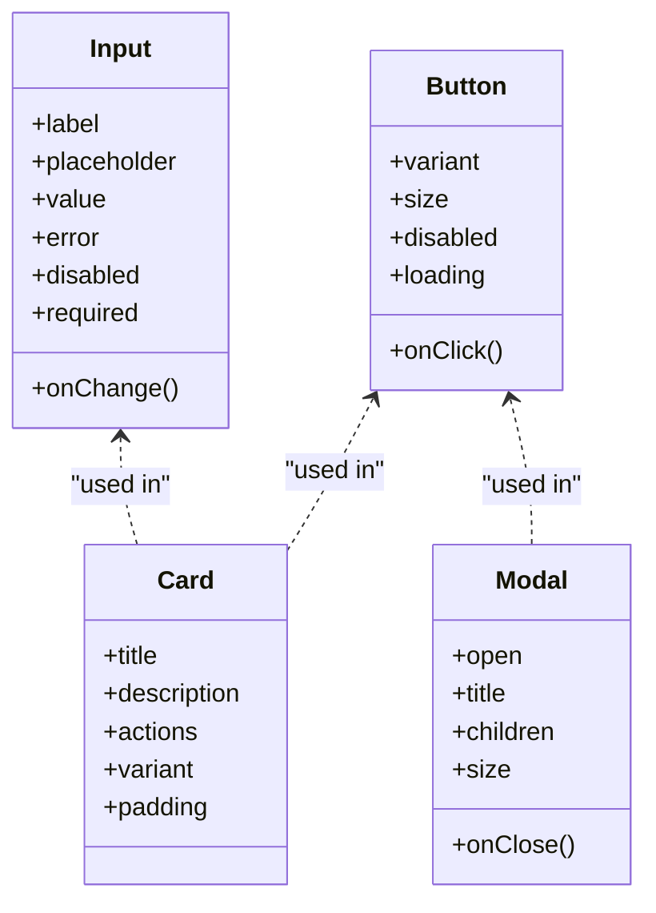
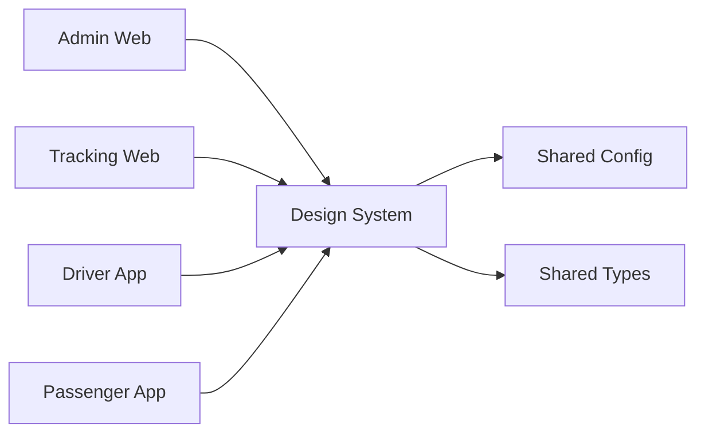

# Design System Components

<cite>
**Referenced Files in This Document**
- [README.md](file://README.md)
- [package.json](file://package.json)
- [tsconfig.base.json](file://tsconfig.base.json)
- [.eslintrc.json](file://.eslintrc.json)
- [.prettierrc.json](file://.prettierrc.json)
- [apps/admin-web/package.json](file://apps/admin-web/package.json)
- [apps/admin-web/tailwind.config.js](file://apps/admin-web/tailwind.config.js)
- [apps/tracking-web/package.json](file://apps/tracking-web/package.json)
- [apps/tracking-web/tailwind.config.js](file://apps/tracking-web/tailwind.config.js)
- [packages/shared-config/package.json](file://packages/shared-config/package.json)
- [packages/shared-types/package.json](file://packages/shared-types/package.json)
</cite>

## Table of Contents
1. [Introduction](#introduction)
2. [Project Structure](#project-structure)
3. [Core Components](#core-components)
4. [Architecture Overview](#architecture-overview)
5. [Detailed Component Analysis](#detailed-component-analysis)
6. [Dependency Analysis](#dependency-analysis)
7. [Performance Considerations](#performance-considerations)
8. [Troubleshooting Guide](#troubleshooting-guide)
9. [Conclusion](#conclusion)
10. [Appendices](#appendices)

## Introduction
This document provides comprehensive documentation for the design system components package within a monorepo that includes multiple applications and shared packages. It focuses on reusable UI components, styling tokens, theme configuration, and composition patterns. It also covers component API design, prop interfaces, customization options, usage examples across apps, styling approaches, responsive design, accessibility compliance, testing strategies (including visual regression), and guidelines for creating new components while maintaining design consistency.

The repository is structured as a monorepo with:
- Web applications using Next.js and Tailwind CSS
- Mobile applications using Expo/React Native
- Shared packages for configuration, types, database utilities, and authentication
- A dedicated design-system package intended to centralize UI components and tokens

Where applicable, this document references specific files to ground recommendations and guidance in the actual codebase structure.

## Project Structure
At a high level, the repository organizes code by application and shared packages:
- apps: Contains runnable applications (admin-web, tracking-web, mobile-driver, mobile-passenger)
- packages: Contains shared libraries (design-system, shared-config, shared-db, shared-auth, shared-types)
- Root-level tooling and configuration (linting, formatting, TypeScript base config, CI)

[No sources needed since this diagram shows conceptual workflow, not actual code structure]

Key observations from the project structure:
- Both web apps include Tailwind configuration files, indicating a utility-first styling approach.
- The presence of a design-system package suggests a centralized source of truth for UI primitives and tokens.
- Shared packages provide cross-cutting concerns such as configuration, types, database access, and authentication.

**Section sources**
- [README.md](file://README.md)
- [package.json](file://package.json)
- [tsconfig.base.json](file://tsconfig.base.json)

## Core Components
The design-system package should encapsulate:
- Reusable UI components (buttons, inputs, cards, modals, navigation elements, etc.)
- Styling tokens (colors, typography, spacing, breakpoints, shadows, radii)
- Theme configuration (light/dark modes, semantic color mappings)
- Composition patterns (compound components, render props, context-based theming)

Component API design principles:
- Explicit prop interfaces with clear defaults and constraints
- Consistent naming conventions (e.g., variant, size, disabled, loading)
- Accessibility attributes exposed via props (aria-* roles, labels, keyboard support)
- Composable APIs enabling flexible layouts without excessive nesting

Customization options:
- Theme overrides through context or provider pattern
- Token-driven styling to ensure consistency across apps
- Variant and size props to reduce duplication

Usage examples across applications:
- Import components from the design-system package into app pages and layouts
- Configure Tailwind to consume tokens where appropriate
- Apply theme providers at the app root to propagate styles globally

Styling approaches:
- Prefer tokens over hard-coded values
- Use Tailwind classes for layout and responsive behavior when aligned with tokens
- Maintain separation between presentation logic and business logic

Responsive design patterns:
- Define breakpoints in tokens and apply consistently
- Use fluid typography and spacing scales
- Ensure touch targets meet accessibility guidelines

Accessibility compliance:
- Provide semantic HTML and ARIA attributes
- Support keyboard navigation and focus management
- Ensure sufficient color contrast and scalable text

Testing strategies:
- Unit tests for component logic and prop validation
- Visual regression tests for UI changes
- Integration tests for composed components and theme contexts

Design token management:
- Centralize tokens in a single source
- Generate type-safe tokens for TypeScript consumers
- Version tokens alongside components to avoid drift

Guidelines for creating new components:
- Follow established prop interfaces and naming conventions
- Include accessibility features by default
- Add unit and visual regression tests
- Document usage examples and customization options

**Section sources**
- [apps/admin-web/tailwind.config.js](file://apps/admin-web/tailwind.config.js)
- [apps/tracking-web/tailwind.config.js](file://apps/tracking-web/tailwind.config.js)
- [packages/shared-config/package.json](file://packages/shared-config/package.json)
- [packages/shared-types/package.json](file://packages/shared-types/package.json)

## Architecture Overview
The design system sits at the center of the monorepo, consumed by all applications. It provides:
- A consistent UI layer across platforms
- Shared tokens and themes
- Type-safe APIs for components

[No sources needed since this diagram shows conceptual workflow, not actual code structure]

## Detailed Component Analysis
This section outlines how to analyze and document individual components once implemented in the design-system package. For each component, include:
- Purpose and use cases
- Prop interface summary
- Default behaviors and variants
- Accessibility considerations
- Theming and customization hooks
- Example usage paths

Example analysis structure:
- Button
  - Props: variant, size, disabled, loading, onClick
  - Variants: primary, secondary, ghost
  - Sizes: sm, md, lg
  - Accessibility: role="button", aria-disabled, focus ring
  - Customization: theme colors, radius, elevation
  - Usage example path: [apps/admin-web/src/app/dashboard/page.tsx](file://apps/admin-web/src/app/dashboard/page.tsx)

- Input
  - Props: label, placeholder, value, onChange, error, disabled, required
  - Validation integration: async/sync validators
  - Accessibility: aria-invalid, aria-describedby, inputmode
  - Customization: token-driven borders, focus states
  - Usage example path: [apps/tracking-web/src/app/page.tsx](file://apps/tracking-web/src/app/page.tsx)

- Card
  - Props: title, description, actions, variant, padding
  - Composition: header, body, footer slots
  - Accessibility: semantic headings, action buttons
  - Customization: elevation, border radius
  - Usage example path: [apps/admin-web/src/app/dashboard/users/page.tsx](file://apps/admin-web/src/app/dashboard/users/page.tsx)

- Modal
  - Props: open, onClose, title, children, size
  - Focus trap and escape key handling
  - Accessibility: aria-modal, role="dialog"
  - Customization: backdrop opacity, animation duration
  - Usage example path: [apps/tracking-web/src/app/track/[rideId]/page.tsx](file://apps/tracking-web/src/app/track/[rideId]/page.tsx)

For object-oriented components, illustrate class relationships and method contracts. For API/service-like components, show sequence flows. For complex logic components, present flowcharts.

**Diagram sources**
- [apps/admin-web/src/app/dashboard/page.tsx](file://apps/admin-web/src/app/dashboard/page.tsx)
- [apps/tracking-web/src/app/page.tsx](file://apps/tracking-web/src/app/page.tsx)
- [apps/tracking-web/src/app/track/[rideId]/page.tsx](file://apps/tracking-web/src/app/track/[rideId]/page.tsx)

**Section sources**
- [apps/admin-web/src/app/dashboard/page.tsx](file://apps/admin-web/src/app/dashboard/page.tsx)
- [apps/admin-web/src/app/dashboard/users/page.tsx](file://apps/admin-web/src/app/dashboard/users/page.tsx)
- [apps/tracking-web/src/app/page.tsx](file://apps/tracking-web/src/app/page.tsx)
- [apps/tracking-web/src/app/track/[rideId]/page.tsx](file://apps/tracking-web/src/app/track/[rideId]/page.tsx)

## Dependency Analysis
The design-system package depends on shared configuration and types, and is consumed by all applications. Understanding these dependencies ensures stable upgrades and consistent behavior.

**Diagram sources**
- [packages/shared-config/package.json](file://packages/shared-config/package.json)
- [packages/shared-types/package.json](file://packages/shared-types/package.json)
- [apps/admin-web/package.json](file://apps/admin-web/package.json)
- [apps/tracking-web/package.json](file://apps/tracking-web/package.json)

**Section sources**
- [packages/shared-config/package.json](file://packages/shared-config/package.json)
- [packages/shared-types/package.json](file://packages/shared-types/package.json)
- [apps/admin-web/package.json](file://apps/admin-web/package.json)
- [apps/tracking-web/package.json](file://apps/tracking-web/package.json)

## Performance Considerations
- Minimize bundle size by tree-shaking unused components
- Lazy-load heavy components (modals, charts)
- Memoize expensive computations and derived styles
- Avoid unnecessary re-renders with proper prop contracts and React.memo
- Prefer token-driven styles to reduce CSS bloat
- Optimize images and assets used by components

[No sources needed since this section provides general guidance]

## Troubleshooting Guide
Common issues and resolutions:
- Theme mismatch across apps: Ensure tokens are centralized and versioned; validate theme provider initialization order
- Inconsistent spacing or typography: Audit Tailwind configs against tokens; enforce lint rules
- Accessibility regressions: Integrate automated axe checks in CI; add manual audits for critical flows
- Visual differences after updates: Use snapshot or visual regression tools; compare baseline screenshots
- Build errors due to missing dependencies: Verify package versions in root and app package.json files

**Section sources**
- [.eslintrc.json](file://.eslintrc.json)
- [.prettierrc.json](file://.prettierrc.json)
- [tsconfig.base.json](file://tsconfig.base.json)

## Conclusion
A well-architected design system centralizes UI components, tokens, and themes, ensuring consistency and maintainability across applications. By following the API design principles, accessibility standards, and testing strategies outlined here, teams can deliver cohesive user experiences and streamline development workflows. Continuous governance—through linting, formatting, and CI checks—helps preserve design integrity as the system evolves.

[No sources needed since this section summarizes without analyzing specific files]

## Appendices
- Installation and setup instructions for consuming the design system in apps
- Migration guide for adopting tokens and replacing ad-hoc styles
- Checklist for reviewing new components before publishing
- Reference links to Tailwind best practices and accessibility guidelines

[No sources needed since this section provides general guidance]