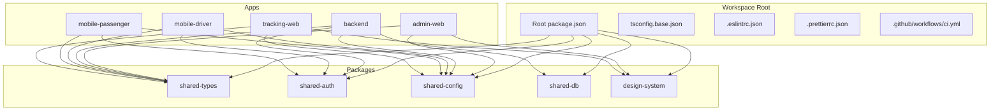
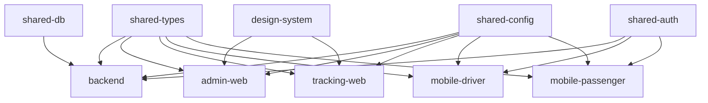
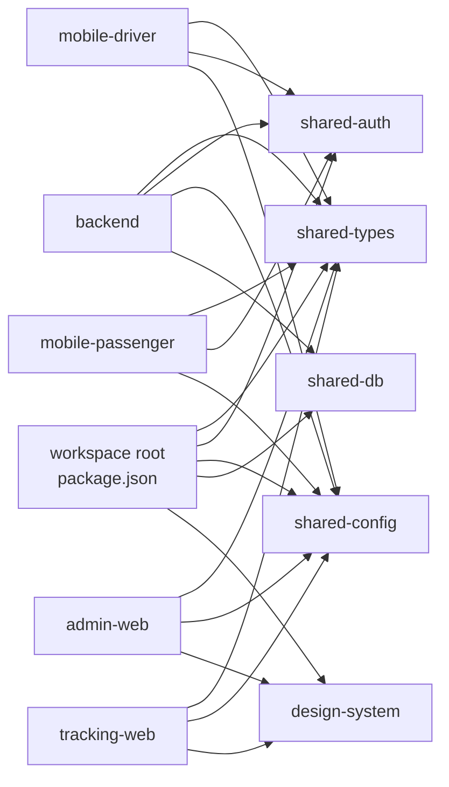

# Shared Packages & Libraries

<cite>
**Referenced Files in This Document**
- [package.json](file://package.json)
- [tsconfig.base.json](file://tsconfig.base.json)
- [.eslintrc.json](file://.eslintrc.json)
- [.prettierrc.json](file://.prettierrc.json)
- [ci.yml](file://.github/workflows/ci.yml)
- [apps/admin-web/package.json](file://apps/admin-web/package.json)
- [apps/backend/package.json](file://apps/backend/package.json)
- [apps/mobile-driver/package.json](file://apps/mobile-driver/package.json)
- [apps/mobile-passenger/package.json](file://apps/mobile-passenger/package.json)
- [apps/tracking-web/package.json](file://apps/tracking-web/package.json)
- [packages/shared-types/package.json](file://packages/shared-types/package.json)
- [packages/shared-auth/package.json](file://packages/shared-auth/package.json)
- [packages/shared-config/package.json](file://packages/shared-config/package.json)
- [packages/shared-db/package.json](file://packages/shared-db/package.json)
- [packages/design-system/package.json](file://packages/design-system/package.json)
</cite>

## Table of Contents
1. [Introduction](#introduction)
2. [Project Structure](#project-structure)
3. [Core Components](#core-components)
4. [Architecture Overview](#architecture-overview)
5. [Detailed Component Analysis](#detailed-component-analysis)
6. [Dependency Analysis](#dependency-analysis)
7. [Performance Considerations](#performance-considerations)
8. [Troubleshooting Guide](#troubleshooting-guide)
9. [Conclusion](#conclusion)
10. [Appendices](#appendices)

## Introduction
This document describes the design philosophy and architecture for shared packages and libraries used across applications in this monorepo. It explains how code is organized for reusability, how shared types, authentication utilities, configuration management, database helpers, and design system components are structured, and how they are published, versioned, and consumed by apps. It also provides guidelines for creating new shared packages, maintaining backward compatibility, testing shared code, and building/bundling/distributing artifacts.

## Project Structure
The repository follows a monorepo layout with multiple applications under apps/ and reusable packages under packages/. The root contains workspace-level configuration (TypeScript base config, linting, formatting), CI workflow, and top-level package manifests that coordinate dependency resolution across packages and apps.

**Diagram sources**
- [package.json](file://package.json)
- [tsconfig.base.json](file://tsconfig.base.json)
- [apps/admin-web/package.json](file://apps/admin-web/package.json)
- [apps/backend/package.json](file://apps/backend/package.json)
- [apps/mobile-driver/package.json](file://apps/mobile-driver/package.json)
- [apps/mobile-passenger/package.json](file://apps/mobile-passenger/package.json)
- [apps/tracking-web/package.json](file://apps/tracking-web/package.json)
- [packages/shared-types/package.json](file://packages/shared-types/package.json)
- [packages/shared-auth/package.json](file://packages/shared-auth/package.json)
- [packages/shared-config/package.json](file://packages/shared-config/package.json)
- [packages/shared-db/package.json](file://packages/shared-db/package.json)
- [packages/design-system/package.json](file://packages/design-system/package.json)

**Section sources**
- [package.json](file://package.json)
- [tsconfig.base.json](file://tsconfig.base.json)
- [.eslintrc.json](file://.eslintrc.json)
- [.prettierrc.json](file://.prettierrc.json)
- [ci.yml](file://.github/workflows/ci.yml)

## Core Components
The shared packages provide cross-cutting concerns and domain primitives to reduce duplication and ensure consistency across apps:

- shared-types: Centralized TypeScript types and interfaces consumed by backend and frontend apps.
- shared-auth: Authentication utilities and guards used by the backend and mobile apps.
- shared-config: Configuration loading and validation for environment-specific settings.
- shared-db: Database helpers and connection setup for the backend.
- design-system: Reusable UI components and styles for web apps.

These packages are referenced from application package manifests, enabling consistent versions and centralized updates.

**Section sources**
- [packages/shared-types/package.json](file://packages/shared-types/package.json)
- [packages/shared-auth/package.json](file://packages/shared-auth/package.json)
- [packages/shared-config/package.json](file://packages/shared-config/package.json)
- [packages/shared-db/package.json](file://packages/shared-db/package.json)
- [packages/design-system/package.json](file://packages/design-system/package.json)
- [apps/backend/package.json](file://apps/backend/package.json)
- [apps/admin-web/package.json](file://apps/admin-web/package.json)
- [apps/mobile-driver/package.json](file://apps/mobile-driver/package.json)
- [apps/mobile-passenger/package.json](file://apps/mobile-passenger/package.json)
- [apps/tracking-web/package.json](file://apps/tracking-web/package.json)

## Architecture Overview
The design emphasizes strict separation between shared logic and app-specific code. Apps depend on stable APIs exposed by shared packages. Types are defined once and reused everywhere to prevent drift. Configuration is validated at startup to fail fast. Database helpers encapsulate connection and query patterns. Design system components standardize UI behavior and appearance.

[No sources needed since this diagram shows conceptual relationships without mapping to specific source files]

## Detailed Component Analysis

### shared-types
Purpose:
- Provide canonical type definitions for entities, DTOs, enums, and API contracts.
- Ensure compile-time consistency across backend and frontend apps.

Design principles:
- Pure TypeScript declarations only; no runtime dependencies.
- Versioned independently to allow safe evolution.
- Export minimal public surface to avoid accidental coupling.

Guidelines:
- Prefer discriminated unions and branded types where helpful.
- Keep types small and composable.
- Add migration notes when breaking changes occur.

Testing:
- Use type tests to assert shape stability.
- Validate against sample payloads in CI.

Build and distribution:
- Build to CommonJS and ESM if needed; publish to npm registry or internal registry.
- Include tsconfig and declaration files.

**Section sources**
- [packages/shared-types/package.json](file://packages/shared-types/package.json)

### shared-auth
Purpose:
- Centralize authentication flows, token handling, and role-based access control.
- Provide guards and decorators for NestJS backend and hooks/stores for mobile apps.

Design principles:
- Platform-agnostic core logic with thin platform adapters.
- Clear separation between strategy (e.g., OTP, JWT) and usage.
- Minimal side effects in pure functions.

Guidelines:
- Expose typed interfaces for tokens and user sessions.
- Avoid storing secrets in shared code; rely on environment configuration.
- Document error codes and recovery paths.

Testing:
- Unit test auth strategies and guards.
- Integration tests for login/verify flows using mock providers.

Build and distribution:
- Publish as a library with both CJS and ESM outputs.
- Provide typings and README with usage examples.

**Section sources**
- [packages/shared-auth/package.json](file://packages/shared-auth/package.json)
- [apps/backend/package.json](file://apps/backend/package.json)
- [apps/mobile-driver/package.json](file://apps/mobile-driver/package.json)
- [apps/mobile-passenger/package.json](file://apps/mobile-passenger/package.json)

### shared-config
Purpose:
- Load, validate, and normalize environment variables per environment.
- Provide typed configuration objects to apps.

Design principles:
- Fail-fast validation at startup.
- Environment-specific overrides with sensible defaults.
- No secret values in code; all secrets via environment.

Guidelines:
- Define schema for each config namespace.
- Provide helper getters with clear error messages.
- Keep config keys stable; deprecate via migration guides.

Testing:
- Test config parsing with valid and invalid inputs.
- Snapshot default configs and environment overrides.

Build and distribution:
- Lightweight library with zero runtime dependencies if possible.
- Publish with type declarations and documentation.

**Section sources**
- [packages/shared-config/package.json](file://packages/shared-config/package.json)
- [apps/admin-web/package.json](file://apps/admin-web/package.json)
- [apps/tracking-web/package.json](file://apps/tracking-web/package.json)
- [apps/backend/package.json](file://apps/backend/package.json)
- [apps/mobile-driver/package.json](file://apps/mobile-driver/package.json)
- [apps/mobile-passenger/package.json](file://apps/mobile-passenger/package.json)

### shared-db
Purpose:
- Encapsulate database connections, migrations, and common query patterns.
- Provide typed repositories or helpers to reduce boilerplate.

Design principles:
- Connection pooling and lifecycle management.
- Transaction helpers and retry policies.
- Strict typing for queries and results.

Guidelines:
- Separate schema definitions into shared-types where appropriate.
- Avoid leaking driver-specific details beyond the package boundary.
- Provide seeders/fixtures for local development.

Testing:
- Use an isolated test database or in-memory provider.
- Test transactions, retries, and error propagation.

Build and distribution:
- Publish with type definitions and migration scripts.
- Document required environment variables and setup steps.

**Section sources**
- [packages/shared-db/package.json](file://packages/shared-db/package.json)
- [apps/backend/package.json](file://apps/backend/package.json)

### design-system
Purpose:
- Provide reusable UI components, tokens, and styling utilities for web apps.
- Ensure consistent look-and-feel across admin and tracking web apps.

Design principles:
- Theme-driven design with tokens for colors, spacing, typography.
- Accessible components with keyboard navigation and ARIA attributes.
- Stable component APIs with prop contracts.

Guidelines:
- Version components semantically; avoid breaking changes in minor releases.
- Provide stories/examples and visual regression tests.
- Keep bundle size in check via tree-shaking-friendly exports.

Testing:
- Unit tests for component logic.
- Visual regression tests for UI diffs.
- Accessibility audits in CI.

Build and distribution:
- Build to UMD/CJS/ESM as needed for consumption by Next.js and bundlers.
- Ship CSS assets and fonts alongside components.

**Section sources**
- [packages/design-system/package.json](file://packages/design-system/package.json)
- [apps/admin-web/package.json](file://apps/admin-web/package.json)
- [apps/tracking-web/package.json](file://apps/tracking-web/package.json)

## Dependency Analysis
Shared packages are consumed by multiple apps. The root package.json coordinates workspace dependencies, while each app’s package.json declares its own set of shared packages. This structure enables consistent version pinning and easy upgrades.

**Diagram sources**
- [package.json](file://package.json)
- [apps/backend/package.json](file://apps/backend/package.json)
- [apps/admin-web/package.json](file://apps/admin-web/package.json)
- [apps/tracking-web/package.json](file://apps/tracking-web/package.json)
- [apps/mobile-driver/package.json](file://apps/mobile-driver/package.json)
- [apps/mobile-passenger/package.json](file://apps/mobile-passenger/package.json)
- [packages/shared-types/package.json](file://packages/shared-types/package.json)
- [packages/shared-auth/package.json](file://packages/shared-auth/package.json)
- [packages/shared-config/package.json](file://packages/shared-config/package.json)
- [packages/shared-db/package.json](file://packages/shared-db/package.json)
- [packages/design-system/package.json](file://packages/design-system/package.json)

**Section sources**
- [package.json](file://package.json)
- [apps/backend/package.json](file://apps/backend/package.json)
- [apps/admin-web/package.json](file://apps/admin-web/package.json)
- [apps/tracking-web/package.json](file://apps/tracking-web/package.json)
- [apps/mobile-driver/package.json](file://apps/mobile-driver/package.json)
- [apps/mobile-passenger/package.json](file://apps/mobile-passenger/package.json)

## Performance Considerations
- Minimize shared package sizes by avoiding heavy runtime dependencies and using tree-shaking-friendly exports.
- Prefer lazy-loading for large UI components in the design system.
- Cache configuration and database clients appropriately; avoid repeated initialization.
- Use incremental builds and caching in CI to speed up feedback loops.

[No sources needed since this section provides general guidance]

## Troubleshooting Guide
Common issues and resolutions:
- Type mismatches across apps: Update shared-types and run type checks in CI.
- Auth failures on mobile: Verify shared-auth integration and environment variables.
- Config errors at startup: Validate environment schemas and logs.
- DB connection issues: Check connection strings and pool limits.
- UI regressions: Run visual regression tests and compare snapshots.

CI and tooling:
- Linting and formatting are enforced via workspace-wide rules.
- CI pipeline runs build and tests for packages and apps.

**Section sources**
- [.eslintrc.json](file://.eslintrc.json)
- [.prettierrc.json](file://.prettierrc.json)
- [ci.yml](file://.github/workflows/ci.yml)

## Conclusion
The shared packages strategy centralizes cross-cutting concerns and domain primitives, improving consistency, reducing duplication, and accelerating feature delivery. By adhering to clear APIs, robust testing, and disciplined versioning, teams can evolve shared code safely while keeping apps decoupled and maintainable.

[No sources needed since this section summarizes without analyzing specific files]

## Appendices

### Package Publishing Strategy
- Each package publishes independently with semantic versioning.
- Maintain CHANGELOG entries for breaking changes.
- Use a private registry if necessary for internal packages.

Versioning Approach
- Follow SemVer strictly for shared packages.
- Coordinate major version bumps across consumers when breaking changes occur.

Dependency Management
- Pin exact versions in apps for reproducibility.
- Use workspace protocols to link packages during development.

Guidelines for Creating New Shared Packages
- Define a clear scope and public API surface.
- Provide comprehensive types and documentation.
- Include unit and integration tests.
- Add a README with usage examples and migration notes.

Maintaining Backward Compatibility
- Deprecate features gradually with warnings.
- Provide codemods for large migrations.
- Keep deprecated APIs behind feature flags when feasible.

Testing Shared Code
- Unit tests for pure logic.
- Integration tests for external interactions.
- Contract tests for APIs and data shapes.
- Visual regression tests for UI components.

Build Processes, Bundling, and Distribution
- Configure multi-format builds (CJS/ESM) as needed.
- Emit declaration files and include them in the package.
- Optimize bundles for tree-shaking and minimal overhead.
- Automate publishing in CI after successful tests and checks.

**Section sources**
- [ci.yml](file://.github/workflows/ci.yml)
- [tsconfig.base.json](file://tsconfig.base.json)
- [.eslintrc.json](file://.eslintrc.json)
- [.prettierrc.json](file://.prettierrc.json)