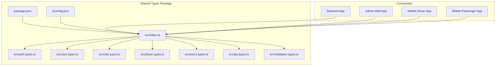
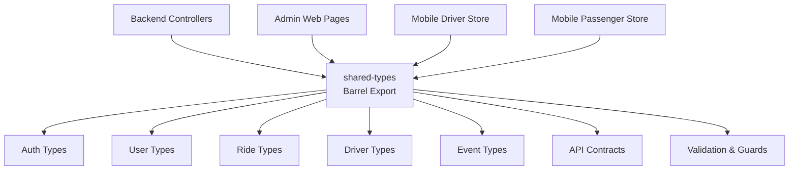
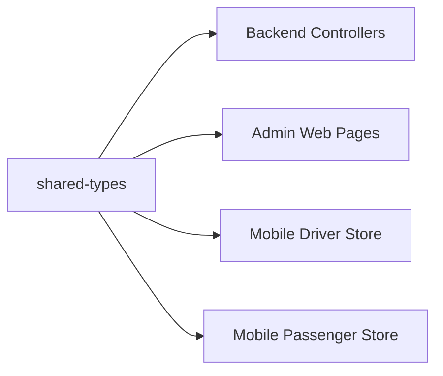

# Shared Types & Interfaces

<cite>
**Referenced Files in This Document**
- [package.json](file://packages/shared-types/package.json)
- [tsconfig.json](file://packages/shared-types/tsconfig.json)
- [index.ts](file://packages/shared-types/src/index.ts)
- [auth.types.ts](file://packages/shared-types/src/auth.types.ts)
- [user.types.ts](file://packages/shared-types/src/user.types.ts)
- [ride.types.ts](file://packages/shared-types/src/ride.types.ts)
- [driver.types.ts](file://packages/shared-types/src/driver.types.ts)
- [event.types.ts](file://packages/shared-types/src/event.types.ts)
- [api.types.ts](file://packages/shared-types/src/api.types.ts)
- [validation.types.ts](file://packages/shared-types/src/validation.types.ts)
- [backend/src/modules/auth/auth.controller.ts](file://apps/backend/src/modules/auth/auth.controller.ts)
- [backend/src/modules/users/users.controller.ts](file://apps/backend/src/modules/users/users.controller.ts)
- [backend/src/modules/drivers/drivers.controller.ts](file://apps/backend/src/modules/drivers/drivers.controller.ts)
- [backend/src/modules/rides/rides.controller.ts](file://apps/backend/src/modules/rides/rides.controller.ts)
- [admin-web/src/app/dashboard/users/page.tsx](file://apps/admin-web/src/app/dashboard/users/page.tsx)
- [admin-web/src/app/dashboard/rides/page.tsx](file://apps/admin-web/src/app/dashboard/rides/page.tsx)
- [mobile-driver/src/stores/auth-store.ts](file://apps/mobile-driver/src/stores/auth-store.ts)
- [mobile-passenger/src/stores/auth-store.ts](file://apps/mobile-passenger/src/stores/auth-store.ts)
</cite>

## Table of Contents
1. [Introduction](#introduction)
2. [Project Structure](#project-structure)
3. [Core Components](#core-components)
4. [Architecture Overview](#architecture-overview)
5. [Detailed Component Analysis](#detailed-component-analysis)
6. [Dependency Analysis](#dependency-analysis)
7. [Performance Considerations](#performance-considerations)
8. [Troubleshooting Guide](#troubleshooting-guide)
9. [Conclusion](#conclusion)
10. [Appendices](#appendices)

## Introduction
This document describes the shared types and interfaces package that centralizes TypeScript definitions used across backend, admin web, and mobile applications. It explains the type system architecture, naming conventions, organization patterns, import and usage examples per application, validation strategies, custom type guards, utility functions, and versioning considerations for maintaining backward compatibility.

## Project Structure
The shared types are organized under a dedicated package with a clear module-per-domain layout:
- Package metadata and build configuration live at the package root.
- Source files are grouped by domain (auth, user, ride, driver, event) plus cross-cutting concerns (API contracts, validation).
- A single barrel export file re-exports public types for consumers.

**Diagram sources**
- [package.json](file://packages/shared-types/package.json)
- [tsconfig.json](file://packages/shared-types/tsconfig.json)
- [index.ts](file://packages/shared-types/src/index.ts)
- [auth.types.ts](file://packages/shared-types/src/auth.types.ts)
- [user.types.ts](file://packages/shared-types/src/user.types.ts)
- [ride.types.ts](file://packages/shared-types/src/ride.types.ts)
- [driver.types.ts](file://packages/shared-types/src/driver.types.ts)
- [event.types.ts](file://packages/shared-types/src/event.types.ts)
- [api.types.ts](file://packages/shared-types/src/api.types.ts)
- [validation.types.ts](file://packages/shared-types/src/validation.types.ts)

**Section sources**
- [package.json](file://packages/shared-types/package.json)
- [tsconfig.json](file://packages/shared-types/tsconfig.json)
- [index.ts](file://packages/shared-types/src/index.ts)

## Core Components
The shared types package exposes domain-specific type modules and cross-cutting API and validation contracts via a single entry point. Consumers import from the package’s public surface to ensure consistency across apps.

Key responsibilities:
- Domain models: auth, user, ride, driver, event
- API contracts: request/response shapes, pagination, error envelopes
- Validation helpers: runtime checks and type guards aligned with compile-time types

Typical import pattern:
- Import named exports from the package index to access domain types and utilities.
- Use these types on both client and server sides to keep payloads consistent.

Examples of usage locations:
- Backend controllers consume shared types for DTOs and responses.
- Admin web pages consume shared types for UI state and API payloads.
- Mobile stores consume shared types for local state and network payloads.

**Section sources**
- [index.ts](file://packages/shared-types/src/index.ts)
- [auth.types.ts](file://packages/shared-types/src/auth.types.ts)
- [user.types.ts](file://packages/shared-types/src/user.types.ts)
- [ride.types.ts](file://packages/shared-types/src/ride.types.ts)
- [driver.types.ts](file://packages/shared-types/src/driver.types.ts)
- [event.types.ts](file://packages/shared-types/src/event.types.ts)
- [api.types.ts](file://packages/shared-types/src/api.types.ts)
- [validation.types.ts](file://packages/shared-types/src/validation.types.ts)
- [backend/src/modules/auth/auth.controller.ts](file://apps/backend/src/modules/auth/auth.controller.ts)
- [backend/src/modules/users/users.controller.ts](file://apps/backend/src/modules/users/users.controller.ts)
- [backend/src/modules/drivers/drivers.controller.ts](file://apps/backend/src/modules/drivers/drivers.controller.ts)
- [backend/src/modules/rides/rides.controller.ts](file://apps/backend/src/modules/rides/rides.controller.ts)
- [admin-web/src/app/dashboard/users/page.tsx](file://apps/admin-web/src/app/dashboard/users/page.tsx)
- [admin-web/src/app/dashboard/rides/page.tsx](file://apps/admin-web/src/app/dashboard/rides/page.tsx)
- [mobile-driver/src/stores/auth-store.ts](file://apps/mobile-driver/src/stores/auth-store.ts)
- [mobile-passenger/src/stores/auth-store.ts](file://apps/mobile-passenger/src/stores/auth-store.ts)

## Architecture Overview
The shared types package acts as a single source of truth for data contracts. All applications depend on it to serialize and deserialize payloads consistently. The barrel file aggregates all public types, enabling clean imports and reducing coupling between domains.

**Diagram sources**
- [index.ts](file://packages/shared-types/src/index.ts)
- [auth.types.ts](file://packages/shared-types/src/auth.types.ts)
- [user.types.ts](file://packages/shared-types/src/user.types.ts)
- [ride.types.ts](file://packages/shared-types/src/ride.types.ts)
- [driver.types.ts](file://packages/shared-types/src/driver.types.ts)
- [event.types.ts](file://packages/shared-types/src/event.types.ts)
- [api.types.ts](file://packages/shared-types/src/api.types.ts)
- [validation.types.ts](file://packages/shared-types/src/validation.types.ts)

## Detailed Component Analysis

### Authentication Types
Purpose:
- Define tokens, sessions, OTP flows, and permission-related shapes used by auth endpoints and client-side stores.

Common elements:
- Token payload shape
- Session or refresh token envelope
- OTP verification request/response
- Role-based permission enums or literals

Usage examples:
- Backend: controllers validate incoming auth requests and return typed responses.
- Mobile: stores hold tokens and session state using shared types.

Import example:
- Import authentication-related types from the package index.

**Section sources**
- [auth.types.ts](file://packages/shared-types/src/auth.types.ts)
- [index.ts](file://packages/shared-types/src/index.ts)
- [backend/src/modules/auth/auth.controller.ts](file://apps/backend/src/modules/auth/auth.controller.ts)
- [mobile-driver/src/stores/auth-store.ts](file://apps/mobile-driver/src/stores/auth-store.ts)
- [mobile-passenger/src/stores/auth-store.ts](file://apps/mobile-passenger/src/stores/auth-store.ts)

### User Types
Purpose:
- Model user profiles, roles, and account metadata consumed by user management features.

Common elements:
- Profile fields and identifiers
- Role or status enumerations
- Pagination and filtering query shapes

Usage examples:
- Backend: user controller reads/writes user entities and returns typed responses.
- Admin web: dashboard pages render user lists and details using shared types.

Import example:
- Import user-related types from the package index.

**Section sources**
- [user.types.ts](file://packages/shared-types/src/user.types.ts)
- [index.ts](file://packages/shared-types/src/index.ts)
- [backend/src/modules/users/users.controller.ts](file://apps/backend/src/modules/users/users.controller.ts)
- [admin-web/src/app/dashboard/users/page.tsx](file://apps/admin-web/src/app/dashboard/users/page.tsx)

### Ride Types
Purpose:
- Represent ride lifecycle, location snapshots, pricing, and status transitions.

Common elements:
- Ride creation and update payloads
- Status enum or union
- Location and route data structures
- Pagination and list filters

Usage examples:
- Backend: rides controller orchestrates ride operations and emits events.
- Admin web: dashboard pages display ride history and details.

Import example:
- Import ride-related types from the package index.

**Section sources**
- [ride.types.ts](file://packages/shared-types/src/ride.types.ts)
- [index.ts](file://packages/shared-types/src/index.ts)
- [backend/src/modules/rides/rides.controller.ts](file://apps/backend/src/modules/rides/rides.controller.ts)
- [admin-web/src/app/dashboard/rides/page.tsx](file://apps/admin-web/src/app/dashboard/rides/page.tsx)

### Driver Types
Purpose:
- Model driver profiles, availability, earnings, and subscription states.

Common elements:
- Driver profile and credentials
- Availability flags and schedule windows
- Subscription plan references

Usage examples:
- Backend: drivers controller manages driver records and subscriptions.
- Mobile driver app: store uses shared types for profile and subscription state.

Import example:
- Import driver-related types from the package index.

**Section sources**
- [driver.types.ts](file://packages/shared-types/src/driver.types.ts)
- [index.ts](file://packages/shared-types/src/index.ts)
- [backend/src/modules/drivers/drivers.controller.ts](file://apps/backend/src/modules/drivers/drivers.controller.ts)
- [mobile-driver/src/stores/auth-store.ts](file://apps/mobile-driver/src/stores/auth-store.ts)

### Event Types
Purpose:
- Define WebSocket or real-time event schemas for ride updates, notifications, and system events.

Common elements:
- Event name or type discriminator
- Payload shape per event kind
- Timestamp and correlation IDs

Usage examples:
- Backend: gateway emits typed events.
- Mobile apps: clients subscribe and handle events using shared types.

Import example:
- Import event-related types from the package index.

**Section sources**
- [event.types.ts](file://packages/shared-types/src/event.types.ts)
- [index.ts](file://packages/shared-types/src/index.ts)

### API Contracts
Purpose:
- Centralize request/response envelopes, pagination, sorting, and error formats.

Common elements:
- Standardized response wrapper
- Error envelope with code and message
- Pagination parameters and result shape
- Query filter base types

Usage examples:
- All apps use these contracts to serialize and parse API payloads consistently.

Import example:
- Import API contract types from the package index.

**Section sources**
- [api.types.ts](file://packages/shared-types/src/api.types.ts)
- [index.ts](file://packages/shared-types/src/index.ts)

### Validation and Type Guards
Purpose:
- Provide runtime validation utilities and type guards that align with compile-time types.

Common elements:
- Input validators for common payloads
- Type guard functions for discriminated unions
- Utility helpers for safe parsing and coercion

Usage examples:
- Backend controllers validate inputs before processing.
- Client apps validate local state and network responses.

Import example:
- Import validation helpers and guards from the package index.

**Section sources**
- [validation.types.ts](file://packages/shared-types/src/validation.types.ts)
- [index.ts](file://packages/shared-types/src/index.ts)

## Dependency Analysis
The shared types package is a leaf dependency; it does not depend on application code. Applications depend on it for type safety and runtime validation.

**Diagram sources**
- [index.ts](file://packages/shared-types/src/index.ts)
- [backend/src/modules/auth/auth.controller.ts](file://apps/backend/src/modules/auth/auth.controller.ts)
- [backend/src/modules/users/users.controller.ts](file://apps/backend/src/modules/users/users.controller.ts)
- [backend/src/modules/drivers/drivers.controller.ts](file://apps/backend/src/modules/drivers/drivers.controller.ts)
- [backend/src/modules/rides/rides.controller.ts](file://apps/backend/src/modules/rides/rides.controller.ts)
- [admin-web/src/app/dashboard/users/page.tsx](file://apps/admin-web/src/app/dashboard/users/page.tsx)
- [admin-web/src/app/dashboard/rides/page.tsx](file://apps/admin-web/src/app/dashboard/rides/page.tsx)
- [mobile-driver/src/stores/auth-store.ts](file://apps/mobile-driver/src/stores/auth-store.ts)
- [mobile-passenger/src/stores/auth-store.ts](file://apps/mobile-passenger/src/stores/auth-store.ts)

**Section sources**
- [index.ts](file://packages/shared-types/src/index.ts)

## Performance Considerations
- Keep shared types lean: avoid heavy computed types or deep conditional inference that can slow down IDEs and builds.
- Prefer simple enums or string literal unions over complex mapped types where possible.
- Split large modules into focused files to reduce compilation scope when importing only a subset.
- Avoid circular dependencies between type modules; rely on the barrel to aggregate exports.

[No sources needed since this section provides general guidance]

## Troubleshooting Guide
Common issues and resolutions:
- Missing exports: Ensure new types are added to the barrel so consumers can import them.
- Breaking changes: When modifying existing types, prefer additive changes (new optional fields, new union members) and deprecate old fields gradually.
- Runtime mismatches: Use provided validation helpers and type guards to catch discrepancies early.
- Version drift: Pin the shared types version in each app until you have validated compatibility.

**Section sources**
- [index.ts](file://packages/shared-types/src/index.ts)
- [validation.types.ts](file://packages/shared-types/src/validation.types.ts)

## Conclusion
The shared types package centralizes the type system across applications, ensuring consistent contracts, improved developer experience, and safer integrations. By following the outlined organization, naming conventions, and validation strategies—and by adhering to careful versioning practices—you can evolve the type system confidently while preserving backward compatibility.

[No sources needed since this section summarizes without analyzing specific files]

## Appendices

### Naming Conventions
- Use PascalCase for interfaces and types.
- Use camelCase for utility functions and guards.
- Prefer descriptive names that reflect domain concepts (e.g., RideStatus, UserProfile).
- Group related types within domain-specific files.

### Organization Patterns
- One domain per file (auth, user, ride, driver, event).
- Cross-cutting concerns in api.types and validation.types.
- Single barrel export for stable public API.

### Import and Usage Examples by Application
- Backend: import shared types in controllers to type request bodies, responses, and internal DTOs.
- Admin web: import shared types in page components and services to type UI state and API calls.
- Mobile apps: import shared types in stores and API clients to type local state and network payloads.

[No sources needed since this section provides general guidance]