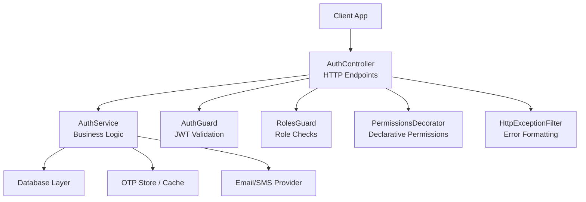
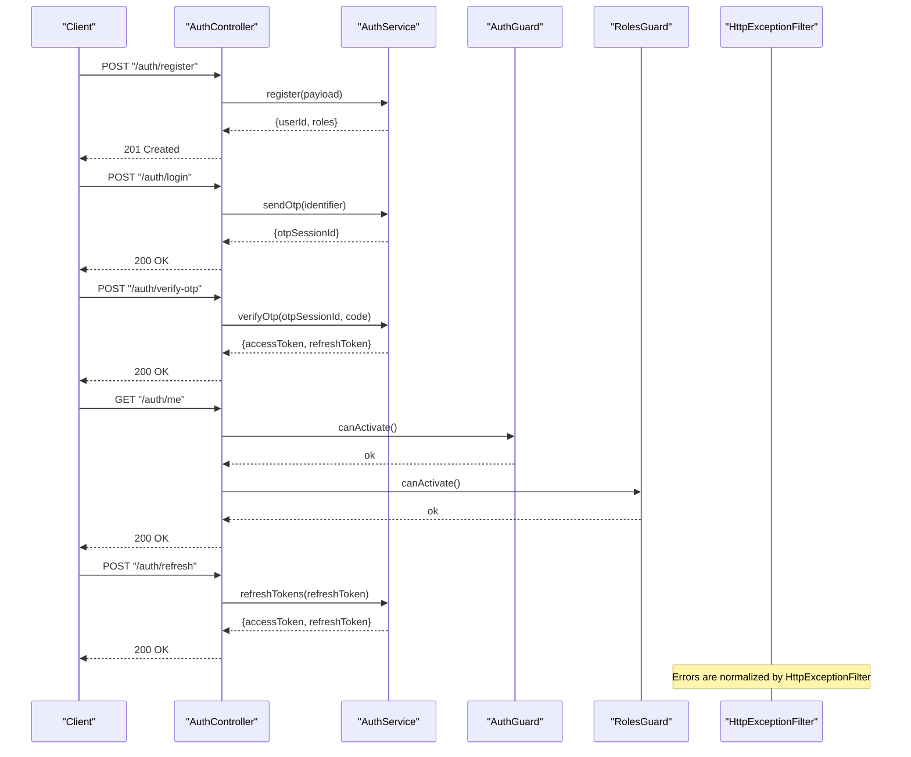
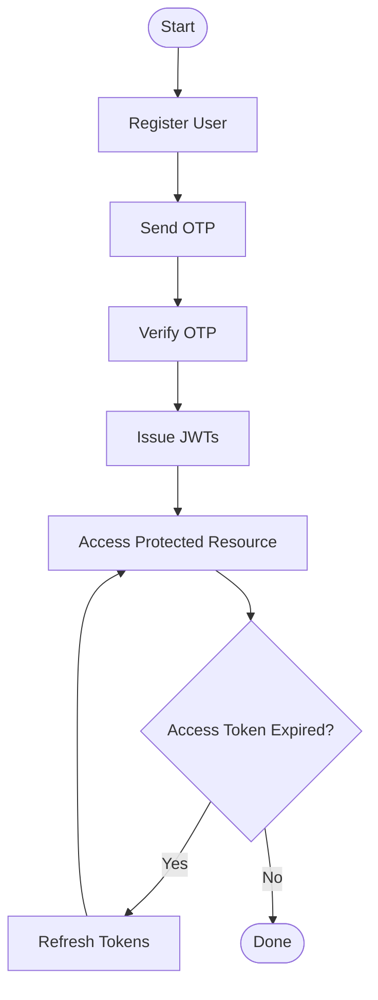
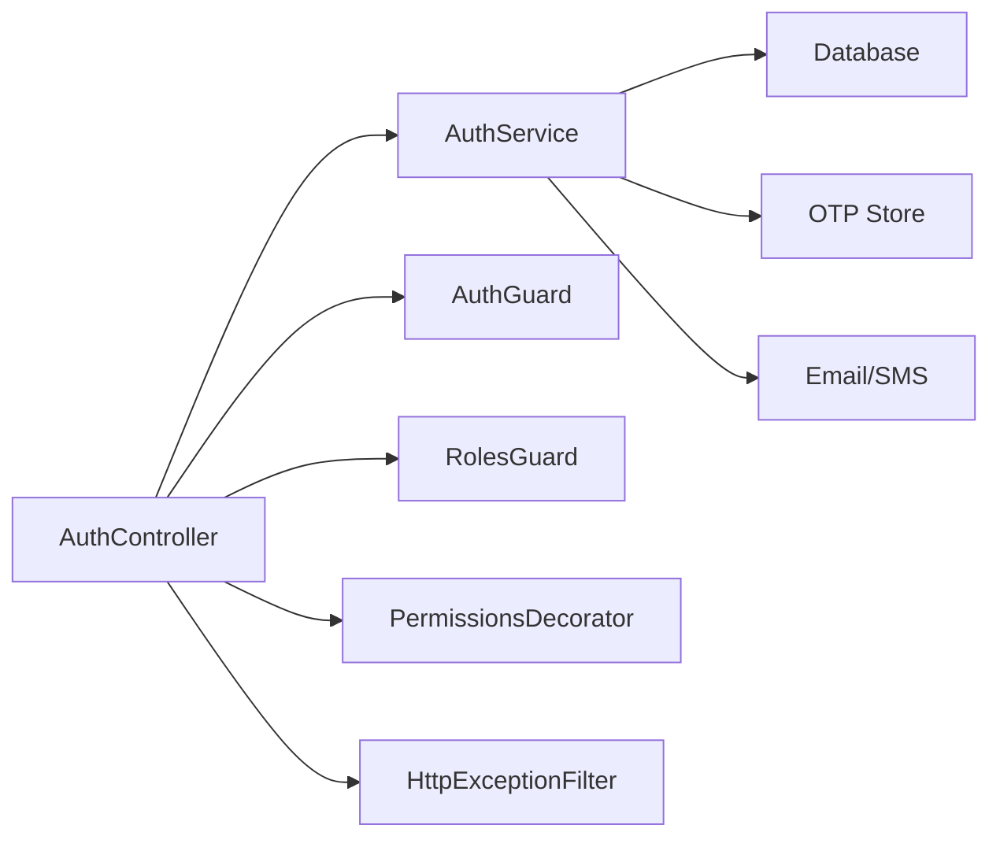

# Authentication API

<cite>
**Referenced Files in This Document**
- [auth.controller.ts](file://apps/backend/src/modules/auth/auth.controller.ts)
- [auth.service.ts](file://apps/backend/src/modules/auth/auth.service.ts)
- [auth.module.ts](file://apps/backend/src/modules/auth/auth.module.ts)
- [auth.guard.ts](file://apps/backend/src/common/guards/auth.guard.ts)
- [roles.guard.ts](file://apps/backend/src/common/guards/roles.guard.ts)
- [permissions.decorator.ts](file://apps/backend/src/common/decorators/permissions.decorator.ts)
- [http-exception.filter.ts](file://apps/backend/src/common/filters/http-exception.filter.ts)
- [app.module.ts](file://apps/backend/src/app.module.ts)
- [main.ts](file://apps/backend/src/main.ts)
</cite>

## Table of Contents
1. [Introduction](#introduction)
2. [Project Structure](#project-structure)
3. [Core Components](#core-components)
4. [Architecture Overview](#architecture-overview)
5. [Detailed Component Analysis](#detailed-component-analysis)
6. [Dependency Analysis](#dependency-analysis)
7. [Performance Considerations](#performance-considerations)
8. [Troubleshooting Guide](#troubleshooting-guide)
9. [Conclusion](#conclusion)
10. [Appendices](#appendices)

## Introduction
This document provides comprehensive API documentation for the authentication system, including user registration, login with OTP verification, JWT token management, and role-based authorization. It explains the end-to-end authentication flow from initial login through token validation and refresh mechanisms, and details request/response schemas, error handling patterns, and security considerations. Practical examples are provided for different user roles (admin, driver, passenger), along with guidance on using permission decorators and guards.

## Project Structure
The authentication system is implemented as a NestJS module within the backend application. The core components include:
- Auth controller exposing HTTP endpoints for registration, login, OTP verification, and token operations
- Auth service implementing business logic for OTP generation, JWT issuance, and role checks
- Guards for protecting routes and enforcing role-based access
- A decorator to declare permissions at the controller method level
- An HTTP exception filter for consistent error responses
- Module wiring and application bootstrap configuration

**Diagram sources**
- [auth.controller.ts](file://apps/backend/src/modules/auth/auth.controller.ts)
- [auth.service.ts](file://apps/backend/src/modules/auth/auth.service.ts)
- [auth.guard.ts](file://apps/backend/src/common/guards/auth.guard.ts)
- [roles.guard.ts](file://apps/backend/src/common/guards/roles.guard.ts)
- [permissions.decorator.ts](file://apps/backend/src/common/decorators/permissions.decorator.ts)
- [http-exception.filter.ts](file://apps/backend/src/common/filters/http-exception.filter.ts)

**Section sources**
- [auth.controller.ts](file://apps/backend/src/modules/auth/auth.controller.ts)
- [auth.service.ts](file://apps/backend/src/modules/auth/auth.service.ts)
- [auth.module.ts](file://apps/backend/src/modules/auth/auth.module.ts)
- [auth.guard.ts](file://apps/backend/src/common/guards/auth.guard.ts)
- [roles.guard.ts](file://apps/backend/src/common/guards/roles.guard.ts)
- [permissions.decorator.ts](file://apps/backend/src/common/decorators/permissions.decorator.ts)
- [http-exception.filter.ts](file://apps/backend/src/common/filters/http-exception.filter.ts)
- [app.module.ts](file://apps/backend/src/app.module.ts)
- [main.ts](file://apps/backend/src/main.ts)

## Core Components
- AuthController: Defines REST endpoints for registration, login, OTP verification, and token management. Integrates guards and decorators for authorization.
- AuthService: Implements OTP lifecycle (send, verify), JWT creation/validation, and role-based checks. Coordinates with external services such as email/SMS and storage backends.
- AuthGuard: Validates JWT tokens attached to requests and attaches user context to the request object.
- RolesGuard: Enforces role-based access control by checking the authenticated user’s roles against declared requirements.
- PermissionsDecorator: Provides declarative permission annotations that can be combined with guards for fine-grained authorization.
- HttpExceptionFilter: Normalizes error responses across the application for consistent client handling.

Key responsibilities:
- Registration: Create user accounts and assign default roles based on client type.
- Login: Issue an OTP to the user’s contact channel and return a session identifier.
- OTP Verification: Validate the OTP and issue JWTs (access and refresh tokens).
- Token Management: Provide endpoints to refresh access tokens using valid refresh tokens.
- Authorization: Protect endpoints via guards and decorators to enforce roles and permissions.

**Section sources**
- [auth.controller.ts](file://apps/backend/src/modules/auth/auth.controller.ts)
- [auth.service.ts](file://apps/backend/src/modules/auth/auth.service.ts)
- [auth.guard.ts](file://apps/backend/src/common/guards/auth.guard.ts)
- [roles.guard.ts](file://apps/backend/src/common/guards/roles.guard.ts)
- [permissions.decorator.ts](file://apps/backend/src/common/decorators/permissions.decorator.ts)
- [http-exception.filter.ts](file://apps/backend/src/common/filters/http-exception.filter.ts)

## Architecture Overview
The authentication architecture follows a layered approach:
- Presentation layer: Controllers expose HTTP endpoints.
- Business layer: Services orchestrate OTP flows, JWT issuance, and role checks.
- Security layer: Guards validate tokens and enforce roles; decorators declare permissions.
- Cross-cutting concerns: Exception filter standardizes error responses.

**Diagram sources**
- [auth.controller.ts](file://apps/backend/src/modules/auth/auth.controller.ts)
- [auth.service.ts](file://apps/backend/src/modules/auth/auth.service.ts)
- [auth.guard.ts](file://apps/backend/src/common/guards/auth.guard.ts)
- [roles.guard.ts](file://apps/backend/src/common/guards/roles.guard.ts)
- [http-exception.filter.ts](file://apps/backend/src/common/filters/http-exception.filter.ts)

## Detailed Component Analysis

### Authentication Endpoints
The following endpoints are exposed by the authentication system. All paths are relative to the base URL configured in the application.

- Register User
  - Method: POST
  - Path: /auth/register
  - Request body:
    - username: string (required)
    - email: string (required, unique)
    - phone: string (optional)
    - password: string (required, min length enforced server-side)
    - role: enum ["passenger", "driver", "admin"] (optional; defaults may apply)
  - Response:
    - 201 Created: { userId: string, username: string, email: string, roles: string[] }
    - 400 Bad Request: { message: string, errors?: Record<string, string[]> }
    - 409 Conflict: { message: string }
  - Notes: Default roles may be assigned if not provided. Password hashing is handled server-side.

- Send OTP
  - Method: POST
  - Path: /auth/login
  - Request body:
    - identifier: string (email or phone)
  - Response:
    - 200 OK: { otpSessionId: string }
    - 400 Bad Request: { message: string }
    - 404 Not Found: { message: string }
  - Notes: OTP delivery channel depends on identifier type. Rate limiting applies.

- Verify OTP and Issue Tokens
  - Method: POST
  - Path: /auth/verify-otp
  - Request body:
    - otpSessionId: string (required)
    - code: string (required, numeric)
  - Response:
    - 200 OK: { accessToken: string, refreshToken: string, expiresIn: number }
    - 400 Bad Request: { message: string }
    - 401 Unauthorized: { message: string }
  - Notes: OTP must be valid and unused. Tokens follow JWT format.

- Refresh Access Token
  - Method: POST
  - Path: /auth/refresh
  - Request body:
    - refreshToken: string (required)
  - Response:
    - 200 OK: { accessToken: string, refreshToken: string, expiresIn: number }
    - 401 Unauthorized: { message: string }
  - Notes: Refresh tokens are rotated upon use. Blacklist or expiration is enforced server-side.

- Get Current User Profile
  - Method: GET
  - Path: /auth/me
  - Headers:
    - Authorization: Bearer <accessToken>
  - Response:
    - 200 OK: { id: string, username: string, email: string, roles: string[], profile: object }
    - 401 Unauthorized: { message: string }
    - 403 Forbidden: { message: string }
  - Notes: Protected by AuthGuard and RolesGuard.

- Role-Specific Endpoints (Examples)
  - Admin-only:
    - GET /auth/admin/users
    - DELETE /auth/admin/users/:id
  - Driver-only:
    - GET /auth/driver/profile
    - PUT /auth/driver/profile
  - Passenger-only:
    - GET /auth/passenger/activity
  - Notes: These endpoints are protected by RolesGuard and/or PermissionsDecorator.

Request/Response Schemas Summary
- Common fields:
  - accessToken: string (JWT)
  - refreshToken: string (opaque or JWT)
  - expiresIn: number (seconds until access token expiry)
  - roles: string[] (user roles)
- Error response shape:
  - { message: string, errors?: Record<string, string[]> }

Security Considerations
- Use HTTPS for all endpoints.
- Enforce strong password policies and hash passwords server-side.
- Limit OTP attempts and implement rate limiting per identifier and IP.
- Short-lived access tokens and secure rotation of refresh tokens.
- Validate and sanitize inputs; reject malformed identifiers.
- Store secrets (JWT signing keys, OTP store credentials) securely via environment variables.

**Section sources**
- [auth.controller.ts](file://apps/backend/src/modules/auth/auth.controller.ts)
- [auth.service.ts](file://apps/backend/src/modules/auth/auth.service.ts)

### Authentication Flow
End-to-end flow from login to protected resource access:

**Diagram sources**
- [auth.controller.ts](file://apps/backend/src/modules/auth/auth.controller.ts)
- [auth.service.ts](file://apps/backend/src/modules/auth/auth.service.ts)
- [auth.guard.ts](file://apps/backend/src/common/guards/auth.guard.ts)
- [roles.guard.ts](file://apps/backend/src/common/guards/roles.guard.ts)

### Permission Decorator Usage
The permissions decorator allows declarative specification of required permissions on controller methods. Combine it with guards to enforce fine-grained authorization.

Usage pattern:
- Apply the decorator above controller methods to require specific permissions.
- Ensure the guard reads the declared permissions and validates them against the authenticated user’s capabilities.
- Example roles:
  - admin: full access to administrative endpoints
  - driver: access to driver-specific endpoints
  - passenger: access to passenger-specific endpoints

Best practices:
- Keep permissions granular and aligned with business features.
- Centralize permission definitions to avoid duplication.
- Log permission denials for auditability.

**Section sources**
- [permissions.decorator.ts](file://apps/backend/src/common/decorators/permissions.decorator.ts)
- [roles.guard.ts](file://apps/backend/src/common/guards/roles.guard.ts)

### Guard Implementation Patterns
- AuthGuard:
  - Validates JWT presence and signature.
  - Attaches user context to the request object.
  - Rejects invalid or expired tokens with standardized errors.
- RolesGuard:
  - Compares user roles against required roles.
  - Returns forbidden when roles do not match.
  - Can be combined with the permissions decorator for advanced checks.

Integration points:
- Global guards can be registered in the application bootstrap.
- Route-level guards provide more granular control.
- The HTTP exception filter ensures consistent error formatting.

**Section sources**
- [auth.guard.ts](file://apps/backend/src/common/guards/auth.guard.ts)
- [roles.guard.ts](file://apps/backend/src/common/guards/roles.guard.ts)
- [http-exception.filter.ts](file://apps/backend/src/common/filters/http-exception.filter.ts)
- [main.ts](file://apps/backend/src/main.ts)

### Practical Examples by Role

- Admin Flow
  - Register as admin (if allowed by policy).
  - Login and verify OTP to obtain tokens.
  - Access admin endpoints (e.g., list users, manage rides).
  - Use permissions decorator to restrict sensitive actions.

- Driver Flow
  - Register as driver.
  - Login and verify OTP.
  - Access driver endpoints (e.g., update profile, view earnings).
  - RolesGuard enforces driver-only access.

- Passenger Flow
  - Register as passenger.
  - Login and verify OTP.
  - Access passenger endpoints (e.g., view activity, book rides).
  - RolesGuard enforces passenger-only access.

Example sequences:
- Admin accessing admin endpoint:
  - Client sends request with Authorization header.
  - AuthGuard validates token.
  - RolesGuard checks admin role.
  - PermissionsDecorator verifies specific permission.
  - Controller returns data.

- Driver refreshing tokens:
  - Client calls refresh endpoint with valid refresh token.
  - Service issues new access and refresh tokens.
  - Client updates stored tokens and retries request.

**Section sources**
- [auth.controller.ts](file://apps/backend/src/modules/auth/auth.controller.ts)
- [auth.service.ts](file://apps/backend/src/modules/auth/auth.service.ts)
- [auth.guard.ts](file://apps/backend/src/common/guards/auth.guard.ts)
- [roles.guard.ts](file://apps/backend/src/common/guards/roles.guard.ts)
- [permissions.decorator.ts](file://apps/backend/src/common/decorators/permissions.decorator.ts)

## Dependency Analysis
The authentication system has clear separation of concerns:
- Controllers depend on services for business logic.
- Guards depend on JWT utilities and user context.
- Decorators rely on metadata to inform guards.
- Filters intercept exceptions globally.

**Diagram sources**
- [auth.controller.ts](file://apps/backend/src/modules/auth/auth.controller.ts)
- [auth.service.ts](file://apps/backend/src/modules/auth/auth.service.ts)
- [auth.guard.ts](file://apps/backend/src/common/guards/auth.guard.ts)
- [roles.guard.ts](file://apps/backend/src/common/guards/roles.guard.ts)
- [permissions.decorator.ts](file://apps/backend/src/common/decorators/permissions.decorator.ts)
- [http-exception.filter.ts](file://apps/backend/src/common/filters/http-exception.filter.ts)

**Section sources**
- [auth.module.ts](file://apps/backend/src/modules/auth/auth.module.ts)
- [app.module.ts](file://apps/backend/src/app.module.ts)
- [main.ts](file://apps/backend/src/main.ts)

## Performance Considerations
- Minimize payload sizes by returning only necessary fields.
- Cache OTP sessions efficiently with short TTLs.
- Use connection pooling for database interactions.
- Implement rate limiting on login and OTP endpoints.
- Prefer stateless JWTs where possible; keep refresh token rotation lightweight.
- Monitor token validation overhead and optimize cryptographic operations.

[No sources needed since this section provides general guidance]

## Troubleshooting Guide
Common issues and resolutions:
- Invalid or missing Authorization header:
  - Ensure clients attach Bearer tokens correctly.
  - Check token expiry and refresh flow.
- OTP verification failures:
  - Confirm OTP session ID validity and code correctness.
  - Inspect rate limiting and delivery logs.
- Role-based access denied:
  - Verify user roles assignment and guard configuration.
  - Review permissions decorator usage on endpoints.
- Consistent error responses:
  - Confirm HttpExceptionFilter is registered globally.
  - Normalize error payloads for client handling.

Operational tips:
- Enable detailed logging for auth flows during development.
- Use structured error codes for clients to handle gracefully.
- Audit failed login attempts and suspicious patterns.

**Section sources**
- [http-exception.filter.ts](file://apps/backend/src/common/filters/http-exception.filter.ts)
- [auth.guard.ts](file://apps/backend/src/common/guards/auth.guard.ts)
- [roles.guard.ts](file://apps/backend/src/common/guards/roles.guard.ts)

## Conclusion
The authentication system provides a robust foundation for secure user management and access control. It supports registration, OTP-based login, JWT token management, and role-based authorization with flexible permission declarations. By following the documented flows, schemas, and best practices, clients can integrate reliably and securely across admin, driver, and passenger roles.

[No sources needed since this section summarizes without analyzing specific files]

## Appendices

### Configuration and Bootstrap
- Application bootstrap registers global filters and modules.
- Auth module wires controllers, services, guards, and decorators.
- Environment variables should configure JWT secrets, OTP store settings, and provider credentials.

**Section sources**
- [main.ts](file://apps/backend/src/main.ts)
- [app.module.ts](file://apps/backend/src/app.module.ts)
- [auth.module.ts](file://apps/backend/src/modules/auth/auth.module.ts)