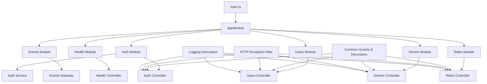
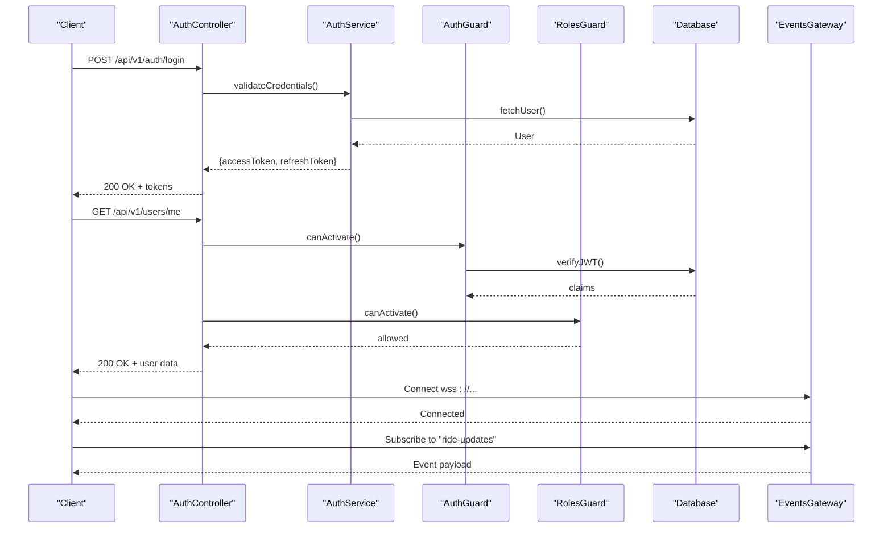
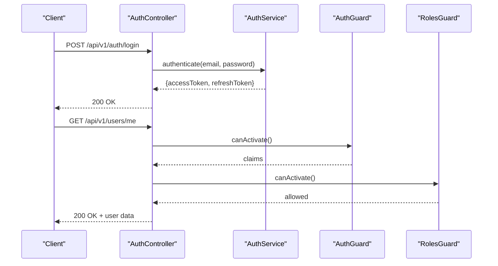
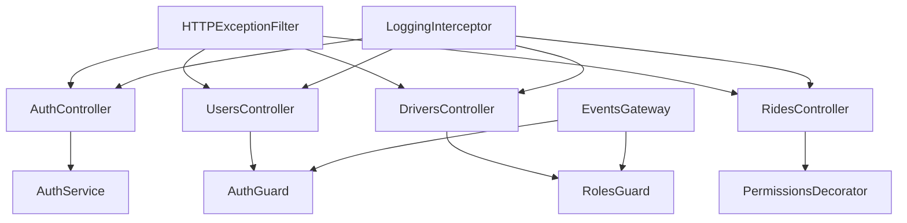

# Backend API Documentation

<cite>
**Referenced Files in This Document**
- [main.ts](file://apps/backend/src/main.ts)
- [app.module.ts](file://apps/backend/src/app.module.ts)
- [auth.controller.ts](file://apps/backend/src/modules/auth/auth.controller.ts)
- [auth.service.ts](file://apps/backend/src/modules/auth/auth.service.ts)
- [auth.guard.ts](file://apps/backend/src/common/guards/auth.guard.ts)
- [roles.guard.ts](file://apps/backend/src/common/guards/roles.guard.ts)
- [permissions.decorator.ts](file://apps/backend/src/common/decorators/permissions.decorator.ts)
- [http-exception.filter.ts](file://apps/backend/src/common/filters/http-exception.filter.ts)
- [logging.interceptor.ts](file://apps/backend/src/common/interceptors/logging.interceptor.ts)
- [events.gateway.ts](file://apps/backend/src/modules/events/events.gateway.ts)
- [drivers.controller.ts](file://apps/backend/src/modules/drivers/drivers.controller.ts)
- [rides.controller.ts](file://apps/backend/src/modules/rides/rides.controller.ts)
- [users.controller.ts](file://apps/backend/src/modules/users/users.controller.ts)
- [health.controller.ts](file://apps/backend/src/modules/health/health.controller.ts)
</cite>

## Table of Contents
1. [Introduction](#introduction)
2. [Project Structure](#project-structure)
3. [Core Components](#core-components)
4. [Architecture Overview](#architecture-overview)
5. [Detailed Component Analysis](#detailed-component-analysis)
6. [Dependency Analysis](#dependency-analysis)
7. [Performance Considerations](#performance-considerations)
8. [Troubleshooting Guide](#troubleshooting-guide)
9. [Conclusion](#conclusion)
10. [Appendices](#appendices)

## Introduction
This document provides comprehensive API documentation for the 18KansRide backend service. It covers RESTful endpoints, authentication with JWT and OTP verification, role-based access control, WebSocket gateway for real-time features, error handling strategies, status codes, response formats, rate limiting considerations, security best practices, and API versioning guidance. The goal is to enable clients (web, mobile, admin) to integrate reliably and securely with the backend.

## Project Structure
The backend is a NestJS application organized by feature modules with shared cross-cutting concerns:
- Entry point and bootstrap configuration
- Feature modules: auth, users, drivers, rides, events, health
- Common infrastructure: guards, decorators, filters, interceptors

**Diagram sources**
- [main.ts](file://apps/backend/src/main.ts)
- [app.module.ts](file://apps/backend/src/app.module.ts)
- [auth.controller.ts](file://apps/backend/src/modules/auth/auth.controller.ts)
- [auth.service.ts](file://apps/backend/src/modules/auth/auth.service.ts)
- [users.controller.ts](file://apps/backend/src/modules/users/users.controller.ts)
- [drivers.controller.ts](file://apps/backend/src/modules/drivers/drivers.controller.ts)
- [rides.controller.ts](file://apps/backend/src/modules/rides/rides.controller.ts)
- [events.gateway.ts](file://apps/backend/src/modules/events/events.gateway.ts)
- [health.controller.ts](file://apps/backend/src/modules/health/health.controller.ts)
- [auth.guard.ts](file://apps/backend/src/common/guards/auth.guard.ts)
- [roles.guard.ts](file://apps/backend/src/common/guards/roles.guard.ts)
- [permissions.decorator.ts](file://apps/backend/src/common/decorators/permissions.decorator.ts)
- [http-exception.filter.ts](file://apps/backend/src/common/filters/http-exception.filter.ts)
- [logging.interceptor.ts](file://apps/backend/src/common/interceptors/logging.interceptor.ts)

**Section sources**
- [main.ts](file://apps/backend/src/main.ts)
- [app.module.ts](file://apps/backend/src/app.module.ts)

## Core Components
- Authentication controller: handles login, OTP send/verify, token refresh, logout
- Users controller: user profile management and account operations
- Drivers controller: driver-specific operations (availability, earnings, subscription)
- Rides controller: ride lifecycle (create, list, update, cancel, complete)
- Events gateway: WebSocket gateway for real-time updates (ride tracking, notifications)
- Health controller: readiness/liveness probes
- Shared infrastructure: JWT guard, roles guard, permissions decorator, HTTP exception filter, logging interceptor

Key responsibilities:
- Enforce authentication via JWT bearer tokens
- Apply role-based access control using guards and decorators
- Emit and subscribe to real-time events through the WebSocket gateway
- Standardize error responses via an HTTP exception filter
- Log request/response metadata via an interceptor

**Section sources**
- [auth.controller.ts](file://apps/backend/src/modules/auth/auth.controller.ts)
- [auth.service.ts](file://apps/backend/src/modules/auth/auth.service.ts)
- [users.controller.ts](file://apps/backend/src/modules/users/users.controller.ts)
- [drivers.controller.ts](file://apps/backend/src/modules/drivers/drivers.controller.ts)
- [rides.controller.ts](file://apps/backend/src/modules/rides/rides.controller.ts)
- [events.gateway.ts](file://apps/backend/src/modules/events/events.gateway.ts)
- [health.controller.ts](file://apps/backend/src/modules/health/health.controller.ts)
- [auth.guard.ts](file://apps/backend/src/common/guards/auth.guard.ts)
- [roles.guard.ts](file://apps/backend/src/common/guards/roles.guard.ts)
- [permissions.decorator.ts](file://apps/backend/src/common/decorators/permissions.decorator.ts)
- [http-exception.filter.ts](file://apps/backend/src/common/filters/http-exception.filter.ts)
- [logging.interceptor.ts](file://apps/backend/src/common/interceptors/logging.interceptor.ts)

## Architecture Overview
The backend exposes REST APIs over HTTP and a WebSocket gateway for real-time communication. Authentication is enforced at the controller level using guards and decorators. Real-time events are broadcasted from the gateway based on business logic triggered by controllers/services.

**Diagram sources**
- [auth.controller.ts](file://apps/backend/src/modules/auth/auth.controller.ts)
- [auth.service.ts](file://apps/backend/src/modules/auth/auth.service.ts)
- [auth.guard.ts](file://apps/backend/src/common/guards/auth.guard.ts)
- [roles.guard.ts](file://apps/backend/src/common/guards/roles.guard.ts)
- [events.gateway.ts](file://apps/backend/src/modules/events/events.gateway.ts)

## Detailed Component Analysis

### Authentication API
Endpoints:
- Login: POST /api/v1/auth/login
- Send OTP: POST /api/v1/auth/send-otp
- Verify OTP: POST /api/v1/auth/verify-otp
- Refresh Token: POST /api/v1/auth/refresh-token
- Logout: POST /api/v1/auth/logout

Authentication requirements:
- Login and OTP endpoints do not require prior authentication
- Protected endpoints require a valid JWT bearer token in the Authorization header
- Role-based access may be enforced per endpoint using roles guard and permissions decorator

Request/Response schemas:
- Login request: email, password
- Login response: accessToken, refreshToken, expiresIn
- Send OTP request: phone or email (provider-dependent)
- Send OTP response: success flag, message
- Verify OTP request: code, identifier (phone/email), action context
- Verify OTP response: success flag, optional token(s)
- Refresh Token request: refreshToken
- Refresh Token response: new accessToken, expiresIn
- Logout request: bearer token
- Logout response: success flag

Example usage:
- Login:
  - Request: POST /api/v1/auth/login with JSON body containing email and password
  - Response: 200 OK with accessToken and refreshToken
- Send OTP:
  - Request: POST /api/v1/auth/send-otp with identifier
  - Response: 200 OK with success message
- Verify OTP:
  - Request: POST /api/v1/auth/verify-otp with code and identifier
  - Response: 200 OK with success and optional tokens
- Refresh Token:
  - Request: POST /api/v1/auth/refresh-token with refreshToken
  - Response: 200 OK with new accessToken
- Logout:
  - Request: POST /api/v1/auth/logout with bearer token
  - Response: 200 OK with success message

Error handling:
- Invalid credentials: 401 Unauthorized
- OTP invalid/expired: 400 Bad Request
- Rate-limited OTP requests: 429 Too Many Requests
- Server errors: 500 Internal Server Error

Security considerations:
- Use HTTPS for all endpoints
- Store tokens securely on client side
- Implement token rotation and short-lived access tokens
- Validate OTP expiration and single-use constraints

**Section sources**
- [auth.controller.ts](file://apps/backend/src/modules/auth/auth.controller.ts)
- [auth.service.ts](file://apps/backend/src/modules/auth/auth.service.ts)
- [auth.guard.ts](file://apps/backend/src/common/guards/auth.guard.ts)
- [roles.guard.ts](file://apps/backend/src/common/guards/roles.guard.ts)
- [permissions.decorator.ts](file://apps/backend/src/common/decorators/permissions.decorator.ts)

#### Authentication Flow Sequence

**Diagram sources**
- [auth.controller.ts](file://apps/backend/src/modules/auth/auth.controller.ts)
- [auth.service.ts](file://apps/backend/src/modules/auth/auth.service.ts)
- [auth.guard.ts](file://apps/backend/src/common/guards/auth.guard.ts)
- [roles.guard.ts](file://apps/backend/src/common/guards/roles.guard.ts)

### Users API
Endpoints:
- Get current user: GET /api/v1/users/me
- Update profile: PATCH /api/v1/users/me
- List users (admin): GET /api/v1/users
- Get user by ID: GET /api/v1/users/:id
- Deactivate account: DELETE /api/v1/users/me

Authentication requirements:
- All endpoints require JWT bearer token
- Admin-only endpoints enforce role checks via roles guard and permissions decorator

Request/Response schemas:
- Update profile request: name, avatar URL, contact info fields
- Update profile response: updated user object
- List users response: paginated array of user objects
- Get user by ID response: user object
- Deactivate account response: success flag

Example usage:
- Get current user:
  - Request: GET /api/v1/users/me with Authorization: Bearer <token>
  - Response: 200 OK with user details
- Update profile:
  - Request: PATCH /api/v1/users/me with JSON body
  - Response: 200 OK with updated user
- List users (admin):
  - Request: GET /api/v1/users?page=1&limit=20 with Authorization: Bearer <admin-token>
  - Response: 200 OK with paginated users

Error handling:
- Unauthorized: 401
- Forbidden: 403
- Not found: 404
- Validation errors: 422 Unprocessable Entity
- Server errors: 500

Security considerations:
- Enforce field-level validation
- Sanitize inputs
- Limit exposure of sensitive fields

**Section sources**
- [users.controller.ts](file://apps/backend/src/modules/users/users.controller.ts)
- [auth.guard.ts](file://apps/backend/src/common/guards/auth.guard.ts)
- [roles.guard.ts](file://apps/backend/src/common/guards/roles.guard.ts)
- [permissions.decorator.ts](file://apps/backend/src/common/decorators/permissions.decorator.ts)

### Drivers API
Endpoints:
- Driver availability: PUT /api/v1/drivers/me/availability
- Driver earnings: GET /api/v1/drivers/me/earnings
- Driver subscription: GET /api/v1/drivers/me/subscription
- Update driver profile: PATCH /api/v1/drivers/me

Authentication requirements:
- JWT bearer token required
- Role-based access restricted to drivers

Request/Response schemas:
- Availability request: status (online/offline)
- Availability response: updated status
- Earnings response: summary and breakdown
- Subscription response: plan details and expiry
- Update profile request: driver-specific fields

Example usage:
- Set availability:
  - Request: PUT /api/v1/drivers/me/availability with status
  - Response: 200 OK with updated status
- Get earnings:
  - Request: GET /api/v1/drivers/me/earnings?period=week
  - Response: 200 OK with earnings summary

Error handling:
- Unauthorized: 401
- Forbidden: 403
- Validation errors: 422
- Server errors: 500

Security considerations:
- Ensure only authenticated drivers can modify their own data
- Validate numeric ranges for earnings and subscription fields

**Section sources**
- [drivers.controller.ts](file://apps/backend/src/modules/drivers/drivers.controller.ts)
- [auth.guard.ts](file://apps/backend/src/common/guards/auth.guard.ts)
- [roles.guard.ts](file://apps/backend/src/common/guards/roles.guard.ts)
- [permissions.decorator.ts](file://apps/backend/src/common/decorators/permissions.decorator.ts)

### Rides API
Endpoints:
- Create ride: POST /api/v1/rides
- List rides: GET /api/v1/rides
- Get ride by ID: GET /api/v1/rides/:id
- Update ride: PATCH /api/v1/rides/:id
- Cancel ride: DELETE /api/v1/rides/:id
- Complete ride: POST /api/v1/rides/:id/complete

Authentication requirements:
- JWT bearer token required
- Role-based access for passengers and drivers

Request/Response schemas:
- Create ride request: pickup, dropoff, scheduled time, passenger count
- Create ride response: created ride object
- List rides response: paginated rides
- Update ride request: partial ride fields
- Update ride response: updated ride
- Cancel ride response: cancellation confirmation
- Complete ride response: completion confirmation

Example usage:
- Create ride:
  - Request: POST /api/v1/rides with ride details
  - Response: 201 Created with ride object
- Cancel ride:
  - Request: DELETE /api/v1/rides/:id
  - Response: 200 OK with cancellation confirmation

Error handling:
- Unauthorized: 401
- Forbidden: 403
- Not found: 404
- Conflict: 409 (e.g., ride already completed)
- Validation errors: 422
- Server errors: 500

Security considerations:
- Validate ownership and permissions before mutations
- Enforce state transitions (e.g., cannot cancel completed rides)

**Section sources**
- [rides.controller.ts](file://apps/backend/src/modules/rides/rides.controller.ts)
- [auth.guard.ts](file://apps/backend/src/common/guards/auth.guard.ts)
- [roles.guard.ts](file://apps/backend/src/common/guards/roles.guard.ts)
- [permissions.decorator.ts](file://apps/backend/src/common/decorators/permissions.decorator.ts)

### WebSocket Gateway
Connection and events:
- Connection: wss://<host>/ws
- Subscriptions:
  - ride-updates: real-time ride status changes
  - notifications: system and user notifications
- Message format:
  - event: string (event type)
  - payload: object (context-specific data)
  - timestamp: number (epoch milliseconds)

Example usage:
- Connect:
  - Client connects to wss://<host>/ws
  - Server responds with connection established
- Subscribe to ride-updates:
  - Client sends subscribe message with event type
  - Server emits ride-updates events with payload

Error handling:
- Connection errors: retry with exponential backoff
- Invalid messages: server ignores or returns error event
- Disconnections: client re-subscribes upon reconnect

Security considerations:
- Authenticate WebSocket connections using JWT
- Authorize subscriptions based on user roles and resource ownership

**Section sources**
- [events.gateway.ts](file://apps/backend/src/modules/events/events.gateway.ts)
- [auth.guard.ts](file://apps/backend/src/common/guards/auth.guard.ts)
- [roles.guard.ts](file://apps/backend/src/common/guards/roles.guard.ts)

### Health Check API
Endpoints:
- Readiness: GET /api/v1/health/readiness
- Liveness: GET /api/v1/health/liveness

Authentication requirements:
- No authentication required (public endpoints)

Request/Response schemas:
- Readiness response: status (ready/not ready), details
- Liveness response: status (alive/dead), timestamp

Example usage:
- Readiness:
  - Request: GET /api/v1/health/readiness
  - Response: 200 OK with readiness status
- Liveness:
  - Request: GET /api/v1/health/liveness
  - Response: 200 OK with liveness status

Error handling:
- Service unavailable: 503 Service Unavailable
- Server errors: 500 Internal Server Error

Security considerations:
- Restrict health endpoints to internal networks if needed
- Avoid exposing sensitive diagnostic information

**Section sources**
- [health.controller.ts](file://apps/backend/src/modules/health/health.controller.ts)

## Dependency Analysis
The backend follows a modular architecture with clear separation of concerns. Controllers depend on services for business logic, while guards and decorators enforce cross-cutting concerns like authentication and authorization. The WebSocket gateway integrates with the same authentication and authorization mechanisms.

**Diagram sources**
- [auth.controller.ts](file://apps/backend/src/modules/auth/auth.controller.ts)
- [auth.service.ts](file://apps/backend/src/modules/auth/auth.service.ts)
- [users.controller.ts](file://apps/backend/src/modules/users/users.controller.ts)
- [drivers.controller.ts](file://apps/backend/src/modules/drivers/drivers.controller.ts)
- [rides.controller.ts](file://apps/backend/src/modules/rides/rides.controller.ts)
- [events.gateway.ts](file://apps/backend/src/modules/events/events.gateway.ts)
- [auth.guard.ts](file://apps/backend/src/common/guards/auth.guard.ts)
- [roles.guard.ts](file://apps/backend/src/common/guards/roles.guard.ts)
- [permissions.decorator.ts](file://apps/backend/src/common/decorators/permissions.decorator.ts)
- [http-exception.filter.ts](file://apps/backend/src/common/filters/http-exception.filter.ts)
- [logging.interceptor.ts](file://apps/backend/src/common/interceptors/logging.interceptor.ts)

**Section sources**
- [app.module.ts](file://apps/backend/src/app.module.ts)
- [auth.controller.ts](file://apps/backend/src/modules/auth/auth.controller.ts)
- [auth.service.ts](file://apps/backend/src/modules/auth/auth.service.ts)
- [users.controller.ts](file://apps/backend/src/modules/users/users.controller.ts)
- [drivers.controller.ts](file://apps/backend/src/modules/drivers/drivers.controller.ts)
- [rides.controller.ts](file://apps/backend/src/modules/rides/rides.controller.ts)
- [events.gateway.ts](file://apps/backend/src/modules/events/events.gateway.ts)
- [auth.guard.ts](file://apps/backend/src/common/guards/auth.guard.ts)
- [roles.guard.ts](file://apps/backend/src/common/guards/roles.guard.ts)
- [permissions.decorator.ts](file://apps/backend/src/common/decorators/permissions.decorator.ts)
- [http-exception.filter.ts](file://apps/backend/src/common/filters/http-exception.filter.ts)
- [logging.interceptor.ts](file://apps/backend/src/common/interceptors/logging.interceptor.ts)

## Performance Considerations
- Use pagination for list endpoints to reduce payload sizes
- Implement caching for frequently accessed read-only data
- Optimize database queries with proper indexing and joins
- Monitor WebSocket connection limits and scale horizontally
- Use compression for large responses
- Profile and optimize hot paths in business logic

[No sources needed since this section provides general guidance]

## Troubleshooting Guide
Common issues and resolutions:
- Authentication failures:
  - Ensure JWT token is present and valid
  - Check token expiration and refresh flow
- Authorization errors:
  - Verify user roles and permissions
  - Confirm endpoint requires specific roles
- WebSocket disconnections:
  - Implement reconnection logic with exponential backoff
  - Validate subscription permissions
- Rate limiting:
  - Monitor 429 responses and adjust client retry behavior
  - Configure appropriate rate limits per endpoint

Error response format:
- status: number (HTTP status code)
- message: string (error description)
- error: string (error type)
- timestamp: number (ISO timestamp)
- path: string (request path)

Logging and monitoring:
- Use logging interceptor to capture request/response metadata
- Integrate with centralized logging systems
- Set up alerts for critical errors

**Section sources**
- [http-exception.filter.ts](file://apps/backend/src/common/filters/http-exception.filter.ts)
- [logging.interceptor.ts](file://apps/backend/src/common/interceptors/logging.interceptor.ts)

## Conclusion
The 18KansRide backend provides a robust API surface with secure authentication, role-based access control, and real-time capabilities through WebSocket. The modular architecture ensures maintainability and scalability. Clients should follow the documented endpoints, handle errors appropriately, and implement security best practices for reliable integration.

[No sources needed since this section summarizes without analyzing specific files]

## Appendices

### API Versioning Strategy
- Use URL path versioning (/api/v1/)
- Maintain backward compatibility within major versions
- Deprecate endpoints with advance notice
- Document breaking changes in release notes

### Security Best Practices
- Enforce HTTPS everywhere
- Implement input validation and sanitization
- Use parameterized queries to prevent SQL injection
- Apply rate limiting and throttling
- Secure secrets with environment variables
- Regularly rotate JWT signing keys

### Rate Limiting Guidelines
- Implement per-user and per-IP rate limiting
- Configure different limits for sensitive endpoints (login, OTP)
- Return appropriate 429 responses with retry-after headers
- Monitor and adjust limits based on usage patterns

[No sources needed since this section provides general guidance]