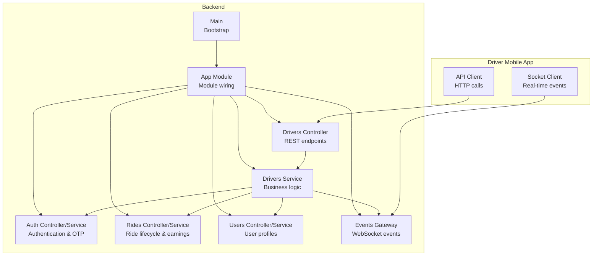
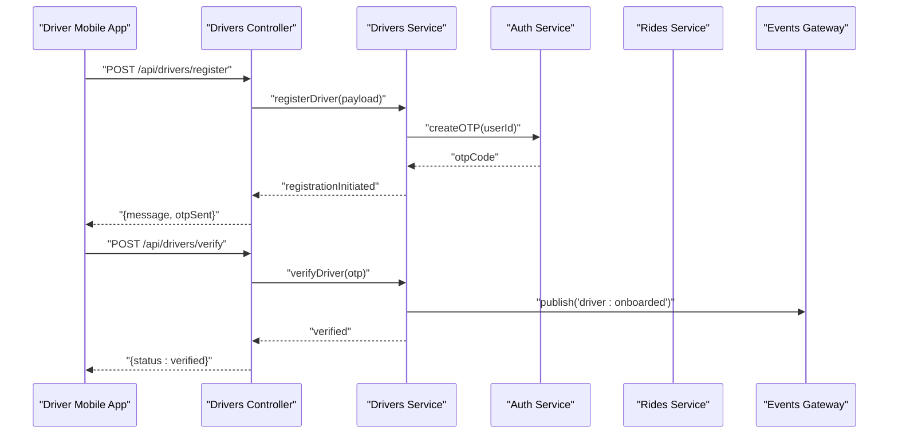
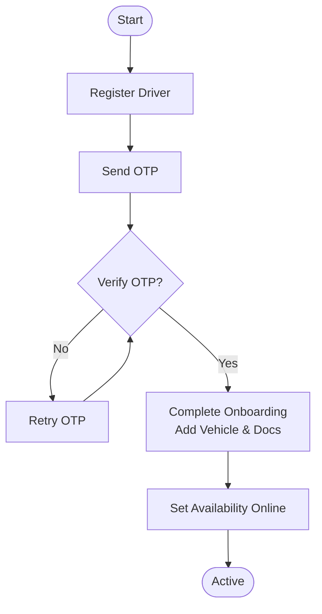
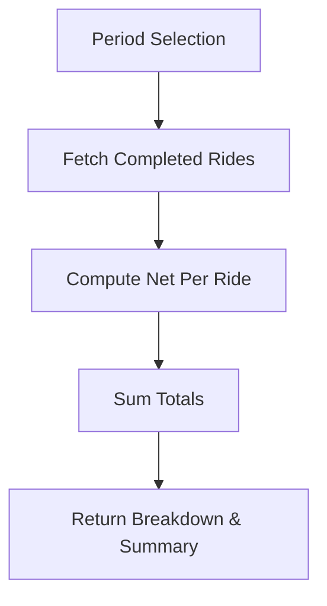
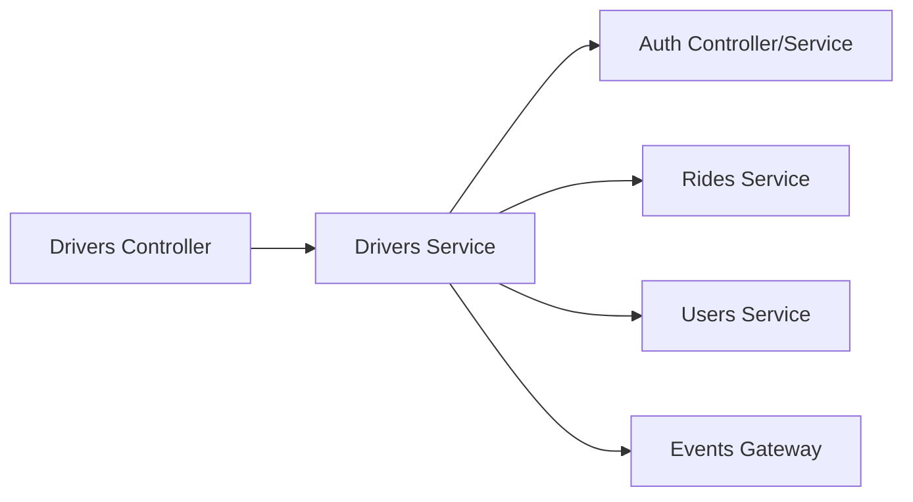

# Driver Management API

<cite>
**Referenced Files in This Document**
- [drivers.controller.ts](file://apps/backend/src/modules/drivers/drivers.controller.ts)
- [drivers.service.ts](file://apps/backend/src/modules/drivers/drivers.service.ts)
- [drivers.module.ts](file://apps/backend/src/modules/drivers/drivers.module.ts)
- [auth.controller.ts](file://apps/backend/src/modules/auth/auth.controller.ts)
- [auth.service.ts](file://apps/backend/src/modules/auth/auth.service.ts)
- [events.gateway.ts](file://apps/backend/src/modules/events/events.gateway.ts)
- [rides.controller.ts](file://apps/backend/src/modules/rides/rides.controller.ts)
- [rides.service.ts](file://apps/backend/src/modules/rides/rides.service.ts)
- [users.controller.ts](file://apps/backend/src/modules/users/users.controller.ts)
- [users.service.ts](file://apps/backend/src/modules/users/users.service.ts)
- [app.module.ts](file://apps/backend/src/app.module.ts)
- [main.ts](file://apps/backend/src/main.ts)
- [client.ts (driver mobile)](file://apps/mobile-driver/src/api/client.ts)
- [socket.ts (driver mobile)](file://apps/mobile-driver/src/api/socket.ts)
</cite>

## Table of Contents
1. Introduction
2. Project Structure
3. Core Components
4. Architecture Overview
5. Detailed Component Analysis
6. Dependency Analysis
7. Performance Considerations
8. Troubleshooting Guide
9. Conclusion

## Introduction
This document provides comprehensive API documentation for driver management functionality, including registration, profile updates, vehicle management, availability status, earnings tracking, onboarding and verification workflows, performance metrics collection, and integration points with real-time location tracking and notifications. It also includes request/response schemas, validation rules, business logic constraints, examples of status transitions, earnings calculations, fleet operations, and end-to-end flows.

## Project Structure
The backend is a NestJS application organized by feature modules. The driver management module exposes REST endpoints for driver lifecycle operations and integrates with authentication, rides, users, and real-time events. The driver mobile app consumes these APIs and uses WebSockets for live updates.

**Diagram sources**
- [drivers.controller.ts](file://apps/backend/src/modules/drivers/drivers.controller.ts)
- [drivers.service.ts](file://apps/backend/src/modules/drivers/drivers.service.ts)
- [auth.controller.ts](file://apps/backend/src/modules/auth/auth.controller.ts)
- [auth.service.ts](file://apps/backend/src/modules/auth/auth.service.ts)
- [rides.controller.ts](file://apps/backend/src/modules/rides/rides.controller.ts)
- [rides.service.ts](file://apps/backend/src/modules/rides/rides.service.ts)
- [users.controller.ts](file://apps/backend/src/modules/users/users.controller.ts)
- [users.service.ts](file://apps/backend/src/modules/users/users.service.ts)
- [events.gateway.ts](file://apps/backend/src/modules/events/events.gateway.ts)
- [app.module.ts](file://apps/backend/src/app.module.ts)
- [main.ts](file://apps/backend/src/main.ts)
- [client.ts (driver mobile)](file://apps/mobile-driver/src/api/client.ts)
- [socket.ts (driver mobile)](file://apps/mobile-driver/src/api/socket.ts)

**Section sources**
- [app.module.ts](file://apps/backend/src/app.module.ts)
- [main.ts](file://apps/backend/src/main.ts)

## Core Components
- Drivers Controller: Exposes REST endpoints for driver registration, profile updates, vehicle CRUD, availability toggles, and earnings queries.
- Drivers Service: Implements business logic for driver lifecycle, verification state machine, earnings aggregation, and event publishing.
- Auth Controller/Service: Handles OTP-based login and session/token issuance used by drivers during onboarding.
- Rides Controller/Service: Provides ride lifecycle endpoints; used to compute earnings and update driver performance metrics.
- Users Controller/Service: Manages user profiles; drivers are linked to user accounts.
- Events Gateway: Publishes WebSocket events for driver status changes, location updates, and ride progress.
- Driver Mobile Client: HTTP client and socket client used by the driver app to call APIs and subscribe to real-time events.

**Section sources**
- [drivers.controller.ts](file://apps/backend/src/modules/drivers/drivers.controller.ts)
- [drivers.service.ts](file://apps/backend/src/modules/drivers/drivers.service.ts)
- [auth.controller.ts](file://apps/backend/src/modules/auth/auth.controller.ts)
- [auth.service.ts](file://apps/backend/src/modules/auth/auth.service.ts)
- [rides.controller.ts](file://apps/backend/src/modules/rides/rides.controller.ts)
- [rides.service.ts](file://apps/backend/src/modules/rides/rides.service.ts)
- [users.controller.ts](file://apps/backend/src/modules/users/users.controller.ts)
- [users.service.ts](file://apps/backend/src/modules/users/users.service.ts)
- [events.gateway.ts](file://apps/backend/src/modules/events/events.gateway.ts)
- [client.ts (driver mobile)](file://apps/mobile-driver/src/api/client.ts)
- [socket.ts (driver mobile)](file://apps/mobile-driver/src/api/socket.ts)

## Architecture Overview
The driver management system follows a modular architecture with clear separation between controllers (HTTP), services (business logic), and gateways (real-time). Authentication is OTP-based and integrated into the driver onboarding flow. Real-time updates are delivered via WebSockets for live location and status.

**Diagram sources**
- [drivers.controller.ts](file://apps/backend/src/modules/drivers/drivers.controller.ts)
- [drivers.service.ts](file://apps/backend/src/modules/drivers/drivers.service.ts)
- [auth.controller.ts](file://apps/backend/src/modules/auth/auth.controller.ts)
- [auth.service.ts](file://apps/backend/src/modules/auth/auth.service.ts)
- [events.gateway.ts](file://apps/backend/src/modules/events/events.gateway.ts)

## Detailed Component Analysis

### Driver Registration and Onboarding
- Endpoints:
  - POST /api/drivers/register
  - POST /api/drivers/verify
- Request/Response Schemas:
  - Register Request:
    - userId: string (required)
    - phone: string (required, E.164 format)
    - email: string (optional, valid email)
    - name: string (required, min length 2)
  - Register Response:
    - message: string
    - otpSent: boolean
  - Verify Request:
    - otp: string (required, numeric, fixed length)
  - Verify Response:
    - status: string ("verified")
- Validation Rules:
  - Phone must match E.164 pattern.
  - Email must be valid if provided.
  - Name must not be empty or too short.
  - OTP must be numeric and correct length.
- Business Logic Constraints:
  - Duplicate phone numbers are rejected.
  - OTP expires after a configured time window.
  - Verification marks driver as active and eligible for rides.
- Status Transitions:
  - pending -> verified upon successful OTP verification.
- Example Flow:
  - Driver submits registration details; OTP is sent via SMS/email.
  - Driver verifies OTP; account becomes verified and ready for onboarding completion.

**Section sources**
- [drivers.controller.ts](file://apps/backend/src/modules/drivers/drivers.controller.ts)
- [drivers.service.ts](file://apps/backend/src/modules/drivers/drivers.service.ts)
- [auth.controller.ts](file://apps/backend/src/modules/auth/auth.controller.ts)
- [auth.service.ts](file://apps/backend/src/modules/auth/auth.service.ts)

### Profile Updates
- Endpoints:
  - PATCH /api/drivers/profile
- Request Schema:
  - name: string (optional)
  - email: string (optional, valid email)
  - phone: string (optional, E.164)
  - avatarUrl: string (optional, URL)
  - bio: string (optional, max length)
- Response Schema:
  - driverId: string
  - updatedFields: array of strings
  - updatedAt: timestamp
- Validation Rules:
  - If fields are provided, they must conform to their types and formats.
  - Phone uniqueness enforced across drivers.
- Business Logic Constraints:
  - Only the authenticated driver can update their own profile.
  - Audit log records changes.

**Section sources**
- [drivers.controller.ts](file://apps/backend/src/modules/drivers/drivers.controller.ts)
- [drivers.service.ts](file://apps/backend/src/modules/drivers/drivers.service.ts)

### Vehicle Management
- Endpoints:
  - POST /api/drivers/vehicles
  - GET /api/drivers/vehicles
  - PUT /api/drivers/vehicles/:vehicleId
  - DELETE /api/drivers/vehicles/:vehicleId
- Request Schemas:
  - Create Vehicle:
    - make: string (required)
    - model: string (required)
    - year: number (required, within range)
    - color: string (required)
    - plateNumber: string (required, unique per region)
    - vin: string (optional)
    - insuranceExpiry: date (required)
    - registrationExpiry: date (required)
  - Update Vehicle:
    - Partial fields allowed; same validations apply.
- Response Schemas:
  - Vehicle object with id, driverId, and metadata.
- Validation Rules:
  - Year must be within acceptable bounds.
  - Plate number must be unique and formatted correctly.
  - Insurance and registration dates must be in the future.
- Business Logic Constraints:
  - A driver can have multiple vehicles but only one primary at a time.
  - Expired documents block vehicle from being set as primary.

**Section sources**
- [drivers.controller.ts](file://apps/backend/src/modules/drivers/drivers.controller.ts)
- [drivers.service.ts](file://apps/backend/src/modules/drivers/drivers.service.ts)

### Availability Status
- Endpoints:
  - POST /api/drivers/availability
- Request Schema:
  - status: enum ["online", "offline"]
  - reason: string (optional)
- Response Schema:
  - driverId: string
  - status: string
  - updatedAt: timestamp
- Validation Rules:
  - Status must be one of the allowed values.
- Business Logic Constraints:
  - Online drivers become eligible for ride requests.
  - Offline drivers are excluded from matching.
  - Reason is optional but recommended for auditability.

**Section sources**
- [drivers.controller.ts](file://apps/backend/src/modules/drivers/drivers.controller.ts)
- [drivers.service.ts](file://apps/backend/src/modules/drivers/drivers.service.ts)

### Earnings Tracking
- Endpoints:
  - GET /api/drivers/earnings?period=week|month&currency=USD
- Response Schema:
  - totalEarnings: number
  - currency: string
  - periodStart: date
  - periodEnd: date
  - breakdown: array of {rideId, amount, fee, tip, net}
- Calculation Rules:
  - Total earnings sum net amounts from completed rides in the period.
  - Fees and tips are included per ride where applicable.
  - Currency conversion applied if requested.
- Validation Rules:
  - Period must be valid enum value.
  - Currency must be supported ISO code.
- Business Logic Constraints:
  - Only completed rides count toward earnings.
  - Adjustments (refunds, penalties) are reflected in net.

**Section sources**
- [drivers.controller.ts](file://apps/backend/src/modules/drivers/drivers.controller.ts)
- [rides.service.ts](file://apps/backend/src/modules/rides/rides.service.ts)

### Performance Metrics Collection
- Endpoints:
  - GET /api/drivers/metrics?window=day|week|month
- Response Schema:
  - acceptanceRate: number (0..1)
  - cancellationRate: number (0..1)
  - averageRating: number (0..5)
  - completedRides: number
  - totalHoursOnline: number
- Validation Rules:
  - Window must be valid enum value.
- Business Logic Constraints:
  - Acceptance rate computed over eligible requests in the window.
  - Ratings aggregated from passenger feedback.
  - Hours online derived from availability logs.

**Section sources**
- [drivers.controller.ts](file://apps/backend/src/modules/drivers/drivers.controller.ts)
- [drivers.service.ts](file://apps/backend/src/modules/drivers/drivers.service.ts)

### Fleet Management Operations
- Endpoints:
  - GET /api/fleet/drivers?status=active|inactive
  - PUT /api/fleet/drivers/:driverId/status
- Request Schema:
  - Set status: { status: "active" | "inactive" }
- Response Schema:
  - driverId: string
  - status: string
  - updatedAt: timestamp
- Validation Rules:
  - Fleet admin role required.
  - Status must be valid enum.
- Business Logic Constraints:
  - Inactive drivers cannot accept new rides.
  - Active drivers must be verified and have a primary vehicle.

**Section sources**
- [drivers.controller.ts](file://apps/backend/src/modules/drivers/drivers.controller.ts)
- [drivers.service.ts](file://apps/backend/src/modules/drivers/drivers.service.ts)

### Integration Points: Real-Time Location Tracking and Notifications
- WebSocket Events:
  - driver:locationUpdate: { driverId, lat, lng, timestamp }
  - driver:statusChanged: { driverId, status, reason }
  - driver:onboarded: { driverId }
- Client Usage:
  - Driver mobile app connects to the gateway and subscribes to events.
  - Backend publishes events when driver availability or location changes.
- Error Handling:
  - Reconnection logic on client side.
  - Server-side heartbeat and cleanup for stale connections.

**Section sources**
- [events.gateway.ts](file://apps/backend/src/modules/events/events.gateway.ts)
- [socket.ts (driver mobile)](file://apps/mobile-driver/src/api/socket.ts)

### Driver Onboarding Workflow
- Steps:
  - Register driver with identity and contact info.
  - Send OTP for verification.
  - Verify OTP to mark driver as verified.
  - Add primary vehicle and upload required documents.
  - Set availability to online.
- State Machine:
  - pending -> verified -> onboarded -> active
- Example Sequence:
  - Driver registers -> OTP sent -> Driver verifies -> Onboarding complete -> Driver goes online.

**Diagram sources**
- [drivers.controller.ts](file://apps/backend/src/modules/drivers/drivers.controller.ts)
- [drivers.service.ts](file://apps/backend/src/modules/drivers/drivers.service.ts)
- [auth.controller.ts](file://apps/backend/src/modules/auth/auth.controller.ts)
- [auth.service.ts](file://apps/backend/src/modules/auth/auth.service.ts)

**Section sources**
- [drivers.controller.ts](file://apps/backend/src/modules/drivers/drivers.controller.ts)
- [drivers.service.ts](file://apps/backend/src/modules/drivers/drivers.service.ts)
- [auth.controller.ts](file://apps/backend/src/modules/auth/auth.controller.ts)
- [auth.service.ts](file://apps/backend/src/modules/auth/auth.service.ts)

### Earnings Calculation Example
- Inputs:
  - Completed rides in period with gross fare, platform fee, and tip.
- Formula:
  - Net per ride = gross fare - platform fee + tip
  - Total earnings = sum(net per ride)
- Output:
  - Aggregated totals and per-ride breakdown.

**Diagram sources**
- [rides.service.ts](file://apps/backend/src/modules/rides/rides.service.ts)
- [drivers.controller.ts](file://apps/backend/src/modules/drivers/drivers.controller.ts)

**Section sources**
- [drivers.controller.ts](file://apps/backend/src/modules/drivers/drivers.controller.ts)
- [rides.service.ts](file://apps/backend/src/modules/rides/rides.service.ts)

### Status Transition Examples
- Pending to Verified:
  - Trigger: Successful OTP verification.
  - Effect: Driver becomes eligible for onboarding completion.
- Verified to Active:
  - Trigger: Primary vehicle added and availability set to online.
  - Effect: Driver can receive ride requests.
- Active to Inactive:
  - Trigger: Fleet admin sets status inactive or driver self-deactivates.
  - Effect: Driver removed from matching pool.

**Section sources**
- [drivers.controller.ts](file://apps/backend/src/modules/drivers/drivers.controller.ts)
- [drivers.service.ts](file://apps/backend/src/modules/drivers/drivers.service.ts)

## Dependency Analysis
The driver module depends on authentication for OTP handling, rides for earnings and metrics, users for profile linkage, and events for real-time communication. Controllers delegate to services, which orchestrate cross-module interactions.

**Diagram sources**
- [drivers.controller.ts](file://apps/backend/src/modules/drivers/drivers.controller.ts)
- [drivers.service.ts](file://apps/backend/src/modules/drivers/drivers.service.ts)
- [auth.controller.ts](file://apps/backend/src/modules/auth/auth.controller.ts)
- [auth.service.ts](file://apps/backend/src/modules/auth/auth.service.ts)
- [rides.service.ts](file://apps/backend/src/modules/rides/rides.service.ts)
- [users.service.ts](file://apps/backend/src/modules/users/users.service.ts)
- [events.gateway.ts](file://apps/backend/src/modules/events/events.gateway.ts)

**Section sources**
- [drivers.controller.ts](file://apps/backend/src/modules/drivers/drivers.controller.ts)
- [drivers.service.ts](file://apps/backend/src/modules/drivers/drivers.service.ts)
- [auth.controller.ts](file://apps/backend/src/modules/auth/auth.controller.ts)
- [auth.service.ts](file://apps/backend/src/modules/auth/auth.service.ts)
- [rides.service.ts](file://apps/backend/src/modules/rides/rides.service.ts)
- [users.service.ts](file://apps/backend/src/modules/users/users.service.ts)
- [events.gateway.ts](file://apps/backend/src/modules/events/events.gateway.ts)

## Performance Considerations
- Pagination and filtering for large datasets (vehicles, earnings, metrics).
- Caching frequently accessed driver profiles and metrics.
- Debouncing location updates to reduce payload size.
- Efficient aggregation queries for earnings and metrics windows.
- Connection pooling and timeouts for external OTP providers.

[No sources needed since this section provides general guidance]

## Troubleshooting Guide
- Common Errors:
  - Invalid OTP: Ensure OTP matches expected format and has not expired.
  - Duplicate phone: Check existing driver records before registration.
  - Expired documents: Validate insurance and registration expiry dates.
  - WebSocket disconnects: Implement reconnection and heartbeat checks.
- Debugging Tips:
  - Inspect request payloads against schema definitions.
  - Review service logs for business rule violations.
  - Monitor gateway event emissions for missing updates.

**Section sources**
- [drivers.controller.ts](file://apps/backend/src/modules/drivers/drivers.controller.ts)
- [drivers.service.ts](file://apps/backend/src/modules/drivers/drivers.service.ts)
- [events.gateway.ts](file://apps/backend/src/modules/events/events.gateway.ts)

## Conclusion
The Driver Management API provides a robust set of endpoints for managing driver lifecycles, vehicles, availability, earnings, and performance metrics. Integrated OTP-based authentication ensures secure onboarding, while real-time events enable live tracking and notifications. Adhering to the documented schemas, validation rules, and business constraints will ensure reliable operation and a smooth driver experience.