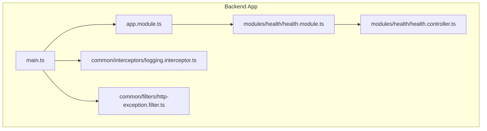
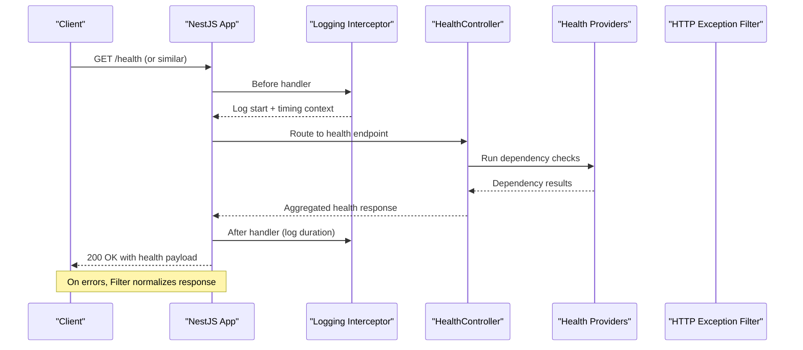
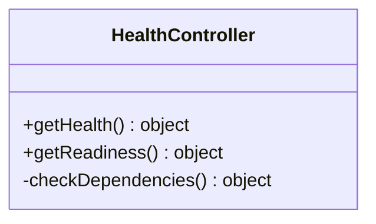
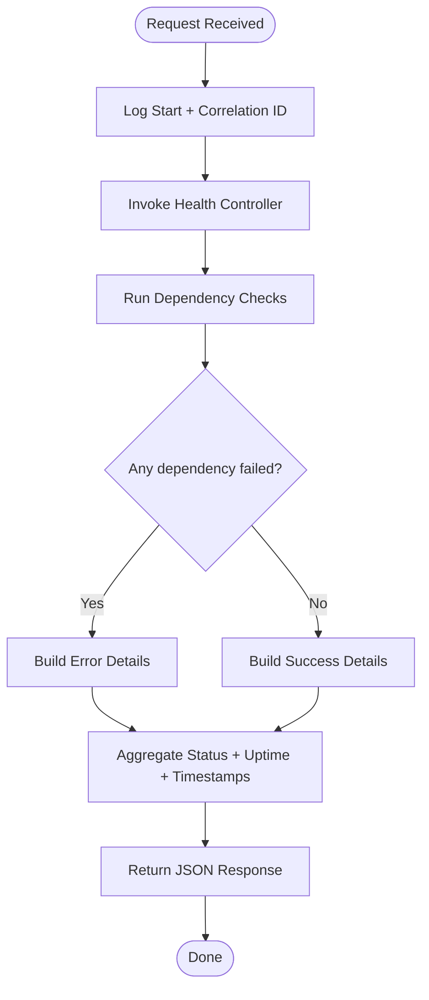
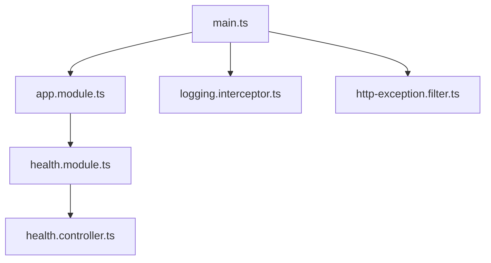

# Health & Monitoring API

<cite>
**Referenced Files in This Document**
- [health.controller.ts](file://apps/backend/src/modules/health/health.controller.ts)
- [health.module.ts](file://apps/backend/src/modules/health/health.module.ts)
- [app.module.ts](file://apps/backend/src/app.module.ts)
- [main.ts](file://apps/backend/src/main.ts)
- [logging.interceptor.ts](file://apps/backend/src/common/interceptors/logging.interceptor.ts)
- [http-exception.filter.ts](file://apps/backend/src/common/filters/http-exception.filter.ts)
</cite>

## Table of Contents
1. [Introduction](#introduction)
2. [Project Structure](#project-structure)
3. [Core Components](#core-components)
4. [Architecture Overview](#architecture-overview)
5. [Detailed Component Analysis](#detailed-component-analysis)
6. [Dependency Analysis](#dependency-analysis)
7. [Performance Considerations](#performance-considerations)
8. [Troubleshooting Guide](#troubleshooting-guide)
9. [Conclusion](#conclusion)
10. [Appendices](#appendices)

## Introduction
This document describes the health check and monitoring capabilities exposed by the backend service. It focuses on:
- System health status endpoints
- Dependency checks (e.g., database, external services)
- Performance metrics collection
- Response formats for health status, uptime information, and service dependencies
- Monitoring integration patterns, alerting setup, and operational dashboards
- Logging configuration, error tracking, and debugging endpoints for development and production environments

The backend is a NestJS application with a dedicated health module and shared infrastructure for logging and exception handling.

## Project Structure
The health and monitoring features are implemented under the backend application:
- Health module provides HTTP endpoints for liveness/readiness and dependency checks
- Application bootstrap wires global interceptors and filters that support logging and consistent error responses
- The root module registers the health module so its controllers are available at runtime

**Diagram sources**
- [main.ts](file://apps/backend/src/main.ts)
- [app.module.ts](file://apps/backend/src/app.module.ts)
- [health.module.ts](file://apps/backend/src/modules/health/health.module.ts)
- [health.controller.ts](file://apps/backend/src/modules/health/health.controller.ts)
- [logging.interceptor.ts](file://apps/backend/src/common/interceptors/logging.interceptor.ts)
- [http-exception.filter.ts](file://apps/backend/src/common/filters/http-exception.filter.ts)

**Section sources**
- [main.ts](file://apps/backend/src/main.ts)
- [app.module.ts](file://apps/backend/src/app.module.ts)
- [health.module.ts](file://apps/backend/src/modules/health/health.module.ts)
- [health.controller.ts](file://apps/backend/src/modules/health/health.controller.ts)
- [logging.interceptor.ts](file://apps/backend/src/common/interceptors/logging.interceptor.ts)
- [http-exception.filter.ts](file://apps/backend/src/common/filters/http-exception.filter.ts)

## Core Components
- Health Controller: Exposes HTTP endpoints for health checks and dependency probes. It orchestrates checks and returns structured responses suitable for orchestration tools and monitoring systems.
- Health Module: Registers the controller and any health-related providers used to perform dependency checks.
- Logging Interceptor: Adds request/response logging and timing metadata to all requests, aiding performance monitoring and troubleshooting.
- HTTP Exception Filter: Normalizes error responses and ensures consistent structure across the API, including health endpoints.

Key responsibilities:
- Provide liveness/readiness semantics via distinct endpoints or combined responses
- Aggregate dependency statuses (e.g., database, cache, message broker)
- Include uptime and timestamp fields for observability
- Emit structured logs for each health check invocation

**Section sources**
- [health.controller.ts](file://apps/backend/src/modules/health/health.controller.ts)
- [health.module.ts](file://apps/backend/src/modules/health/health.module.ts)
- [logging.interceptor.ts](file://apps/backend/src/common/interceptors/logging.interceptor.ts)
- [http-exception.filter.ts](file://apps/backend/src/common/filters/http-exception.filter.ts)

## Architecture Overview
The health system integrates with the NestJS lifecycle and middleware stack:
- Requests to health endpoints pass through the logging interceptor, which records timing and context
- The controller performs dependency checks and aggregates results
- Responses include status, timestamps, uptime, and per-dependency details
- Errors are normalized by the global filter

**Diagram sources**
- [main.ts](file://apps/backend/src/main.ts)
- [health.controller.ts](file://apps/backend/src/modules/health/health.controller.ts)
- [logging.interceptor.ts](file://apps/backend/src/common/interceptors/logging.interceptor.ts)
- [http-exception.filter.ts](file://apps/backend/src/common/filters/http-exception.filter.ts)

## Detailed Component Analysis

### Health Controller
Responsibilities:
- Define routes for health checks (liveness/readiness)
- Execute dependency checks and aggregate results
- Return standardized payloads with status, uptime, and dependency details

Response format overview:
- Top-level status: overall health state
- Timestamps: server time when the response was generated
- Uptime: process uptime in seconds or ISO duration
- Dependencies: map of dependency name to individual status and optional details

Operational considerations:
- Keep endpoints lightweight and fast
- Avoid heavy I/O; use timeouts and short-circuit logic
- Ensure idempotency and no side effects

**Section sources**
- [health.controller.ts](file://apps/backend/src/modules/health/health.controller.ts)

#### Class Diagram

**Diagram sources**
- [health.controller.ts](file://apps/backend/src/modules/health/health.controller.ts)

### Health Module
Responsibilities:
- Register the health controller
- Provide health check providers (e.g., DB, cache, external APIs)
- Configure any module-level options for health checks

Integration points:
- Imported into the root application module
- May depend on shared configuration and database modules

**Section sources**
- [health.module.ts](file://apps/backend/src/modules/health/health.module.ts)
- [app.module.ts](file://apps/backend/src/app.module.ts)

#### Module Relationship Diagram

**Diagram sources**
- [app.module.ts](file://apps/backend/src/app.module.ts)
- [health.module.ts](file://apps/backend/src/modules/health/health.module.ts)
- [health.controller.ts](file://apps/backend/src/modules/health/health.controller.ts)

### Logging Interceptor
Responsibilities:
- Attach request correlation IDs
- Measure request latency
- Log structured entries for health endpoints and other routes
- Support environment-based verbosity

Operational guidance:
- Use correlation IDs for distributed tracing
- Avoid logging sensitive data
- Adjust log levels per environment

**Section sources**
- [logging.interceptor.ts](file://apps/backend/src/common/interceptors/logging.interceptor.ts)

### HTTP Exception Filter
Responsibilities:
- Normalize error responses across the API
- Ensure consistent structure for health endpoint errors
- Preserve original error codes and messages where appropriate

Operational guidance:
- Do not leak internal stack traces in production
- Include correlation ID in error responses for traceability

**Section sources**
- [http-exception.filter.ts](file://apps/backend/src/common/filters/http-exception.filter.ts)

### Health Check Flow (Algorithm)

**Diagram sources**
- [health.controller.ts](file://apps/backend/src/modules/health/health.controller.ts)
- [logging.interceptor.ts](file://apps/backend/src/common/interceptors/logging.interceptor.ts)
- [http-exception.filter.ts](file://apps/backend/src/common/filters/http-exception.filter.ts)

## Dependency Analysis
High-level relationships:
- main.ts bootstraps the Nest application and configures global interceptors and filters
- app.module.ts registers feature modules, including the health module
- health.module.ts exposes the health controller and any health providers
- health.controller.ts depends on providers to perform checks and returns structured responses

**Diagram sources**
- [main.ts](file://apps/backend/src/main.ts)
- [app.module.ts](file://apps/backend/src/app.module.ts)
- [health.module.ts](file://apps/backend/src/modules/health/health.module.ts)
- [health.controller.ts](file://apps/backend/src/modules/health/health.controller.ts)
- [logging.interceptor.ts](file://apps/backend/src/common/interceptors/logging.interceptor.ts)
- [http-exception.filter.ts](file://apps/backend/src/common/filters/http-exception.filter.ts)

**Section sources**
- [main.ts](file://apps/backend/src/main.ts)
- [app.module.ts](file://apps/backend/src/app.module.ts)
- [health.module.ts](file://apps/backend/src/modules/health/health.module.ts)
- [health.controller.ts](file://apps/backend/src/modules/health/health.controller.ts)
- [logging.interceptor.ts](file://apps/backend/src/common/interceptors/logging.interceptor.ts)
- [http-exception.filter.ts](file://apps/backend/src/common/filters/http-exception.filter.ts)

## Performance Considerations
- Keep health endpoints synchronous and fast; avoid long-running operations
- Use timeouts for dependency checks to prevent slow responses
- Cache expensive checks if appropriate, but ensure staleness does not mask real issues
- Prefer separate readiness checks for startup-heavy dependencies
- Instrument request durations via the logging interceptor and expose metrics externally if needed

[No sources needed since this section provides general guidance]

## Troubleshooting Guide
Common issues and resolutions:
- Health endpoint returns degraded status: inspect dependency details in the response and correlate with logs using the correlation ID
- High latency on health checks: verify dependency timeouts and network paths; consider splitting into liveness vs readiness
- Missing correlation ID in logs: confirm the logging interceptor is registered globally
- Inconsistent error shapes: validate the HTTP exception filter is applied globally

Operational tips:
- Use correlation IDs to trace requests across services
- Enable verbose logging only in development/staging
- Validate response schemas in CI to catch breaking changes early

**Section sources**
- [logging.interceptor.ts](file://apps/backend/src/common/interceptors/logging.interceptor.ts)
- [http-exception.filter.ts](file://apps/backend/src/common/filters/http-exception.filter.ts)

## Conclusion
The health and monitoring layer provides a clear, structured surface for liveness/readiness and dependency checks, integrated with logging and error normalization. By following the recommended response formats and operational practices, teams can reliably integrate with orchestration platforms, monitoring systems, and alerting pipelines.

[No sources needed since this section summarizes without analyzing specific files]

## Appendices

### API Reference: Health Endpoints
- Endpoint: GET /health
  - Purpose: Overall health status including uptime and dependency summary
  - Success response:
    - status: string (e.g., ok, degraded, critical)
    - timestamp: string (ISO 8601)
    - uptime_seconds: number
    - dependencies: object mapping dependency names to their status and optional details
  - Error response:
    - status: string (error)
    - message: string
    - correlation_id: string (if available)

- Endpoint: GET /ready
  - Purpose: Readiness probe indicating whether the service is ready to accept traffic
  - Success response:
    - status: string (ready/not_ready)
    - timestamp: string (ISO 8601)
    - dependencies: object with detailed readiness states
  - Error response:
    - status: string (error)
    - message: string
    - correlation_id: string (if available)

Notes:
- All responses should be JSON
- Include correlation_id when available for tracing
- Keep responses small and fast

**Section sources**
- [health.controller.ts](file://apps/backend/src/modules/health/health.controller.ts)

### Monitoring Integration Examples
- Kubernetes Liveness/Readiness Probes:
  - Liveness: GET /health
  - Readiness: GET /ready
- Prometheus Metrics:
  - Export counters for health check invocations and durations
  - Expose gauges for dependency latencies
- Alerting Rules:
  - Alert on non-healthy status for more than N minutes
  - Alert on high dependency failure rates
- Dashboards:
  - Show uptime, health status timeline, and dependency health
  - Include request latency percentiles from the logging interceptor

[No sources needed since this section provides general guidance]

### Logging Configuration
- Global logging interceptor:
  - Add correlation IDs
  - Record request duration
  - Redact sensitive fields
- Environment-specific settings:
  - Development: verbose logs
  - Production: concise logs with correlation IDs
- Structured output:
  - JSON lines for log aggregation systems

**Section sources**
- [logging.interceptor.ts](file://apps/backend/src/common/interceptors/logging.interceptor.ts)

### Debugging Endpoints
- Health endpoints serve as lightweight debug surfaces:
  - Verify service availability
  - Inspect dependency states
  - Confirm uptime and recent timestamps
- Combine with correlation IDs to trace issues across components

**Section sources**
- [health.controller.ts](file://apps/backend/src/modules/health/health.controller.ts)
- [logging.interceptor.ts](file://apps/backend/src/common/interceptors/logging.interceptor.ts)