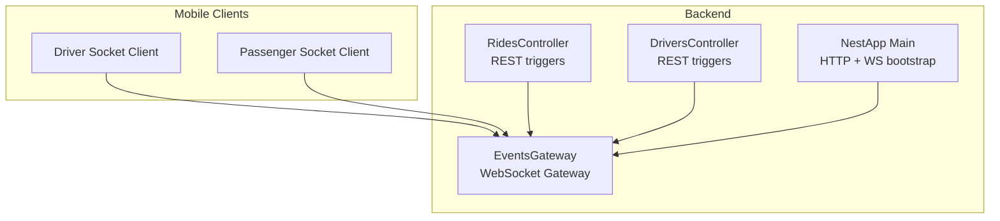
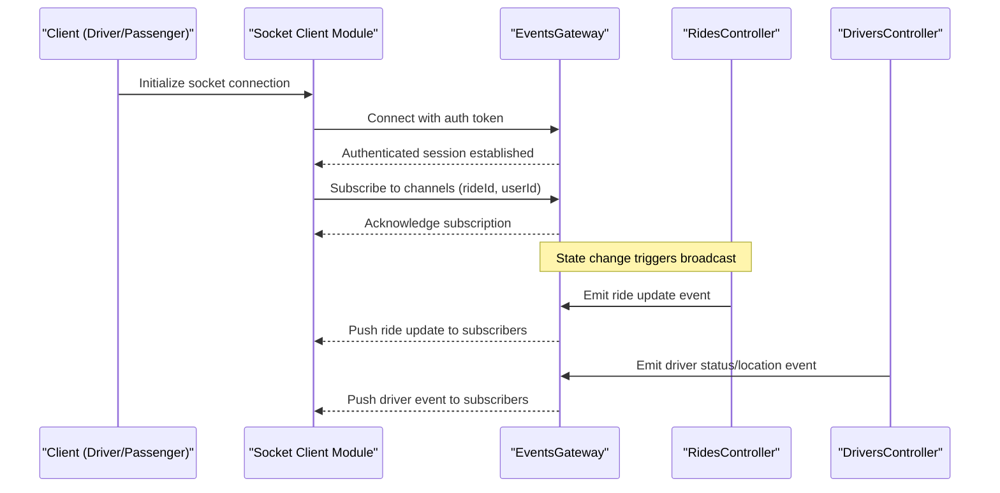
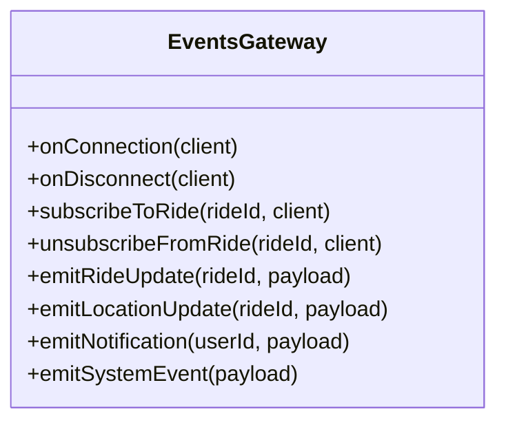
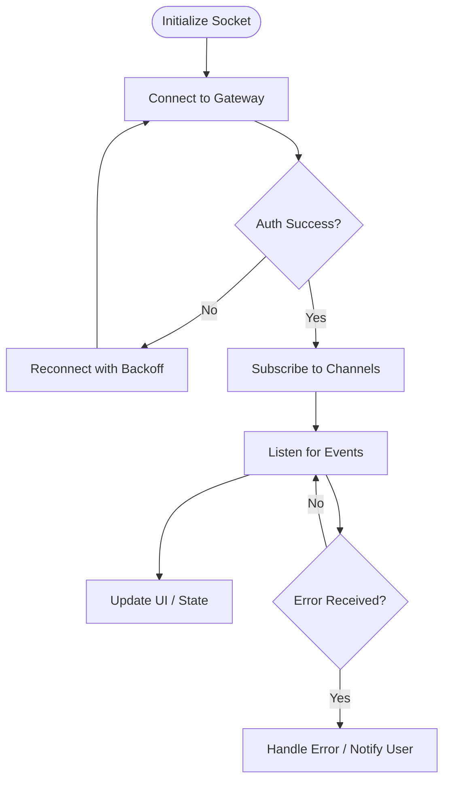
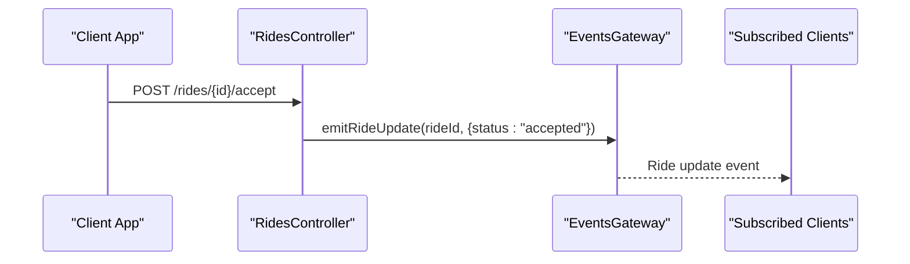
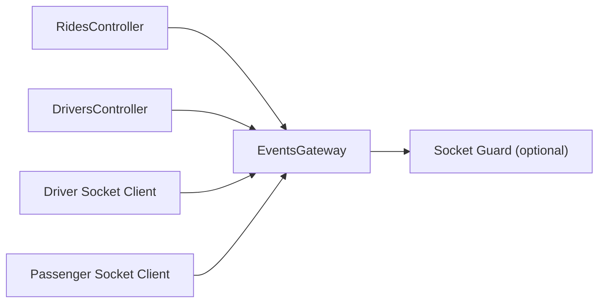

# Real-time Events API

<cite>
**Referenced Files in This Document**
- [events.gateway.ts](file://apps/backend/src/modules/events/events.gateway.ts)
- [events.module.ts](file://apps/backend/src/modules/events/events.module.ts)
- [socket.ts (mobile-driver)](file://apps/mobile-driver/src/api/socket.ts)
- [socket.ts (mobile-passenger)](file://apps/mobile-passenger/src/api/socket.ts)
- [main.ts](file://apps/backend/src/main.ts)
- [auth.guard.ts](file://apps/backend/src/common/guards/auth.guard.ts)
- [rides.controller.ts](file://apps/backend/src/modules/rides/rides.controller.ts)
- [drivers.controller.ts](file://apps/backend/src/modules/drivers/drivers.controller.ts)
</cite>

## Table of Contents
1. [Introduction](#introduction)
2. [Project Structure](#project-structure)
3. [Core Components](#core-components)
4. [Architecture Overview](#architecture-overview)
5. [Detailed Component Analysis](#detailed-component-analysis)
6. [Dependency Analysis](#dependency-analysis)
7. [Performance Considerations](#performance-considerations)
8. [Troubleshooting Guide](#troubleshooting-guide)
9. [Conclusion](#conclusion)
10. [Appendices](#appendices)

## Introduction
This document describes the real-time events API used for live ride tracking, driver and passenger updates, notifications, and system events. It covers connection establishment, authentication handshake, session management, event types, message formats, error handling patterns, client-side subscription examples, reconnection strategies, and performance optimization techniques. The backend is implemented with a NestJS WebSocket gateway, while mobile clients connect via dedicated socket modules.

## Project Structure
The real-time features are primarily implemented in:
- Backend: A NestJS module exposing a WebSocket gateway for broadcasting and handling real-time events.
- Mobile apps: Dedicated socket clients for driver and passenger apps that manage connections, subscriptions, and event listeners.

**Diagram sources**
- [events.gateway.ts](file://apps/backend/src/modules/events/events.gateway.ts)
- [events.module.ts](file://apps/backend/src/modules/events/events.module.ts)
- [main.ts](file://apps/backend/src/main.ts)
- [rides.controller.ts](file://apps/backend/src/modules/rides/rides.controller.ts)
- [drivers.controller.ts](file://apps/backend/src/modules/drivers/drivers.controller.ts)
- [socket.ts (mobile-driver)](file://apps/mobile-driver/src/api/socket.ts)
- [socket.ts (mobile-passenger)](file://apps/mobile-passenger/src/api/socket.ts)

**Section sources**
- [events.gateway.ts](file://apps/backend/src/modules/events/events.gateway.ts)
- [events.module.ts](file://apps/backend/src/modules/events/events.module.ts)
- [main.ts](file://apps/backend/src/main.ts)
- [socket.ts (mobile-driver)](file://apps/mobile-driver/src/api/socket.ts)
- [socket.ts (mobile-passenger)](file://apps/mobile-passenger/src/api/socket.ts)

## Core Components
- WebSocket Gateway: Central hub for emitting and subscribing to real-time events such as ride updates, location streaming, notifications, and system events.
- Socket Clients: Mobile drivers and passengers maintain persistent connections, subscribe to channels, and handle incoming events.
- REST Integration Points: Controllers can trigger real-time broadcasts when state changes occur (e.g., ride status transitions).

Key responsibilities:
- Connection lifecycle: accept, authenticate, and manage sessions.
- Event routing: publish events to relevant rooms or users.
- Error handling: emit structured errors and close connections on invalid states.

**Section sources**
- [events.gateway.ts](file://apps/backend/src/modules/events/events.gateway.ts)
- [events.module.ts](file://apps/backend/src/modules/events/events.module.ts)
- [rides.controller.ts](file://apps/backend/src/modules/rides/rides.controller.ts)
- [drivers.controller.ts](file://apps/backend/src/modules/drivers/drivers.controller.ts)

## Architecture Overview
The architecture follows a pub/sub model over WebSockets:
- Clients connect to the gateway endpoint.
- Authentication occurs during the handshake phase using tokens or credentials.
- Clients subscribe to specific channels (e.g., ride IDs, user IDs).
- The gateway emits events to subscribed clients.
- REST controllers can trigger broadcasts by invoking gateway methods.

**Diagram sources**
- [events.gateway.ts](file://apps/backend/src/modules/events/events.gateway.ts)
- [rides.controller.ts](file://apps/backend/src/modules/rides/rides.controller.ts)
- [drivers.controller.ts](file://apps/backend/src/modules/drivers/drivers.controller.ts)
- [socket.ts (mobile-driver)](file://apps/mobile-driver/src/api/socket.ts)
- [socket.ts (mobile-passenger)](file://apps/mobile-passenger/src/api/socket.ts)

## Detailed Component Analysis

### WebSocket Gateway
Responsibilities:
- Accept connections and perform authentication.
- Manage room membership per ride or user.
- Emit typed events for ride updates, location sharing, notifications, and system events.
- Handle disconnects and cleanup.

**Diagram sources**
- [events.gateway.ts](file://apps/backend/src/modules/events/events.gateway.ts)

**Section sources**
- [events.gateway.ts](file://apps/backend/src/modules/events/events.gateway.ts)

### Socket Clients (Mobile Driver and Passenger)
Responsibilities:
- Establish and maintain WebSocket connections.
- Authenticate during connection setup.
- Subscribe/unsubscribe from channels.
- Listen for events and update UI/state accordingly.
- Implement reconnection logic with exponential backoff.

**Diagram sources**
- [socket.ts (mobile-driver)](file://apps/mobile-driver/src/api/socket.ts)
- [socket.ts (mobile-passenger)](file://apps/mobile-passenger/src/api/socket.ts)

**Section sources**
- [socket.ts (mobile-driver)](file://apps/mobile-driver/src/api/socket.ts)
- [socket.ts (mobile-passenger)](file://apps/mobile-passenger/src/api/socket.ts)

### REST Integration Triggers
Controllers may trigger real-time broadcasts when business state changes:
- Rides controller: Emits ride status updates, acceptance, completion, cancellation.
- Drivers controller: Emits driver availability, location updates, earnings summaries.

**Diagram sources**
- [rides.controller.ts](file://apps/backend/src/modules/rides/rides.controller.ts)
- [events.gateway.ts](file://apps/backend/src/modules/events/events.gateway.ts)

**Section sources**
- [rides.controller.ts](file://apps/backend/src/modules/rides/rides.controller.ts)
- [events.gateway.ts](file://apps/backend/src/modules/events/events.gateway.ts)

## Dependency Analysis
- The gateway depends on NestJS WebSocket infrastructure and optional guards for authentication.
- Controllers depend on the gateway to broadcast events after mutating state.
- Mobile clients depend on their respective socket modules for connection and event handling.

**Diagram sources**
- [events.gateway.ts](file://apps/backend/src/modules/events/events.gateway.ts)
- [auth.guard.ts](file://apps/backend/src/common/guards/auth.guard.ts)
- [rides.controller.ts](file://apps/backend/src/modules/rides/rides.controller.ts)
- [drivers.controller.ts](file://apps/backend/src/modules/drivers/drivers.controller.ts)
- [socket.ts (mobile-driver)](file://apps/mobile-driver/src/api/socket.ts)
- [socket.ts (mobile-passenger)](file://apps/mobile-passenger/src/api/socket.ts)

**Section sources**
- [events.gateway.ts](file://apps/backend/src/modules/events/events.gateway.ts)
- [auth.guard.ts](file://apps/backend/src/common/guards/auth.guard.ts)
- [rides.controller.ts](file://apps/backend/src/modules/rides/rides.controller.ts)
- [drivers.controller.ts](file://apps/backend/src/modules/drivers/drivers.controller.ts)
- [socket.ts (mobile-driver)](file://apps/mobile-driver/src/api/socket.ts)
- [socket.ts (mobile-passenger)](file://apps/mobile-passenger/src/api/socket.ts)

## Performance Considerations
- Throttle location updates: Limit frequency to reduce bandwidth and CPU usage.
- Use room-based broadcasting: Target only relevant subscribers instead of global broadcasts.
- Batch events: Combine multiple small updates into a single payload when appropriate.
- Avoid heavy payloads: Send minimal data; include identifiers and deltas rather than full objects.
- Monitor connection limits: Configure maximum concurrent connections per process and scale horizontally if needed.
- Optimize reconnection: Use exponential backoff with jitter to prevent thundering herd effects.

[No sources needed since this section provides general guidance]

## Troubleshooting Guide
Common issues and resolutions:
- Authentication failures: Ensure tokens are valid and passed during connection handshake. Check guard configuration and token validation logic.
- Missing events: Verify client subscriptions to correct channels (rideId/userId). Confirm gateway emits to the intended rooms.
- Frequent disconnects: Inspect network stability, server load, and reconnection strategy. Adjust backoff intervals and timeouts.
- High latency: Reduce payload size, throttle updates, and ensure efficient room scoping.

Operational checks:
- Validate gateway health endpoints and logs.
- Review client-side error handlers and retry policies.
- Confirm REST controllers invoke gateway methods on state mutations.

**Section sources**
- [events.gateway.ts](file://apps/backend/src/modules/events/events.gateway.ts)
- [auth.guard.ts](file://apps/backend/src/common/guards/auth.guard.ts)
- [socket.ts (mobile-driver)](file://apps/mobile-driver/src/api/socket.ts)
- [socket.ts (mobile-passenger)](file://apps/mobile-passenger/src/api/socket.ts)

## Conclusion
The real-time events API enables robust live interactions across rides, locations, and notifications. By leveraging room-based broadcasting, structured authentication, and resilient client reconnection strategies, the system delivers timely updates efficiently. Follow the guidelines for payload design, throttling, and monitoring to maintain performance at scale.

[No sources needed since this section summarizes without analyzing specific files]

## Appendices

### Connection Establishment and Authentication Handshake
- Establish a WebSocket connection to the gateway endpoint.
- Include an authentication token in the handshake parameters or initial message.
- On success, receive an acknowledgment indicating an authenticated session.
- On failure, receive an error event and initiate reconnection with backoff.

**Section sources**
- [events.gateway.ts](file://apps/backend/src/modules/events/events.gateway.ts)
- [auth.guard.ts](file://apps/backend/src/common/guards/auth.guard.ts)
- [socket.ts (mobile-driver)](file://apps/mobile-driver/src/api/socket.ts)
- [socket.ts (mobile-passenger)](file://apps/mobile-passenger/src/api/socket.ts)

### Session Management
- Maintain a unique session identifier per connected client.
- Associate sessions with user identity and roles for authorization.
- Clean up sessions on disconnect and invalidate stale tokens.

**Section sources**
- [events.gateway.ts](file://apps/backend/src/modules/events/events.gateway.ts)

### Event Types and Payloads
- Ride Updates: Status transitions, ETA changes, route adjustments.
- Location Sharing: Driver position coordinates, heading, speed.
- Notifications: System alerts, ride reminders, payment confirmations.
- System Events: Health checks, maintenance notices, rate limit warnings.

Note: Refer to the gateway implementation for exact field names and structures.

**Section sources**
- [events.gateway.ts](file://apps/backend/src/modules/events/events.gateway.ts)

### Client-Side Subscription Examples
- Subscribe to a ride channel using the ride ID.
- Listen for ride update events and refresh UI components.
- Unsubscribe when leaving the ride screen to free resources.

**Section sources**
- [socket.ts (mobile-driver)](file://apps/mobile-driver/src/api/socket.ts)
- [socket.ts (mobile-passenger)](file://apps/mobile-passenger/src/api/socket.ts)

### Real-Time Location Streaming
- Driver app emits periodic location updates.
- Gateway forwards updates to all subscribers of the active ride.
- Passenger app renders driver movement on the map.

**Section sources**
- [events.gateway.ts](file://apps/backend/src/modules/events/events.gateway.ts)
- [socket.ts (mobile-driver)](file://apps/mobile-driver/src/api/socket.ts)
- [socket.ts (mobile-passenger)](file://apps/mobile-passenger/src/api/socket.ts)

### Push Notification Delivery
- Gateway emits notification events targeted to user IDs.
- Client receives and displays in-app notifications or integrates with OS-level push services.

**Section sources**
- [events.gateway.ts](file://apps/backend/src/modules/events/events.gateway.ts)
- [socket.ts (mobile-driver)](file://apps/mobile-driver/src/api/socket.ts)
- [socket.ts (mobile-passenger)](file://apps/mobile-passenger/src/api/socket.ts)

### Message Formats
- Use consistent envelope structures: type, timestamp, payload, correlationId.
- Include versioning fields to support future schema evolution.
- Keep payloads compact and idempotent where possible.

**Section sources**
- [events.gateway.ts](file://apps/backend/src/modules/events/events.gateway.ts)

### Error Handling Patterns
- Emit structured error events with codes and messages.
- Close connections on unrecoverable authentication failures.
- Provide retry hints for transient errors.

**Section sources**
- [events.gateway.ts](file://apps/backend/src/modules/events/events.gateway.ts)

### Connection Limits and Scaling
- Configure maximum concurrent connections per process.
- Scale horizontally behind a load balancer; use sticky sessions if required.
- Monitor memory and CPU usage under sustained load.

**Section sources**
- [events.gateway.ts](file://apps/backend/src/modules/events/events.gateway.ts)

### Reconnection Strategies
- Exponential backoff with jitter.
- Maximum retry attempts before prompting user action.
- Graceful degradation: show cached data while reconnecting.

**Section sources**
- [socket.ts (mobile-driver)](file://apps/mobile-driver/src/api/socket.ts)
- [socket.ts (mobile-passenger)](file://apps/mobile-passenger/src/api/socket.ts)

### Performance Optimization Techniques
- Throttle high-frequency events (e.g., location updates).
- Use delta payloads instead of full objects.
- Prefer room-scoped broadcasts over global emissions.
- Cache frequently accessed metadata on the client side.

[No sources needed since this section provides general guidance]