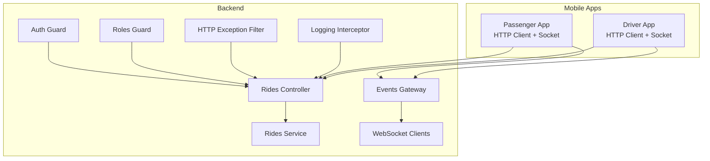
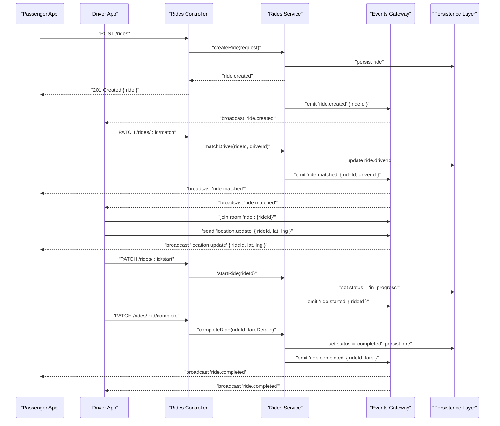
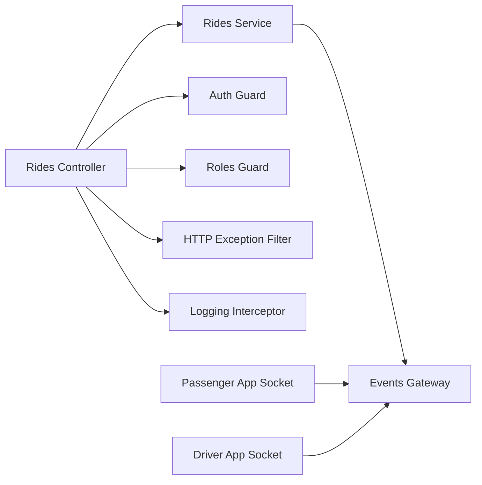
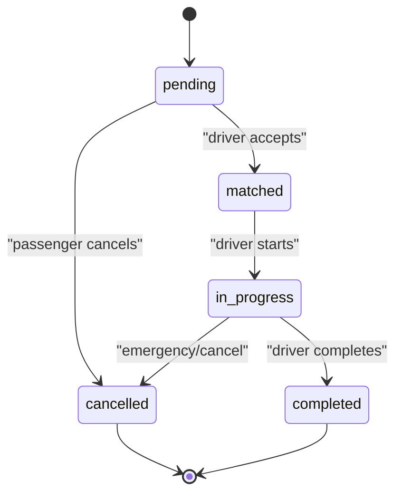

# Ride Management API

<cite>
**Referenced Files in This Document**
- [rides.controller.ts](file://apps/backend/src/modules/rides/rides.controller.ts)
- [rides.service.ts](file://apps/backend/src/modules/rides/rides.service.ts)
- [events.gateway.ts](file://apps/backend/src/modules/events/events.gateway.ts)
- [auth.guard.ts](file://apps/backend/src/common/guards/auth.guard.ts)
- [roles.guard.ts](file://apps/backend/src/common/guards/roles.guard.ts)
- [http-exception.filter.ts](file://apps/backend/src/common/filters/http-exception.filter.ts)
- [logging.interceptor.ts](file://apps/backend/src/common/interceptors/logging.interceptor.ts)
- [app.module.ts](file://apps/backend/src/app.module.ts)
- [main.ts](file://apps/backend/src/main.ts)
- [socket.ts (passenger)](file://apps/mobile-passenger/src/api/socket.ts)
- [client.ts (passenger)](file://apps/mobile-passenger/src/api/client.ts)
- [socket.ts (driver)](file://apps/mobile-driver/src/api/socket.ts)
- [client.ts (driver)](file://apps/mobile-driver/src/api/client.ts)
</cite>

## Table of Contents
1. [Introduction](#introduction)
2. [Project Structure](#project-structure)
3. [Core Components](#core-components)
4. [Architecture Overview](#architecture-overview)
5. [Detailed Component Analysis](#detailed-component-analysis)
6. [Dependency Analysis](#dependency-analysis)
7. [Performance Considerations](#performance-considerations)
8. [Troubleshooting Guide](#troubleshooting-guide)
9. [Conclusion](#conclusion)
10. [Appendices](#appendices)

## Introduction
This document provides comprehensive API documentation for the ride management functionality, covering ride booking, driver matching, real-time tracking, and ride completion workflows. It details the complete ride lifecycle from booking to completion, including status transitions, route optimization considerations, fare calculation integration points, request/response schemas, error handling for failed rides, disputes, and emergency scenarios.

## Project Structure
The backend is a NestJS application with modular organization:
- Rides module exposes REST endpoints and business logic for ride lifecycle
- Events module provides WebSocket gateway for real-time updates
- Common modules provide guards, filters, and interceptors for auth, roles, logging, and error handling
- Mobile apps (passenger and driver) integrate via HTTP client and Socket.IO

**Diagram sources**
- [rides.controller.ts](file://apps/backend/src/modules/rides/rides.controller.ts)
- [rides.service.ts](file://apps/backend/src/modules/rides/rides.service.ts)
- [events.gateway.ts](file://apps/backend/src/modules/events/events.gateway.ts)
- [auth.guard.ts](file://apps/backend/src/common/guards/auth.guard.ts)
- [roles.guard.ts](file://apps/backend/src/common/guards/roles.guard.ts)
- [http-exception.filter.ts](file://apps/backend/src/common/filters/http-exception.filter.ts)
- [logging.interceptor.ts](file://apps/backend/src/common/interceptors/logging.interceptor.ts)

**Section sources**
- [app.module.ts](file://apps/backend/src/app.module.ts)
- [main.ts](file://apps/backend/src/main.ts)

## Core Components
- Rides Controller: Defines REST endpoints for ride creation, updates, cancellation, and listing. Applies authentication and role-based access control.
- Rides Service: Implements business logic for ride lifecycle, matching, status transitions, and coordination with real-time events.
- Events Gateway: Manages WebSocket connections and broadcasts ride state changes, location updates, and notifications.
- Guards and Filters: Enforce authentication, roles, structured error responses, and request logging.

Key responsibilities:
- Authentication and authorization for all ride endpoints
- Real-time event broadcasting for live tracking
- Centralized error handling and consistent response formats
- Logging for observability and debugging

**Section sources**
- [rides.controller.ts](file://apps/backend/src/modules/rides/rides.controller.ts)
- [rides.service.ts](file://apps/backend/src/modules/rides/rides.service.ts)
- [events.gateway.ts](file://apps/backend/src/modules/events/events.gateway.ts)
- [auth.guard.ts](file://apps/backend/src/common/guards/auth.guard.ts)
- [roles.guard.ts](file://apps/backend/src/common/guards/roles.guard.ts)
- [http-exception.filter.ts](file://apps/backend/src/common/filters/http-exception.filter.ts)
- [logging.interceptor.ts](file://apps/backend/src/common/interceptors/logging.interceptor.ts)

## Architecture Overview
The ride system follows a layered architecture:
- Controllers expose REST APIs
- Services encapsulate business logic
- Gateways handle real-time communication
- Guards enforce security
- Filters standardize errors
- Interceptors add cross-cutting concerns like logging

**Diagram sources**
- [rides.controller.ts](file://apps/backend/src/modules/rides/rides.controller.ts)
- [rides.service.ts](file://apps/backend/src/modules/rides/rides.service.ts)
- [events.gateway.ts](file://apps/backend/src/modules/events/events.gateway.ts)

## Detailed Component Analysis

### Rides Controller Endpoints
The controller defines REST endpoints for managing rides. All endpoints are protected by authentication and may require specific roles (e.g., passenger or driver).

- Create Ride
  - Method: POST
  - Path: /rides
  - Auth: Required
  - Roles: passenger
  - Request Body:
    - pickupLocation: object with latitude and longitude
    - dropoffLocation: object with latitude and longitude
    - passengers: number
    - notes: string (optional)
  - Response: 201 Created with ride object including id, status, timestamps, and locations
  - Errors: 400 Bad Request (validation), 401 Unauthorized, 403 Forbidden

- Update Ride
  - Method: PATCH
  - Path: /rides/:id
  - Auth: Required
  - Roles: passenger (owner only)
  - Request Body: fields to update (e.g., notes, pickup/dropoff if allowed)
  - Response: 200 OK with updated ride
  - Errors: 404 Not Found, 403 Forbidden

- Cancel Ride
  - Method: DELETE
  - Path: /rides/:id
  - Auth: Required
  - Roles: passenger (owner only)
  - Response: 200 OK with confirmation
  - Errors: 404 Not Found, 403 Forbidden, 409 Conflict (if already started/completed)

- List Rides
  - Method: GET
  - Path: /rides
  - Auth: Required
  - Roles: passenger (own rides), admin (all rides)
  - Query Params:
    - status: filter by status
    - page, limit: pagination
  - Response: 200 OK with list of rides
  - Errors: 401 Unauthorized, 403 Forbidden

- Match Driver
  - Method: PATCH
  - Path: /rides/:id/match
  - Auth: Required
  - Roles: driver
  - Request Body:
    - driverId: string
  - Response: 200 OK with updated ride
  - Errors: 404 Not Found, 403 Forbidden, 409 Conflict (already matched)

- Start Ride
  - Method: PATCH
  - Path: /rides/:id/start
  - Auth: Required
  - Roles: driver
  - Response: 200 OK with updated ride
  - Errors: 404 Not Found, 403 Forbidden, 409 Conflict (not matched)

- Complete Ride
  - Method: PATCH
  - Path: /rides/:id/complete
  - Auth: Required
  - Roles: driver
  - Request Body:
    - fareAmount: number
    - paymentMethod: string
    - tip: number (optional)
  - Response: 200 OK with completed ride and fare summary
  - Errors: 404 Not Found, 403 Forbidden, 409 Conflict (not in progress)

- Get Ride Details
  - Method: GET
  - Path: /rides/:id
  - Auth: Required
  - Roles: passenger (owner), driver (assigned), admin
  - Response: 200 OK with ride details
  - Errors: 404 Not Found, 403 Forbidden

Notes:
- Role enforcement is applied via guards
- Validation errors return structured error responses
- Conflicts are returned when state transitions are invalid

**Section sources**
- [rides.controller.ts](file://apps/backend/src/modules/rides/rides.controller.ts)
- [auth.guard.ts](file://apps/backend/src/common/guards/auth.guard.ts)
- [roles.guard.ts](file://apps/backend/src/common/guards/roles.guard.ts)

### Rides Service Logic
The service implements core business rules:
- Validates inputs and enforces ride state transitions
- Coordinates driver matching based on proximity and availability
- Persists ride data and updates
- Emits real-time events through the gateway
- Integrates with external services for route optimization and fare calculation

Key methods:
- createRide(request): validates locations, persists ride, emits creation event
- matchDriver(rideId, driverId): assigns driver, validates eligibility, emits match event
- startRide(rideId): transitions to in_progress, emits start event
- completeRide(rideId, fareDetails): finalizes ride, calculates fare, emits completion event
- cancelRide(rideId): cancels eligible rides, emits cancellation event
- getRide(rideId): retrieves ride with authorization checks

Matching algorithm highlights:
- Proximity scoring using geospatial queries
- Driver availability and current load balancing
- Estimated time to pickup and route feasibility
- Returns ranked drivers; first accepted becomes assigned

Fare calculation integration:
- Base fare + distance + time + surge multiplier
- Tip handling and payment method selection
- Integration point for payment provider

Route optimization:
- Uses routing service to estimate distance/time
- Considers traffic and road conditions
- Provides ETA updates during ride

**Section sources**
- [rides.service.ts](file://apps/backend/src/modules/rides/rides.service.ts)
- [events.gateway.ts](file://apps/backend/src/modules/events/events.gateway.ts)

### Events Gateway (Real-Time Tracking)
The gateway manages WebSocket connections and rooms per ride:
- Join/leave rooms for ride-specific channels
- Broadcast events: ride.created, ride.matched, ride.started, ride.completed, ride.cancelled
- Handle location updates from drivers and broadcast to passengers
- Manage connection lifecycle and reconnection hints

Client-side integration:
- Passenger app subscribes to ride events and location updates
- Driver app joins ride rooms and sends periodic location updates

**Section sources**
- [events.gateway.ts](file://apps/backend/src/modules/events/events.gateway.ts)
- [socket.ts (passenger)](file://apps/mobile-passenger/src/api/socket.ts)
- [socket.ts (driver)](file://apps/mobile-driver/src/api/socket.ts)

### Security and Cross-Cutting Concerns
- Authentication guard ensures valid tokens and user context
- Roles guard enforces passenger/driver/admin permissions
- HTTP exception filter standardizes error responses
- Logging interceptor records requests/responses for audit and debugging

**Section sources**
- [auth.guard.ts](file://apps/backend/src/common/guards/auth.guard.ts)
- [roles.guard.ts](file://apps/backend/src/common/guards/roles.guard.ts)
- [http-exception.filter.ts](file://apps/backend/src/common/filters/http-exception.filter.ts)
- [logging.interceptor.ts](file://apps/backend/src/common/interceptors/logging.interceptor.ts)

## Dependency Analysis
The following diagram shows key dependencies between components:

**Diagram sources**
- [rides.controller.ts](file://apps/backend/src/modules/rides/rides.controller.ts)
- [rides.service.ts](file://apps/backend/src/modules/rides/rides.service.ts)
- [events.gateway.ts](file://apps/backend/src/modules/events/events.gateway.ts)
- [auth.guard.ts](file://apps/backend/src/common/guards/auth.guard.ts)
- [roles.guard.ts](file://apps/backend/src/common/guards/roles.guard.ts)
- [http-exception.filter.ts](file://apps/backend/src/common/filters/http-exception.filter.ts)
- [logging.interceptor.ts](file://apps/backend/src/common/interceptors/logging.interceptor.ts)
- [socket.ts (passenger)](file://apps/mobile-passenger/src/api/socket.ts)
- [socket.ts (driver)](file://apps/mobile-driver/src/api/socket.ts)

**Section sources**
- [app.module.ts](file://apps/backend/src/app.module.ts)
- [main.ts](file://apps/backend/src/main.ts)

## Performance Considerations
- Use efficient geospatial queries for driver matching
- Batch location updates to reduce WebSocket traffic
- Implement caching for frequently accessed ride metadata
- Apply pagination and filtering for ride listings
- Monitor WebSocket connection limits and scale horizontally

[No sources needed since this section provides general guidance]

## Troubleshooting Guide
Common issues and resolutions:
- Authentication failures: verify token validity and expiration
- Role mismatches: ensure user roles align with endpoint requirements
- State transition conflicts: check current ride status before operations
- WebSocket disconnects: implement reconnection logic and heartbeat
- Payment processing errors: log transaction IDs and retry policies
- Disputes: capture evidence (timestamps, locations, logs) and escalate

Error response format:
- code: error identifier
- message: human-readable description
- details: additional context (field-level errors, stack traces in dev)

**Section sources**
- [http-exception.filter.ts](file://apps/backend/src/common/filters/http-exception.filter.ts)
- [logging.interceptor.ts](file://apps/backend/src/common/interceptors/logging.interceptor.ts)

## Conclusion
The ride management API provides a robust foundation for booking, matching, real-time tracking, and completion workflows. With strong security, standardized error handling, and real-time capabilities, it supports scalable operations and excellent user experiences across passenger and driver applications.

[No sources needed since this section summarizes without analyzing specific files]

## Appendices

### Ride Lifecycle Status Transitions

[No sources needed since this diagram shows conceptual workflow, not actual code structure]

### Request/Response Schemas Summary
- Create Ride Request:
  - pickupLocation: { latitude: number, longitude: number }
  - dropoffLocation: { latitude: number, longitude: number }
  - passengers: number
  - notes: string (optional)
- Create Ride Response:
  - id: string
  - status: enum
  - createdAt: timestamp
  - updatedAt: timestamp
  - locations: { pickup, dropoff }
- Match Driver Request:
  - driverId: string
- Complete Ride Request:
  - fareAmount: number
  - paymentMethod: string
  - tip: number (optional)

[No sources needed since this section provides schema definitions without analyzing specific files]

### Error Handling Examples
- Validation Error:
  - code: VALIDATION_ERROR
  - message: "Invalid input parameters"
  - details: { field: "pickupLocation", reason: "required" }
- Conflict Error:
  - code: CONFLICT
  - message: "Ride cannot be cancelled after starting"
- Unauthorized Error:
  - code: UNAUTHORIZED
  - message: "Invalid or expired token"

[No sources needed since this section provides examples without analyzing specific files]