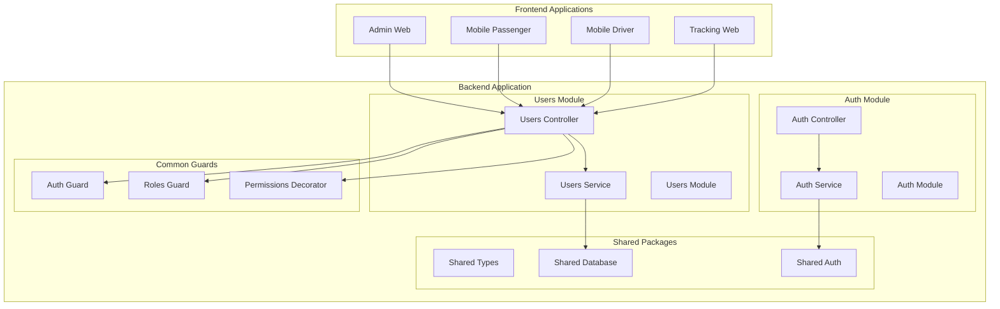
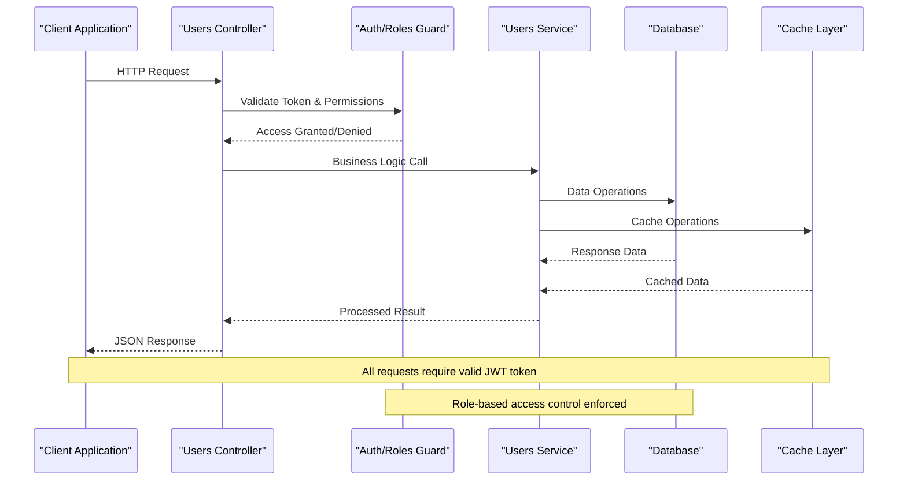
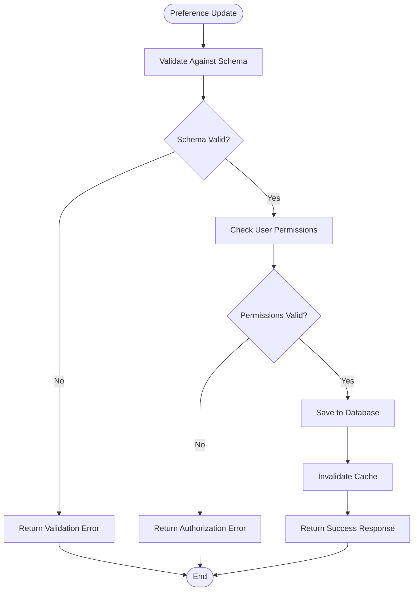
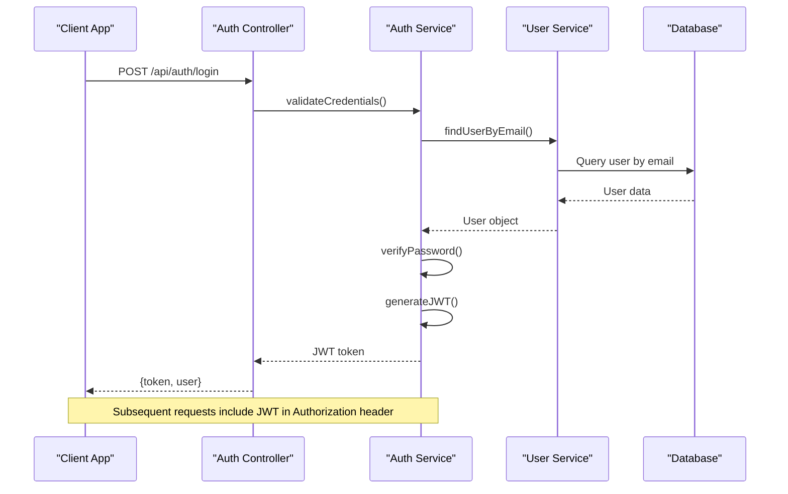
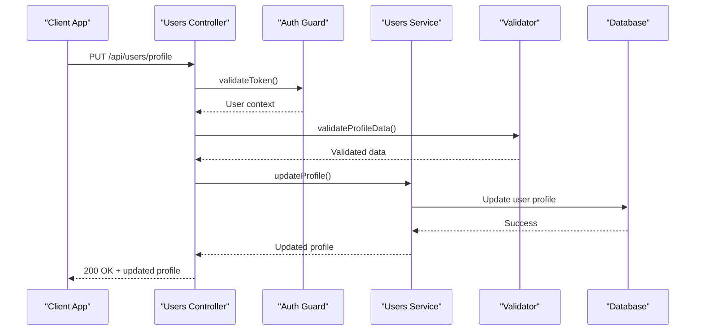

# User Management API

<cite>
**Referenced Files in This Document**
- [users.controller.ts](file://apps/backend/src/modules/users/users.controller.ts)
- [users.service.ts](file://apps/backend/src/modules/users/users.service.ts)
- [auth.controller.ts](file://apps/backend/src/modules/auth/auth.controller.ts)
- [auth.service.ts](file://apps/backend/src/modules/auth/auth.service.ts)
- [auth.guard.ts](file://apps/backend/src/common/guards/auth.guard.ts)
- [roles.guard.ts](file://apps/backend/src/common/guards/roles.guard.ts)
- [permissions.decorator.ts](file://apps/backend/src/common/decorators/permissions.decorator.ts)
- [app.module.ts](file://apps/backend/src/app.module.ts)
</cite>

## Table of Contents
1. [Introduction](#introduction)
2. [Project Structure](#project-structure)
3. [Core Components](#core-components)
4. [Architecture Overview](#architecture-overview)
5. [Detailed Component Analysis](#detailed-component-analysis)
6. [API Endpoints Reference](#api-endpoints-reference)
7. [Data Models and Schemas](#data-models-and-schemas)
8. [Authentication and Authorization](#authentication-and-authorization)
9. [User Preferences and Settings](#user-preferences-and-settings)
10. [Privacy Controls](#privacy-controls)
11. [Error Handling](#error-handling)
12. [Integration Examples](#integration-examples)
13. [Performance Considerations](#performance-considerations)
14. [Troubleshooting Guide](#troubleshooting-guide)
15. [Conclusion](#conclusion)

## Introduction

The User Management API provides comprehensive functionality for managing user accounts, profiles, preferences, settings, and account operations within the 18kansride ride-sharing platform. This RESTful API is built using NestJS and follows industry best practices for security, validation, and data integrity.

The API supports multiple user roles including passengers, drivers, and administrators, each with specific permissions and access controls. It integrates with an authentication system that handles user registration, login, session management, and role-based authorization.

## Project Structure

The user management functionality is organized within a modular NestJS architecture:



**Diagram sources**
- [users.controller.ts](file://apps/backend/src/modules/users/users.controller.ts)
- [users.service.ts](file://apps/backend/src/modules/users/users.service.ts)
- [auth.controller.ts](file://apps/backend/src/modules/auth/auth.controller.ts)
- [auth.service.ts](file://apps/backend/src/modules/auth/auth.service.ts)
- [auth.guard.ts](file://apps/backend/src/common/guards/auth.guard.ts)

**Section sources**
- [app.module.ts](file://apps/backend/src/app.module.ts)

## Core Components

### Users Module Architecture

The users module implements a clean separation of concerns following the MVC pattern:

- **Controller Layer**: Handles HTTP requests, validates input, and returns responses
- **Service Layer**: Contains business logic, data manipulation, and external service calls
- **Guard Layer**: Provides authentication and authorization middleware
- **Decorator Layer**: Enables declarative permission checking

### Authentication Integration

The user management system integrates with a centralized authentication module that provides:

- JWT token-based authentication
- Role-based access control (RBAC)
- Permission decorators for fine-grained access control
- Session management and token refresh mechanisms

**Section sources**
- [users.controller.ts](file://apps/backend/src/modules/users/users.controller.ts)
- [users.service.ts](file://apps/backend/src/modules/users/users.service.ts)
- [auth.guard.ts](file://apps/backend/src/common/guards/auth.guard.ts)

## Architecture Overview

The user management API follows a layered architecture pattern with clear separation between presentation, business logic, and data access layers.



**Diagram sources**
- [users.controller.ts](file://apps/backend/src/modules/users/users.controller.ts)
- [users.service.ts](file://apps/backend/src/modules/users/users.service.ts)
- [auth.guard.ts](file://apps/backend/src/common/guards/auth.guard.ts)

## Detailed Component Analysis

### Users Controller

The users controller exposes RESTful endpoints for all user-related operations. It handles request validation, parameter extraction, and response formatting.

#### Key Responsibilities:
- HTTP endpoint routing and method handling
- Request parameter and body validation
- Response status code management
- Error handling and exception mapping
- Input sanitization and data transformation

#### Endpoint Categories:
- **Profile Management**: CRUD operations for user profiles
- **Account Operations**: Registration, login, password management
- **Preferences**: User preference and setting management
- **Activity History**: Retrieval of user activity logs
- **Notification Settings**: Notification preference configuration

**Section sources**
- [users.controller.ts](file://apps/backend/src/modules/users/users.controller.ts)

### Users Service

The users service encapsulates all business logic related to user management operations. It coordinates data access, validation, and external service integrations.

#### Core Functions:
- User data validation and transformation
- Password hashing and verification
- Profile update operations
- Preference and settings management
- Activity history tracking
- Account lifecycle management

#### Business Rules:
- Email uniqueness validation
- Password strength requirements
- Profile completeness checks
- Privacy preference enforcement
- Role-based data filtering

**Section sources**
- [users.service.ts](file://apps/backend/src/modules/users/users.service.ts)

### Authentication Guards

The authentication system uses guards to protect routes and enforce access control policies.

#### Auth Guard:
- Validates JWT tokens
- Extracts user information from tokens
- Handles token expiration and refresh
- Manages session state

#### Roles Guard:
- Enforces role-based access control
- Validates user roles against route requirements
- Supports hierarchical role permissions
- Integrates with permission decorators

**Section sources**
- [auth.guard.ts](file://apps/backend/src/common/guards/auth.guard.ts)
- [roles.guard.ts](file://apps/backend/src/common/guards/roles.guard.ts)

## API Endpoints Reference

### User Profile Management

#### Get Current User Profile
- **Endpoint**: `GET /api/users/profile`
- **Authentication**: Required (JWT)
- **Description**: Retrieves the authenticated user's complete profile information
- **Response**: User profile object with personal details, preferences, and settings

#### Update User Profile
- **Endpoint**: `PUT /api/users/profile`
- **Authentication**: Required (JWT)
- **Description**: Updates user profile information with validation
- **Request Body**: Partial profile updates
- **Validation**: Field-specific validation rules applied

#### Upload Profile Photo
- **Endpoint**: `POST /api/users/profile/photo`
- **Authentication**: Required (JWT)
- **Description**: Uploads or updates user profile photo
- **Content-Type**: multipart/form-data
- **File Validation**: Size limits and format restrictions

### Account Operations

#### User Registration
- **Endpoint**: `POST /api/auth/register`
- **Description**: Creates a new user account
- **Request Body**: Registration form data
- **Validation**: Comprehensive input validation
- **Response**: User object with initial preferences

#### User Login
- **Endpoint**: `POST /api/auth/login`
- **Description**: Authenticates user and returns JWT token
- **Request Body**: Credentials (email/password or phone/OTP)
- **Response**: JWT token and user information

#### Password Reset
- **Endpoint**: `POST /api/auth/password-reset`
- **Description**: Initiates password reset process
- **Request Body**: Email address
- **Process**: Sends reset email with secure token

#### Delete Account
- **Endpoint**: `DELETE /api/users/account`
- **Authentication**: Required (JWT + re-authentication)
- **Description**: Permanently deletes user account and associated data
- **Confirmation**: Requires explicit confirmation and re-authentication

### User Preferences and Settings

#### Get User Preferences
- **Endpoint**: `GET /api/users/preferences`
- **Authentication**: Required (JWT)
- **Description**: Retrieves all user preferences and settings
- **Response**: Complete preferences object

#### Update User Preferences
- **Endpoint**: `PUT /api/users/preferences`
- **Authentication**: Required (JWT)
- **Description**: Updates user preferences with validation
- **Request Body**: Partial preferences updates
- **Validation**: Schema validation for preference fields

#### Get Notification Settings
- **Endpoint**: `GET /api/users/notifications`
- **Authentication**: Required (JWT)
- **Description**: Retrieves notification preferences
- **Response**: Notification channel preferences

#### Update Notification Settings
- **Endpoint**: `PUT /api/users/notifications`
- **Authentication**: Required (JWT)
- **Description**: Updates notification preferences
- **Request Body**: Notification channel configurations

### Activity History

#### Get Activity History
- **Endpoint**: `GET /api/users/activity`
- **Authentication**: Required (JWT)
- **Description**: Retrieves user activity history with pagination
- **Query Parameters**: Date range, activity type, pagination
- **Response**: Paginated activity list

#### Get Ride History
- **Endpoint**: `GET /api/users/rides`
- **Authentication**: Required (JWT)
- **Description**: Retrieves user's ride history
- **Query Parameters**: Date filters, status filters
- **Response**: Paginated ride history

### Privacy Controls

#### Update Privacy Settings
- **Endpoint**: `PUT /api/users/privacy`
- **Authentication**: Required (JWT)
- **Description**: Updates privacy preferences and visibility settings
- **Request Body**: Privacy configuration object
- **Validation**: Privacy schema validation

#### Get Privacy Settings
- **Endpoint**: `GET /api/users/privacy`
- **Authentication**: Required (JWT)
- **Description**: Retrieves current privacy settings
- **Response**: Privacy configuration object

## Data Models and Schemas

### User Model

The core user model represents the fundamental user entity with essential attributes and relationships.

| Field | Type | Required | Description | Validation Rules |
|-------|------|----------|-------------|------------------|
| id | UUID | Yes | Unique user identifier | Auto-generated UUID |
| email | String | Yes | User email address | Valid email format, unique |
| phone | String | Optional | Phone number | Valid phone format |
| firstName | String | Yes | First name | 2-50 characters |
| lastName | String | Yes | Last name | 2-50 characters |
| avatar | String | Optional | Profile photo URL | Valid URL format |
| role | Enum | Yes | User role (passenger/driver/admin) | Enum validation |
| isActive | Boolean | Yes | Account status | Default true |
| createdAt | Timestamp | Yes | Account creation time | Auto-set |
| updatedAt | Timestamp | Yes | Last update time | Auto-updated |

### Profile Model

Extended profile information beyond basic user credentials.

| Field | Type | Required | Description | Default Value |
|-------|------|----------|-------------|---------------|
| bio | String | Optional | User biography | Empty string |
| location | String | Optional | User location | Null |
| language | String | Optional | Preferred language | 'en' |
| timezone | String | Optional | User timezone | 'UTC' |
| dateOfBirth | Date | Optional | Date of birth | Null |
| gender | Enum | Optional | Gender identity | Null |

### Preferences Model

User-specific preferences and settings.

| Field | Type | Required | Description | Default Value |
|-------|------|----------|-------------|---------------|
| theme | Enum | Yes | UI theme preference | 'light' |
| notifications | Object | Yes | Notification settings | Default config |
| privacy | Object | Yes | Privacy settings | Default config |
| search | Object | Yes | Search preferences | Default config |
| accessibility | Object | Yes | Accessibility options | Default config |

### Validation Rules

#### Email Validation
- Must be a valid email format
- Must be unique across all users
- Case-insensitive comparison
- Maximum length: 255 characters

#### Password Validation
- Minimum length: 8 characters
- Must contain uppercase letter
- Must contain lowercase letter
- Must contain number
- Must contain special character
- Cannot match previous 5 passwords

#### Profile Photo Validation
- Maximum file size: 5MB
- Supported formats: JPEG, PNG, WebP
- Recommended dimensions: 400x400 pixels
- Aspect ratio: 1:1

## Authentication and Authorization

### JWT Token Structure

The authentication system uses JSON Web Tokens (JWT) for stateless authentication.

#### Token Payload:
```json
{
  "sub": "user-id",
  "email": "user@example.com",
  "role": "passenger",
  "permissions": ["profile:read", "profile:write"],
  "iat": 1234567890,
  "exp": 1234567890
}
```

### Role-Based Access Control

The system implements hierarchical role-based access control:

#### Role Hierarchy:
1. **Administrator**: Full system access
2. **Driver**: Driver-specific operations
3. **Passenger**: Passenger-specific operations

#### Permission Matrix:

| Operation | Admin | Driver | Passenger |
|-----------|-------|--------|-----------|
| Read own profile | ✓ | ✓ | ✓ |
| Update own profile | ✓ | ✓ | ✓ |
| Delete own account | ✓ | ✓ | ✓ |
| View other profiles | ✓ | ✗ | ✗ |
| Manage users | ✓ | ✗ | ✗ |
| View analytics | ✓ | ✗ | ✗ |
| System settings | ✓ | ✗ | ✗ |

### Security Headers

All API responses include security headers:
- `X-Content-Type-Options: nosniff`
- `X-Frame-Options: DENY`
- `X-XSS-Protection: 1; mode=block`
- `Strict-Transport-Security: max-age=31536000`

**Section sources**
- [auth.controller.ts](file://apps/backend/src/modules/auth/auth.controller.ts)
- [auth.service.ts](file://apps/backend/src/modules/auth/auth.service.ts)
- [permissions.decorator.ts](file://apps/backend/src/common/decorators/permissions.decorator.ts)

## User Preferences and Settings

### Preference Categories

The user preferences system supports multiple categories of settings:

#### Theme Preferences
- **theme**: 'light' | 'dark' | 'system'
- **accentColor**: Hex color code
- **fontSize**: 'small' | 'medium' | 'large'

#### Notification Preferences
- **emailNotifications**: Boolean
- **pushNotifications**: Boolean
- **smsNotifications**: Boolean
- **marketingEmails**: Boolean
- **securityAlerts**: Boolean

#### Privacy Preferences
- **profileVisibility**: 'public' | 'private' | 'contacts-only'
- **showOnlineStatus**: Boolean
- **allowMessageRequests**: Boolean
- **dataSharing**: Boolean

#### Search Preferences
- **defaultLocation**: Location object
- **searchRadius**: Number (meters)
- **sortBy**: 'rating' | 'price' | 'distance'
- **vehicleType**: Vehicle category filter

### Preference Schema Validation

Each preference category has specific validation rules:



**Diagram sources**
- [users.service.ts](file://apps/backend/src/modules/users/users.service.ts)

## Privacy Controls

### Data Visibility Levels

The privacy system provides granular control over data visibility:

#### Profile Visibility
- **Public**: Visible to all users
- **Private**: Only visible to user
- **Contacts Only**: Visible to trusted contacts

#### Activity Visibility
- **Ride History**: Public/Private/Hidden
- **Rating History**: Public/Private/Hidden
- **Review History**: Public/Private/Hidden

#### Contact Information
- **Phone Number**: Visible/Hidden
- **Email Address**: Visible/Hidden
- **Location**: Exact/Approximate/Hidden

### Privacy Settings Schema

| Setting | Type | Options | Default | Description |
|---------|------|---------|---------|-------------|
| profileVisibility | Enum | public/private/contacts-only | private | Who can view profile |
| showOnlineStatus | Boolean | true/false | true | Show online presence |
| allowMessageRequests | Boolean | true/false | true | Allow messages from strangers |
| dataSharing | Boolean | true/false | false | Share data with partners |
| analyticsOptOut | Boolean | true/false | false | Opt out of analytics |

### GDPR Compliance

The system includes GDPR-compliant features:
- Right to data portability
- Right to erasure (account deletion)
- Consent management
- Data processing transparency
- Automated decision-making opt-out

**Section sources**
- [users.service.ts](file://apps/backend/src/modules/users/users.service.ts)

## Error Handling

### Standard Error Response Format

All API errors follow a consistent format:

```json
{
  "statusCode": 400,
  "message": "Validation failed",
  "errors": [
    {
      "field": "email",
      "message": "Invalid email format",
      "code": "INVALID_EMAIL"
    }
  ],
  "timestamp": "2024-01-01T00:00:00Z",
  "path": "/api/users/profile"
}
```

### Common Error Codes

| Status Code | Error Type | Description |
|-------------|------------|-------------|
| 400 | BadRequestException | Invalid request data |
| 401 | UnauthorizedException | Missing or invalid authentication |
| 403 | ForbiddenException | Insufficient permissions |
| 404 | NotFoundException | Resource not found |
| 409 | ConflictException | Duplicate resource |
| 422 | UnprocessableEntity | Validation errors |
| 429 | TooManyRequests | Rate limit exceeded |
| 500 | InternalServerError | Server error |

### Custom Exceptions

The system defines custom exceptions for domain-specific errors:

- **UserNotFoundException**: When user ID doesn't exist
- **EmailAlreadyExistsException**: Duplicate email registration
- **InvalidCredentialsException**: Wrong login credentials
- **InsufficientPermissionsException**: Role-based access denied
- **ProfileIncompleteException**: Missing required profile fields

**Section sources**
- [http-exception.filter.ts](file://apps/backend/src/common/filters/http-exception.filter.ts)

## Integration Examples

### Authentication Flow



**Diagram sources**
- [auth.controller.ts](file://apps/backend/src/modules/auth/auth.controller.ts)
- [auth.service.ts](file://apps/backend/src/modules/auth/auth.service.ts)

### User Profile Update Flow



**Diagram sources**
- [users.controller.ts](file://apps/backend/src/modules/users/users.controller.ts)
- [users.service.ts](file://apps/backend/src/modules/users/users.service.ts)
- [auth.guard.ts](file://apps/backend/src/common/guards/auth.guard.ts)

### Preference Management Example

```javascript
// Example: Updating user preferences
const updatePreferences = async (userId, preferences) => {
  const response = await fetch('/api/users/preferences', {
    method: 'PUT',
    headers: {
      'Authorization': `Bearer ${accessToken}`,
      'Content-Type': 'application/json'
    },
    body: JSON.stringify({
      theme: 'dark',
      notifications: {
        emailNotifications: true,
        pushNotifications: false
      },
      privacy: {
        profileVisibility: 'private',
        showOnlineStatus: false
      }
    })
  });
  
  return response.json();
};
```

## Performance Considerations

### Caching Strategy

The API implements multi-level caching:

- **Redis Cache**: For frequently accessed user data
- **Application Cache**: In-memory caching for session data
- **CDN**: Static assets and profile photos
- **Database Query Optimization**: Indexed queries and connection pooling

### Rate Limiting

- **Global Rate Limit**: 100 requests per minute per IP
- **Authentication Rate Limit**: 10 login attempts per hour
- **Profile Update Rate Limit**: 5 updates per minute
- **API Versioning**: Support for backward compatibility

### Database Optimization

- **Index Strategy**: Optimized indexes for common queries
- **Connection Pooling**: Efficient database connection management
- **Query Optimization**: N+1 query prevention
- **Read Replicas**: Load balancing for read-heavy operations

## Troubleshooting Guide

### Common Issues and Solutions

#### Authentication Errors
- **Issue**: 401 Unauthorized errors
- **Solution**: Verify JWT token validity and expiration
- **Debug**: Check token payload and signature

#### Validation Errors
- **Issue**: 422 Unprocessable Entity
- **Solution**: Review request body against schema
- **Debug**: Enable detailed validation error logging

#### Permission Denied
- **Issue**: 403 Forbidden errors
- **Solution**: Verify user role and permissions
- **Debug**: Check role hierarchy and permission matrix

#### Performance Issues
- **Issue**: Slow API responses
- **Solution**: Monitor cache hit rates and database query performance
- **Debug**: Enable slow query logging and profiling

### Monitoring and Logging

#### Request Logging
- Track request/response times
- Log authentication events
- Monitor error rates and patterns
- Track user activity metrics

#### Health Checks
- Database connectivity monitoring
- Cache service health checks
- External service availability
- Memory and CPU usage tracking

**Section sources**
- [logging.interceptor.ts](file://apps/backend/src/common/interceptors/logging.interceptor.ts)

## Conclusion

The User Management API provides a comprehensive, secure, and scalable solution for managing user accounts, profiles, preferences, and settings in the 18kansride platform. The implementation follows modern architectural patterns with strong emphasis on security, validation, and maintainability.

Key strengths of the system include:
- Robust authentication and authorization framework
- Comprehensive validation and error handling
- Flexible preference and settings management
- Privacy-first design with GDPR compliance
- Scalable architecture supporting multiple client applications

The API is designed to support future growth and feature additions while maintaining backward compatibility and performance standards.