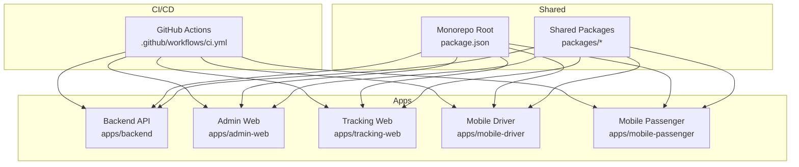
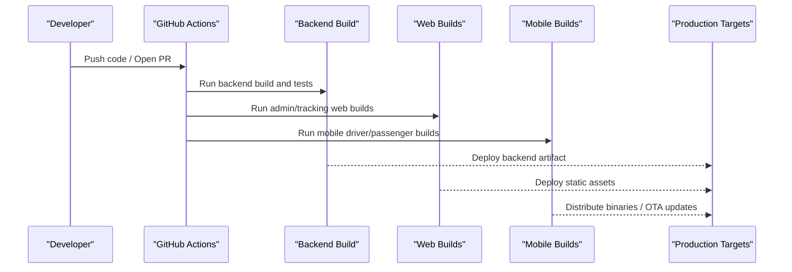
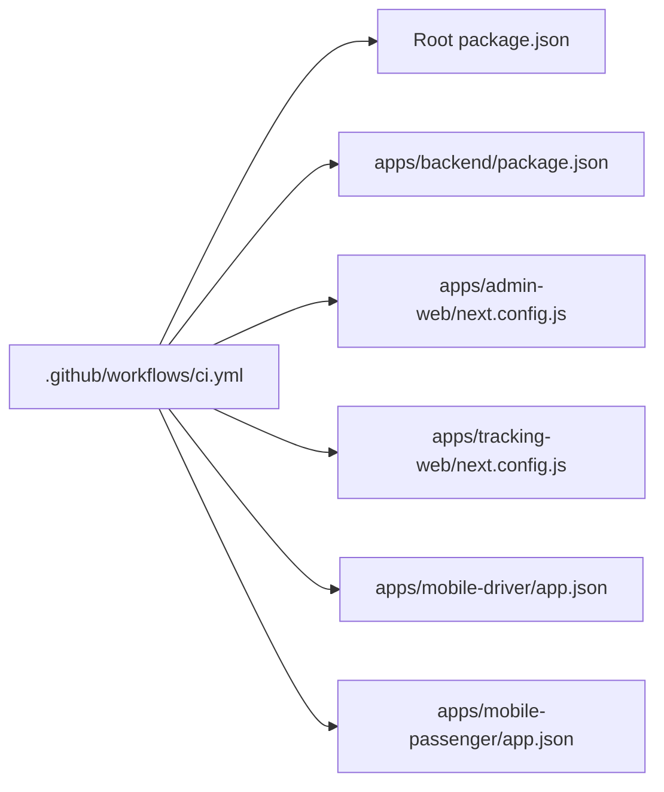

# Deployment & Operations

<cite>
**Referenced Files in This Document**
- [ci.yml](file://.github/workflows/ci.yml)
- [package.json](file://package.json)
- [README.md](file://README.md)
- [backend/package.json](file://apps/backend/package.json)
- [backend/nest-cli.json](file://apps/backend/nest-cli.json)
- [backend/src/main.ts](file://apps/backend/src/main.ts)
- [admin-web/next.config.js](file://apps/admin-web/next.config.js)
- [tracking-web/next.config.js](file://apps/tracking-web/next.config.js)
- [mobile-driver/app.json](file://apps/mobile-driver/app.json)
- [mobile-passenger/app.json](file://apps/mobile-passenger/app.json)
</cite>

## Table of Contents
1. [Introduction](#introduction)
2. [Project Structure](#project-structure)
3. [Core Components](#core-components)
4. [Architecture Overview](#architecture-overview)
5. [Detailed Component Analysis](#detailed-component-analysis)
6. [Dependency Analysis](#dependency-analysis)
7. [Performance Considerations](#performance-considerations)
8. [Troubleshooting Guide](#troubleshooting-guide)
9. [Conclusion](#conclusion)
10. [Appendices](#appendices)

## Introduction
This document provides comprehensive deployment and operations guidance for the 18KansRide platform. It covers build pipeline configuration, containerization strategies, deployment automation using GitHub Actions, environment configuration management across development, staging, and production, scaling and load balancing considerations, performance optimization techniques, monitoring and logging setup, error tracking and alerting, backup and disaster recovery procedures, database maintenance, security best practices, mobile app distribution, OTA updates, and app store deployment processes. It also includes a troubleshooting guide for common deployment issues and operational challenges.

## Project Structure
The repository is a monorepo with multiple applications and shared packages:
- Backend API (NestJS)
- Admin Web App (Next.js)
- Tracking Web App (Next.js)
- Mobile Apps (React Native Expo for Driver and Passenger)
- Shared packages for design system, authentication, configuration, database utilities, and types

**Diagram sources**
- [ci.yml](file://.github/workflows/ci.yml)
- [package.json](file://package.json)
- [backend/package.json](file://apps/backend/package.json)
- [admin-web/next.config.js](file://apps/admin-web/next.config.js)
- [tracking-web/next.config.js](file://apps/tracking-web/next.config.js)
- [mobile-driver/app.json](file://apps/mobile-driver/app.json)
- [mobile-passenger/app.json](file://apps/mobile-passenger/app.json)

**Section sources**
- [README.md](file://README.md)
- [package.json](file://package.json)

## Core Components
- Build Pipeline: A single GitHub Actions workflow orchestrates builds for all apps and shared packages.
- Backend API: NestJS application configured via CLI and entrypoint.
- Web Apps: Next.js applications with their own configurations.
- Mobile Apps: React Native Expo apps configured via app manifests.

Key operational artifacts:
- CI workflow file for automated builds and tests
- Application package manifests defining dependencies and scripts
- App-specific configuration files that influence runtime behavior

**Section sources**
- [ci.yml](file://.github/workflows/ci.yml)
- [backend/package.json](file://apps/backend/package.json)
- [backend/nest-cli.json](file://apps/backend/nest-cli.json)
- [backend/src/main.ts](file://apps/backend/src/main.ts)
- [admin-web/next.config.js](file://apps/admin-web/next.config.js)
- [tracking-web/next.config.js](file://apps/tracking-web/next.config.js)
- [mobile-driver/app.json](file://apps/mobile-driver/app.json)
- [mobile-passenger/app.json](file://apps/mobile-passenger/app.json)

## Architecture Overview
High-level architecture for deployment:
- GitHub Actions triggers on code changes to run CI jobs.
- Each job builds its respective app or package.
- Artifacts are produced for web apps and backend; mobile apps produce builds suitable for distribution.
- Deploy targets include cloud platforms for backend and static hosting for web apps, and app stores or OTA channels for mobile apps.

[No sources needed since this diagram shows conceptual workflow, not actual code structure]

## Detailed Component Analysis

### CI/CD Pipeline Configuration
- The workflow defines jobs to install dependencies, lint/type-check, test, and build each target.
- Caching is used to speed up dependency resolution.
- Environment variables and secrets are consumed from GitHub Secrets for secure configuration.
- Artifacts are uploaded for later deployment steps.

Operational recommendations:
- Pin Node.js versions for reproducibility.
- Use matrix builds for parallel testing across environments.
- Add deployment jobs gated by branch protection rules.

**Section sources**
- [ci.yml](file://.github/workflows/ci.yml)

### Backend API (NestJS)
- Entry point and module composition are defined in the main application file.
- CLI configuration controls compilation and output directories.
- Package manifest includes build and start scripts.

Deployment considerations:
- Containerize the compiled output for consistent runtime.
- Configure health check endpoints for orchestration readiness.
- Use environment variables for DB connection strings, JWT keys, and feature flags.

Scaling and load balancing:
- Run multiple replicas behind a reverse proxy or service mesh.
- Enable horizontal pod autoscaling based on CPU/memory or custom metrics.
- Ensure stateless API design; externalize sessions and caches.

Monitoring and logging:
- Emit structured logs with correlation IDs.
- Expose metrics endpoint for Prometheus scraping.
- Integrate with centralized log aggregation.

Error tracking and alerting:
- Capture unhandled exceptions and route errors to an error tracking service.
- Set SLOs and alerts for latency, error rate, and saturation.

Security best practices:
- Rotate secrets regularly and use secret managers.
- Enforce HTTPS and HSTS at the edge.
- Apply least privilege to service accounts and database users.

**Section sources**
- [backend/src/main.ts](file://apps/backend/src/main.ts)
- [backend/nest-cli.json](file://apps/backend/nest-cli.json)
- [backend/package.json](file://apps/backend/package.json)

### Admin Web App (Next.js)
- Next.js configuration influences build-time options and runtime behavior.
- Static export or server-side rendering can be selected based on needs.

Deployment considerations:
- Build once and deploy immutable artifacts to CDN-backed hosting.
- Use environment variables injected at build time for non-sensitive config.
- Implement cache-busting and versioned asset paths.

Performance optimizations:
- Enable image optimization and prefetching.
- Minimize bundle size via code splitting and tree-shaking.
- Leverage browser caching and HTTP/2.

**Section sources**
- [admin-web/next.config.js](file://apps/admin-web/next.config.js)

### Tracking Web App (Next.js)
- Similar to Admin Web, uses Next.js configuration for build/runtime behavior.

Deployment considerations:
- Separate domain or path-based routing for isolation.
- Use separate CI jobs to build and deploy independently.

Performance optimizations:
- Optimize real-time map rendering and data polling intervals.
- Use efficient data fetching patterns and client-side caching.

**Section sources**
- [tracking-web/next.config.js](file://apps/tracking-web/next.config.js)

### Mobile Apps (Driver and Passenger)
- Expo app manifests define metadata, permissions, and build settings.
- Builds can be generated for Android and iOS, then distributed via app stores or OTA channels.

Distribution and OTA:
- Use EAS Build for cloud-native builds and signing.
- Publish updates via EAS Update for rapid iteration without full app store releases.
- Manage channel names and rollout percentages for staged deployments.

Security considerations:
- Store signing credentials securely in CI secrets.
- Validate API endpoints and enforce TLS.
- Implement certificate pinning if required by policy.

**Section sources**
- [mobile-driver/app.json](file://apps/mobile-driver/app.json)
- [mobile-passenger/app.json](file://apps/mobile-passenger/app.json)

### Monorepo and Shared Packages
- Root package manifest coordinates workspace dependencies and scripts.
- Shared packages encapsulate cross-cutting concerns such as auth, config, DB utilities, and types.

Operational benefits:
- Centralized dependency management reduces drift.
- Versioning and publishing workflows ensure consistency across apps.

**Section sources**
- [package.json](file://package.json)

## Dependency Analysis
The CI workflow depends on Node.js toolchains and package managers. Applications depend on shared packages and third-party libraries declared in their package manifests.

**Diagram sources**
- [ci.yml](file://.github/workflows/ci.yml)
- [package.json](file://package.json)
- [backend/package.json](file://apps/backend/package.json)
- [admin-web/next.config.js](file://apps/admin-web/next.config.js)
- [tracking-web/next.config.js](file://apps/tracking-web/next.config.js)
- [mobile-driver/app.json](file://apps/mobile-driver/app.json)
- [mobile-passenger/app.json](file://apps/mobile-passenger/app.json)

**Section sources**
- [ci.yml](file://.github/workflows/ci.yml)
- [package.json](file://package.json)

## Performance Considerations
- Backend:
  - Tune worker threads and process counts per replica.
  - Use connection pooling for databases and caches.
  - Profile hot paths and optimize queries.
- Web Apps:
  - Enable compression and caching headers.
  - Use CDN for static assets and images.
  - Monitor bundle sizes and lazy-load heavy components.
- Mobile:
  - Reduce payload sizes and implement pagination.
  - Cache responses locally where appropriate.
  - Optimize network requests and background tasks.

[No sources needed since this section provides general guidance]

## Troubleshooting Guide
Common deployment issues and resolutions:
- Build failures due to missing dependencies:
  - Verify lockfiles and cache keys in CI.
  - Ensure correct Node.js version is set in the workflow.
- Environment variable misconfiguration:
  - Confirm secrets are present and correctly named.
  - Validate values in staging before promoting to production.
- Health checks failing:
  - Inspect startup logs and readiness probes.
  - Check database connectivity and schema migrations.
- High latency or timeouts:
  - Review resource limits and autoscaling policies.
  - Analyze slow queries and external API calls.
- Mobile build/signing errors:
  - Re-sync keystore and provisioning profiles in CI.
  - Validate bundle identifiers and entitlements.

Operational diagnostics:
- Centralized logging with structured fields and correlation IDs.
- Metrics dashboards for request rates, error rates, and latency percentiles.
- Alerting rules tied to SLOs and business KPIs.

**Section sources**
- [ci.yml](file://.github/workflows/ci.yml)
- [backend/src/main.ts](file://apps/backend/src/main.ts)

## Conclusion
This document outlines the end-to-end deployment and operations strategy for 18KansRide, covering CI/CD automation, environment management, scaling, performance, monitoring, security, and mobile distribution. By following these guidelines and leveraging the existing CI workflow and app configurations, teams can achieve reliable, scalable, and secure deployments across environments.

[No sources needed since this section summarizes without analyzing specific files]

## Appendices

### Environment Configuration Management
- Development:
  - Local env files with minimal privileges and sandboxed services.
- Staging:
  - Mirror production configuration with synthetic data and lower quotas.
- Production:
  - Secret managers for sensitive values; strict access controls and audit trails.

[No sources needed since this section provides general guidance]

### Backup and Disaster Recovery
- Database backups:
  - Automated snapshots and point-in-time recovery.
  - Test restore procedures regularly.
- Object storage:
  - Versioned buckets and lifecycle policies.
- RTO/RPO definitions:
  - Define recovery objectives and validate with drills.

[No sources needed since this section provides general guidance]

### Security Best Practices
- Secrets rotation and least privilege access.
- Network segmentation and firewall rules.
- Vulnerability scanning in CI and runtime protection.
- Compliance checks and audit logging.

[No sources needed since this section provides general guidance]