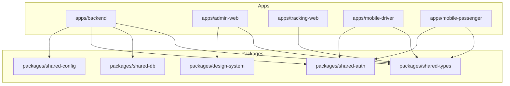
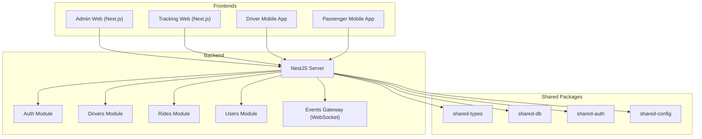
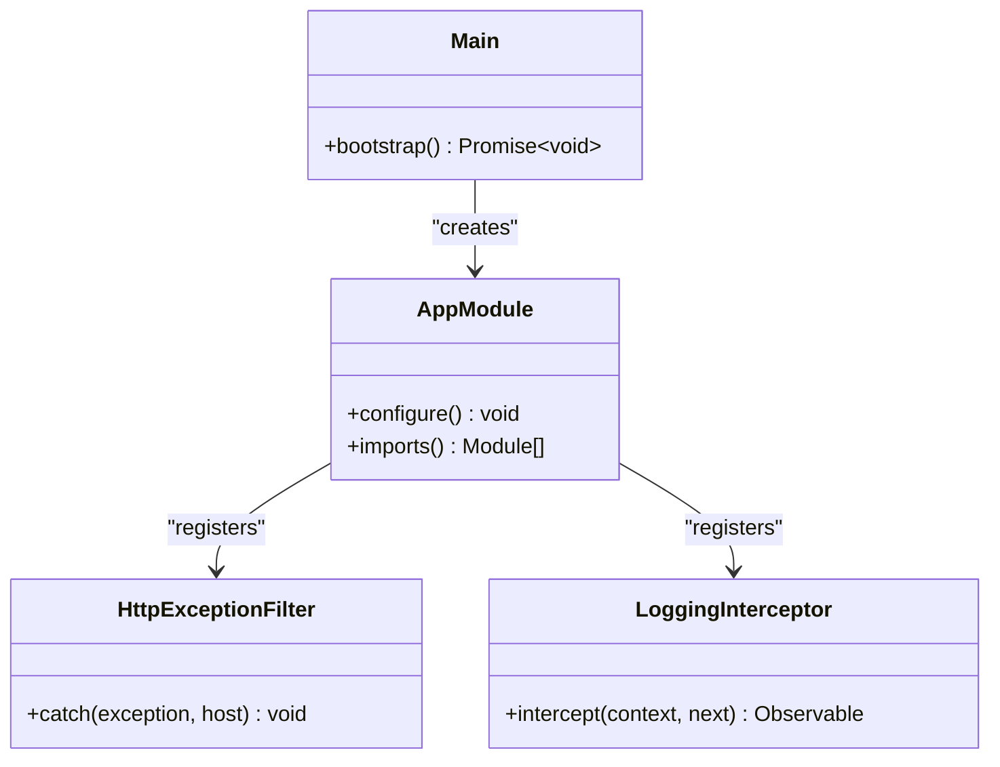
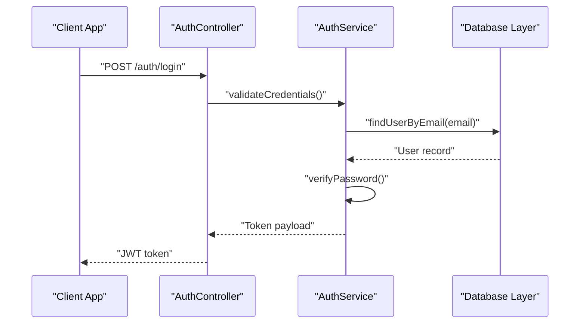
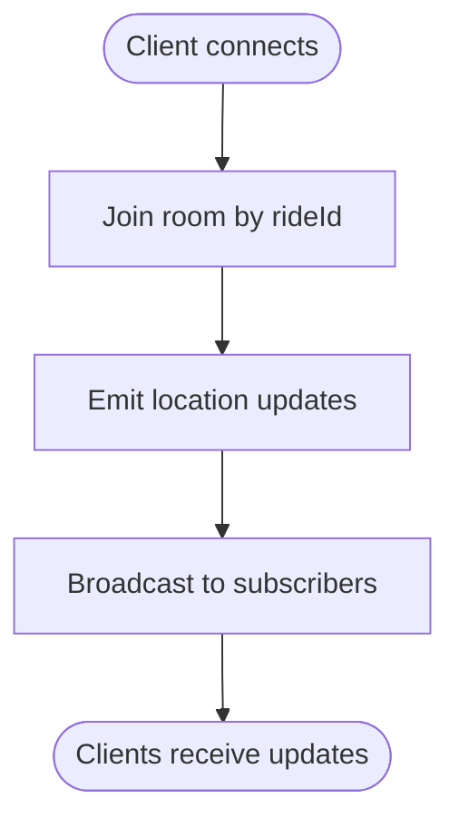
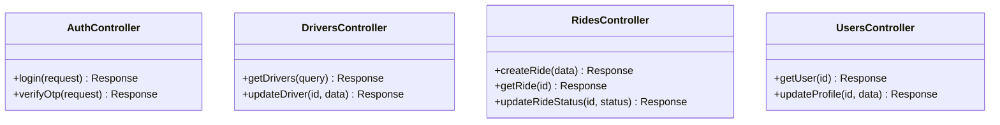
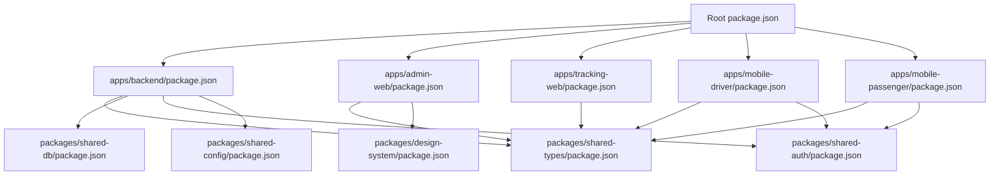

# Development Guide

<cite>
**Referenced Files in This Document**
- [README.md](file://README.md)
- [.eslintrc.json](file://.eslintrc.json)
- [.prettierrc.json](file://.prettierrc.json)
- [tsconfig.base.json](file://tsconfig.base.json)
- [package.json](file://package.json)
- [.github/workflows/ci.yml](file://.github/workflows/ci.yml)
- [apps/backend/src/main.ts](file://apps/backend/src/main.ts)
- [apps/backend/src/app.module.ts](file://apps/backend/src/app.module.ts)
- [apps/admin-web/next.config.js](file://apps/admin-web/next.config.js)
- [apps/tracking-web/next.config.js](file://apps/tracking-web/next.config.js)
- [apps/mobile-driver/package.json](file://apps/mobile-driver/package.json)
- [apps/mobile-passenger/package.json](file://apps/mobile-passenger/package.json)
- [apps/backend/nest-cli.json](file://apps/backend/nest-cli.json)
- [apps/backend/tsconfig.json](file://apps/backend/tsconfig.json)
- [apps/admin-web/tsconfig.json](file://apps/admin-web/tsconfig.json)
- [apps/tracking-web/tsconfig.json](file://apps/tracking-web/tsconfig.json)
- [apps/mobile-driver/tsconfig.json](file://apps/mobile-driver/tsconfig.json)
- [apps/mobile-passenger/tsconfig.json](file://apps/mobile-passenger/tsconfig.json)
- [apps/backend/src/common/filters/http-exception.filter.ts](file://apps/backend/src/common/filters/http-exception.filter.ts)
- [apps/backend/src/common/interceptors/logging.interceptor.ts](file://apps/backend/src/common/interceptors/logging.interceptor.ts)
- [apps/backend/src/modules/auth/auth.controller.ts](file://apps/backend/src/modules/auth/auth.controller.ts)
- [apps/backend/src/modules/auth/auth.service.ts](file://apps/backend/src/modules/auth/auth.service.ts)
- [apps/backend/src/modules/drivers/drivers.controller.ts](file://apps/backend/src/modules/drivers/drivers.controller.ts)
- [apps/backend/src/modules/rides/rides.controller.ts](file://apps/backend/src/modules/rides/rides.controller.ts)
- [apps/backend/src/modules/users/users.controller.ts](file://apps/backend/src/modules/users/users.controller.ts)
- [apps/backend/src/modules/events/events.gateway.ts](file://apps/backend/src/modules/events/events.gateway.ts)
</cite>

## Table of Contents
1. Introduction
2. Project Structure
3. Core Components
4. Architecture Overview
5. Detailed Component Analysis
6. Dependency Analysis
7. Performance Considerations
8. Troubleshooting Guide
9. Conclusion
10. Appendices

## Introduction
This guide provides comprehensive development guidelines for contributing to the 18KansRide project. It covers coding standards, linting and formatting rules, TypeScript conventions, project structure and naming patterns, testing strategy, CI/CD pipeline configuration, debugging and logging techniques, performance monitoring, code review practices, branching strategies, and development tool setup. The goal is to help contributors work efficiently and consistently across the monorepo’s backend, admin web app, tracking web app, and mobile apps.

## Project Structure
The repository is a monorepo with multiple applications under apps and shared packages under packages. Each app has its own configuration and dependencies, while shared packages provide common types, database utilities, auth logic, design system components, and shared configuration.

Key directories:
- apps/backend: NestJS-based API server with modules for auth, drivers, rides, users, events, and health checks.
- apps/admin-web: Next.js admin dashboard application.
- apps/tracking-web: Next.js ride tracking application.
- apps/mobile-driver: React Native/Expo driver mobile app.
- apps/mobile-passenger: React Native/Expo passenger mobile app.
- packages: Shared libraries (design-system, shared-auth, shared-config, shared-db, shared-types).

[No sources needed since this diagram shows conceptual workflow, not actual code structure]

**Section sources**
- [README.md](file://README.md)
- [package.json](file://package.json)

## Core Components
This section outlines the core components and their responsibilities within the backend and frontend apps.

- Backend (NestJS):
  - Application bootstrap and module composition.
  - Feature modules: auth, drivers, rides, users, events, health.
  - Cross-cutting concerns: HTTP exception filter, logging interceptor, guards, decorators.

- Admin Web (Next.js):
  - Dashboard pages for drivers, rides, subscriptions, users, live map.
  - Layouts and global styles.

- Tracking Web (Next.js):
  - Public ride tracking page and layout.

- Mobile Apps (React Native/Expo):
  - Driver and passenger apps with authentication flows, main screens, API client, socket integration, and local state stores.

**Section sources**
- [apps/backend/src/main.ts](file://apps/backend/src/main.ts)
- [apps/backend/src/app.module.ts](file://apps/backend/src/app.module.ts)
- [apps/admin-web/next.config.js](file://apps/admin-web/next.config.js)
- [apps/tracking-web/next.config.js](file://apps/tracking-web/next.config.js)
- [apps/mobile-driver/package.json](file://apps/mobile-driver/package.json)
- [apps/mobile-passenger/package.json](file://apps/mobile-passenger/package.json)

## Architecture Overview
High-level architecture showing how apps interact with the backend and shared packages.

**Diagram sources**
- [apps/backend/src/app.module.ts](file://apps/backend/src/app.module.ts)
- [apps/backend/src/modules/auth/auth.controller.ts](file://apps/backend/src/modules/auth/auth.controller.ts)
- [apps/backend/src/modules/auth/auth.service.ts](file://apps/backend/src/modules/auth/auth.service.ts)
- [apps/backend/src/modules/drivers/drivers.controller.ts](file://apps/backend/src/modules/drivers/drivers.controller.ts)
- [apps/backend/src/modules/rides/rides.controller.ts](file://apps/backend/src/modules/rides/rides.controller.ts)
- [apps/backend/src/modules/users/users.controller.ts](file://apps/backend/src/modules/users/users.controller.ts)
- [apps/backend/src/modules/events/events.gateway.ts](file://apps/backend/src/modules/events/events.gateway.ts)

## Detailed Component Analysis

### Backend Application Bootstrap and Modules
- Entry point initializes the NestJS application and registers global filters and interceptors.
- Root module composes feature modules and configures cross-cutting concerns.

**Diagram sources**
- [apps/backend/src/main.ts](file://apps/backend/src/main.ts)
- [apps/backend/src/app.module.ts](file://apps/backend/src/app.module.ts)
- [apps/backend/src/common/filters/http-exception.filter.ts](file://apps/backend/src/common/filters/http-exception.filter.ts)
- [apps/backend/src/common/interceptors/logging.interceptor.ts](file://apps/backend/src/common/interceptors/logging.interceptor.ts)

**Section sources**
- [apps/backend/src/main.ts](file://apps/backend/src/main.ts)
- [apps/backend/src/app.module.ts](file://apps/backend/src/app.module.ts)
- [apps/backend/src/common/filters/http-exception.filter.ts](file://apps/backend/src/common/filters/http-exception.filter.ts)
- [apps/backend/src/common/interceptors/logging.interceptor.ts](file://apps/backend/src/common/interceptors/logging.interceptor.ts)

### Authentication Flow
Sequence of operations when a client authenticates via the backend.

**Diagram sources**
- [apps/backend/src/modules/auth/auth.controller.ts](file://apps/backend/src/modules/auth/auth.controller.ts)
- [apps/backend/src/modules/auth/auth.service.ts](file://apps/backend/src/modules/auth/auth.service.ts)

**Section sources**
- [apps/backend/src/modules/auth/auth.controller.ts](file://apps/backend/src/modules/auth/auth.controller.ts)
- [apps/backend/src/modules/auth/auth.service.ts](file://apps/backend/src/modules/auth/auth.service.ts)

### Real-time Events (WebSocket)
The events gateway handles real-time communication between clients and the backend.

**Diagram sources**
- [apps/backend/src/modules/events/events.gateway.ts](file://apps/backend/src/modules/events/events.gateway.ts)

**Section sources**
- [apps/backend/src/modules/events/events.gateway.ts](file://apps/backend/src/modules/events/events.gateway.ts)

### API Controllers Overview
Controllers expose REST endpoints for core features.

**Diagram sources**
- [apps/backend/src/modules/auth/auth.controller.ts](file://apps/backend/src/modules/auth/auth.controller.ts)
- [apps/backend/src/modules/drivers/drivers.controller.ts](file://apps/backend/src/modules/drivers/drivers.controller.ts)
- [apps/backend/src/modules/rides/rides.controller.ts](file://apps/backend/src/modules/rides/rides.controller.ts)
- [apps/backend/src/modules/users/users.controller.ts](file://apps/backend/src/modules/users/users.controller.ts)

**Section sources**
- [apps/backend/src/modules/auth/auth.controller.ts](file://apps/backend/src/modules/auth/auth.controller.ts)
- [apps/backend/src/modules/drivers/drivers.controller.ts](file://apps/backend/src/modules/drivers/drivers.controller.ts)
- [apps/backend/src/modules/rides/rides.controller.ts](file://apps/backend/src/modules/rides/rides.controller.ts)
- [apps/backend/src/modules/users/users.controller.ts](file://apps/backend/src/modules/users/users.controller.ts)

### Frontend Configuration Highlights
- Admin and Tracking web apps use Next.js configurations for environment-specific settings.
- Mobile apps define Expo/React Native configurations and dependencies.

**Section sources**
- [apps/admin-web/next.config.js](file://apps/admin-web/next.config.js)
- [apps/tracking-web/next.config.js](file://apps/tracking-web/next.config.js)
- [apps/mobile-driver/package.json](file://apps/mobile-driver/package.json)
- [apps/mobile-passenger/package.json](file://apps/mobile-passenger/package.json)

## Dependency Analysis
Monorepo dependency management and build orchestration are defined at the root level.

**Diagram sources**
- [package.json](file://package.json)
- [apps/backend/package.json](file://apps/backend/package.json)
- [apps/admin-web/package.json](file://apps/admin-web/package.json)
- [apps/tracking-web/package.json](file://apps/tracking-web/package.json)
- [apps/mobile-driver/package.json](file://apps/mobile-driver/package.json)
- [apps/mobile-passenger/package.json](file://apps/mobile-passenger/package.json)

**Section sources**
- [package.json](file://package.json)

## Performance Considerations
- Backend:
  - Use efficient queries and pagination in services.
  - Leverage caching where appropriate (e.g., Redis or in-memory cache).
  - Profile hot paths using built-in logging and metrics.

- Frontend:
  - Enable code splitting and lazy loading in Next.js apps.
  - Optimize images and assets; use CDN if available.
  - Minimize re-renders in React components; memoize expensive computations.

- Mobile:
  - Avoid heavy synchronous operations on the UI thread.
  - Use background tasks for long-running jobs.
  - Monitor memory usage and network requests.

[No sources needed since this section provides general guidance]

## Troubleshooting Guide
- Error Handling:
  - Global HTTP exception filter standardizes error responses.
  - Ensure consistent error shapes and codes across controllers.

- Logging:
  - Logging interceptor captures request/response metadata and timing.
  - Centralize log aggregation and include correlation IDs for tracing.

- Debugging:
  - Use IDE debuggers for Node.js and browser environments.
  - For WebSocket issues, inspect event emissions and room joins.

- Common Issues:
  - CORS misconfiguration between frontends and backend.
  - Environment variables not loaded correctly in different apps.
  - Database connection failures or migrations not applied.

**Section sources**
- [apps/backend/src/common/filters/http-exception.filter.ts](file://apps/backend/src/common/filters/http-exception.filter.ts)
- [apps/backend/src/common/interceptors/logging.interceptor.ts](file://apps/backend/src/common/interceptors/logging.interceptor.ts)

## Conclusion
By following these guidelines—coding standards, linting/formatting rules, TypeScript conventions, structured project organization, robust testing, CI/CD automation, and effective debugging—you can contribute confidently to the 18KansRide project. Maintain consistency across apps and shared packages, and leverage the provided tools and workflows to ensure high-quality releases.

[No sources needed since this section summarizes without analyzing specific files]

## Appendices

### Coding Standards
- Prefer clear, descriptive names for functions, classes, and variables.
- Keep functions small and focused; extract reusable logic into services/utilities.
- Use TypeScript strictly; avoid any types unless necessary.
- Document public APIs and complex business logic with comments.

**Section sources**
- [tsconfig.base.json](file://tsconfig.base.json)

### ESLint Rules
- Enforce consistent style and best practices across the monorepo.
- Configure rules per-app where necessary, but maintain shared base rules.
- Integrate ESLint with pre-commit hooks to catch issues early.

**Section sources**
- [.eslintrc.json](file://.eslintrc.json)

### Prettier Configuration
- Standardize formatting across all languages (TypeScript, JSON, CSS).
- Run Prettier before commits to ensure uniform code style.
- Configure IDE integrations for automatic formatting on save.

**Section sources**
- [.prettierrc.json](file://.prettierrc.json)

### TypeScript Conventions
- Use strict mode and enable helpful compiler flags.
- Define shared types in packages/shared-types and import them across apps.
- Prefer interfaces for object shapes and enums for fixed sets of values.

**Section sources**
- [tsconfig.base.json](file://tsconfig.base.json)
- [apps/backend/tsconfig.json](file://apps/backend/tsconfig.json)
- [apps/admin-web/tsconfig.json](file://apps/admin-web/tsconfig.json)
- [apps/tracking-web/tsconfig.json](file://apps/tracking-web/tsconfig.json)
- [apps/mobile-driver/tsconfig.json](file://apps/mobile-driver/tsconfig.json)
- [apps/mobile-passenger/tsconfig.json](file://apps/mobile-passenger/tsconfig.json)

### Testing Strategy
- Unit Tests:
  - Test service methods and utility functions in isolation.
  - Mock external dependencies (database, third-party APIs).

- Integration Tests:
  - Validate controller endpoints and module interactions.
  - Use test databases and seed fixtures.

- End-to-End Tests:
  - Simulate user flows across admin/tracking web and mobile apps.
  - Automate critical journeys like login, ride creation, and tracking.

[No sources needed since this section provides general guidance]

### CI/CD Pipeline
- Automated builds for all apps and packages.
- Linting and formatting checks on pull requests.
- Unit and integration tests executed in CI.
- Artifact generation and deployment steps for staging/prod.

**Section sources**
- [.github/workflows/ci.yml](file://.github/workflows/ci.yml)

### Code Reviews and Pull Requests
- Create feature branches from main for each change.
- Open pull requests with clear descriptions and linked issues.
- Require reviews from at least one maintainer before merging.
- Ensure all CI checks pass before merge.

[No sources needed since this section provides general guidance]

### Development Tools Setup
- Install Node.js and required versions as specified in root configuration.
- Use the monorepo package manager to install dependencies across apps and packages.
- Configure IDE extensions for ESLint, Prettier, and TypeScript.
- Set up environment variables for local development (backend, web, mobile).

**Section sources**
- [package.json](file://package.json)
- [apps/backend/nest-cli.json](file://apps/backend/nest-cli.json)

### Productivity Tips
- Use task runners to start multiple apps concurrently during development.
- Leverage hot reload for faster feedback loops.
- Utilize shared packages to reduce duplication and improve consistency.

[No sources needed since this section provides general guidance]