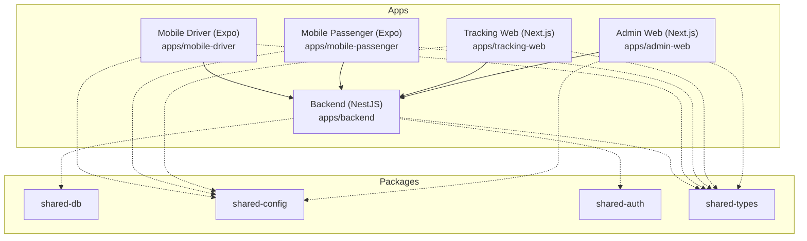
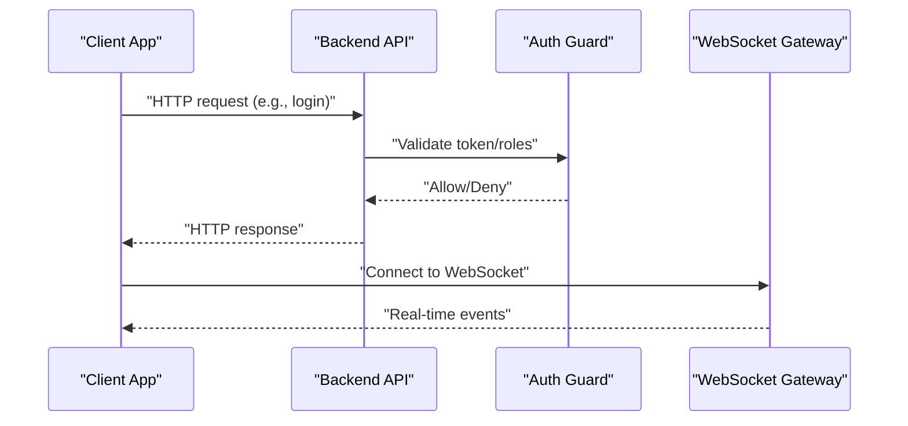
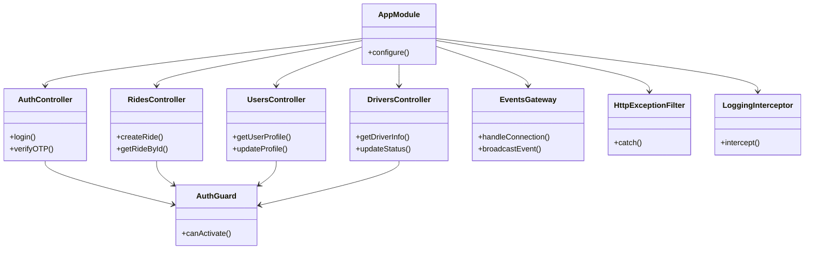
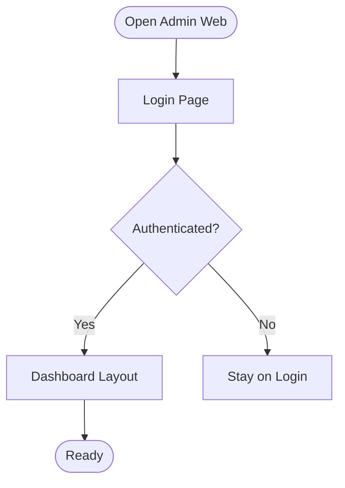
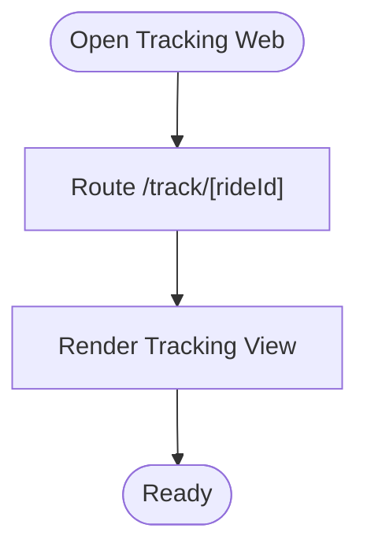
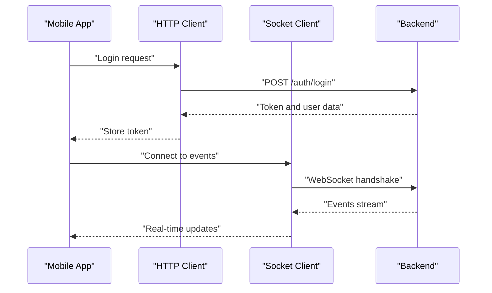
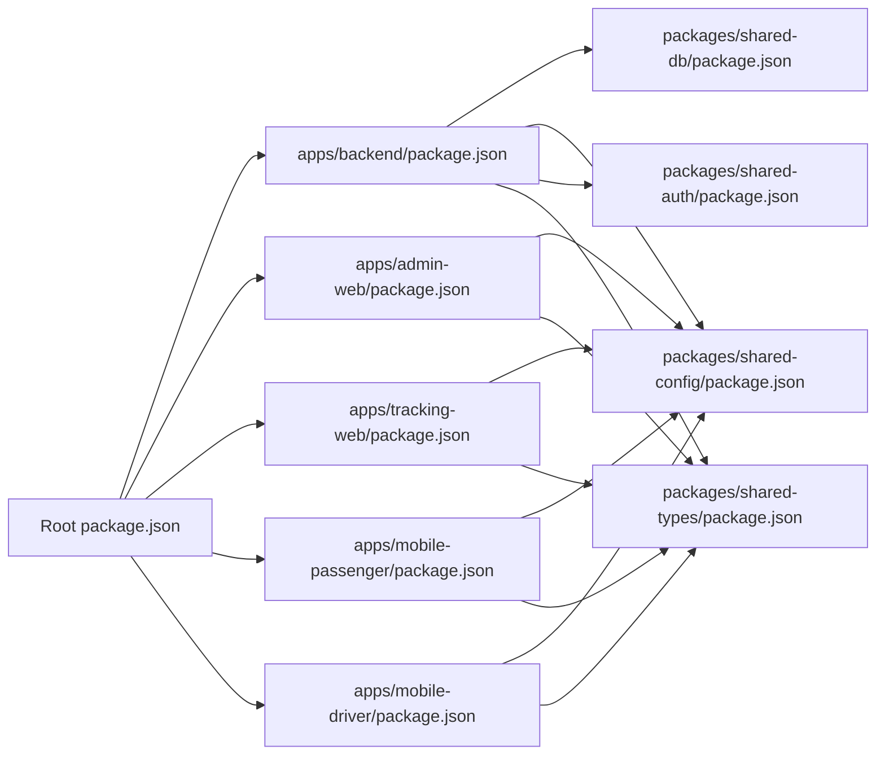

# Getting Started

<cite>
**Referenced Files in This Document**
- [README.md](file://README.md)
- [package.json](file://package.json)
- [apps/backend/package.json](file://apps/backend/package.json)
- [apps/admin-web/package.json](file://apps/admin-web/package.json)
- [apps/tracking-web/package.json](file://apps/tracking-web/package.json)
- [apps/mobile-passenger/package.json](file://apps/mobile-passenger/package.json)
- [apps/mobile-driver/package.json](file://apps/mobile-driver/package.json)
- [apps/backend/src/main.ts](file://apps/backend/src/main.ts)
- [apps/backend/src/app.module.ts](file://apps/backend/src/app.module.ts)
- [apps/backend/src/modules/auth/auth.controller.ts](file://apps/backend/src/modules/auth/auth.controller.ts)
- [apps/backend/src/modules/rides/rides.controller.ts](file://apps/backend/src/modules/rides/rides.controller.ts)
- [apps/backend/src/modules/users/users.controller.ts](file://apps/backend/src/modules/users/users.controller.ts)
- [apps/backend/src/modules/drivers/drivers.controller.ts](file://apps/backend/src/modules/drivers/drivers.controller.ts)
- [apps/backend/src/modules/events/events.gateway.ts](file://apps/backend/src/modules/events/events.gateway.ts)
- [apps/backend/src/common/guards/auth.guard.ts](file://apps/backend/src/common/guards/auth.guard.ts)
- [apps/backend/src/common/filters/http-exception.filter.ts](file://apps/backend/src/common/filters/http-exception.filter.ts)
- [apps/backend/src/common/interceptors/logging.interceptor.ts](file://apps/backend/src/common/interceptors/logging.interceptor.ts)
- [apps/admin-web/src/app/login/page.tsx](file://apps/admin-web/src/app/login/page.tsx)
- [apps/admin-web/src/app/dashboard/layout.tsx](file://apps/admin-web/src/app/dashboard/layout.tsx)
- [apps/tracking-web/src/app/track/[rideId]/page.tsx](file://apps/tracking-web/src/app/track/[rideId]/page.tsx)
- [apps/mobile-passenger/src/api/client.ts](file://apps/mobile-passenger/src/api/client.ts)
- [apps/mobile-passenger/src/api/socket.ts](file://apps/mobile-passenger/src/api/socket.ts)
- [apps/mobile-driver/src/api/client.ts](file://apps/mobile-driver/src/api/client.ts)
- [apps/mobile-driver/src/api/socket.ts](file://apps/mobile-driver/src/api/socket.ts)
- [apps/mobile-passenger/src/stores/auth-store.ts](file://apps/mobile-passenger/src/stores/auth-store.ts)
- [apps/mobile-driver/src/stores/auth-store.ts](file://apps/mobile-driver/src/stores/auth-store.ts)
- [packages/shared-db/package.json](file://packages/shared-db/package.json)
- [packages/shared-config/package.json](file://packages/shared-config/package.json)
- [packages/shared-auth/package.json](file://packages/shared-auth/package.json)
- [packages/shared-types/package.json](file://packages/shared-types/package.json)
- [tsconfig.base.json](file://tsconfig.base.json)
- [.eslintrc.json](file://.eslintrc.json)
- [.prettierrc.json](file://.prettierrc.json)
</cite>

## Table of Contents
1. Introduction
2. Project Structure
3. Core Components
4. Architecture Overview
5. Detailed Component Analysis
6. Dependency Analysis
7. Performance Considerations
8. Troubleshooting Guide
9. Conclusion

## Introduction
This guide helps you set up and run the 18KansRide platform locally. It is a multi-platform ride-sharing application with:
- A NestJS backend API
- An admin web dashboard (Next.js)
- A public tracking web app (Next.js)
- Mobile apps for passengers and drivers (React Native/Expo)

The goal is to get all services running on your machine so you can develop, test, and iterate across platforms.

## Project Structure
At a high level, the repository is organized as a monorepo with multiple applications under apps and shared packages under packages. Each app has its own package.json and configuration files. The backend is NestJS-based; the web apps are Next.js; the mobile apps are Expo-based.

[No sources needed since this diagram shows conceptual structure]

## Core Components
- Backend (NestJS): Provides REST endpoints and WebSocket events for authentication, users, rides, drivers, and real-time updates.
- Admin Web: Dashboard UI for managing users, drivers, rides, subscriptions, and live map.
- Tracking Web: Public page to track an active ride by ID.
- Mobile Apps: Passenger and driver apps that authenticate, manage profiles, and interact with the backend via HTTP and WebSocket.

Key responsibilities:
- Authentication and authorization guards
- Real-time event gateway
- Shared types and configs across apps
- Database access layer abstraction

**Section sources**
- [apps/backend/src/main.ts](file://apps/backend/src/main.ts)
- [apps/backend/src/app.module.ts](file://apps/backend/src/app.module.ts)
- [apps/backend/src/modules/auth/auth.controller.ts](file://apps/backend/src/modules/auth/auth.controller.ts)
- [apps/backend/src/modules/rides/rides.controller.ts](file://apps/backend/src/modules/rides/rides.controller.ts)
- [apps/backend/src/modules/users/users.controller.ts](file://apps/backend/src/modules/users/users.controller.ts)
- [apps/backend/src/modules/drivers/drivers.controller.ts](file://apps/backend/src/modules/drivers/drivers.controller.ts)
- [apps/backend/src/modules/events/events.gateway.ts](file://apps/backend/src/modules/events/events.gateway.ts)
- [apps/backend/src/common/guards/auth.guard.ts](file://apps/backend/src/common/guards/auth.guard.ts)
- [apps/backend/src/common/filters/http-exception.filter.ts](file://apps/backend/src/common/filters/http-exception.filter.ts)
- [apps/backend/src/common/interceptors/logging.interceptor.ts](file://apps/backend/src/common/interceptors/logging.interceptor.ts)
- [apps/admin-web/src/app/login/page.tsx](file://apps/admin-web/src/app/login/page.tsx)
- [apps/admin-web/src/app/dashboard/layout.tsx](file://apps/admin-web/src/app/dashboard/layout.tsx)
- [apps/tracking-web/src/app/track/[rideId]/page.tsx](file://apps/tracking-web/src/app/track/[rideId]/page.tsx)
- [apps/mobile-passenger/src/api/client.ts](file://apps/mobile-passenger/src/api/client.ts)
- [apps/mobile-passenger/src/api/socket.ts](file://apps/mobile-passenger/src/api/socket.ts)
- [apps/mobile-driver/src/api/client.ts](file://apps/mobile-driver/src/api/client.ts)
- [apps/mobile-driver/src/api/socket.ts](file://apps/mobile-driver/src/api/socket.ts)

## Architecture Overview
The system follows a client-server architecture with real-time communication:
- Clients (web and mobile) call the backend over HTTP and connect to WebSocket events.
- The backend exposes controllers for domain features and a gateway for real-time updates.
- Shared packages provide common configurations, database utilities, auth helpers, and type definitions.

**Diagram sources**
- [apps/backend/src/modules/auth/auth.controller.ts](file://apps/backend/src/modules/auth/auth.controller.ts)
- [apps/backend/src/common/guards/auth.guard.ts](file://apps/backend/src/common/guards/auth.guard.ts)
- [apps/backend/src/modules/events/events.gateway.ts](file://apps/backend/src/modules/events/events.gateway.ts)

## Detailed Component Analysis

### Backend Setup and Configuration
- Entry point initializes the NestJS application and registers global filters and interceptors.
- Root module wires feature modules (auth, users, rides, drivers, events).
- Controllers expose REST endpoints; the gateway handles WebSocket events.
- Guards enforce authentication and roles; filters centralize error handling; interceptors add logging.

**Diagram sources**
- [apps/backend/src/app.module.ts](file://apps/backend/src/app.module.ts)
- [apps/backend/src/modules/auth/auth.controller.ts](file://apps/backend/src/modules/auth/auth.controller.ts)
- [apps/backend/src/modules/rides/rides.controller.ts](file://apps/backend/src/modules/rides/rides.controller.ts)
- [apps/backend/src/modules/users/users.controller.ts](file://apps/backend/src/modules/users/users.controller.ts)
- [apps/backend/src/modules/drivers/drivers.controller.ts](file://apps/backend/src/modules/drivers/drivers.controller.ts)
- [apps/backend/src/modules/events/events.gateway.ts](file://apps/backend/src/modules/events/events.gateway.ts)
- [apps/backend/src/common/guards/auth.guard.ts](file://apps/backend/src/common/guards/auth.guard.ts)
- [apps/backend/src/common/filters/http-exception.filter.ts](file://apps/backend/src/common/filters/http-exception.filter.ts)
- [apps/backend/src/common/interceptors/logging.interceptor.ts](file://apps/backend/src/common/interceptors/logging.interceptor.ts)

**Section sources**
- [apps/backend/src/main.ts](file://apps/backend/src/main.ts)
- [apps/backend/src/app.module.ts](file://apps/backend/src/app.module.ts)
- [apps/backend/src/modules/auth/auth.controller.ts](file://apps/backend/src/modules/auth/auth.controller.ts)
- [apps/backend/src/modules/rides/rides.controller.ts](file://apps/backend/src/modules/rides/rides.controller.ts)
- [apps/backend/src/modules/users/users.controller.ts](file://apps/backend/src/modules/users/users.controller.ts)
- [apps/backend/src/modules/drivers/drivers.controller.ts](file://apps/backend/src/modules/drivers/drivers.controller.ts)
- [apps/backend/src/modules/events/events.gateway.ts](file://apps/backend/src/modules/events/events.gateway.ts)
- [apps/backend/src/common/guards/auth.guard.ts](file://apps/backend/src/common/guards/auth.guard.ts)
- [apps/backend/src/common/filters/http-exception.filter.ts](file://apps/backend/src/common/filters/http-exception.filter.ts)
- [apps/backend/src/common/interceptors/logging.interceptor.ts](file://apps/backend/src/common/interceptors/logging.interceptor.ts)

### Admin Web Application
- Login page authenticates against the backend and redirects to the dashboard.
- Dashboard layout wraps protected routes and manages navigation.

**Diagram sources**
- [apps/admin-web/src/app/login/page.tsx](file://apps/admin-web/src/app/login/page.tsx)
- [apps/admin-web/src/app/dashboard/layout.tsx](file://apps/admin-web/src/app/dashboard/layout.tsx)

**Section sources**
- [apps/admin-web/src/app/login/page.tsx](file://apps/admin-web/src/app/login/page.tsx)
- [apps/admin-web/src/app/dashboard/layout.tsx](file://apps/admin-web/src/app/dashboard/layout.tsx)

### Tracking Web Application
- Public route renders a tracking view using a dynamic ride ID from the URL.

**Diagram sources**
- [apps/tracking-web/src/app/track/[rideId]/page.tsx](file://apps/tracking-web/src/app/track/[rideId]/page.tsx)

**Section sources**
- [apps/tracking-web/src/app/track/[rideId]/page.tsx](file://apps/tracking-web/src/app/track/[rideId]/page.tsx)

### Mobile Applications (Passenger and Driver)
- HTTP client and socket modules configure base URLs and WebSocket connections.
- Auth store persists tokens and user state.

**Diagram sources**
- [apps/mobile-passenger/src/api/client.ts](file://apps/mobile-passenger/src/api/client.ts)
- [apps/mobile-passenger/src/api/socket.ts](file://apps/mobile-passenger/src/api/socket.ts)
- [apps/mobile-driver/src/api/client.ts](file://apps/mobile-driver/src/api/client.ts)
- [apps/mobile-driver/src/api/socket.ts](file://apps/mobile-driver/src/api/socket.ts)
- [apps/mobile-passenger/src/stores/auth-store.ts](file://apps/mobile-passenger/src/stores/auth-store.ts)
- [apps/mobile-driver/src/stores/auth-store.ts](file://apps/mobile-driver/src/stores/auth-store.ts)

**Section sources**
- [apps/mobile-passenger/src/api/client.ts](file://apps/mobile-passenger/src/api/client.ts)
- [apps/mobile-passenger/src/api/socket.ts](file://apps/mobile-passenger/src/api/socket.ts)
- [apps/mobile-driver/src/api/client.ts](file://apps/mobile-driver/src/api/client.ts)
- [apps/mobile-driver/src/api/socket.ts](file://apps/mobile-driver/src/api/socket.ts)
- [apps/mobile-passenger/src/stores/auth-store.ts](file://apps/mobile-passenger/src/stores/auth-store.ts)
- [apps/mobile-driver/src/stores/auth-store.ts](file://apps/mobile-driver/src/stores/auth-store.ts)

## Dependency Analysis
- Monorepo root defines workspace scripts and shared tooling (linting, formatting).
- Each app declares its dependencies and build/run scripts.
- Shared packages provide reusable logic and types.

**Diagram sources**
- [package.json](file://package.json)
- [apps/backend/package.json](file://apps/backend/package.json)
- [apps/admin-web/package.json](file://apps/admin-web/package.json)
- [apps/tracking-web/package.json](file://apps/tracking-web/package.json)
- [apps/mobile-passenger/package.json](file://apps/mobile-passenger/package.json)
- [apps/mobile-driver/package.json](file://apps/mobile-driver/package.json)
- [packages/shared-db/package.json](file://packages/shared-db/package.json)
- [packages/shared-config/package.json](file://packages/shared-config/package.json)
- [packages/shared-auth/package.json](file://packages/shared-auth/package.json)
- [packages/shared-types/package.json](file://packages/shared-types/package.json)

**Section sources**
- [package.json](file://package.json)
- [apps/backend/package.json](file://apps/backend/package.json)
- [apps/admin-web/package.json](file://apps/admin-web/package.json)
- [apps/tracking-web/package.json](file://apps/tracking-web/package.json)
- [apps/mobile-passenger/package.json](file://apps/mobile-passenger/package.json)
- [apps/mobile-driver/package.json](file://apps/mobile-driver/package.json)
- [packages/shared-db/package.json](file://packages/shared-db/package.json)
- [packages/shared-config/package.json](file://packages/shared-config/package.json)
- [packages/shared-auth/package.json](file://packages/shared-auth/package.json)
- [packages/shared-types/package.json](file://packages/shared-types/package.json)

## Performance Considerations
- Enable caching headers at the API layer where appropriate.
- Use connection pooling for database clients.
- Minimize payload sizes and paginate large lists.
- For real-time features, throttle events and use efficient serialization.
- Profile hot paths in controllers and services to identify bottlenecks.

[No sources needed since this section provides general guidance]

## Troubleshooting Guide
Common setup issues and resolutions:
- Node.js version mismatch: Ensure your Node.js version matches the project’s requirements. Check the root package.json engines or scripts.
- Missing environment variables: Verify that each app’s environment file exists and contains required keys (e.g., backend API URL, database credentials, JWT secrets).
- Port conflicts: If the backend or Next.js dev servers fail to start, change ports in their respective configuration files.
- CORS errors: Confirm that the backend allows origins used by the web and mobile apps during development.
- WebSocket connection failures: Ensure the backend gateway is running and clients connect to the correct host/port.
- Database connectivity: Validate database credentials and network reachability.
- Lint/formatting issues: Run linting and formatting commands defined in the root package.json.

Useful references:
- Root scripts and tooling: [package.json](file://package.json), [.eslintrc.json](file://.eslintrc.json), [.prettierrc.json](file://.prettierrc.json), [tsconfig.base.json](file://tsconfig.base.json)
- Backend entry and modules: [apps/backend/src/main.ts](file://apps/backend/src/main.ts), [apps/backend/src/app.module.ts](file://apps/backend/src/app.module.ts)
- App-specific scripts and configs: [apps/backend/package.json](file://apps/backend/package.json), [apps/admin-web/package.json](file://apps/admin-web/package.json), [apps/tracking-web/package.json](file://apps/tracking-web/package.json), [apps/mobile-passenger/package.json](file://apps/mobile-passenger/package.json), [apps/mobile-driver/package.json](file://apps/mobile-driver/package.json)

**Section sources**
- [package.json](file://package.json)
- [.eslintrc.json](file://.eslintrc.json)
- [.prettierrc.json](file://.prettierrc.json)
- [tsconfig.base.json](file://tsconfig.base.json)
- [apps/backend/src/main.ts](file://apps/backend/src/main.ts)
- [apps/backend/src/app.module.ts](file://apps/backend/src/app.module.ts)
- [apps/backend/package.json](file://apps/backend/package.json)
- [apps/admin-web/package.json](file://apps/admin-web/package.json)
- [apps/tracking-web/package.json](file://apps/tracking-web/package.json)
- [apps/mobile-passenger/package.json](file://apps/mobile-passenger/package.json)
- [apps/mobile-driver/package.json](file://apps/mobile-driver/package.json)

## Conclusion
You now have a roadmap to install dependencies, configure environments, and run the backend, admin web, tracking web, and mobile apps. Start with the backend, then launch the web apps and mobile apps, verifying connectivity and real-time events. Refer to the troubleshooting section if you encounter common setup issues.

[No sources needed since this section summarizes without analyzing specific files]