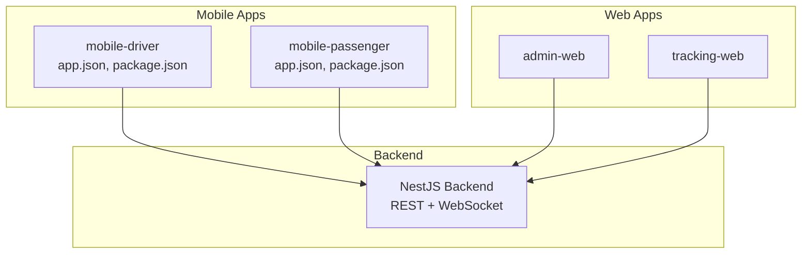
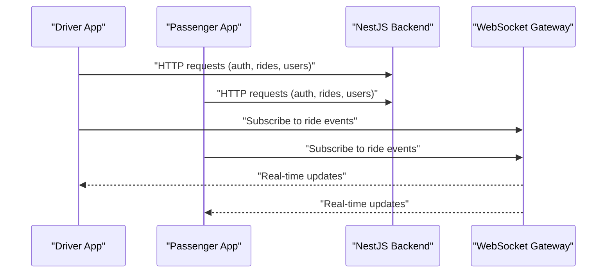
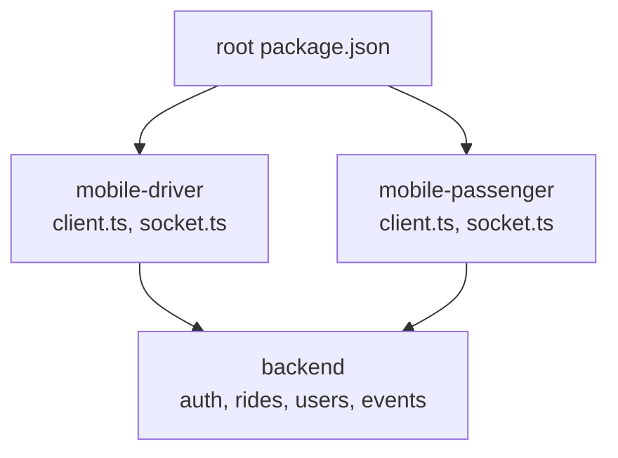
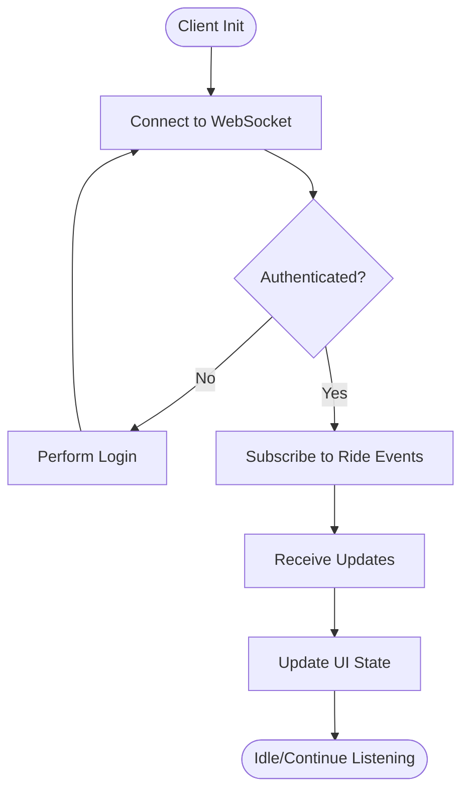
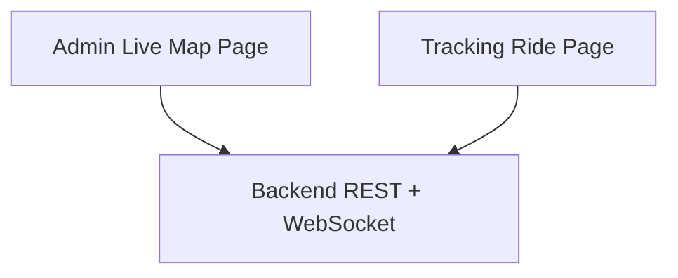

# Cross-Platform Considerations

<cite>
**Referenced Files in This Document**
- [apps/mobile-driver/app.json](file://apps/mobile-driver/app.json)
- [apps/mobile-driver/package.json](file://apps/mobile-driver/package.json)
- [apps/mobile-passenger/app.json](file://apps/mobile-passenger/app.json)
- [apps/mobile-passenger/package.json](file://apps/mobile-passenger/package.json)
- [apps/mobile-driver/src/api/client.ts](file://apps/mobile-driver/src/api/client.ts)
- [apps/mobile-driver/src/api/socket.ts](file://apps/mobile-driver/src/api/socket.ts)
- [apps/mobile-passenger/src/api/client.ts](file://apps/mobile-passenger/src/api/client.ts)
- [apps/mobile-passenger/src/api/socket.ts](file://apps/mobile-passenger/src/api/socket.ts)
- [apps/mobile-driver/src/stores/auth-store.ts](file://apps/mobile-driver/src/stores/auth-store.ts)
- [apps/mobile-passenger/src/stores/auth-store.ts](file://apps/mobile-passenger/src/stores/auth-store.ts)
- [apps/mobile-driver/metro.config.js](file://apps/mobile-driver/metro.config.js)
- [apps/mobile-passenger/metro.config.js](file://apps/mobile-passenger/metro.config.js)
- [apps/backend/src/main.ts](file://apps/backend/src/main.ts)
- [apps/backend/src/modules/events/events.gateway.ts](file://apps/backend/src/modules/events/events.gateway.ts)
- [apps/backend/src/modules/auth/auth.controller.ts](file://apps/backend/src/modules/auth/auth.controller.ts)
- [apps/backend/src/modules/rides/rides.controller.ts](file://apps/backend/src/modules/rides/rides.controller.ts)
- [apps/backend/src/modules/users/users.controller.ts](file://apps/backend/src/modules/users/users.controller.ts)
- [apps/admin-web/src/app/dashboard/live-map/page.tsx](file://apps/admin-web/src/app/dashboard/live-map/page.tsx)
- [apps/tracking-web/src/app/track/[rideId]/page.tsx](file://apps/tracking-web/src/app/track/[rideId]/page.tsx)
- [package.json](file://package.json)
</cite>

## Table of Contents
1. Introduction
2. Project Structure
3. Core Components
4. Architecture Overview
5. Detailed Component Analysis
6. Dependency Analysis
7. Performance Considerations
8. Troubleshooting Guide
9. Conclusion
10. Appendices

## Introduction
This document focuses on cross-platform development considerations for the mobile applications within this repository, specifically the driver and passenger apps built with Expo/React Native. It covers platform-specific configuration differences between iOS and Android, dependency management, build configurations, permissions, background location services, push notifications, deep linking, UI adaptations, navigation nuances, performance optimizations, testing strategies, debugging techniques, deployment processes, environment variable management, feature flags, conditional logic, app store submission requirements, versioning, and over-the-air updates using Expo’s update system.

The goal is to provide a comprehensive guide that helps developers implement robust, platform-aware features while maintaining a shared codebase across iOS and Android.

## Project Structure
At a high level, the repository includes:
- Two mobile apps (driver and passenger) under apps/mobile-driver and apps/mobile-passenger
- A NestJS backend under apps/backend providing REST APIs and WebSocket events
- Web apps for admin and tracking under apps/admin-web and apps/tracking-web
- Shared packages under packages/*

For cross-platform concerns, the most relevant directories are the mobile apps and their configuration files (app.json, package.json, metro.config.js), as well as the API clients and socket integrations used by both apps.

[No sources needed since this diagram shows conceptual workflow, not actual code structure]

## Core Components
Key components impacting cross-platform behavior include:
- Expo app configuration (app.json) for each mobile app
- Package dependencies (package.json) including platform-specific libraries
- Metro bundler configuration (metro.config.js)
- API client and WebSocket integration for real-time features
- Authentication store usage across screens

These components influence how platform-specific features are enabled, how native modules are linked, and how runtime behaviors differ between iOS and Android.

**Section sources**
- [apps/mobile-driver/app.json](file://apps/mobile-driver/app.json)
- [apps/mobile-passenger/app.json](file://apps/mobile-passenger/app.json)
- [apps/mobile-driver/package.json](file://apps/mobile-driver/package.json)
- [apps/mobile-passenger/package.json](file://apps/mobile-passenger/package.json)
- [apps/mobile-driver/metro.config.js](file://apps/mobile-driver/metro.config.js)
- [apps/mobile-passenger/metro.config.js](file://apps/mobile-passenger/metro.config.js)
- [apps/mobile-driver/src/api/client.ts](file://apps/mobile-driver/src/api/client.ts)
- [apps/mobile-passenger/src/api/client.ts](file://apps/mobile-passenger/src/api/client.ts)
- [apps/mobile-driver/src/api/socket.ts](file://apps/mobile-driver/src/api/socket.ts)
- [apps/mobile-passenger/src/api/socket.ts](file://apps/mobile-passenger/src/api/socket.ts)
- [apps/mobile-driver/src/stores/auth-store.ts](file://apps/mobile-driver/src/stores/auth-store.ts)
- [apps/mobile-passenger/src/stores/auth-store.ts](file://apps/mobile-passenger/src/stores/auth-store.ts)

## Architecture Overview
The mobile apps communicate with the backend via HTTP and WebSocket channels. Real-time ride updates and authentication flows rely on these connections. The architecture must account for platform differences in networking, permissions, and background execution.

**Diagram sources**
- [apps/backend/src/modules/events/events.gateway.ts](file://apps/backend/src/modules/events/events.gateway.ts)
- [apps/backend/src/modules/auth/auth.controller.ts](file://apps/backend/src/modules/auth/auth.controller.ts)
- [apps/backend/src/modules/rides/rides.controller.ts](file://apps/backend/src/modules/rides/rides.controller.ts)
- [apps/backend/src/modules/users/users.controller.ts](file://apps/backend/src/modules/users/users.controller.ts)
- [apps/mobile-driver/src/api/socket.ts](file://apps/mobile-driver/src/api/socket.ts)
- [apps/mobile-passenger/src/api/socket.ts](file://apps/mobile-passenger/src/api/socket.ts)

**Section sources**
- [apps/backend/src/main.ts](file://apps/backend/src/main.ts)
- [apps/backend/src/modules/events/events.gateway.ts](file://apps/backend/src/modules/events/events.gateway.ts)
- [apps/backend/src/modules/auth/auth.controller.ts](file://apps/backend/src/modules/auth/auth.controller.ts)
- [apps/backend/src/modules/rides/rides.controller.ts](file://apps/backend/src/modules/rides/rides.controller.ts)
- [apps/backend/src/modules/users/users.controller.ts](file://apps/backend/src/modules/users/users.controller.ts)
- [apps/mobile-driver/src/api/client.ts](file://apps/mobile-driver/src/api/client.ts)
- [apps/mobile-passenger/src/api/client.ts](file://apps/mobile-passenger/src/api/client.ts)
- [apps/mobile-driver/src/api/socket.ts](file://apps/mobile-driver/src/api/socket.ts)
- [apps/mobile-passenger/src/api/socket.ts](file://apps/mobile-passenger/src/api/socket.ts)

## Detailed Component Analysis

### Expo Configuration Differences Between iOS and Android
Expo app configuration resides in each mobile app’s app.json file. Platform-specific settings such as bundle identifiers, app icons, splash screens, permissions, and build variants are typically defined here. Differences between iOS and Android include:
- Bundle identifier vs. applicationId
- Permission keys and descriptions
- Background modes and capabilities
- Build scripts and customizations

Ensure consistent naming conventions and maintain separate sections for ios and android where applicable. Validate that required keys exist for each platform before building.

**Section sources**
- [apps/mobile-driver/app.json](file://apps/mobile-driver/app.json)
- [apps/mobile-passenger/app.json](file://apps/mobile-passenger/app.json)

### Platform-Specific Dependencies and Build Configurations
Dependencies declared in package.json may include platform-specific modules. For example, location services, push notifications, or analytics often require different implementations per platform. Use conditional imports or platform checks to load appropriate modules at runtime.

Metro configuration (metro.config.js) can affect asset resolution, module aliasing, and plugin usage. Ensure that platform-specific assets and modules are correctly resolved during bundling.

**Section sources**
- [apps/mobile-driver/package.json](file://apps/mobile-driver/package.json)
- [apps/mobile-passenger/package.json](file://apps/mobile-passenger/package.json)
- [apps/mobile-driver/metro.config.js](file://apps/mobile-driver/metro.config.js)
- [apps/mobile-passenger/metro.config.js](file://apps/mobile-passenger/metro.config.js)

### Device Permission Handling
Permissions are essential for location access, notifications, camera, and storage. In Expo projects, permissions are typically requested at runtime and configured in app.json. Best practices:
- Request permissions only when needed
- Provide clear user-facing explanations
- Handle denied states gracefully
- Re-request after user changes system settings

For background location, ensure platform-specific capabilities are enabled and documented in app.json.

**Section sources**
- [apps/mobile-driver/app.json](file://apps/mobile-driver/app.json)
- [apps/mobile-passenger/app.json](file://apps/mobile-passenger/app.json)

### Background Location Services
Background location requires careful handling due to OS restrictions:
- iOS: Enable background modes and configure location updates; respect battery optimization
- Android: Configure foreground service and background permissions; handle Doze mode

Implement fallbacks when background location is unavailable and inform users about privacy implications.

**Section sources**
- [apps/mobile-driver/app.json](file://apps/mobile-driver/app.json)
- [apps/mobile-passenger/app.json](file://apps/mobile-passenger/app.json)

### Push Notification Setup
Push notifications involve:
- Registering device tokens with the backend
- Handling notification payloads and actions
- Managing permission prompts and user preferences
- Differentiating between iOS APNs and Android FCM

Ensure the backend supports token registration and routing based on platform.

**Section sources**
- [apps/mobile-driver/app.json](file://apps/mobile-driver/app.json)
- [apps/mobile-passenger/app.json](file://apps/mobile-passenger/app.json)
- [apps/backend/src/modules/auth/auth.controller.ts](file://apps/backend/src/modules/auth/auth.controller.ts)

### Deep Linking Implementation
Deep links enable opening specific app screens from external URLs. Configure URL schemes and domains in app.json and handle incoming links in the app entry points. Consider:
- URL scheme uniqueness per platform
- Domain verification for universal links (iOS) and app links (Android)
- Routing logic to navigate to target screens
- Fallback behavior when the app is not installed

**Section sources**
- [apps/mobile-driver/app.json](file://apps/mobile-driver/app.json)
- [apps/mobile-passenger/app.json](file://apps/mobile-passenger/app.json)

### Platform-Specific UI Adaptations and Navigation Differences
UI adaptations should account for:
- Safe areas and notch handling
- Touch targets and accessibility guidelines
- Keyboard behavior and input methods
- Navigation patterns (tab bars vs. bottom sheets)

Use responsive design principles and platform-aware components to deliver consistent experiences.

[No sources needed since this section provides general guidance]

### Performance Optimizations
Optimizations include:
- Minimizing bundle size with tree-shaking and lazy loading
- Using efficient data structures and memoization
- Reducing re-renders with React.memo and useMemo
- Leveraging background tasks judiciously
- Monitoring memory usage and network latency

Profile on both iOS and Android devices to identify bottlenecks.

[No sources needed since this section provides general guidance]

### Testing Strategies for Different Devices and Platforms
Testing approaches:
- Unit tests for shared logic
- Integration tests for API and socket interactions
- E2E tests on simulators and physical devices
- Platform-specific test suites for permission and background behavior
- Automated CI pipelines to run tests across platforms

**Section sources**
- [apps/mobile-driver/src/api/client.ts](file://apps/mobile-driver/src/api/client.ts)
- [apps/mobile-passenger/src/api/client.ts](file://apps/mobile-passenger/src/api/client.ts)
- [apps/mobile-driver/src/api/socket.ts](file://apps/mobile-driver/src/api/socket.ts)
- [apps/mobile-passenger/src/api/socket.ts](file://apps/mobile-passenger/src/api/socket.ts)

### Debugging Techniques
Debugging tips:
- Use React Native Debugger and Flipper
- Inspect network requests and WebSocket frames
- Log permission states and background task lifecycle
- Capture crash logs and stack traces
- Test on multiple OS versions and device types

**Section sources**
- [apps/mobile-driver/src/api/client.ts](file://apps/mobile-driver/src/api/client.ts)
- [apps/mobile-passenger/src/api/client.ts](file://apps/mobile-passenger/src/api/client.ts)
- [apps/mobile-driver/src/api/socket.ts](file://apps/mobile-driver/src/api/socket.ts)
- [apps/mobile-passenger/src/api/socket.ts](file://apps/mobile-passenger/src/api/socket.ts)

### Deployment Processes for Both App Stores
Deployment steps:
- Generate platform-specific builds (IPA/APK/AAB)
- Sign artifacts with appropriate certificates and keystores
- Submit to Apple App Store and Google Play Store
- Manage release tracks and rollout strategies
- Monitor post-release metrics and crashes

**Section sources**
- [apps/mobile-driver/app.json](file://apps/mobile-driver/app.json)
- [apps/mobile-passenger/app.json](file://apps/mobile-passenger/app.json)

### Environment Variable Management, Feature Flags, and Conditional Logic
Environment variables should be managed securely and injected at build time. Feature flags allow toggling functionality without redeployments. Conditional logic should isolate platform-specific code paths and avoid runtime errors.

[No sources needed since this section provides general guidance]

### App Store Submission Requirements, Version Management, and Over-the-Air Updates
Submission requirements include metadata, screenshots, privacy labels, and compliance documentation. Version management should follow semantic versioning and coordinate with backend compatibility. Over-the-air updates via Expo allow delivering JavaScript and asset updates without full app store submissions.

**Section sources**
- [apps/mobile-driver/app.json](file://apps/mobile-driver/app.json)
- [apps/mobile-passenger/app.json](file://apps/mobile-passenger/app.json)

## Dependency Analysis
The mobile apps depend on the backend for authentication, ride management, and real-time updates. They also rely on Expo and React Native ecosystem libraries for platform features.

**Diagram sources**
- [apps/mobile-driver/src/api/client.ts](file://apps/mobile-driver/src/api/client.ts)
- [apps/mobile-passenger/src/api/client.ts](file://apps/mobile-passenger/src/api/client.ts)
- [apps/mobile-driver/src/api/socket.ts](file://apps/mobile-driver/src/api/socket.ts)
- [apps/mobile-passenger/src/api/socket.ts](file://apps/mobile-passenger/src/api/socket.ts)
- [apps/backend/src/modules/auth/auth.controller.ts](file://apps/backend/src/modules/auth/auth.controller.ts)
- [apps/backend/src/modules/rides/rides.controller.ts](file://apps/backend/src/modules/rides/rides.controller.ts)
- [apps/backend/src/modules/users/users.controller.ts](file://apps/backend/src/modules/users/users.controller.ts)
- [apps/backend/src/modules/events/events.gateway.ts](file://apps/backend/src/modules/events/events.gateway.ts)
- [package.json](file://package.json)

**Section sources**
- [apps/mobile-driver/src/api/client.ts](file://apps/mobile-driver/src/api/client.ts)
- [apps/mobile-passenger/src/api/client.ts](file://apps/mobile-passenger/src/api/client.ts)
- [apps/mobile-driver/src/api/socket.ts](file://apps/mobile-driver/src/api/socket.ts)
- [apps/mobile-passenger/src/api/socket.ts](file://apps/mobile-passenger/src/api/socket.ts)
- [apps/backend/src/modules/auth/auth.controller.ts](file://apps/backend/src/modules/auth/auth.controller.ts)
- [apps/backend/src/modules/rides/rides.controller.ts](file://apps/backend/src/modules/rides/rides.controller.ts)
- [apps/backend/src/modules/users/users.controller.ts](file://apps/backend/src/modules/users/users.controller.ts)
- [apps/backend/src/modules/events/events.gateway.ts](file://apps/backend/src/modules/events/events.gateway.ts)
- [package.json](file://package.json)

## Performance Considerations
- Prefer lightweight libraries and avoid unnecessary native modules
- Optimize image sizes and use caching strategies
- Debounce frequent location updates and throttle network requests
- Profile CPU and memory usage on both platforms
- Use Hermes engine and enable new architecture features where supported

[No sources needed since this section provides general guidance]

## Troubleshooting Guide
Common issues and resolutions:
- Permission denied: Verify runtime prompts and app.json declarations
- Background location stops: Check OS power-saving modes and foreground service setup
- Push notifications not received: Confirm token registration and payload format
- Deep links not opening: Validate URL schemes and domain verification
- Build failures: Review platform-specific dependencies and signing configurations

**Section sources**
- [apps/mobile-driver/app.json](file://apps/mobile-driver/app.json)
- [apps/mobile-passenger/app.json](file://apps/mobile-passenger/app.json)
- [apps/mobile-driver/src/api/client.ts](file://apps/mobile-driver/src/api/client.ts)
- [apps/mobile-passenger/src/api/client.ts](file://apps/mobile-passenger/src/api/client.ts)
- [apps/mobile-driver/src/api/socket.ts](file://apps/mobile-driver/src/api/socket.ts)
- [apps/mobile-passenger/src/api/socket.ts](file://apps/mobile-passenger/src/api/socket.ts)

## Conclusion
Cross-platform development in this repository hinges on careful configuration in app.json, thoughtful dependency selection in package.json, and robust API and socket integrations. By addressing permissions, background services, notifications, deep linking, UI adaptations, performance, testing, debugging, deployment, environment management, and OTA updates, teams can deliver reliable mobile experiences across iOS and Android while leveraging shared logic and infrastructure.

[No sources needed since this section summarizes without analyzing specific files]

## Appendices

### Real-Time Data Flow Diagram

**Diagram sources**
- [apps/mobile-driver/src/api/socket.ts](file://apps/mobile-driver/src/api/socket.ts)
- [apps/mobile-passenger/src/api/socket.ts](file://apps/mobile-passenger/src/api/socket.ts)
- [apps/backend/src/modules/events/events.gateway.ts](file://apps/backend/src/modules/events/events.gateway.ts)

### Admin and Tracking Web Integration

**Diagram sources**
- [apps/admin-web/src/app/dashboard/live-map/page.tsx](file://apps/admin-web/src/app/dashboard/live-map/page.tsx)
- [apps/tracking-web/src/app/track/[rideId]/page.tsx](file://apps/tracking-web/src/app/track/[rideId]/page.tsx)
- [apps/backend/src/modules/rides/rides.controller.ts](file://apps/backend/src/modules/rides/rides.controller.ts)
- [apps/backend/src/modules/events/events.gateway.ts](file://apps/backend/src/modules/events/events.gateway.ts)