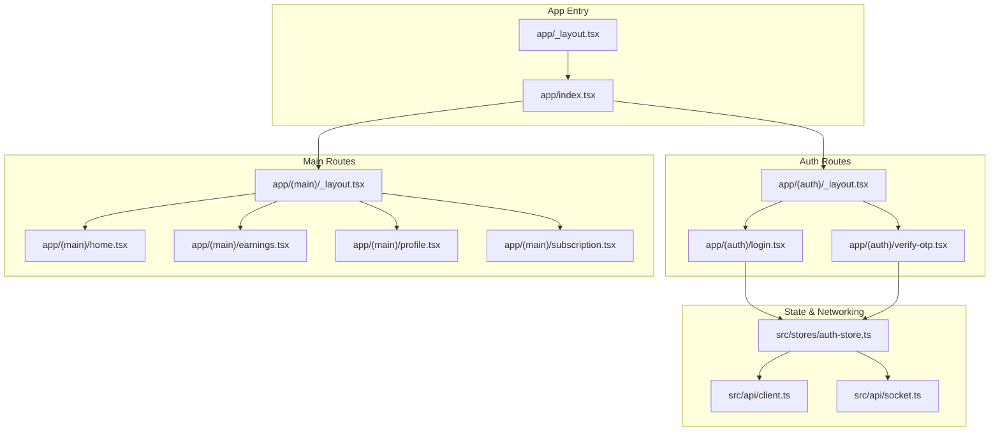
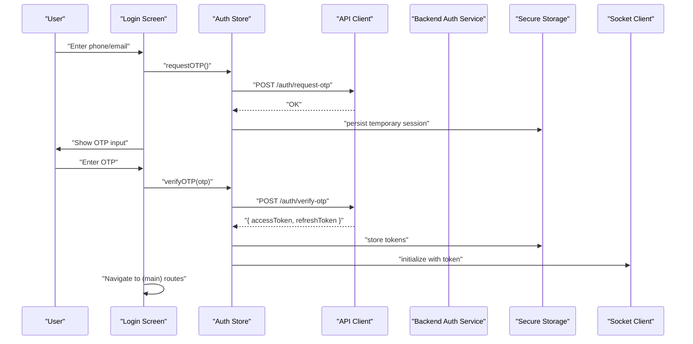
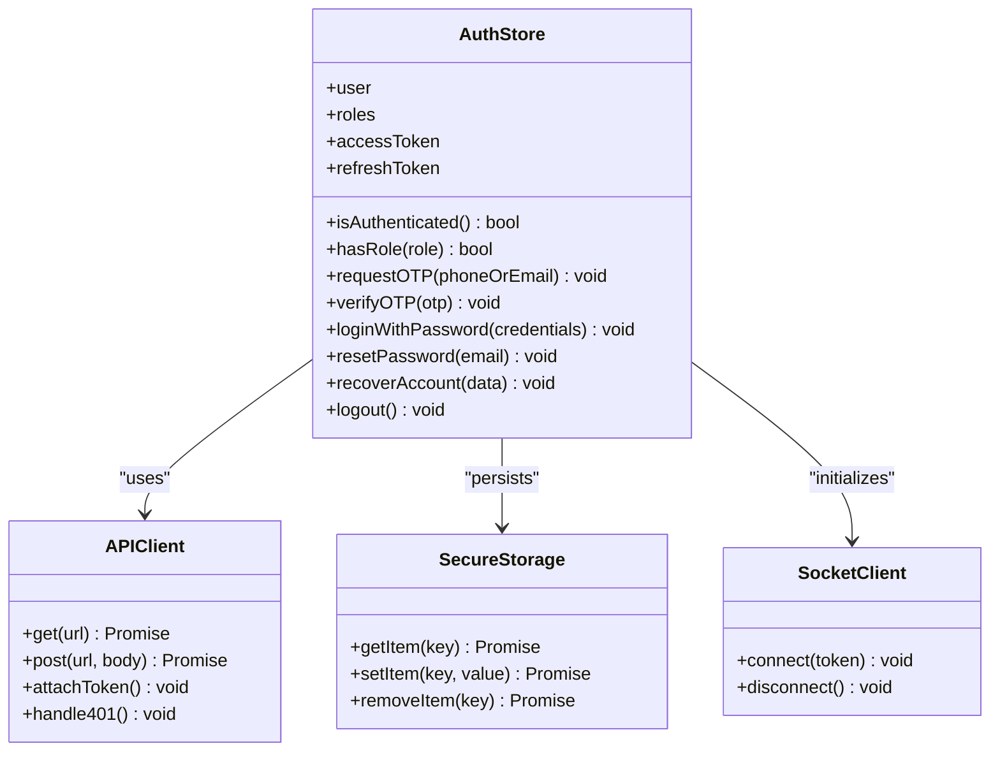
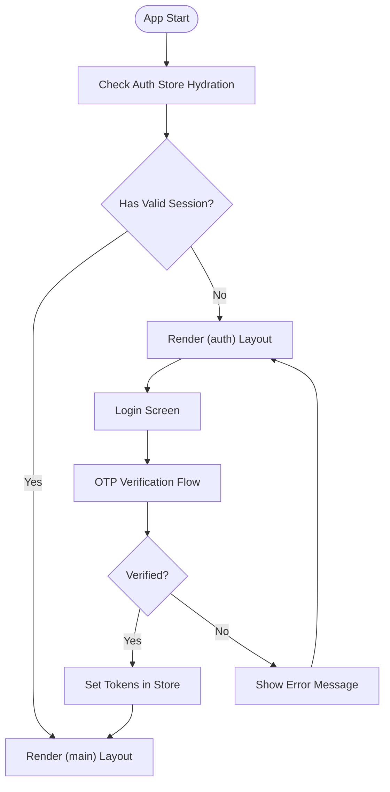
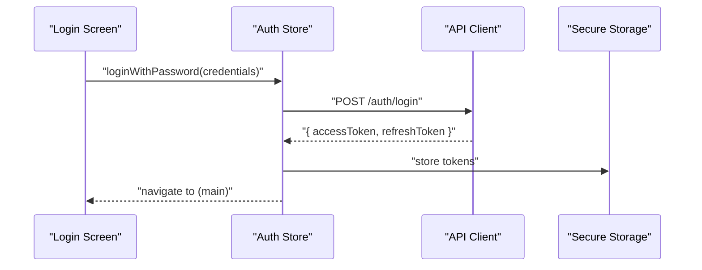
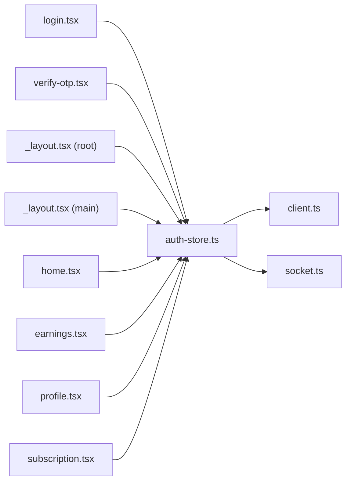

# Authentication & State Management

<cite>
**Referenced Files in This Document**
- [auth-store.ts](file://apps/mobile-driver/src/stores/auth-store.ts)
- [client.ts](file://apps/mobile-driver/src/api/client.ts)
- [socket.ts](file://apps/mobile-driver/src/api/socket.ts)
- [_layout.tsx](file://apps/mobile-driver/app/_layout.tsx)
- [index.tsx](file://apps/mobile-driver/app/index.tsx)
- [login.tsx](file://apps/mobile-driver/app/(auth)/login.tsx)
- [verify-otp.tsx](file://apps/mobile-driver/app/(auth)/verify-otp.tsx)
- [_layout.tsx](file://apps/mobile-driver/app/(main)/_layout.tsx)
- [home.tsx](file://apps/mobile-driver/app/(main)/home.tsx)
- [earnings.tsx](file://apps/mobile-driver/app/(main)/earnings.tsx)
- [profile.tsx](file://apps/mobile-driver/app/(main)/profile.tsx)
- [subscription.tsx](file://apps/mobile-driver/app/(main)/subscription.tsx)
</cite>

## Table of Contents
1. [Introduction](#introduction)
2. [Project Structure](#project-structure)
3. [Core Components](#core-components)
4. [Architecture Overview](#architecture-overview)
5. [Detailed Component Analysis](#detailed-component-analysis)
6. [Dependency Analysis](#dependency-analysis)
7. [Performance Considerations](#performance-considerations)
8. [Troubleshooting Guide](#troubleshooting-guide)
9. [Conclusion](#conclusion)

## Introduction
This document explains the Driver App’s authentication system and state management architecture. It focuses on how user sessions are managed, where tokens are stored, how role-based access control is enforced, and how login flows (including OTP verification and account recovery) operate. It also covers route protection, session persistence strategies, error handling for authentication failures and network issues, and security considerations specific to mobile environments.

## Project Structure
The Driver App is a React Native/Expo application with:
- A Zustand-based auth store that centralizes user session state and token lifecycle.
- An API client that attaches tokens to requests and handles common HTTP errors.
- A socket client initialized after successful authentication.
- Route groups for unauthenticated screens and protected main screens.
- Entry points that redirect based on authentication status.

**Diagram sources**
- [_layout.tsx](file://apps/mobile-driver/app/_layout.tsx)
- [index.tsx](file://apps/mobile-driver/app/index.tsx)
- [_layout.tsx](file://apps/mobile-driver/app/(auth)/_layout.tsx)
- [login.tsx](file://apps/mobile-driver/app/(auth)/login.tsx)
- [verify-otp.tsx](file://apps/mobile-driver/app/(auth)/verify-otp.tsx)
- [_layout.tsx](file://apps/mobile-driver/app/(main)/_layout.tsx)
- [home.tsx](file://apps/mobile-driver/app/(main)/home.tsx)
- [earnings.tsx](file://apps/mobile-driver/app/(main)/earnings.tsx)
- [profile.tsx](file://apps/mobile-driver/app/(main)/profile.tsx)
- [subscription.tsx](file://apps/mobile-driver/app/(main)/subscription.tsx)
- [auth-store.ts](file://apps/mobile-driver/src/stores/auth-store.ts)
- [client.ts](file://apps/mobile-driver/src/api/client.ts)
- [socket.ts](file://apps/mobile-driver/src/api/socket.ts)

**Section sources**
- [_layout.tsx](file://apps/mobile-driver/app/_layout.tsx)
- [index.tsx](file://apps/mobile-driver/app/index.tsx)
- [_layout.tsx](file://apps/mobile-driver/app/(auth)/_layout.tsx)
- [login.tsx](file://apps/mobile-driver/app/(auth)/login.tsx)
- [verify-otp.tsx](file://apps/mobile-driver/app/(auth)/verify-otp.tsx)
- [_layout.tsx](file://apps/mobile-driver/app/(main)/_layout.tsx)
- [home.tsx](file://apps/mobile-driver/app/(main)/home.tsx)
- [earnings.tsx](file://apps/mobile-driver/app/(main)/earnings.tsx)
- [profile.tsx](file://apps/mobile-driver/app/(main)/profile.tsx)
- [subscription.tsx](file://apps/mobile-driver/app/(main)/subscription.tsx)
- [auth-store.ts](file://apps/mobile-driver/src/stores/auth-store.ts)
- [client.ts](file://apps/mobile-driver/src/api/client.ts)
- [socket.ts](file://apps/mobile-driver/src/api/socket.ts)

## Core Components
- Auth Store (Zustand): Centralized state for user identity, roles, and tokens; exposes actions for login, logout, OTP verification, password reset, and account recovery; persists session across app restarts.
- API Client: Intercepts outgoing requests to attach tokens, refreshes or clears them on 401 responses, and normalizes error responses.
- Socket Client: Establishes authenticated WebSocket connections using current credentials.
- Route Groups: Enforce access by checking auth state before rendering protected screens.

Key responsibilities:
- Session lifecycle: create, persist, restore, invalidate.
- Token storage: secure local storage with rotation and refresh support.
- Role-based access control: expose user roles and guard routes accordingly.
- Error handling: map backend errors to user-friendly messages and retry policies.

**Section sources**
- [auth-store.ts](file://apps/mobile-driver/src/stores/auth-store.ts)
- [client.ts](file://apps/mobile-driver/src/api/client.ts)
- [socket.ts](file://apps/mobile-driver/src/api/socket.ts)

## Architecture Overview
The authentication flow centers around the auth store, which orchestrates UI state, token persistence, and networking. Protected routes check the store before rendering. The API client ensures all requests carry valid tokens and handle unauthorized states. The socket client connects only when authenticated.

**Diagram sources**
- [login.tsx](file://apps/mobile-driver/app/(auth)/login.tsx)
- [verify-otp.tsx](file://apps/mobile-driver/app/(auth)/verify-otp.tsx)
- [auth-store.ts](file://apps/mobile-driver/src/stores/auth-store.ts)
- [client.ts](file://apps/mobile-driver/src/api/client.ts)
- [socket.ts](file://apps/mobile-driver/src/api/socket.ts)

## Detailed Component Analysis

### Auth Store (Zustand)
Responsibilities:
- Maintain user profile, roles, and token pair.
- Provide actions: requestOTP, verifyOTP, loginWithPassword, resetPassword, recoverAccount, logout.
- Persist session to secure storage and hydrate on app start.
- Handle token refresh and invalidation on 401.
- Expose guards: isAuthenticated, hasRole.

Data model highlights:
- User identity fields and roles.
- Access and refresh tokens.
- Temporary session flags during OTP flows.

Actions overview:
- requestOTP: calls backend, stores temporary session, updates UI.
- verifyOTP: validates OTP, stores tokens, initializes socket, navigates to main.
- loginWithPassword: authenticates with credentials, stores tokens.
- resetPassword/recoverAccount: triggers backend flows and guides UI.
- logout: clears tokens and state, disconnects socket.

Persistence strategy:
- On mount, read tokens from secure storage and hydrate store.
- On success, write tokens; on 401 or explicit logout, clear storage.

Security considerations:
- Tokens stored in secure storage.
- Avoid logging sensitive values.
- Short-lived access tokens with refresh capability.

**Diagram sources**
- [auth-store.ts](file://apps/mobile-driver/src/stores/auth-store.ts)
- [client.ts](file://apps/mobile-driver/src/api/client.ts)
- [socket.ts](file://apps/mobile-driver/src/api/socket.ts)

**Section sources**
- [auth-store.ts](file://apps/mobile-driver/src/stores/auth-store.ts)

### API Client
Responsibilities:
- Attach access token to Authorization header.
- Retry failed requests with exponential backoff for transient errors.
- On 401, attempt token refresh; if refresh fails, trigger logout and clear storage.
- Normalize error payloads into consistent shapes for UI consumption.

Error handling:
- Network errors: surface generic message and allow retry.
- Validation errors: display field-specific messages.
- Server errors: log and show friendly message.

**Section sources**
- [client.ts](file://apps/mobile-driver/src/api/client.ts)

### Socket Client
Responsibilities:
- Connect to real-time service using current access token.
- Reconnect on connection loss with backoff.
- Disconnect on logout or token expiration.

**Section sources**
- [socket.ts](file://apps/mobile-driver/src/api/socket.ts)

### Route Protection and Guards
Route groups:
- Unauthenticated group: allows login and OTP verification.
- Protected group: requires active session; redirects to login if not authenticated.

Entry behavior:
- Root layout checks initial auth state and redirects accordingly.
- Protected layouts enforce guards before rendering child screens.

**Diagram sources**
- [_layout.tsx](file://apps/mobile-driver/app/_layout.tsx)
- [index.tsx](file://apps/mobile-driver/app/index.tsx)
- [_layout.tsx](file://apps/mobile-driver/app/(auth)/_layout.tsx)
- [_layout.tsx](file://apps/mobile-driver/app/(main)/_layout.tsx)
- [login.tsx](file://apps/mobile-driver/app/(auth)/login.tsx)
- [verify-otp.tsx](file://apps/mobile-driver/app/(auth)/verify-otp.tsx)

**Section sources**
- [_layout.tsx](file://apps/mobile-driver/app/_layout.tsx)
- [index.tsx](file://apps/mobile-driver/app/index.tsx)
- [_layout.tsx](file://apps/mobile-driver/app/(auth)/_layout.tsx)
- [_layout.tsx](file://apps/mobile-driver/app/(main)/_layout.tsx)
- [login.tsx](file://apps/mobile-driver/app/(auth)/login.tsx)
- [verify-otp.tsx](file://apps/mobile-driver/app/(auth)/verify-otp.tsx)

### Login Flows
- Phone/Email OTP Login:
  - Request OTP -> verify OTP -> store tokens -> navigate to main.
- Password Login:
  - Submit credentials -> store tokens -> navigate to main.
- Password Reset:
  - Trigger reset email/SMS -> guide user to set new password.
- Account Recovery:
  - Identity verification steps -> reissue credentials or grant temporary access.

**Diagram sources**
- [login.tsx](file://apps/mobile-driver/app/(auth)/login.tsx)
- [auth-store.ts](file://apps/mobile-driver/src/stores/auth-store.ts)
- [client.ts](file://apps/mobile-driver/src/api/client.ts)

**Section sources**
- [login.tsx](file://apps/mobile-driver/app/(auth)/login.tsx)
- [verify-otp.tsx](file://apps/mobile-driver/app/(auth)/verify-otp.tsx)
- [auth-store.ts](file://apps/mobile-driver/src/stores/auth-store.ts)

### Role-Based Access Control
- The store exposes user roles and helper guards like hasRole.
- Protected routes can check roles before rendering sensitive features.
- Example usage patterns:
  - Guard earnings screen for drivers only.
  - Restrict subscription management to admin roles.

**Section sources**
- [auth-store.ts](file://apps/mobile-driver/src/stores/auth-store.ts)
- [earnings.tsx](file://apps/mobile-driver/app/(main)/earnings.tsx)
- [subscription.tsx](file://apps/mobile-driver/app/(main)/subscription.tsx)

## Dependency Analysis
The following diagram shows key dependencies among components involved in authentication and state management.

**Diagram sources**
- [login.tsx](file://apps/mobile-driver/app/(auth)/login.tsx)
- [verify-otp.tsx](file://apps/mobile-driver/app/(auth)/verify-otp.tsx)
- [auth-store.ts](file://apps/mobile-driver/src/stores/auth-store.ts)
- [client.ts](file://apps/mobile-driver/src/api/client.ts)
- [socket.ts](file://apps/mobile-driver/src/api/socket.ts)
- [_layout.tsx](file://apps/mobile-driver/app/_layout.tsx)
- [_layout.tsx](file://apps/mobile-driver/app/(main)/_layout.tsx)
- [home.tsx](file://apps/mobile-driver/app/(main)/home.tsx)
- [earnings.tsx](file://apps/mobile-driver/app/(main)/earnings.tsx)
- [profile.tsx](file://apps/mobile-driver/app/(main)/profile.tsx)
- [subscription.tsx](file://apps/mobile-driver/app/(main)/subscription.tsx)

**Section sources**
- [auth-store.ts](file://apps/mobile-driver/src/stores/auth-store.ts)
- [client.ts](file://apps/mobile-driver/src/api/client.ts)
- [socket.ts](file://apps/mobile-driver/src/api/socket.ts)
- [_layout.tsx](file://apps/mobile-driver/app/_layout.tsx)
- [_layout.tsx](file://apps/mobile-driver/app/(main)/_layout.tsx)
- [login.tsx](file://apps/mobile-driver/app/(auth)/login.tsx)
- [verify-otp.tsx](file://apps/mobile-driver/app/(auth)/verify-otp.tsx)
- [home.tsx](file://apps/mobile-driver/app/(main)/home.tsx)
- [earnings.tsx](file://apps/mobile-driver/app/(main)/earnings.tsx)
- [profile.tsx](file://apps/mobile-driver/app/(main)/profile.tsx)
- [subscription.tsx](file://apps/mobile-driver/app/(main)/subscription.tsx)

## Performance Considerations
- Minimize re-renders by selecting only necessary state slices in components.
- Debounce OTP resend attempts and network retries.
- Use token refresh proactively before expiry to avoid 401 spikes.
- Keep socket reconnect logic efficient with exponential backoff and jitter.
- Avoid storing large payloads in persistent storage; keep only essential tokens and minimal user metadata.

[No sources needed since this section provides general guidance]

## Troubleshooting Guide
Common issues and resolutions:
- 401 Unauthorized:
  - Ensure token refresh is triggered on 401; if refresh fails, clear storage and force re-login.
- Network Errors:
  - Implement retry with backoff; show user-friendly messages and allow manual retry.
- OTP Not Received:
  - Validate phone/email format; implement resend cooldown; provide fallback to password login.
- Stale Session After Crash:
  - Hydrate store from secure storage on app start; validate token expiry and refresh if needed.
- Socket Disconnections:
  - Auto-reconnect with backoff; ensure re-authentication before reconnecting.

Operational tips:
- Log non-sensitive diagnostics for auth flows.
- Surface actionable error messages to users.
- Add telemetry for failure rates and latency.

**Section sources**
- [client.ts](file://apps/mobile-driver/src/api/client.ts)
- [auth-store.ts](file://apps/mobile-driver/src/stores/auth-store.ts)
- [socket.ts](file://apps/mobile-driver/src/api/socket.ts)

## Conclusion
The Driver App’s authentication system is centered around a Zustand-based auth store that manages session state, token persistence, and role-based access control. The API client enforces token attachment and refresh, while route groups protect sensitive screens. Robust error handling and mobile-specific security practices ensure a resilient and secure user experience.

[No sources needed since this section summarizes without analyzing specific files]