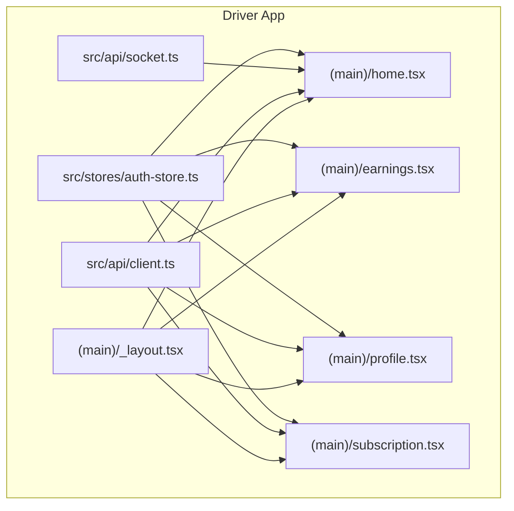
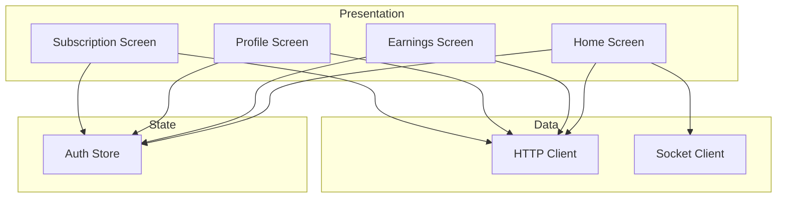
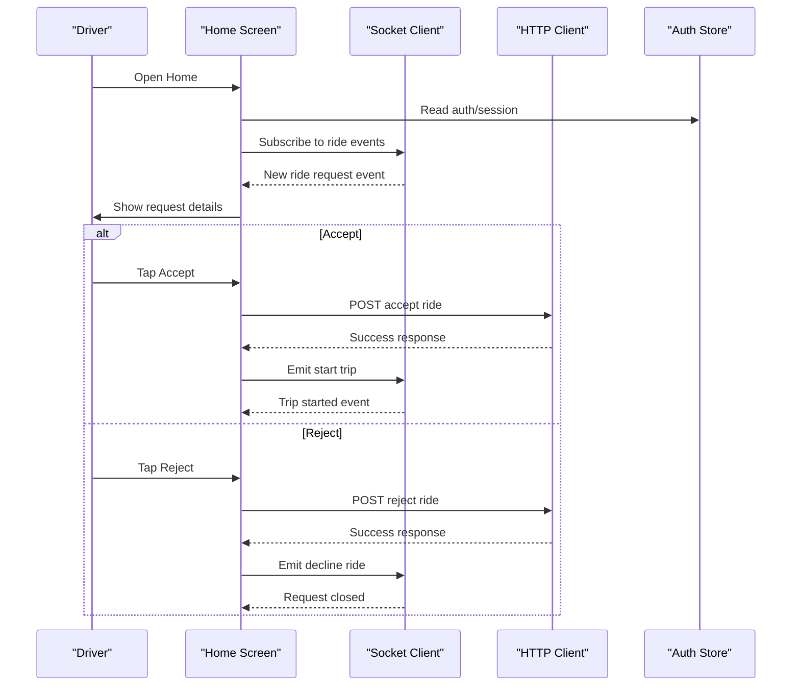
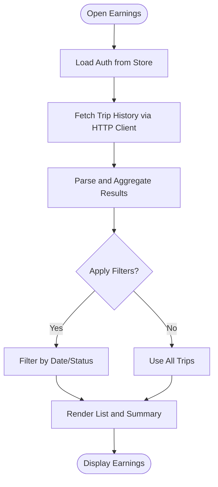
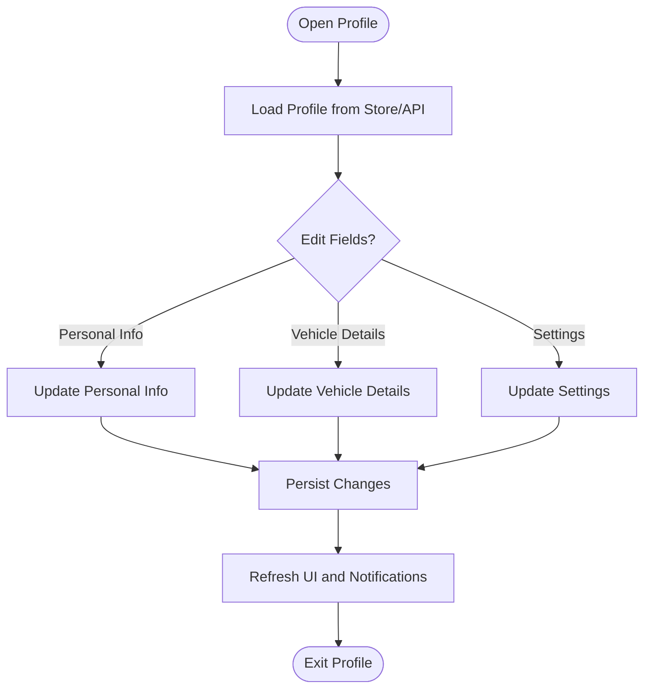
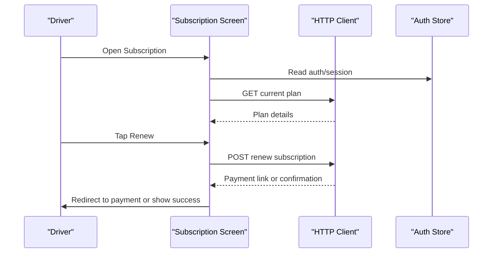
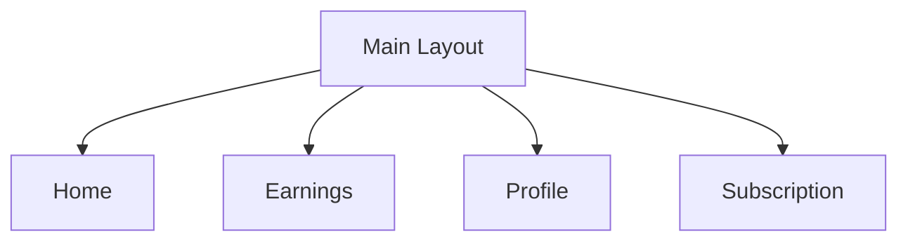
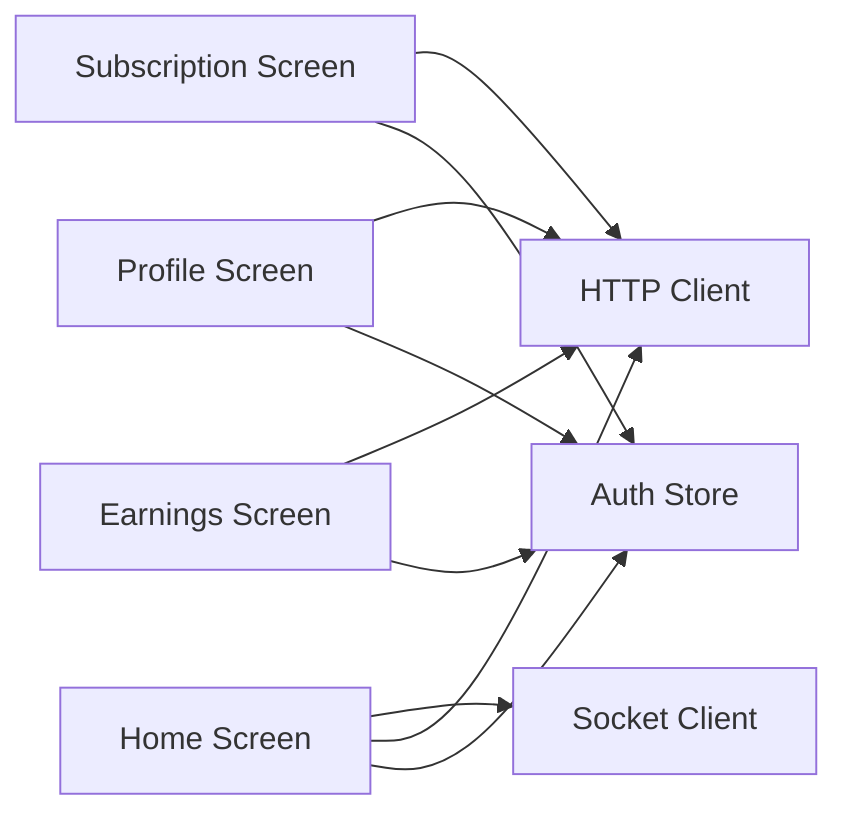

# Core Features & Screens

<cite>
**Referenced Files in This Document**
- [home.tsx](file://apps/mobile-driver/app/(main)/home.tsx)
- [earnings.tsx](file://apps/mobile-driver/app/(main)/earnings.tsx)
- [profile.tsx](file://apps/mobile-driver/app/(main)/profile.tsx)
- [subscription.tsx](file://apps/mobile-driver/app/(main)/subscription.tsx)
- [_layout.tsx](file://apps/mobile-driver/app/(main)/_layout.tsx)
- [client.ts](file://apps/mobile-driver/src/api/client.ts)
- [socket.ts](file://apps/mobile-driver/src/api/socket.ts)
- [auth-store.ts](file://apps/mobile-driver/src/stores/auth-store.ts)
</cite>

## Table of Contents
1. [Introduction](#introduction)
2. [Project Structure](#project-structure)
3. [Core Components](#core-components)
4. [Architecture Overview](#architecture-overview)
5. [Detailed Component Analysis](#detailed-component-analysis)
6. [Dependency Analysis](#dependency-analysis)
7. [Performance Considerations](#performance-considerations)
8. [Troubleshooting Guide](#troubleshooting-guide)
9. [Conclusion](#conclusion)

## Introduction
This document explains the Driver App’s core features and screen implementations, focusing on:
- Home screen for receiving ride requests, accepting/rejecting rides, and managing active trips
- Earnings tracking system including trip history, revenue calculation, and financial reporting
- Profile management for driver information, vehicle details, and settings
- Subscription management interface for plan monitoring and renewal
It also covers UI component structure, navigation patterns between screens, state persistence, and user interaction flows specific to driver workflows.

## Project Structure
The Driver App is a mobile application organized by feature-based routes under the main layout group. The key screens are:
- Home: Ride request handling and active trip management
- Earnings: Trip history and revenue summaries
- Profile: Driver and vehicle details plus settings
- Subscription: Plan monitoring and renewal

Navigation is provided by a shared layout that groups these screens and manages common UI chrome (e.g., tabs or headers). Networking and real-time communication are centralized in API client modules, while authentication state is persisted via a store.

**Diagram sources**
- [_layout.tsx](file://apps/mobile-driver/app/(main)/_layout.tsx)
- [home.tsx](file://apps/mobile-driver/app/(main)/home.tsx)
- [earnings.tsx](file://apps/mobile-driver/app/(main)/earnings.tsx)
- [profile.tsx](file://apps/mobile-driver/app/(main)/profile.tsx)
- [subscription.tsx](file://apps/mobile-driver/app/(main)/subscription.tsx)
- [client.ts](file://apps/mobile-driver/src/api/client.ts)
- [socket.ts](file://apps/mobile-driver/src/api/socket.ts)
- [auth-store.ts](file://apps/mobile-driver/src/stores/auth-store.ts)

**Section sources**
- [_layout.tsx](file://apps/mobile-driver/app/(main)/_layout.tsx)
- [home.tsx](file://apps/mobile-driver/app/(main)/home.tsx)
- [earnings.tsx](file://apps/mobile-driver/app/(main)/earnings.tsx)
- [profile.tsx](file://apps/mobile-driver/app/(main)/profile.tsx)
- [subscription.tsx](file://apps/mobile-driver/app/(main)/subscription.tsx)
- [client.ts](file://apps/mobile-driver/src/api/client.ts)
- [socket.ts](file://apps/mobile-driver/src/api/socket.ts)
- [auth-store.ts](file://apps/mobile-driver/src/stores/auth-store.ts)

## Core Components
- Home Screen
  - Receives incoming ride requests via real-time events
  - Allows accepting or rejecting requests
  - Manages active trips with status transitions and location updates
- Earnings Screen
  - Displays trip history and aggregated earnings
  - Supports filtering by date range and status
  - Provides summary metrics and export options
- Profile Screen
  - Shows and edits driver personal information
  - Manages vehicle details and documents
  - Configures app preferences and notification settings
- Subscription Screen
  - Displays current plan, expiry, and billing cycle
  - Handles renewal actions and payment flow triggers
  - Shows subscription history and receipts

UI components are composed within each screen and reused across the app where applicable. Navigation between screens is handled by the main layout, which provides consistent headers and tab access.

State persistence:
- Authentication and session data are maintained in a central store
- Local storage or secure storage may be used for tokens and minimal profile cache
- Real-time socket connections are managed centrally and reconnected on lifecycle events

Networking:
- HTTP client encapsulates REST calls for profile, earnings, and subscription endpoints
- Socket client handles live ride events and status updates

**Section sources**
- [home.tsx](file://apps/mobile-driver/app/(main)/home.tsx)
- [earnings.tsx](file://apps/mobile-driver/app/(main)/earnings.tsx)
- [profile.tsx](file://apps/mobile-driver/app/(main)/profile.tsx)
- [subscription.tsx](file://apps/mobile-driver/app/(main)/subscription.tsx)
- [client.ts](file://apps/mobile-driver/src/api/client.ts)
- [socket.ts](file://apps/mobile-driver/src/api/socket.ts)
- [auth-store.ts](file://apps/mobile-driver/src/stores/auth-store.ts)

## Architecture Overview
The Driver App follows a modular architecture:
- Presentation layer: Screens implement UI and orchestrate user interactions
- State layer: Centralized stores manage auth and global app state
- Data layer: API client handles HTTP; socket client manages real-time events
- Navigation layer: Main layout groups screens and controls routing

**Diagram sources**
- [home.tsx](file://apps/mobile-driver/app/(main)/home.tsx)
- [earnings.tsx](file://apps/mobile-driver/app/(main)/earnings.tsx)
- [profile.tsx](file://apps/mobile-driver/app/(main)/profile.tsx)
- [subscription.tsx](file://apps/mobile-driver/app/(main)/subscription.tsx)
- [auth-store.ts](file://apps/mobile-driver/src/stores/auth-store.ts)
- [client.ts](file://apps/mobile-driver/src/api/client.ts)
- [socket.ts](file://apps/mobile-driver/src/api/socket.ts)

## Detailed Component Analysis

### Home Screen
Responsibilities:
- Listen for incoming ride requests via socket events
- Present request details and allow accept/reject actions
- Manage active trip lifecycle (start, navigate, complete)
- Update UI based on real-time status changes

User Interaction Flow:

Real-time Updates:
- Location updates and trip progress are streamed via socket events
- UI reflects current trip phase and ETA adjustments

Error Handling:
- Network failures trigger retry logic and user feedback
- Socket disconnections attempt automatic reconnection

**Diagram sources**
- [home.tsx](file://apps/mobile-driver/app/(main)/home.tsx)
- [socket.ts](file://apps/mobile-driver/src/api/socket.ts)
- [client.ts](file://apps/mobile-driver/src/api/client.ts)
- [auth-store.ts](file://apps/mobile-driver/src/stores/auth-store.ts)

**Section sources**
- [home.tsx](file://apps/mobile-driver/app/(main)/home.tsx)
- [socket.ts](file://apps/mobile-driver/src/api/socket.ts)
- [client.ts](file://apps/mobile-driver/src/api/client.ts)
- [auth-store.ts](file://apps/mobile-driver/src/stores/auth-store.ts)

### Earnings Screen
Responsibilities:
- Fetch trip history and calculate total earnings
- Provide filters by date range and trip status
- Display summary metrics and detailed lists

Data Flow:

Key Behaviors:
- Pagination or infinite scroll for large histories
- Export functionality for CSV/PDF reports
- Currency formatting and timezone-aware timestamps

**Diagram sources**
- [earnings.tsx](file://apps/mobile-driver/app/(main)/earnings.tsx)
- [client.ts](file://apps/mobile-driver/src/api/client.ts)
- [auth-store.ts](file://apps/mobile-driver/src/stores/auth-store.ts)

**Section sources**
- [earnings.tsx](file://apps/mobile-driver/app/(main)/earnings.tsx)
- [client.ts](file://apps/mobile-driver/src/api/client.ts)
- [auth-store.ts](file://apps/mobile-driver/src/stores/auth-store.ts)

### Profile Screen
Responsibilities:
- Display and edit driver personal information
- Manage vehicle details and associated documents
- Configure app settings and notifications

Settings Workflow:

Validation and Persistence:
- Input validation before saving
- Optimistic updates with rollback on failure
- Secure storage for sensitive fields

**Diagram sources**
- [profile.tsx](file://apps/mobile-driver/app/(main)/profile.tsx)
- [client.ts](file://apps/mobile-driver/src/api/client.ts)
- [auth-store.ts](file://apps/mobile-driver/src/stores/auth-store.ts)

**Section sources**
- [profile.tsx](file://apps/mobile-driver/app/(main)/profile.tsx)
- [client.ts](file://apps/mobile-driver/src/api/client.ts)
- [auth-store.ts](file://apps/mobile-driver/src/stores/auth-store.ts)

### Subscription Screen
Responsibilities:
- Show current plan details, expiry, and billing cycle
- Handle renewal actions and initiate payment flows
- Display subscription history and receipts

Renewal Flow:

Edge Cases:
- Grace period handling after expiry
- Retry mechanisms for failed payments
- Clear messaging for plan limitations

**Diagram sources**
- [subscription.tsx](file://apps/mobile-driver/app/(main)/subscription.tsx)
- [client.ts](file://apps/mobile-driver/src/api/client.ts)
- [auth-store.ts](file://apps/mobile-driver/src/stores/auth-store.ts)

**Section sources**
- [subscription.tsx](file://apps/mobile-driver/app/(main)/subscription.tsx)
- [client.ts](file://apps/mobile-driver/src/api/client.ts)
- [auth-store.ts](file://apps/mobile-driver/src/stores/auth-store.ts)

### Navigation Patterns
- Main Layout: Groups all primary screens and provides consistent header/tab navigation
- Deep Linking: Optional support for direct navigation to specific screens or contexts
- Back Stack Management: Ensures smooth transitions and preserves state when returning to previous screens

**Diagram sources**
- [_layout.tsx](file://apps/mobile-driver/app/(main)/_layout.tsx)
- [home.tsx](file://apps/mobile-driver/app/(main)/home.tsx)
- [earnings.tsx](file://apps/mobile-driver/app/(main)/earnings.tsx)
- [profile.tsx](file://apps/mobile-driver/app/(main)/profile.tsx)
- [subscription.tsx](file://apps/mobile-driver/app/(main)/subscription.tsx)

**Section sources**
- [_layout.tsx](file://apps/mobile-driver/app/(main)/_layout.tsx)
- [home.tsx](file://apps/mobile-driver/app/(main)/home.tsx)
- [earnings.tsx](file://apps/mobile-driver/app/(main)/earnings.tsx)
- [profile.tsx](file://apps/mobile-driver/app/(main)/profile.tsx)
- [subscription.tsx](file://apps/mobile-driver/app/(main)/subscription.tsx)

## Dependency Analysis
Inter-screen dependencies are minimal; most data and state are accessed through centralized clients and stores.

**Diagram sources**
- [home.tsx](file://apps/mobile-driver/app/(main)/home.tsx)
- [earnings.tsx](file://apps/mobile-driver/app/(main)/earnings.tsx)
- [profile.tsx](file://apps/mobile-driver/app/(main)/profile.tsx)
- [subscription.tsx](file://apps/mobile-driver/app/(main)/subscription.tsx)
- [auth-store.ts](file://apps/mobile-driver/src/stores/auth-store.ts)
- [client.ts](file://apps/mobile-driver/src/api/client.ts)
- [socket.ts](file://apps/mobile-driver/src/api/socket.ts)

**Section sources**
- [home.tsx](file://apps/mobile-driver/app/(main)/home.tsx)
- [earnings.tsx](file://apps/mobile-driver/app/(main)/earnings.tsx)
- [profile.tsx](file://apps/mobile-driver/app/(main)/profile.tsx)
- [subscription.tsx](file://apps/mobile-driver/app/(main)/subscription.tsx)
- [auth-store.ts](file://apps/mobile-driver/src/stores/auth-store.ts)
- [client.ts](file://apps/mobile-driver/src/api/client.ts)
- [socket.ts](file://apps/mobile-driver/src/api/socket.ts)

## Performance Considerations
- Debounce real-time events to avoid excessive UI updates
- Paginate trip history and use virtualization for long lists
- Cache frequently accessed profile data locally with invalidation strategies
- Optimize socket subscriptions by limiting event types per screen
- Minimize re-renders by memoizing derived data and using efficient state updates

## Troubleshooting Guide
Common issues and resolutions:
- Socket connection failures: Verify network connectivity and ensure reconnection logic is triggered; check for server-side availability
- Authentication errors: Confirm token validity and refresh flow; clear stale sessions if necessary
- API timeouts: Implement retries with exponential backoff and provide user feedback
- Subscription payment failures: Surface error messages and guide users to retry or contact support

Operational checks:
- Validate environment variables for API and socket endpoints
- Inspect logs for failed requests and socket events
- Ensure proper error boundaries around critical screens

**Section sources**
- [socket.ts](file://apps/mobile-driver/src/api/socket.ts)
- [client.ts](file://apps/mobile-driver/src/api/client.ts)
- [auth-store.ts](file://apps/mobile-driver/src/stores/auth-store.ts)

## Conclusion
The Driver App organizes core driver workflows into focused screens with clear responsibilities. Real-time communication enables responsive ride request handling, while centralized state and networking layers promote consistency and maintainability. Robust error handling, performance optimizations, and structured navigation contribute to a reliable driver experience.