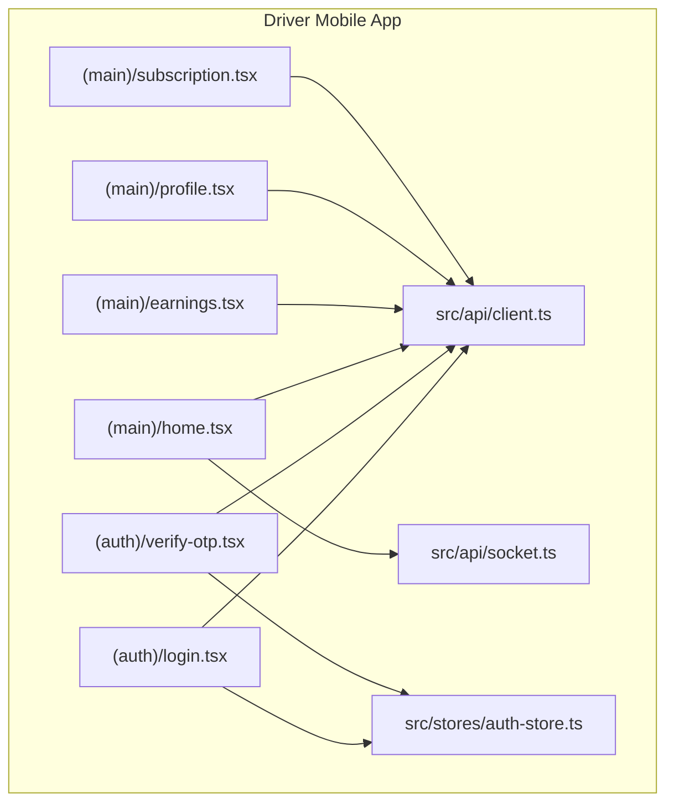
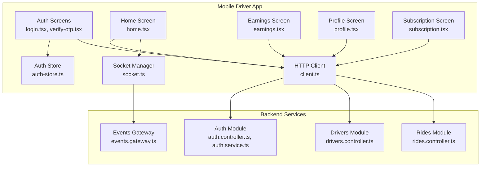
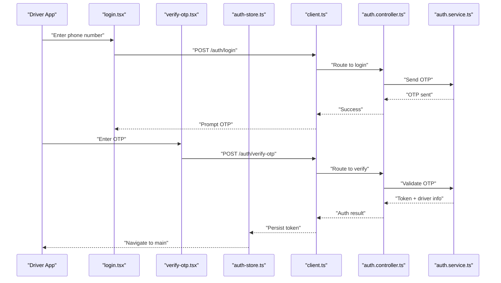
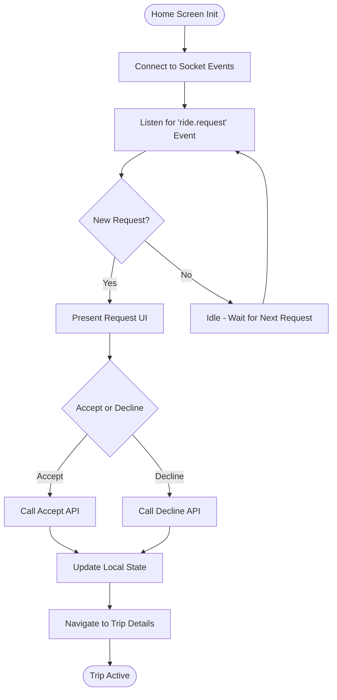
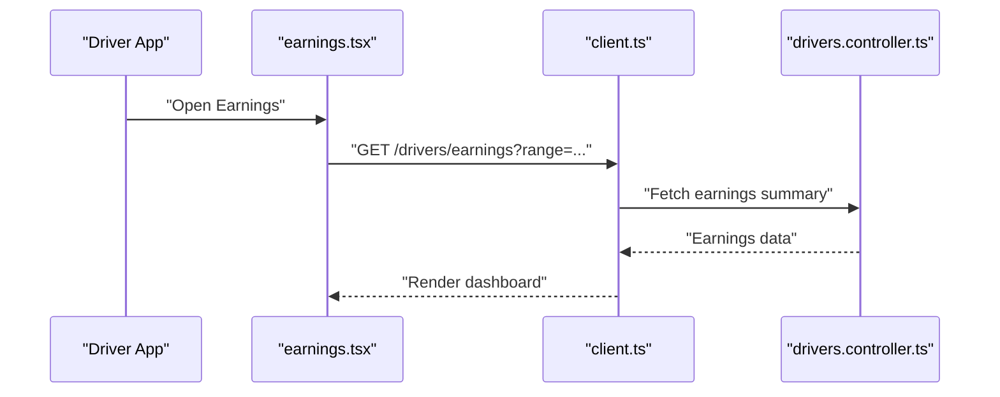
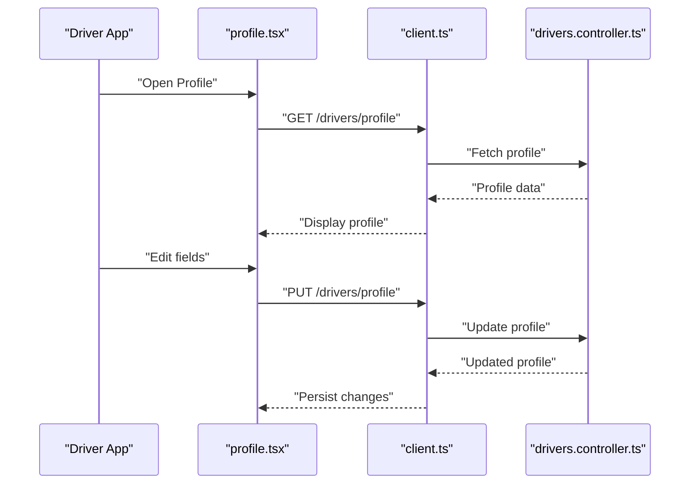
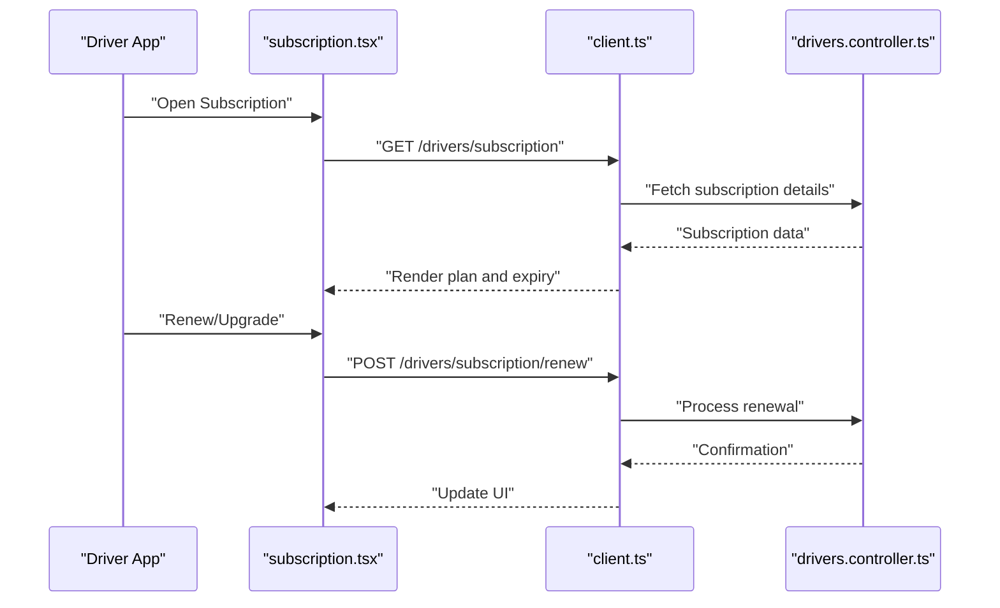
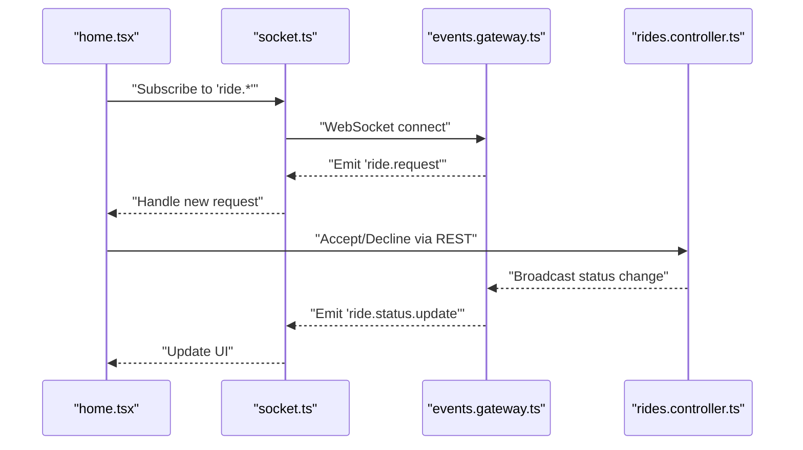
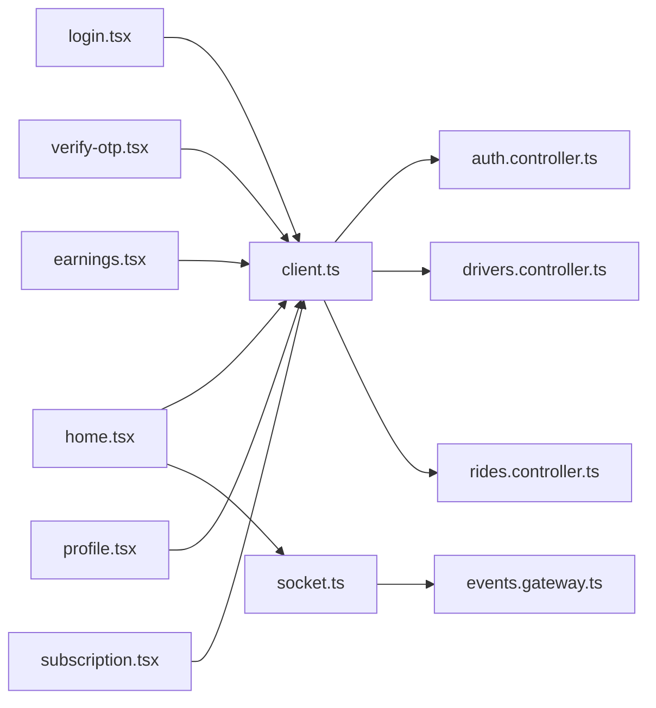

# Driver Mobile App

<cite>
**Referenced Files in This Document**
- [apps/mobile-driver/app/(auth)/login.tsx](file://apps/mobile-driver/app/(auth)/login.tsx)
- [apps/mobile-driver/app/(auth)/verify-otp.tsx](file://apps/mobile-driver/app/(auth)/verify-otp.tsx)
- [apps/mobile-driver/app/(main)/home.tsx](file://apps/mobile-driver/app/(main)/home.tsx)
- [apps/mobile-driver/app/(main)/earnings.tsx](file://apps/mobile-driver/app/(main)/earnings.tsx)
- [apps/mobile-driver/app/(main)/profile.tsx](file://apps/mobile-driver/app/(main)/profile.tsx)
- [apps/mobile-driver/app/(main)/subscription.tsx](file://apps/mobile-driver/app/(main)/subscription.tsx)
- [apps/mobile-driver/src/api/client.ts](file://apps/mobile-driver/src/api/client.ts)
- [apps/mobile-driver/src/api/socket.ts](file://apps/mobile-driver/src/api/socket.ts)
- [apps/mobile-driver/src/stores/auth-store.ts](file://apps/mobile-driver/src/stores/auth-store.ts)
- [apps/backend/src/modules/auth/auth.controller.ts](file://apps/backend/src/modules/auth/auth.controller.ts)
- [apps/backend/src/modules/auth/auth.service.ts](file://apps/backend/src/modules/auth/auth.service.ts)
- [apps/backend/src/modules/drivers/drivers.controller.ts](file://apps/backend/src/modules/drivers/drivers.controller.ts)
- [apps/backend/src/modules/rides/rides.controller.ts](file://apps/backend/src/modules/rides/rides.controller.ts)
- [apps/backend/src/modules/events/events.gateway.ts](file://apps/backend/src/modules/events/events.gateway.ts)
</cite>

## Table of Contents
1. [Introduction](#introduction)
2. [Project Structure](#project-structure)
3. [Core Components](#core-components)
4. [Architecture Overview](#architecture-overview)
5. [Detailed Component Analysis](#detailed-component-analysis)
6. [Dependency Analysis](#dependency-analysis)
7. [Performance Considerations](#performance-considerations)
8. [Troubleshooting Guide](#troubleshooting-guide)
9. [Conclusion](#conclusion)
10. [Appendices](#appendices)

## Introduction
This document provides comprehensive documentation for the Driver Mobile Application built with React Native and Expo. It covers the complete driver workflow including ride acceptance, navigation integration, earnings tracking, and subscription management. The guide explains the home screen functionality for receiving and managing ride requests, the earnings dashboard for financial tracking, profile management features, and subscription status monitoring. It also details authentication flow specific to drivers, real-time ride notifications, location services implementation, offline capabilities, UI/UX patterns, state management approach, API integration strategies, platform-specific considerations for iOS and Android, guidelines for extending driver features, and maintaining app performance.

## Project Structure
The Driver Mobile App is organized under apps/mobile-driver using Expo Router for file-based routing:
- Authentication screens are grouped under (auth), including login and OTP verification.
- Main application screens are grouped under (main), including home, earnings, profile, and subscription.
- Shared networking and real-time communication logic reside under src/api.
- Global state for authentication is managed via a store under src/stores.

**Diagram sources**
- [apps/mobile-driver/app/(auth)/login.tsx](file://apps/mobile-driver/app/(auth)/login.tsx)
- [apps/mobile-driver/app/(auth)/verify-otp.tsx](file://apps/mobile-driver/app/(auth)/verify-otp.tsx)
- [apps/mobile-driver/app/(main)/home.tsx](file://apps/mobile-driver/app/(main)/home.tsx)
- [apps/mobile-driver/app/(main)/earnings.tsx](file://apps/mobile-driver/app/(main)/earnings.tsx)
- [apps/mobile-driver/app/(main)/profile.tsx](file://apps/mobile-driver/app/(main)/profile.tsx)
- [apps/mobile-driver/app/(main)/subscription.tsx](file://apps/mobile-driver/app/(main)/subscription.tsx)
- [apps/mobile-driver/src/api/client.ts](file://apps/mobile-driver/src/api/client.ts)
- [apps/mobile-driver/src/api/socket.ts](file://apps/mobile-driver/src/api/socket.ts)
- [apps/mobile-driver/src/stores/auth-store.ts](file://apps/mobile-driver/src/stores/auth-store.ts)

**Section sources**
- [apps/mobile-driver/app/(auth)/login.tsx](file://apps/mobile-driver/app/(auth)/login.tsx)
- [apps/mobile-driver/app/(auth)/verify-otp.tsx](file://apps/mobile-driver/app/(auth)/verify-otp.tsx)
- [apps/mobile-driver/app/(main)/home.tsx](file://apps/mobile-driver/app/(main)/home.tsx)
- [apps/mobile-driver/app/(main)/earnings.tsx](file://apps/mobile-driver/app/(main)/earnings.tsx)
- [apps/mobile-driver/app/(main)/profile.tsx](file://apps/mobile-driver/app/(main)/profile.tsx)
- [apps/mobile-driver/app/(main)/subscription.tsx](file://apps/mobile-driver/app/(main)/subscription.tsx)
- [apps/mobile-driver/src/api/client.ts](file://apps/mobile-driver/src/api/client.ts)
- [apps/mobile-driver/src/api/socket.ts](file://apps/mobile-driver/src/api/socket.ts)
- [apps/mobile-driver/src/stores/auth-store.ts](file://apps/mobile-driver/src/stores/auth-store.ts)

## Core Components
- Authentication Store: Centralized driver session and token management used across auth flows and protected screens.
- HTTP Client: Configured REST client for backend calls such as login, OTP verification, driver profile updates, earnings retrieval, and subscription queries.
- Socket Manager: Real-time event handling for ride notifications, status updates, and live events.

Key responsibilities:
- Auth store persists tokens and exposes reactive state for UI components.
- HTTP client encapsulates request/response handling, error mapping, and retry policies.
- Socket manager manages connection lifecycle, reconnection, and event subscriptions.

**Section sources**
- [apps/mobile-driver/src/stores/auth-store.ts](file://apps/mobile-driver/src/stores/auth-store.ts)
- [apps/mobile-driver/src/api/client.ts](file://apps/mobile-driver/src/api/client.ts)
- [apps/mobile-driver/src/api/socket.ts](file://apps/mobile-driver/src/api/socket.ts)

## Architecture Overview
The Driver Mobile App follows a layered architecture:
- Presentation Layer: Expo Router screens for authentication and main features.
- State Layer: Local store for authentication and UI state.
- Integration Layer: HTTP client and socket manager for backend communication.
- Backend Services: NestJS modules for authentication, drivers, rides, and real-time events.

**Diagram sources**
- [apps/mobile-driver/app/(auth)/login.tsx](file://apps/mobile-driver/app/(auth)/login.tsx)
- [apps/mobile-driver/app/(auth)/verify-otp.tsx](file://apps/mobile-driver/app/(auth)/verify-otp.tsx)
- [apps/mobile-driver/app/(main)/home.tsx](file://apps/mobile-driver/app/(main)/home.tsx)
- [apps/mobile-driver/app/(main)/earnings.tsx](file://apps/mobile-driver/app/(main)/earnings.tsx)
- [apps/mobile-driver/app/(main)/profile.tsx](file://apps/mobile-driver/app/(main)/profile.tsx)
- [apps/mobile-driver/app/(main)/subscription.tsx](file://apps/mobile-driver/app/(main)/subscription.tsx)
- [apps/mobile-driver/src/stores/auth-store.ts](file://apps/mobile-driver/src/stores/auth-store.ts)
- [apps/mobile-driver/src/api/client.ts](file://apps/mobile-driver/src/api/client.ts)
- [apps/mobile-driver/src/api/socket.ts](file://apps/mobile-driver/src/api/socket.ts)
- [apps/backend/src/modules/auth/auth.controller.ts](file://apps/backend/src/modules/auth/auth.controller.ts)
- [apps/backend/src/modules/auth/auth.service.ts](file://apps/backend/src/modules/auth/auth.service.ts)
- [apps/backend/src/modules/drivers/drivers.controller.ts](file://apps/backend/src/modules/drivers/drivers.controller.ts)
- [apps/backend/src/modules/rides/rides.controller.ts](file://apps/backend/src/modules/rides/rides.controller.ts)
- [apps/backend/src/modules/events/events.gateway.ts](file://apps/backend/src/modules/events/events.gateway.ts)

## Detailed Component Analysis

### Authentication Flow
The driver authentication process uses phone number login with OTP verification. The flow includes:
- Login initiation via phone number.
- OTP verification and token issuance.
- Session persistence through the auth store.
- Navigation to the main app upon successful authentication.

**Diagram sources**
- [apps/mobile-driver/app/(auth)/login.tsx](file://apps/mobile-driver/app/(auth)/login.tsx)
- [apps/mobile-driver/app/(auth)/verify-otp.tsx](file://apps/mobile-driver/app/(auth)/verify-otp.tsx)
- [apps/mobile-driver/src/stores/auth-store.ts](file://apps/mobile-driver/src/stores/auth-store.ts)
- [apps/mobile-driver/src/api/client.ts](file://apps/mobile-driver/src/api/client.ts)
- [apps/backend/src/modules/auth/auth.controller.ts](file://apps/backend/src/modules/auth/auth.controller.ts)
- [apps/backend/src/modules/auth/auth.service.ts](file://apps/backend/src/modules/auth/auth.service.ts)

**Section sources**
- [apps/mobile-driver/app/(auth)/login.tsx](file://apps/mobile-driver/app/(auth)/login.tsx)
- [apps/mobile-driver/app/(auth)/verify-otp.tsx](file://apps/mobile-driver/app/(auth)/verify-otp.tsx)
- [apps/mobile-driver/src/stores/auth-store.ts](file://apps/mobile-driver/src/stores/auth-store.ts)
- [apps/mobile-driver/src/api/client.ts](file://apps/mobile-driver/src/api/client.ts)
- [apps/backend/src/modules/auth/auth.controller.ts](file://apps/backend/src/modules/auth/auth.controller.ts)
- [apps/backend/src/modules/auth/auth.service.ts](file://apps/backend/src/modules/auth/auth.service.ts)

### Home Screen: Ride Requests and Acceptance
The home screen orchestrates:
- Receiving real-time ride requests via WebSocket events.
- Displaying incoming requests with pickup/dropoff details.
- Accepting or declining rides and updating local state.
- Navigating to trip details and initiating navigation.

**Diagram sources**
- [apps/mobile-driver/app/(main)/home.tsx](file://apps/mobile-driver/app/(main)/home.tsx)
- [apps/mobile-driver/src/api/socket.ts](file://apps/mobile-driver/src/api/socket.ts)
- [apps/mobile-driver/src/api/client.ts](file://apps/mobile-driver/src/api/client.ts)
- [apps/backend/src/modules/rides/rides.controller.ts](file://apps/backend/src/modules/rides/rides.controller.ts)
- [apps/backend/src/modules/events/events.gateway.ts](file://apps/backend/src/modules/events/events.gateway.ts)

**Section sources**
- [apps/mobile-driver/app/(main)/home.tsx](file://apps/mobile-driver/app/(main)/home.tsx)
- [apps/mobile-driver/src/api/socket.ts](file://apps/mobile-driver/src/api/socket.ts)
- [apps/mobile-driver/src/api/client.ts](file://apps/mobile-driver/src/api/client.ts)
- [apps/backend/src/modules/rides/rides.controller.ts](file://apps/backend/src/modules/rides/rides.controller.ts)
- [apps/backend/src/modules/events/events.gateway.ts](file://apps/backend/src/modules/events/events.gateway.ts)

### Earnings Dashboard
The earnings screen aggregates driver financial data:
- Fetches daily, weekly, and monthly summaries from the backend.
- Displays totals, per-ride breakdowns, and payout history.
- Supports filtering by date range and export options.

**Diagram sources**
- [apps/mobile-driver/app/(main)/earnings.tsx](file://apps/mobile-driver/app/(main)/earnings.tsx)
- [apps/mobile-driver/src/api/client.ts](file://apps/mobile-driver/src/api/client.ts)
- [apps/backend/src/modules/drivers/drivers.controller.ts](file://apps/backend/src/modules/drivers/drivers.controller.ts)

**Section sources**
- [apps/mobile-driver/app/(main)/earnings.tsx](file://apps/mobile-driver/app/(main)/earnings.tsx)
- [apps/mobile-driver/src/api/client.ts](file://apps/mobile-driver/src/api/client.ts)
- [apps/backend/src/modules/drivers/drivers.controller.ts](file://apps/backend/src/modules/drivers/drivers.controller.ts)

### Profile Management
The profile screen enables drivers to:
- View and update personal information.
- Manage vehicle details and documents.
- Adjust notification preferences and availability settings.

**Diagram sources**
- [apps/mobile-driver/app/(main)/profile.tsx](file://apps/mobile-driver/app/(main)/profile.tsx)
- [apps/mobile-driver/src/api/client.ts](file://apps/mobile-driver/src/api/client.ts)
- [apps/backend/src/modules/drivers/drivers.controller.ts](file://apps/backend/src/modules/drivers/drivers.controller.ts)

**Section sources**
- [apps/mobile-driver/app/(main)/profile.tsx](file://apps/mobile-driver/app/(main)/profile.tsx)
- [apps/mobile-driver/src/api/client.ts](file://apps/mobile-driver/src/api/client.ts)
- [apps/backend/src/modules/drivers/drivers.controller.ts](file://apps/backend/src/modules/drivers/drivers.controller.ts)

### Subscription Status Monitoring
The subscription screen allows drivers to:
- Check current subscription tier and expiration.
- Renew or upgrade plans.
- View billing history and invoices.

**Diagram sources**
- [apps/mobile-driver/app/(main)/subscription.tsx](file://apps/mobile-driver/app/(main)/subscription.tsx)
- [apps/mobile-driver/src/api/client.ts](file://apps/mobile-driver/src/api/client.ts)
- [apps/backend/src/modules/drivers/drivers.controller.ts](file://apps/backend/src/modules/drivers/drivers.controller.ts)

**Section sources**
- [apps/mobile-driver/app/(main)/subscription.tsx](file://apps/mobile-driver/app/(main)/subscription.tsx)
- [apps/mobile-driver/src/api/client.ts](file://apps/mobile-driver/src/api/client.ts)
- [apps/backend/src/modules/drivers/drivers.controller.ts](file://apps/backend/src/modules/drivers/drivers.controller.ts)

### Real-Time Notifications and Location Services
Real-time notifications are handled via the socket manager, which subscribes to ride-related events and updates the UI accordingly. Location services should be implemented to:
- Continuously track driver position when online.
- Send periodic location updates to the backend.
- Handle background location permissions on iOS and Android.

**Diagram sources**
- [apps/mobile-driver/app/(main)/home.tsx](file://apps/mobile-driver/app/(main)/home.tsx)
- [apps/mobile-driver/src/api/socket.ts](file://apps/mobile-driver/src/api/socket.ts)
- [apps/backend/src/modules/events/events.gateway.ts](file://apps/backend/src/modules/events/events.gateway.ts)
- [apps/backend/src/modules/rides/rides.controller.ts](file://apps/backend/src/modules/rides/rides.controller.ts)

**Section sources**
- [apps/mobile-driver/app/(main)/home.tsx](file://apps/mobile-driver/app/(main)/home.tsx)
- [apps/mobile-driver/src/api/socket.ts](file://apps/mobile-driver/src/api/socket.ts)
- [apps/backend/src/modules/events/events.gateway.ts](file://apps/backend/src/modules/events/events.gateway.ts)
- [apps/backend/src/modules/rides/rides.controller.ts](file://apps/backend/src/modules/rides/rides.controller.ts)

### Offline Capabilities
To support offline scenarios:
- Cache recent ride requests and earnings summaries locally.
- Queue actions (accept/decline) until connectivity is restored.
- Sync queued actions with the backend upon reconnection.
- Provide user feedback about offline mode and pending operations.

[No sources needed since this section provides general guidance]

## Dependency Analysis
The following diagram maps key dependencies between mobile screens, shared modules, and backend controllers.

**Diagram sources**
- [apps/mobile-driver/app/(auth)/login.tsx](file://apps/mobile-driver/app/(auth)/login.tsx)
- [apps/mobile-driver/app/(auth)/verify-otp.tsx](file://apps/mobile-driver/app/(auth)/verify-otp.tsx)
- [apps/mobile-driver/app/(main)/home.tsx](file://apps/mobile-driver/app/(main)/home.tsx)
- [apps/mobile-driver/app/(main)/earnings.tsx](file://apps/mobile-driver/app/(main)/earnings.tsx)
- [apps/mobile-driver/app/(main)/profile.tsx](file://apps/mobile-driver/app/(main)/profile.tsx)
- [apps/mobile-driver/app/(main)/subscription.tsx](file://apps/mobile-driver/app/(main)/subscription.tsx)
- [apps/mobile-driver/src/api/client.ts](file://apps/mobile-driver/src/api/client.ts)
- [apps/mobile-driver/src/api/socket.ts](file://apps/mobile-driver/src/api/socket.ts)
- [apps/backend/src/modules/auth/auth.controller.ts](file://apps/backend/src/modules/auth/auth.controller.ts)
- [apps/backend/src/modules/drivers/drivers.controller.ts](file://apps/backend/src/modules/drivers/drivers.controller.ts)
- [apps/backend/src/modules/rides/rides.controller.ts](file://apps/backend/src/modules/rides/rides.controller.ts)
- [apps/backend/src/modules/events/events.gateway.ts](file://apps/backend/src/modules/events/events.gateway.ts)

**Section sources**
- [apps/mobile-driver/app/(auth)/login.tsx](file://apps/mobile-driver/app/(auth)/login.tsx)
- [apps/mobile-driver/app/(auth)/verify-otp.tsx](file://apps/mobile-driver/app/(auth)/verify-otp.tsx)
- [apps/mobile-driver/app/(main)/home.tsx](file://apps/mobile-driver/app/(main)/home.tsx)
- [apps/mobile-driver/app/(main)/earnings.tsx](file://apps/mobile-driver/app/(main)/earnings.tsx)
- [apps/mobile-driver/app/(main)/profile.tsx](file://apps/mobile-driver/app/(main)/profile.tsx)
- [apps/mobile-driver/app/(main)/subscription.tsx](file://apps/mobile-driver/app/(main)/subscription.tsx)
- [apps/mobile-driver/src/api/client.ts](file://apps/mobile-driver/src/api/client.ts)
- [apps/mobile-driver/src/api/socket.ts](file://apps/mobile-driver/src/api/socket.ts)
- [apps/backend/src/modules/auth/auth.controller.ts](file://apps/backend/src/modules/auth/auth.controller.ts)
- [apps/backend/src/modules/drivers/drivers.controller.ts](file://apps/backend/src/modules/drivers/drivers.controller.ts)
- [apps/backend/src/modules/rides/rides.controller.ts](file://apps/backend/src/modules/rides/rides.controller.ts)
- [apps/backend/src/modules/events/events.gateway.ts](file://apps/backend/src/modules/events/events.gateway.ts)

## Performance Considerations
- Minimize re-renders by memoizing expensive computations and using lightweight state updates.
- Debounce location updates and batch network requests where appropriate.
- Implement pagination and lazy loading for earnings and ride history lists.
- Use efficient list rendering techniques and avoid unnecessary allocations.
- Keep WebSocket connections resilient with automatic reconnection and backoff strategies.
- Cache frequently accessed data locally to reduce network overhead.

[No sources needed since this section provides general guidance]

## Troubleshooting Guide
Common issues and resolutions:
- Authentication failures: Validate phone number format, ensure OTP is correct, and check token persistence.
- Socket disconnections: Monitor connection state, implement exponential backoff, and notify users of connectivity issues.
- Permission errors: Ensure location and notification permissions are granted; handle denied states gracefully.
- Network timeouts: Configure retry policies and provide clear error messages for failed requests.
- Data inconsistencies: Validate server responses, reconcile local cache with backend state, and log discrepancies.

**Section sources**
- [apps/mobile-driver/src/stores/auth-store.ts](file://apps/mobile-driver/src/stores/auth-store.ts)
- [apps/mobile-driver/src/api/client.ts](file://apps/mobile-driver/src/api/client.ts)
- [apps/mobile-driver/src/api/socket.ts](file://apps/mobile-driver/src/api/socket.ts)

## Conclusion
The Driver Mobile App integrates authentication, real-time notifications, earnings tracking, profile management, and subscription monitoring into a cohesive experience. By leveraging a clear separation of concerns—screens, state, networking, and backend services—the app remains maintainable and extensible. Following the outlined best practices ensures robust performance, reliable connectivity, and a smooth driver workflow across iOS and Android platforms.

[No sources needed since this section summarizes without analyzing specific files]

## Appendices

### UI/UX Patterns
- Consistent navigation structure using Expo Router groups for auth and main flows.
- Clear feedback for user actions (loading indicators, success/error toasts).
- Accessible forms with validation hints and keyboard-friendly inputs.
- Adaptive layouts for varying screen sizes and orientations.

[No sources needed since this section provides general guidance]

### State Management Approach
- Centralized auth store for tokens and driver identity.
- Local component state for transient UI interactions.
- Optional global state extensions for ride queue and earnings cache.

**Section sources**
- [apps/mobile-driver/src/stores/auth-store.ts](file://apps/mobile-driver/src/stores/auth-store.ts)

### API Integration Strategies
- Encapsulate all HTTP calls within the client module for consistency.
- Standardize error handling and response transformations.
- Separate WebSocket logic for real-time events to keep UI responsive.

**Section sources**
- [apps/mobile-driver/src/api/client.ts](file://apps/mobile-driver/src/api/client.ts)
- [apps/mobile-driver/src/api/socket.ts](file://apps/mobile-driver/src/api/socket.ts)

### Platform-Specific Considerations
- iOS: Background location requires proper entitlements and permission prompts.
- Android: Foreground service may be required for continuous location tracking.
- Push notifications: Integrate platform-specific providers and handle deep links for ride actions.

[No sources needed since this section provides general guidance]

### Extending Driver Features
- Add new screens under (main) and wire them to existing client methods.
- Extend the auth store for additional driver attributes if needed.
- Introduce new socket events for enhanced real-time interactions.
- Implement feature flags to roll out capabilities gradually.

[No sources needed since this section provides general guidance]