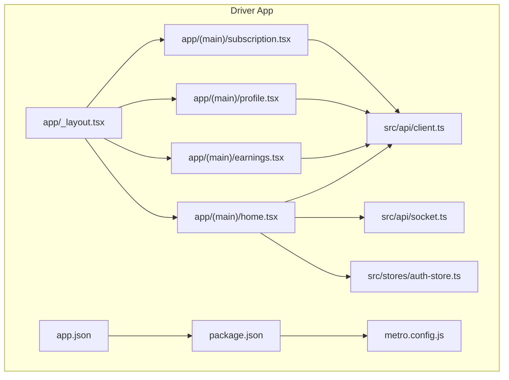
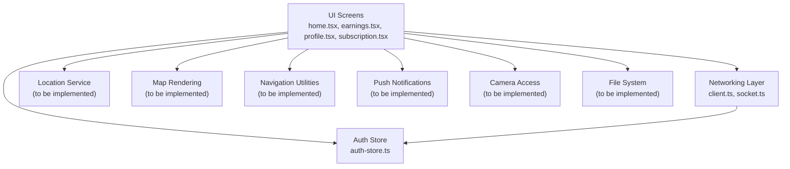
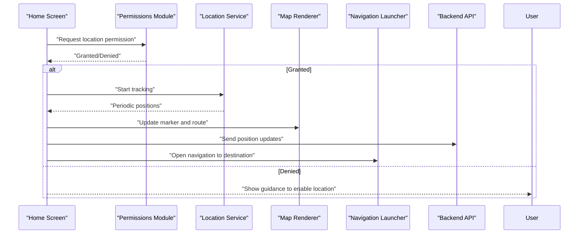
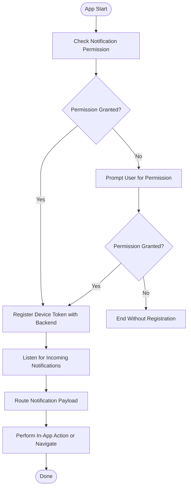
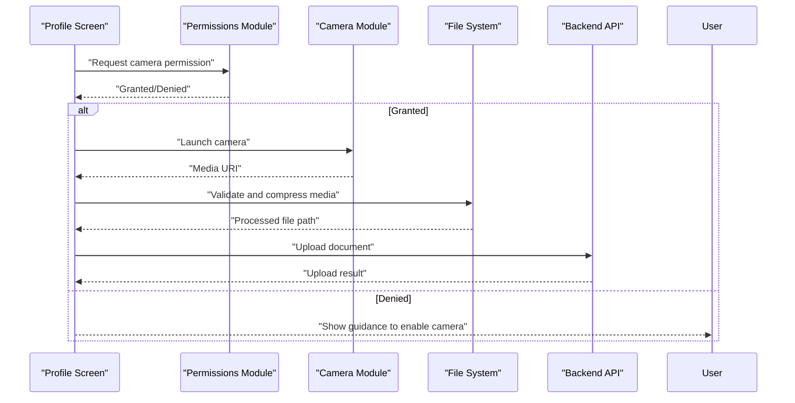
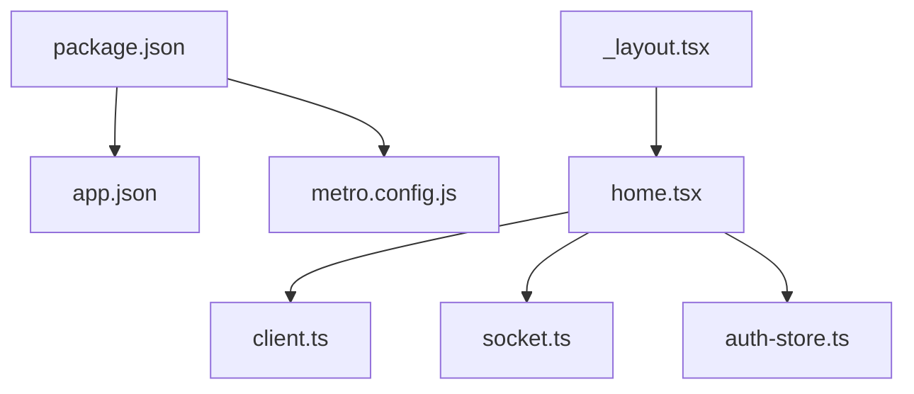

# Platform Integration & Native Features

<cite>
**Referenced Files in This Document**
- [app.json](file://apps/mobile-driver/app.json)
- [package.json](file://apps/mobile-driver/package.json)
- [metro.config.js](file://apps/mobile-driver/metro.config.js)
- [_layout.tsx](file://apps/mobile-driver/app/_layout.tsx)
- [home.tsx](file://apps/mobile-driver/app/(main)/home.tsx)
- [earnings.tsx](file://apps/mobile-driver/app/(main)/earnings.tsx)
- [profile.tsx](file://apps/mobile-driver/app/(main)/profile.tsx)
- [subscription.tsx](file://apps/mobile-driver/app/(main)/subscription.tsx)
- [client.ts](file://apps/mobile-driver/src/api/client.ts)
- [socket.ts](file://apps/mobile-driver/src/api/socket.ts)
- [auth-store.ts](file://apps/mobile-driver/src/stores/auth-store.ts)
</cite>

## Table of Contents
1. [Introduction](#introduction)
2. [Project Structure](#project-structure)
3. [Core Components](#core-components)
4. [Architecture Overview](#architecture-overview)
5. [Detailed Component Analysis](#detailed-component-analysis)
6. [Dependency Analysis](#dependency-analysis)
7. [Performance Considerations](#performance-considerations)
8. [Troubleshooting Guide](#troubleshooting-guide)
9. [Conclusion](#conclusion)
10. [Appendices](#appendices)

## Introduction
This document explains the Driver App’s platform-specific integrations and native feature implementations, focusing on:
- Location services for GPS tracking, map rendering, and navigation
- Push notifications setup for iOS and Android, including permissions and routing
- Camera access for document uploads, file system operations, and device capability detection
- Build configuration, platform optimizations, and deployment considerations for both stores
- Performance profiling, memory management, and battery optimization strategies for mobile drivers

The analysis is based on the current codebase structure and configuration files within the mobile driver app. Where specific native modules are not present in the repository, this document outlines recommended approaches and integration points to implement these features effectively.

## Project Structure
The Driver App is a React Native application using Expo (based on app.json). The key directories include:
- app/: Screen layouts and navigation entry points
- src/api/: HTTP client and WebSocket utilities
- src/stores/: State management for authentication
- Configuration files at the root of the app directory for build and bundling settings

**Diagram sources**
- [_layout.tsx](file://apps/mobile-driver/app/_layout.tsx)
- [home.tsx](file://apps/mobile-driver/app/(main)/home.tsx)
- [earnings.tsx](file://apps/mobile-driver/app/(main)/earnings.tsx)
- [profile.tsx](file://apps/mobile-driver/app/(main)/profile.tsx)
- [subscription.tsx](file://apps/mobile-driver/app/(main)/subscription.tsx)
- [client.ts](file://apps/mobile-driver/src/api/client.ts)
- [socket.ts](file://apps/mobile-driver/src/api/socket.ts)
- [auth-store.ts](file://apps/mobile-driver/src/stores/auth-store.ts)
- [app.json](file://apps/mobile-driver/app.json)
- [package.json](file://apps/mobile-driver/package.json)
- [metro.config.js](file://apps/mobile-driver/metro.config.js)

**Section sources**
- [app.json](file://apps/mobile-driver/app.json)
- [package.json](file://apps/mobile-driver/package.json)
- [metro.config.js](file://apps/mobile-driver/metro.config.js)
- [_layout.tsx](file://apps/mobile-driver/app/_layout.tsx)
- [home.tsx](file://apps/mobile-driver/app/(main)/home.tsx)
- [client.ts](file://apps/mobile-driver/src/api/client.ts)
- [socket.ts](file://apps/mobile-driver/src/api/socket.ts)
- [auth-store.ts](file://apps/mobile-driver/src/stores/auth-store.ts)

## Core Components
- Application shell and navigation layout:
  - Root layout defines global navigation and screen composition.
  - Main screens include home, earnings, profile, and subscription views.
- Networking layer:
  - HTTP client encapsulates API calls and headers.
  - Socket utility manages real-time connections for live updates.
- Authentication state:
  - Auth store persists tokens and user session across screens.

These components form the foundation upon which location, push notifications, camera, and file system integrations should be layered.

**Section sources**
- [_layout.tsx](file://apps/mobile-driver/app/_layout.tsx)
- [home.tsx](file://apps/mobile-driver/app/(main)/home.tsx)
- [earnings.tsx](file://apps/mobile-driver/app/(main)/earnings.tsx)
- [profile.tsx](file://apps/mobile-driver/app/(main)/profile.tsx)
- [subscription.tsx](file://apps/mobile-driver/app/(main)/subscription.tsx)
- [client.ts](file://apps/mobile-driver/src/api/client.ts)
- [socket.ts](file://apps/mobile-driver/src/api/socket.ts)
- [auth-store.ts](file://apps/mobile-driver/src/stores/auth-store.ts)

## Architecture Overview
The Driver App architecture separates UI screens from networking and state concerns. Integrations such as location services, push notifications, camera, and file system should be implemented as modular services invoked by the relevant screens.

[No sources needed since this diagram shows conceptual architecture, not actual code structure]

## Detailed Component Analysis

### Location Services Integration
Objective: Provide GPS tracking, map rendering, and turn-by-turn navigation capabilities for drivers.

Recommended implementation approach:
- Permissions:
  - Request foreground/background location permissions on first use.
  - Handle denied or restricted states gracefully with user guidance.
- Tracking:
  - Use a background task or headless service to keep tracking when the app is minimized.
  - Throttle updates to balance accuracy and battery usage.
- Map Rendering:
  - Integrate a map library compatible with Expo.
  - Render driver marker, route polyline, and nearby pickup/dropoff points.
- Navigation:
  - Launch external navigation apps (Google Maps, Apple Maps) via deep links.
  - Optionally provide in-app directions using the map provider’s SDK.

[No sources needed since this diagram shows conceptual workflow, not actual code structure]

Implementation notes:
- Add location-related dependencies to package.json and configure app.json for platform permissions.
- Create a dedicated location module that encapsulates permission checks, tracking lifecycle, and update throttling.
- Integrate map rendering in the home screen component.
- Use navigation launchers for external apps; ensure fallbacks if unavailable.

**Section sources**
- [package.json](file://apps/mobile-driver/package.json)
- [app.json](file://apps/mobile-driver/app.json)
- [home.tsx](file://apps/mobile-driver/app/(main)/home.tsx)

### Push Notification Setup (iOS and Android)
Objective: Deliver ride requests, status updates, and alerts to drivers with proper permission handling and routing.

Recommended implementation approach:
- Permissions:
  - Prompt users for notification permissions on first launch.
  - Respect platform differences (iOS requires explicit opt-in; Android may require channel configuration).
- Token Management:
  - Register device token with backend during login or on app start.
  - Refresh token on OS changes and re-register.
- Routing:
  - Parse payload to determine action (e.g., new ride request vs. ride status).
  - Route to appropriate screen or trigger in-app actions.
- Background Handling:
  - Configure background handlers for receiving notifications when app is terminated.

[No sources needed since this diagram shows conceptual workflow, not actual code structure]

Implementation notes:
- Add push notification libraries to package.json and configure app.json for iOS and Android.
- Implement a notification service module that handles registration, token refresh, and payload parsing.
- Ensure secure storage of tokens and sensitive data.

**Section sources**
- [package.json](file://apps/mobile-driver/package.json)
- [app.json](file://apps/mobile-driver/app.json)

### Camera Access and File System Operations
Objective: Enable document uploads (e.g., license, insurance), file browsing, and device capability detection.

Recommended implementation approach:
- Camera:
  - Request camera permission before launching camera picker.
  - Capture images or videos and compress before upload.
- File System:
  - Use a file system abstraction to read/write temporary and persistent storage.
  - Validate file types and sizes before processing.
- Capability Detection:
  - Detect device capabilities (camera presence, storage limits) to adapt UI and behavior.

[No sources needed since this diagram shows conceptual workflow, not actual code structure]

Implementation notes:
- Add camera and file system dependencies to package.json and configure app.json for permissions.
- Implement a media utility module to handle capture, validation, compression, and upload.
- Integrate capability detection to conditionally show features based on device support.

**Section sources**
- [package.json](file://apps/mobile-driver/package.json)
- [app.json](file://apps/mobile-driver/app.json)
- [profile.tsx](file://apps/mobile-driver/app/(main)/profile.tsx)

### Build Configuration and Platform Optimizations
Build and bundling configuration:
- app.json: Defines app metadata, versioning, and platform-specific settings.
- package.json: Lists dependencies and scripts for building and running the app.
- metro.config.js: Configures Metro bundler for performance and asset handling.

Optimization recommendations:
- Enable production builds with minification and tree-shaking.
- Configure platform-specific assets and native modules.
- Use environment variables for API endpoints and feature flags.

Deployment considerations:
- iOS:
  - Configure provisioning profiles and signing certificates.
  - Set up App Store Connect and adhere to review guidelines.
- Android:
  - Generate signed APK/AAB and configure Play Store listing.
  - Ensure compliance with privacy and security policies.

**Section sources**
- [app.json](file://apps/mobile-driver/app.json)
- [package.json](file://apps/mobile-driver/package.json)
- [metro.config.js](file://apps/mobile-driver/metro.config.js)

## Dependency Analysis
The Driver App depends on core networking and state management modules. Future integrations will add native modules for location, maps, notifications, camera, and file system.

**Diagram sources**
- [package.json](file://apps/mobile-driver/package.json)
- [app.json](file://apps/mobile-driver/app.json)
- [metro.config.js](file://apps/mobile-driver/metro.config.js)
- [_layout.tsx](file://apps/mobile-driver/app/_layout.tsx)
- [home.tsx](file://apps/mobile-driver/app/(main)/home.tsx)
- [client.ts](file://apps/mobile-driver/src/api/client.ts)
- [socket.ts](file://apps/mobile-driver/src/api/socket.ts)
- [auth-store.ts](file://apps/mobile-driver/src/stores/auth-store.ts)

**Section sources**
- [package.json](file://apps/mobile-driver/package.json)
- [app.json](file://apps/mobile-driver/app.json)
- [metro.config.js](file://apps/mobile-driver/metro.config.js)
- [_layout.tsx](file://apps/mobile-driver/app/_layout.tsx)
- [home.tsx](file://apps/mobile-driver/app/(main)/home.tsx)
- [client.ts](file://apps/mobile-driver/src/api/client.ts)
- [socket.ts](file://apps/mobile-driver/src/api/socket.ts)
- [auth-store.ts](file://apps/mobile-driver/src/stores/auth-store.ts)

## Performance Considerations
- Location tracking:
  - Throttle updates and use adaptive sampling based on speed and context.
  - Avoid excessive map redraws by batching updates.
- Network efficiency:
  - Cache responses where appropriate and use optimistic updates.
  - Implement retry logic with exponential backoff for transient failures.
- Memory management:
  - Unsubscribe from listeners and cancel tasks on screen unmount.
  - Avoid large object retention in state; prefer references and lazy loading.
- Battery optimization:
  - Reduce background work frequency and leverage OS-provided background modes.
  - Disable high-frequency updates when the app is inactive.

[No sources needed since this section provides general guidance]

## Troubleshooting Guide
Common issues and resolutions:
- Location permission denied:
  - Verify permission prompts and guide users to system settings.
  - Test on devices with different OS versions and configurations.
- Push notification failures:
  - Confirm token registration and backend mapping.
  - Check platform-specific configurations (APNs for iOS, FCM for Android).
- Camera access errors:
  - Ensure camera permission is granted and device supports required features.
  - Validate file paths and storage availability.
- Build and deployment problems:
  - Review app.json and platform-specific signing configurations.
  - Inspect Metro bundler logs for asset resolution issues.

**Section sources**
- [app.json](file://apps/mobile-driver/app.json)
- [package.json](file://apps/mobile-driver/package.json)
- [metro.config.js](file://apps/mobile-driver/metro.config.js)

## Conclusion
The Driver App provides a solid foundation with clear separation between UI, networking, and state. To deliver a robust driver experience, integrate location services, push notifications, camera access, and file system operations as modular services. Follow the recommended implementation patterns, optimize for performance and battery life, and adhere to platform-specific build and deployment requirements.

[No sources needed since this section summarizes without analyzing specific files]

## Appendices
- Recommended libraries and tools:
  - Location and maps: Choose an Expo-compatible solution.
  - Push notifications: Use platform-native providers through Expo or custom modules.
  - Camera and file system: Select well-maintained packages with strong community support.
- Security best practices:
  - Securely store tokens and sensitive data.
  - Validate all inputs and sanitize outputs.
- Testing strategy:
  - Unit tests for utilities and services.
  - Integration tests for network flows and native module interactions.
  - Device testing across iOS and Android versions.

[No sources needed since this section provides general guidance]