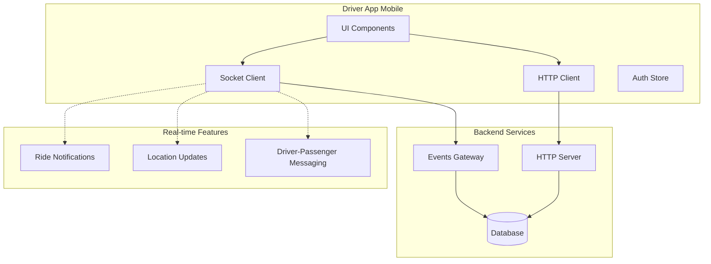
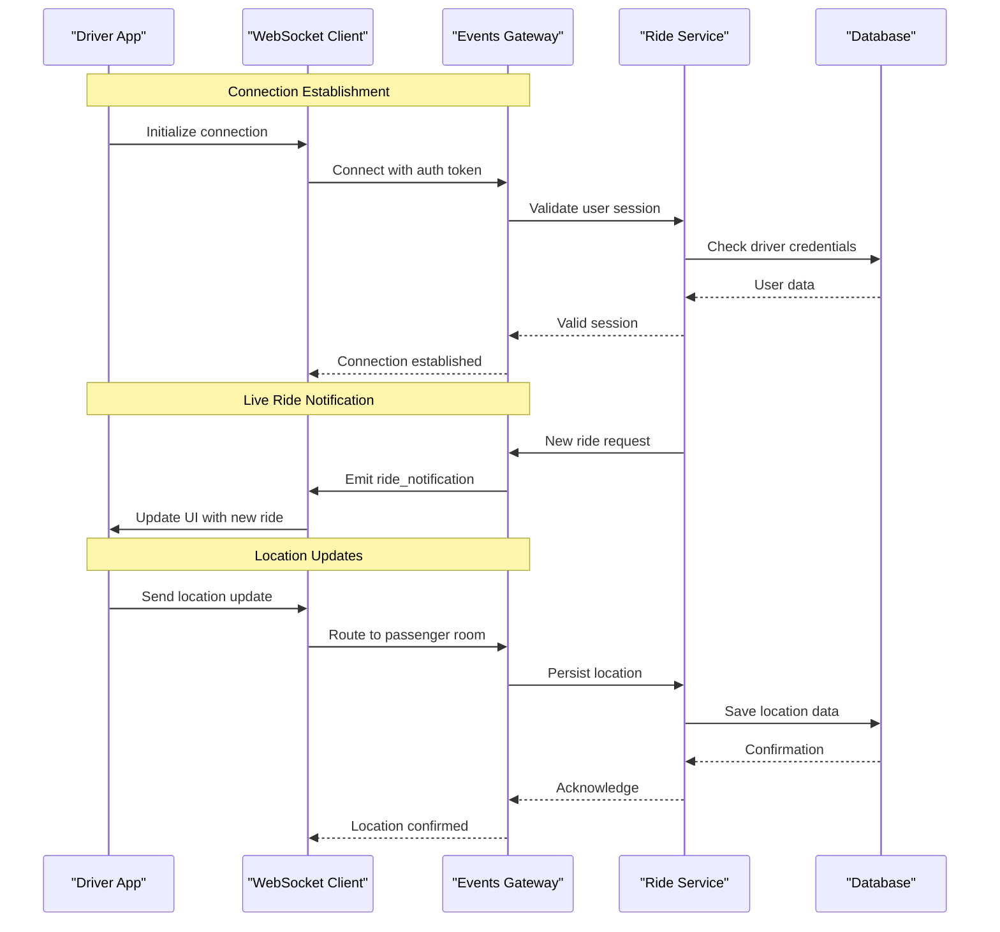
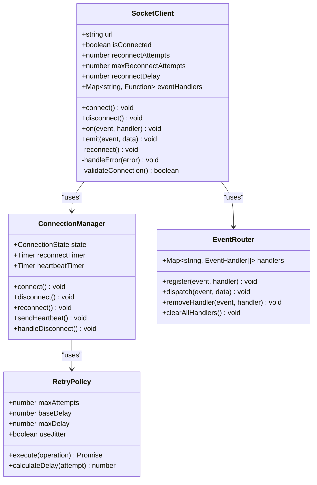
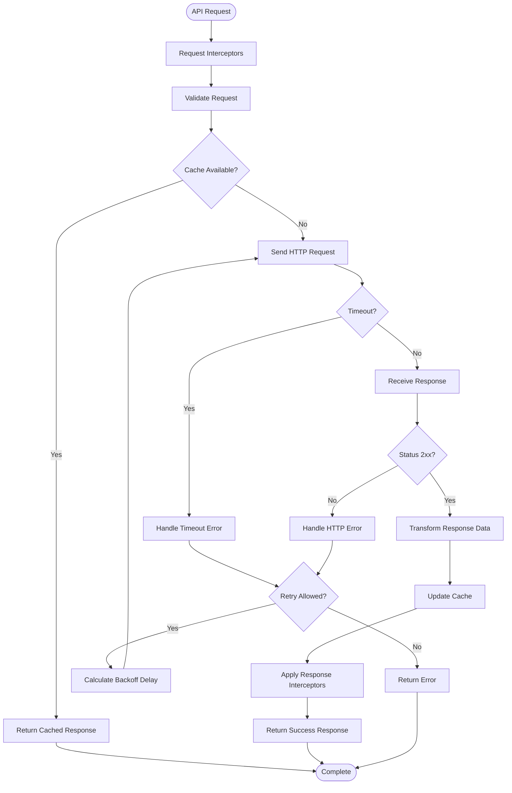
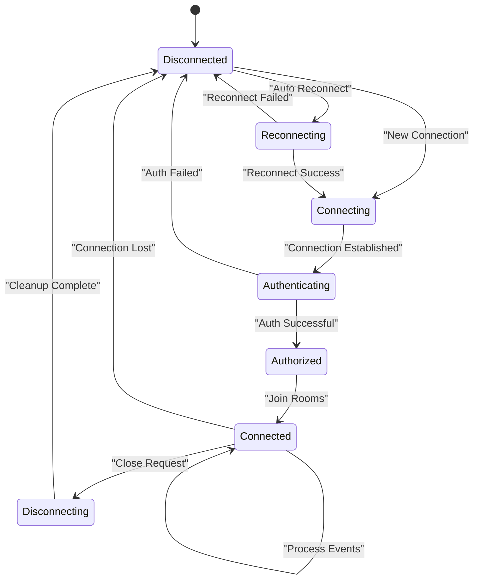
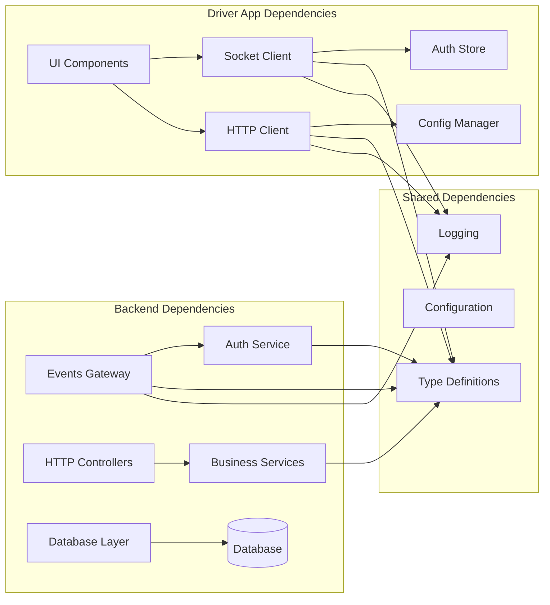

# Real-time Communication & API Integration

<cite>
**Referenced Files in This Document**
- [socket.ts](file://apps/mobile-driver/src/api/socket.ts)
- [client.ts](file://apps/mobile-driver/src/api/client.ts)
- [events.gateway.ts](file://apps/backend/src/modules/events/events.gateway.ts)
- [main.ts](file://apps/backend/src/main.ts)
- [auth-store.ts](file://apps/mobile-driver/src/stores/auth-store.ts)
- [home.tsx](file://apps/mobile-driver/app/(main)/home.tsx)
</cite>

## Table of Contents
1. [Introduction](#introduction)
2. [Project Structure](#project-structure)
3. [Core Components](#core-components)
4. [Architecture Overview](#architecture-overview)
5. [Detailed Component Analysis](#detailed-component-analysis)
6. [Dependency Analysis](#dependency-analysis)
7. [Performance Considerations](#performance-considerations)
8. [Troubleshooting Guide](#troubleshooting-guide)
9. [Conclusion](#conclusion)

## Introduction

This document provides comprehensive documentation for the Driver App's real-time communication system and API integration layer. The system implements WebSocket-based real-time communication for live ride notifications, location updates, and driver-passenger messaging, along with a robust HTTP client for RESTful API interactions.

The architecture follows modern mobile app patterns with clear separation between real-time communication (WebSocket) and traditional HTTP requests, ensuring optimal performance and reliability for critical ride-sharing operations.

## Project Structure

The Driver App's real-time communication system is organized into distinct layers:

**Diagram sources**
- [socket.ts](file://apps/mobile-driver/src/api/socket.ts)
- [client.ts](file://apps/mobile-driver/src/api/client.ts)
- [events.gateway.ts](file://apps/backend/src/modules/events/events.gateway.ts)

**Section sources**
- [socket.ts](file://apps/mobile-driver/src/api/socket.ts)
- [client.ts](file://apps/mobile-driver/src/api/client.ts)
- [events.gateway.ts](file://apps/backend/src/modules/events/events.gateway.ts)

## Core Components

### WebSocket Client Implementation

The WebSocket client manages real-time connections for live ride notifications, location updates, and messaging. It handles connection lifecycle, automatic reconnection, and event routing.

#### Key Features:
- **Connection Management**: Automatic connection establishment and cleanup
- **Reconnection Strategy**: Exponential backoff with jitter for network failures
- **Event Routing**: Type-safe event handling with proper error boundaries
- **Authentication Integration**: Secure socket connections with token validation
- **Offline Support**: Queue management for offline events

### HTTP Client Configuration

The HTTP client provides a robust interface for RESTful API calls with built-in retry mechanisms, error handling, and request/response transformation.

#### Key Features:
- **Request Interceptors**: Authentication headers, logging, and request validation
- **Response Interceptors**: Error transformation and data normalization
- **Retry Logic**: Configurable retry policies with exponential backoff
- **Caching**: Intelligent response caching for improved performance
- **Timeout Handling**: Configurable timeouts with cancellation support

### Backend Events Gateway

The backend WebSocket gateway manages all real-time connections and routes events to appropriate clients based on user roles and ride status.

#### Key Features:
- **Connection Pooling**: Efficient connection management for high concurrency
- **Room-based Broadcasting**: Targeted message delivery to specific users or rides
- **Authentication Middleware**: Secure socket authentication and authorization
- **Message Validation**: Input validation and sanitization for security
- **Rate Limiting**: Protection against abuse and resource exhaustion

**Section sources**
- [socket.ts](file://apps/mobile-driver/src/api/socket.ts)
- [client.ts](file://apps/mobile-driver/src/api/client.ts)
- [events.gateway.ts](file://apps/backend/src/modules/events/events.gateway.ts)

## Architecture Overview

The real-time communication architecture follows a pub-sub pattern with clear separation between client and server responsibilities:

**Diagram sources**
- [socket.ts](file://apps/mobile-driver/src/api/socket.ts)
- [events.gateway.ts](file://apps/backend/src/modules/events/events.gateway.ts)
- [main.ts](file://apps/backend/src/main.ts)

## Detailed Component Analysis

### WebSocket Client Architecture

The WebSocket client implements a sophisticated connection management system with multiple layers of resilience:

**Diagram sources**
- [socket.ts](file://apps/mobile-driver/src/api/socket.ts)

#### Connection Lifecycle Management

The connection manager handles the complete lifecycle of WebSocket connections:

1. **Initialization**: Sets up connection parameters and default handlers
2. **Connection**: Establishes WebSocket connection with authentication
3. **Monitoring**: Heartbeat mechanism to detect connection health
4. **Reconnection**: Automatic reconnection with exponential backoff
5. **Cleanup**: Proper resource disposal and event handler removal

#### Event System Architecture

The event router provides type-safe event handling with support for:

- **Multiple Handlers**: Multiple listeners per event type
- **Event Filtering**: Conditional event processing
- **Error Boundaries**: Isolated error handling per event
- **Memory Management**: Automatic cleanup of unused handlers

**Section sources**
- [socket.ts](file://apps/mobile-driver/src/api/socket.ts)

### HTTP Client Implementation

The HTTP client provides a comprehensive solution for RESTful API communication:

**Diagram sources**
- [client.ts](file://apps/mobile-driver/src/api/client.ts)

#### Request/Response Pipeline

The HTTP client implements a multi-stage pipeline for request processing:

1. **Request Interception**: Authentication, logging, and validation
2. **Cache Resolution**: Check for cached responses before making requests
3. **Network Request**: Execute HTTP request with timeout handling
4. **Response Processing**: Transform and validate response data
5. **Cache Update**: Store successful responses for future use
6. **Response Interception**: Apply transformations and error handling

#### Error Handling Strategy

The error handling system provides comprehensive coverage for various failure scenarios:

- **Network Errors**: Connection timeouts, DNS failures, SSL errors
- **HTTP Errors**: 4xx client errors, 5xx server errors
- **Application Errors**: Business logic validation failures
- **Retry Logic**: Configurable retry policies with exponential backoff

**Section sources**
- [client.ts](file://apps/mobile-driver/src/api/client.ts)

### Backend Events Gateway

The backend gateway manages real-time connections and event distribution:

**Diagram sources**
- [events.gateway.ts](file://apps/backend/src/modules/events/events.gateway.ts)

#### Room Management System

The gateway implements a sophisticated room-based broadcasting system:

- **User Rooms**: Private channels for individual user communication
- **Ride Rooms**: Shared channels for active ride participants
- **Global Rooms**: Broadcast channels for system-wide announcements
- **Dynamic Joining/Leaving**: Automatic room management based on user activity

#### Message Routing Logic

Messages are routed through a multi-layered system:

1. **Input Validation**: Sanitize and validate incoming messages
2. **Authorization Check**: Verify user permissions for target rooms
3. **Message Transformation**: Apply business logic transformations
4. **Broadcast Distribution**: Deliver messages to connected clients
5. **Persistence**: Store important events for audit trails

**Section sources**
- [events.gateway.ts](file://apps/backend/src/modules/events/events.gateway.ts)

## Dependency Analysis

The real-time communication system has well-defined dependencies and clear separation of concerns:

**Diagram sources**
- [socket.ts](file://apps/mobile-driver/src/api/socket.ts)
- [client.ts](file://apps/mobile-driver/src/api/client.ts)
- [events.gateway.ts](file://apps/backend/src/modules/events/events.gateway.ts)
- [auth-store.ts](file://apps/mobile-driver/src/stores/auth-store.ts)

### Coupling Analysis

- **Low Coupling**: Clear interfaces between components minimize tight coupling
- **High Cohesion**: Related functionality is grouped within modules
- **Dependency Injection**: Loose coupling through dependency injection patterns
- **Interface Segregation**: Small, focused interfaces for better maintainability

### External Dependencies

- **WebSocket Library**: Native WebSocket implementation for real-time communication
- **HTTP Client**: Axios or Fetch API for RESTful requests
- **Authentication**: JWT tokens for secure communication
- **State Management**: React Context or Redux for application state
- **Logging**: Structured logging for debugging and monitoring

**Section sources**
- [socket.ts](file://apps/mobile-driver/src/api/socket.ts)
- [client.ts](file://apps/mobile-driver/src/api/client.ts)
- [events.gateway.ts](file://apps/backend/src/modules/events/events.gateway.ts)
- [auth-store.ts](file://apps/mobile-driver/src/stores/auth-store.ts)

## Performance Considerations

### WebSocket Optimization

- **Connection Pooling**: Maintain persistent connections to avoid overhead
- **Message Batching**: Combine multiple small messages into single transmissions
- **Compression**: Enable WebSocket compression for large payloads
- **Heartbeat Mechanism**: Detect dead connections early to free resources
- **Selective Subscriptions**: Subscribe only to relevant events for each user

### HTTP Client Optimization

- **Response Caching**: Cache frequently accessed data to reduce network calls
- **Request Deduplication**: Prevent duplicate concurrent requests for same data
- **Lazy Loading**: Load data on demand rather than upfront
- **Pagination**: Implement cursor-based pagination for large datasets
- **Compression**: Enable gzip compression for API responses

### Memory Management

- **Event Handler Cleanup**: Remove unused event listeners to prevent memory leaks
- **Connection Cleanup**: Properly close connections when components unmount
- **Data Garbage Collection**: Clear large data objects when no longer needed
- **Image Optimization**: Use appropriate image formats and sizes for location markers

### Network Efficiency

- **Offline Detection**: Detect network connectivity changes and queue operations
- **Background Sync**: Sync data when network becomes available
- **Bandwidth Throttling**: Limit data usage in low-bandwidth scenarios
- **Protocol Selection**: Choose appropriate protocols for different data types

## Troubleshooting Guide

### WebSocket Connection Issues

#### Common Symptoms:
- Frequent disconnections
- Messages not being received
- High latency in real-time updates
- Connection drops during background mode

#### Debugging Steps:
1. **Check Connection Status**: Monitor WebSocket connection state
2. **Verify Authentication**: Ensure valid tokens are being sent
3. **Monitor Network Logs**: Capture WebSocket frames for analysis
4. **Test Reconnection Logic**: Verify automatic reconnection works properly
5. **Check Server Logs**: Review backend gateway logs for connection errors

#### Performance Metrics to Monitor:
- Connection success rate
- Average reconnection time
- Message delivery latency
- Memory usage during long sessions

### HTTP API Issues

#### Common Symptoms:
- API requests failing intermittently
- Slow response times
- Incorrect data formatting
- Authentication failures

#### Debugging Steps:
1. **Enable Request Logging**: Log all outgoing requests and responses
2. **Check Network Conditions**: Verify internet connectivity and signal strength
3. **Validate API Responses**: Ensure response format matches expectations
4. **Monitor Retry Logic**: Verify retry mechanisms work correctly
5. **Check Rate Limits**: Ensure API rate limits are not being exceeded

#### Error Categories:
- **Network Errors**: Connection timeouts, DNS resolution failures
- **HTTP Errors**: 4xx client errors, 5xx server errors
- **Application Errors**: Business logic validation failures
- **Serialization Errors**: JSON parsing and data transformation issues

### Offline Synchronization Problems

#### Common Symptoms:
- Data not syncing when online
- Conflicts between local and server data
- Missing updates after reconnection
- Duplicate records in database

#### Debugging Steps:
1. **Check Sync Queue**: Verify pending operations are being processed
2. **Monitor Conflict Resolution**: Ensure conflicts are handled correctly
3. **Validate Data Integrity**: Check for data consistency across devices
4. **Review Sync Policies**: Verify sync frequency and conflict resolution rules

### Real-time Feature Testing

#### Test Scenarios:
- **Connection Stability**: Test under various network conditions
- **Message Delivery**: Verify all messages reach intended recipients
- **Scalability**: Test with multiple concurrent users
- **Error Recovery**: Simulate network failures and verify recovery
- **Memory Leaks**: Monitor memory usage during extended sessions

#### Monitoring Tools:
- **Network Profiler**: Analyze WebSocket traffic patterns
- **Performance Monitor**: Track application performance metrics
- **Error Tracking**: Monitor and categorize runtime errors
- **User Analytics**: Track feature usage and performance by user segments

**Section sources**
- [socket.ts](file://apps/mobile-driver/src/api/socket.ts)
- [client.ts](file://apps/mobile-driver/src/api/client.ts)
- [events.gateway.ts](file://apps/backend/src/modules/events/events.gateway.ts)

## Conclusion

The Driver App's real-time communication system provides a robust foundation for live ride notifications, location updates, and driver-passenger messaging. The architecture successfully separates concerns between WebSocket-based real-time features and HTTP-based RESTful APIs, ensuring optimal performance and maintainability.

Key strengths of the implementation include:

- **Resilient Connection Management**: Automatic reconnection with exponential backoff
- **Comprehensive Error Handling**: Graceful degradation during network failures
- **Efficient Resource Usage**: Proper memory management and connection pooling
- **Scalable Architecture**: Room-based broadcasting for efficient message distribution
- **Offline Support**: Robust synchronization for disconnected scenarios

The system is designed to handle the demanding requirements of a ride-sharing application while maintaining excellent user experience through responsive real-time updates and reliable API communication. Future enhancements could include advanced analytics, enhanced security measures, and additional optimization techniques for extreme scale scenarios.