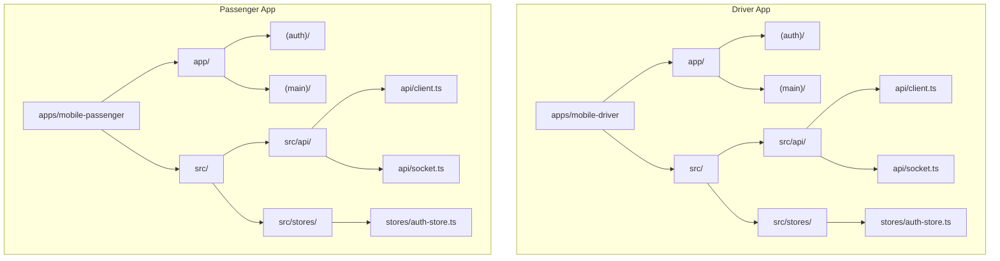
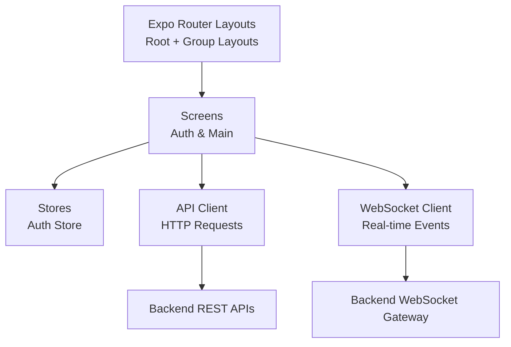
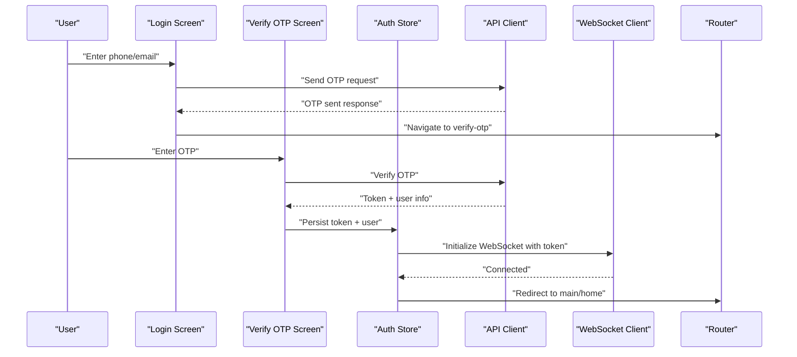
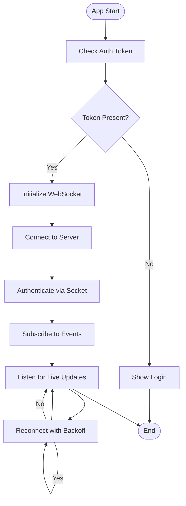
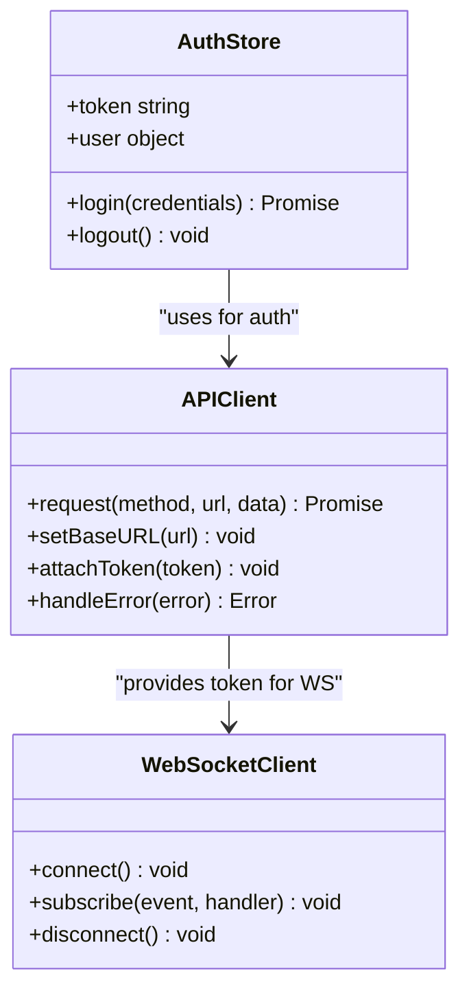
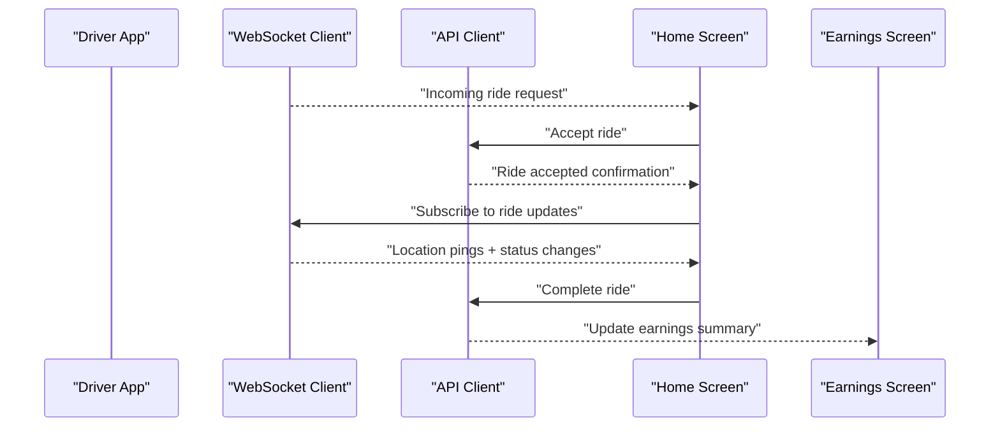
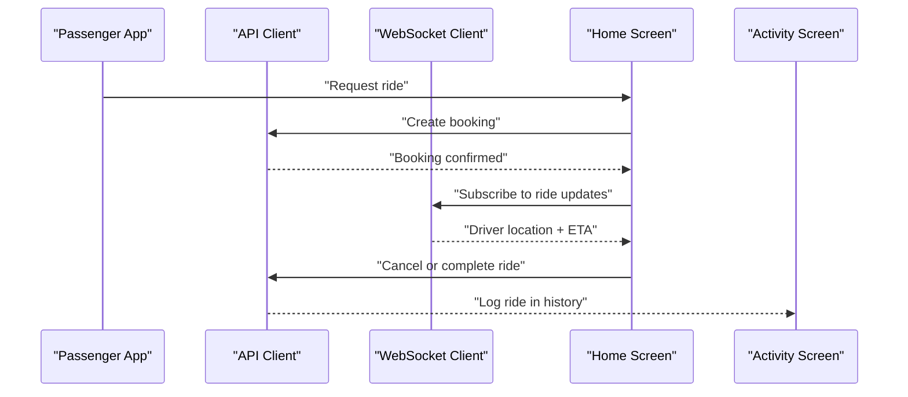
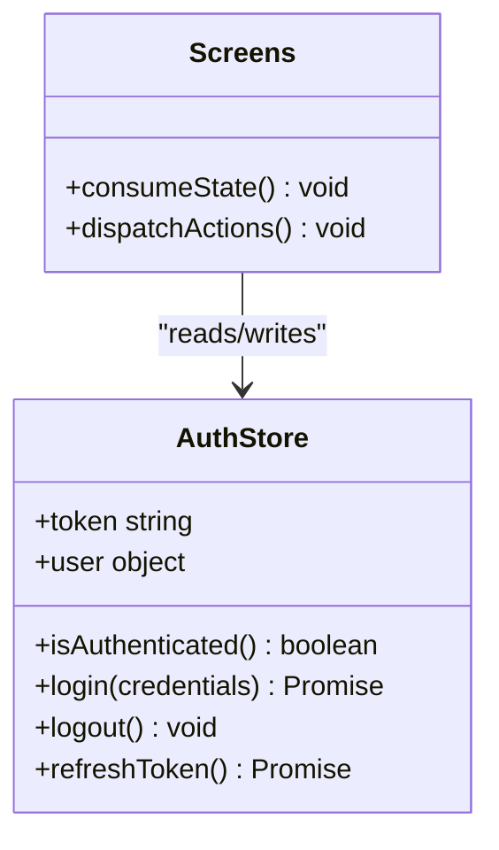
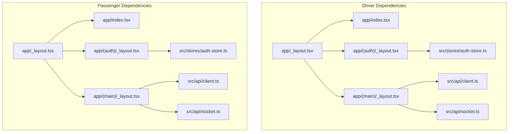

# Mobile Applications

<cite>
**Referenced Files in This Document**
- [apps/mobile-driver/app.json](file://apps/mobile-driver/app.json)
- [apps/mobile-driver/package.json](file://apps/mobile-driver/package.json)
- [apps/mobile-driver/metro.config.js](file://apps/mobile-driver/metro.config.js)
- [apps/mobile-driver/tsconfig.json](file://apps/mobile-driver/tsconfig.json)
- [apps/mobile-driver/src/api/client.ts](file://apps/mobile-driver/src/api/client.ts)
- [apps/mobile-driver/src/api/socket.ts](file://apps/mobile-driver/src/api/socket.ts)
- [apps/mobile-driver/src/stores/auth-store.ts](file://apps/mobile-driver/src/stores/auth-store.ts)
- [apps/mobile-driver/app/_layout.tsx](file://apps/mobile-driver/app/_layout.tsx)
- [apps/mobile-driver/app/index.tsx](file://apps/mobile-driver/app/index.tsx)
- [apps/mobile-driver/app/(auth)/_layout.tsx](file://apps/mobile-driver/app/(auth)/_layout.tsx)
- [apps/mobile-driver/app/(auth)/login.tsx](file://apps/mobile-driver/app/(auth)/login.tsx)
- [apps/mobile-driver/app/(auth)/verify-otp.tsx](file://apps/mobile-driver/app/(auth)/verify-otp.tsx)
- [apps/mobile-driver/app/(main)/_layout.tsx](file://apps/mobile-driver/app/(main)/_layout.tsx)
- [apps/mobile-driver/app/(main)/home.tsx](file://apps/mobile-driver/app/(main)/home.tsx)
- [apps/mobile-driver/app/(main)/earnings.tsx](file://apps/mobile-driver/app/(main)/earnings.tsx)
- [apps/mobile-driver/app/(main)/profile.tsx](file://apps/mobile-driver/app/(main)/profile.tsx)
- [apps/mobile-driver/app/(main)/subscription.tsx](file://apps/mobile-driver/app/(main)/subscription.tsx)
- [apps/mobile-passenger/app.json](file://apps/mobile-passenger/app.json)
- [apps/mobile-passenger/package.json](file://apps/mobile-passenger/package.json)
- [apps/mobile-passenger/metro.config.js](file://apps/mobile-passenger/metro.config.js)
- [apps/mobile-passenger/tsconfig.json](file://apps/mobile-passenger/tsconfig.json)
- [apps/mobile-passenger/src/api/client.ts](file://apps/mobile-passenger/src/api/client.ts)
- [apps/mobile-passenger/src/api/socket.ts](file://apps/mobile-passenger/src/api/socket.ts)
- [apps/mobile-passenger/src/stores/auth-store.ts](file://apps/mobile-passenger/src/stores/auth-store.ts)
- [apps/mobile-passenger/app/_layout.tsx](file://apps/mobile-passenger/app/_layout.tsx)
- [apps/mobile-passenger/app/index.tsx](file://apps/mobile-passenger/app/index.tsx)
- [apps/mobile-passenger/app/(auth)/_layout.tsx](file://apps/mobile-passenger/app/(auth)/_layout.tsx)
- [apps/mobile-passenger/app/(auth)/login.tsx](file://apps/mobile-passenger/app/(auth)/login.tsx)
- [apps/mobile-passenger/app/(auth)/verify-otp.tsx](file://apps/mobile-passenger/app/(auth)/verify-otp.tsx)
- [apps/mobile-passenger/app/(main)/_layout.tsx](file://apps/mobile-passenger/app/(main)/_layout.tsx)
- [apps/mobile-passenger/app/(main)/home.tsx](file://apps/mobile-passenger/app/(main)/home.tsx)
- [apps/mobile-passenger/app/(main)/activity.tsx](file://apps/mobile-passenger/app/(main)/activity.tsx)
- [apps/mobile-passenger/app/(main)/profile.tsx](file://apps/mobile-passenger/app/(main)/profile.tsx)
</cite>

## Table of Contents
1. [Introduction](#introduction)
2. [Project Structure](#project-structure)
3. [Core Components](#core-components)
4. [Architecture Overview](#architecture-overview)
5. [Detailed Component Analysis](#detailed-component-analysis)
6. [Dependency Analysis](#dependency-analysis)
7. [Performance Considerations](#performance-considerations)
8. [Troubleshooting Guide](#troubleshooting-guide)
9. [Conclusion](#conclusion)
10. [Appendices](#appendices)

## Introduction
This document provides comprehensive documentation for the two mobile applications built with React Native and Expo: the Driver app and the Passenger app. It explains shared architecture patterns, authentication flows, real-time communication via WebSockets, state management, API client configuration, and platform-specific considerations such as push notifications and offline support. It also outlines driver features (ride acceptance, earnings tracking, navigation integration) and passenger features (ride booking, real-time tracking, activity history), along with guidelines for extending features and maintaining code consistency across both apps.

## Project Structure
Both mobile apps follow a consistent structure using Expo Router for file-based routing and a src directory for shared application logic. Each app includes:
- App entry points and layout files under app/
- Feature screens grouped by route groups (auth and main)
- Shared infrastructure under src/, including an API client, WebSocket client, and stores for global state

**Diagram sources**
- [apps/mobile-driver/app/_layout.tsx](file://apps/mobile-driver/app/_layout.tsx)
- [apps/mobile-driver/app/(auth)/_layout.tsx](file://apps/mobile-driver/app/(auth)/_layout.tsx)
- [apps/mobile-driver/app/(main)/_layout.tsx](file://apps/mobile-driver/app/(main)/_layout.tsx)
- [apps/mobile-driver/src/api/client.ts](file://apps/mobile-driver/src/api/client.ts)
- [apps/mobile-driver/src/api/socket.ts](file://apps/mobile-driver/src/api/socket.ts)
- [apps/mobile-driver/src/stores/auth-store.ts](file://apps/mobile-driver/src/stores/auth-store.ts)
- [apps/mobile-passenger/app/_layout.tsx](file://apps/mobile-passenger/app/_layout.tsx)
- [apps/mobile-passenger/app/(auth)/_layout.tsx](file://apps/mobile-passenger/app/(auth)/_layout.tsx)
- [apps/mobile-passenger/app/(main)/_layout.tsx](file://apps/mobile-passenger/app/(main)/_layout.tsx)
- [apps/mobile-passenger/src/api/client.ts](file://apps/mobile-passenger/src/api/client.ts)
- [apps/mobile-passenger/src/api/socket.ts](file://apps/mobile-passenger/src/api/socket.ts)
- [apps/mobile-passenger/src/stores/auth-store.ts](file://apps/mobile-passenger/src/stores/auth-store.ts)

**Section sources**
- [apps/mobile-driver/app.json](file://apps/mobile-driver/app.json)
- [apps/mobile-driver/package.json](file://apps/mobile-driver/package.json)
- [apps/mobile-driver/metro.config.js](file://apps/mobile-driver/metro.config.js)
- [apps/mobile-driver/tsconfig.json](file://apps/mobile-driver/tsconfig.json)
- [apps/mobile-passenger/app.json](file://apps/mobile-passenger/app.json)
- [apps/mobile-passenger/package.json](file://apps/mobile-passenger/package.json)
- [apps/mobile-passenger/metro.config.js](file://apps/mobile-passenger/metro.config.js)
- [apps/mobile-passenger/tsconfig.json](file://apps/mobile-passenger/tsconfig.json)

## Core Components
The core components common to both apps include:
- API Client: Centralized HTTP client for REST calls, handling base URL, headers, and error normalization.
- WebSocket Client: Manages connection lifecycle, event subscriptions, reconnection, and message dispatching.
- Auth Store: Global state for authentication tokens, user profile, and login/logout actions.
- Routing Layouts: Root and group layouts that enforce navigation guards and provide shared UI context.

Key responsibilities:
- API client encapsulates request/response transformations and token injection.
- WebSocket client abstracts socket events and ensures resilient connectivity.
- Auth store persists session data and exposes reactive state to screens.
- Layouts coordinate initial auth checks and route protection.

**Section sources**
- [apps/mobile-driver/src/api/client.ts](file://apps/mobile-driver/src/api/client.ts)
- [apps/mobile-driver/src/api/socket.ts](file://apps/mobile-driver/src/api/socket.ts)
- [apps/mobile-driver/src/stores/auth-store.ts](file://apps/mobile-driver/src/stores/auth-store.ts)
- [apps/mobile-passenger/src/api/client.ts](file://apps/mobile-passenger/src/api/client.ts)
- [apps/mobile-passenger/src/api/socket.ts](file://apps/mobile-passenger/src/api/socket.ts)
- [apps/mobile-passenger/src/stores/auth-store.ts](file://apps/mobile-passenger/src/stores/auth-store.ts)

## Architecture Overview
The mobile apps share a consistent architecture pattern:
- Presentation layer: Screens organized by route groups (auth and main).
- State layer: Stores manage global state and side effects.
- Integration layer: API client and WebSocket client handle external communication.
- Navigation layer: Expo Router layouts orchestrate transitions and guards.

[No sources needed since this diagram shows conceptual workflow, not actual code structure]

## Detailed Component Analysis

### Authentication Flow
Both apps implement OTP-based authentication with login and verification screens. The flow is protected by layout-level guards that redirect unauthenticated users to the auth group.

**Diagram sources**
- [apps/mobile-driver/app/(auth)/login.tsx](file://apps/mobile-driver/app/(auth)/login.tsx)
- [apps/mobile-driver/app/(auth)/verify-otp.tsx](file://apps/mobile-driver/app/(auth)/verify-otp.tsx)
- [apps/mobile-driver/src/stores/auth-store.ts](file://apps/mobile-driver/src/stores/auth-store.ts)
- [apps/mobile-driver/src/api/client.ts](file://apps/mobile-driver/src/api/client.ts)
- [apps/mobile-driver/src/api/socket.ts](file://apps/mobile-driver/src/api/socket.ts)
- [apps/mobile-passenger/app/(auth)/login.tsx](file://apps/mobile-passenger/app/(auth)/login.tsx)
- [apps/mobile-passenger/app/(auth)/verify-otp.tsx](file://apps/mobile-passenger/app/(auth)/verify-otp.tsx)
- [apps/mobile-passenger/src/stores/auth-store.ts](file://apps/mobile-passenger/src/stores/auth-store.ts)
- [apps/mobile-passenger/src/api/client.ts](file://apps/mobile-passenger/src/api/client.ts)
- [apps/mobile-passenger/src/api/socket.ts](file://apps/mobile-passenger/src/api/socket.ts)

**Section sources**
- [apps/mobile-driver/app/(auth)/_layout.tsx](file://apps/mobile-driver/app/(auth)/_layout.tsx)
- [apps/mobile-passenger/app/(auth)/_layout.tsx](file://apps/mobile-passenger/app/(auth)/_layout.tsx)

### Real-time Communication (WebSocket)
The WebSocket client manages connection setup, authentication handshake, event subscriptions, and reconnection strategies. Both apps initialize the socket after successful authentication and use it for live updates such as ride status changes and location pings.

**Diagram sources**
- [apps/mobile-driver/src/api/socket.ts](file://apps/mobile-driver/src/api/socket.ts)
- [apps/mobile-passenger/src/api/socket.ts](file://apps/mobile-passenger/src/api/socket.ts)

**Section sources**
- [apps/mobile-driver/src/api/socket.ts](file://apps/mobile-driver/src/api/socket.ts)
- [apps/mobile-passenger/src/api/socket.ts](file://apps/mobile-passenger/src/api/socket.ts)

### API Client Configuration
The API client centralizes HTTP requests, handles token injection, and normalizes errors. It is used by screens and stores to interact with backend REST endpoints.

**Diagram sources**
- [apps/mobile-driver/src/api/client.ts](file://apps/mobile-driver/src/api/client.ts)
- [apps/mobile-driver/src/stores/auth-store.ts](file://apps/mobile-driver/src/stores/auth-store.ts)
- [apps/mobile-driver/src/api/socket.ts](file://apps/mobile-driver/src/api/socket.ts)
- [apps/mobile-passenger/src/api/client.ts](file://apps/mobile-passenger/src/api/client.ts)
- [apps/mobile-passenger/src/stores/auth-store.ts](file://apps/mobile-passenger/src/stores/auth-store.ts)
- [apps/mobile-passenger/src/api/socket.ts](file://apps/mobile-passenger/src/api/socket.ts)

**Section sources**
- [apps/mobile-driver/src/api/client.ts](file://apps/mobile-driver/src/api/client.ts)
- [apps/mobile-passenger/src/api/client.ts](file://apps/mobile-passenger/src/api/client.ts)

### Driver App Features
- Ride Acceptance: Drivers receive incoming ride requests via WebSocket events and can accept or decline through dedicated screens.
- Earnings Tracking: The earnings screen aggregates completed rides and displays summaries over time.
- Navigation Integration: The home screen integrates map navigation to guide drivers to pickup and drop-off locations.

**Diagram sources**
- [apps/mobile-driver/app/(main)/home.tsx](file://apps/mobile-driver/app/(main)/home.tsx)
- [apps/mobile-driver/app/(main)/earnings.tsx](file://apps/mobile-driver/app/(main)/earnings.tsx)
- [apps/mobile-driver/src/api/socket.ts](file://apps/mobile-driver/src/api/socket.ts)
- [apps/mobile-driver/src/api/client.ts](file://apps/mobile-driver/src/api/client.ts)

**Section sources**
- [apps/mobile-driver/app/(main)/home.tsx](file://apps/mobile-driver/app/(main)/home.tsx)
- [apps/mobile-driver/app/(main)/earnings.tsx](file://apps/mobile-driver/app/(main)/earnings.tsx)
- [apps/mobile-driver/app/(main)/profile.tsx](file://apps/mobile-driver/app/(main)/profile.tsx)
- [apps/mobile-driver/app/(main)/subscription.tsx](file://apps/mobile-driver/app/(main)/subscription.tsx)

### Passenger App Features
- Ride Booking: Passengers initiate bookings from the home screen, selecting pickup and destination.
- Real-time Tracking: The app tracks driver location and ride progress via WebSocket events.
- Activity History: The activity screen lists past rides with details and statuses.

**Diagram sources**
- [apps/mobile-passenger/app/(main)/home.tsx](file://apps/mobile-passenger/app/(main)/home.tsx)
- [apps/mobile-passenger/app/(main)/activity.tsx](file://apps/mobile-passenger/app/(main)/activity.tsx)
- [apps/mobile-passenger/src/api/socket.ts](file://apps/mobile-passenger/src/api/socket.ts)
- [apps/mobile-passenger/src/api/client.ts](file://apps/mobile-passenger/src/api/client.ts)

**Section sources**
- [apps/mobile-passenger/app/(main)/home.tsx](file://apps/mobile-passenger/app/(main)/home.tsx)
- [apps/mobile-passenger/app/(main)/activity.tsx](file://apps/mobile-passenger/app/(main)/activity.tsx)
- [apps/mobile-passenger/app/(main)/profile.tsx](file://apps/mobile-passenger/app/(main)/profile.tsx)

### State Management Approach
Global state is managed through stores, primarily the auth store, which holds tokens and user information. Screens consume store state reactively and trigger actions like login, logout, and token refresh.

**Diagram sources**
- [apps/mobile-driver/src/stores/auth-store.ts](file://apps/mobile-driver/src/stores/auth-store.ts)
- [apps/mobile-passenger/src/stores/auth-store.ts](file://apps/mobile-passenger/src/stores/auth-store.ts)

**Section sources**
- [apps/mobile-driver/src/stores/auth-store.ts](file://apps/mobile-driver/src/stores/auth-store.ts)
- [apps/mobile-passenger/src/stores/auth-store.ts](file://apps/mobile-passenger/src/stores/auth-store.ts)

### Platform-Specific Considerations
- Push Notifications: Configure platform-specific notification permissions and handlers in each app’s configuration files. Ensure tokens are registered with the backend during authentication.
- Background Tasks: Use Expo background tasks for location updates and ride tracking when the app is in the background.
- Permissions: Request location, camera, and notification permissions at runtime before accessing related features.

[No sources needed since this section provides general guidance]

### Offline Support Strategies
- Local Persistence: Cache essential data (e.g., recent rides, user profile) locally for quick access.
- Queueing: Queue network requests when offline and replay them upon reconnection.
- Optimistic UI: Update UI immediately on user actions and reconcile with server state once connected.

[No sources needed since this section provides general guidance]

## Dependency Analysis
The apps depend on Expo Router for navigation, a custom API client for HTTP, and a WebSocket client for real-time updates. The following diagram illustrates key dependencies within each app.

**Diagram sources**
- [apps/mobile-driver/app/_layout.tsx](file://apps/mobile-driver/app/_layout.tsx)
- [apps/mobile-driver/app/index.tsx](file://apps/mobile-driver/app/index.tsx)
- [apps/mobile-driver/app/(auth)/_layout.tsx](file://apps/mobile-driver/app/(auth)/_layout.tsx)
- [apps/mobile-driver/app/(main)/_layout.tsx](file://apps/mobile-driver/app/(main)/_layout.tsx)
- [apps/mobile-driver/src/api/client.ts](file://apps/mobile-driver/src/api/client.ts)
- [apps/mobile-driver/src/api/socket.ts](file://apps/mobile-driver/src/api/socket.ts)
- [apps/mobile-driver/src/stores/auth-store.ts](file://apps/mobile-driver/src/stores/auth-store.ts)
- [apps/mobile-passenger/app/_layout.tsx](file://apps/mobile-passenger/app/_layout.tsx)
- [apps/mobile-passenger/app/index.tsx](file://apps/mobile-passenger/app/index.tsx)
- [apps/mobile-passenger/app/(auth)/_layout.tsx](file://apps/mobile-passenger/app/(auth)/_layout.tsx)
- [apps/mobile-passenger/app/(main)/_layout.tsx](file://apps/mobile-passenger/app/(main)/_layout.tsx)
- [apps/mobile-passenger/src/api/client.ts](file://apps/mobile-passenger/src/api/client.ts)
- [apps/mobile-passenger/src/api/socket.ts](file://apps/mobile-passenger/src/api/socket.ts)
- [apps/mobile-passenger/src/stores/auth-store.ts](file://apps/mobile-passenger/src/stores/auth-store.ts)

**Section sources**
- [apps/mobile-driver/app/_layout.tsx](file://apps/mobile-driver/app/_layout.tsx)
- [apps/mobile-driver/app/index.tsx](file://apps/mobile-driver/app/index.tsx)
- [apps/mobile-driver/app/(auth)/_layout.tsx](file://apps/mobile-driver/app/(auth)/_layout.tsx)
- [apps/mobile-driver/app/(main)/_layout.tsx](file://apps/mobile-driver/app/(main)/_layout.tsx)
- [apps/mobile-driver/src/api/client.ts](file://apps/mobile-driver/src/api/client.ts)
- [apps/mobile-driver/src/api/socket.ts](file://apps/mobile-driver/src/api/socket.ts)
- [apps/mobile-driver/src/stores/auth-store.ts](file://apps/mobile-driver/src/stores/auth-store.ts)
- [apps/mobile-passenger/app/_layout.tsx](file://apps/mobile-passenger/app/_layout.tsx)
- [apps/mobile-passenger/app/index.tsx](file://apps/mobile-passenger/app/index.tsx)
- [apps/mobile-passenger/app/(auth)/_layout.tsx](file://apps/mobile-passenger/app/(auth)/_layout.tsx)
- [apps/mobile-passenger/app/(main)/_layout.tsx](file://apps/mobile-passenger/app/(main)/_layout.tsx)
- [apps/mobile-passenger/src/api/client.ts](file://apps/mobile-passenger/src/api/client.ts)
- [apps/mobile-passenger/src/api/socket.ts](file://apps/mobile-passenger/src/api/socket.ts)
- [apps/mobile-passenger/src/stores/auth-store.ts](file://apps/mobile-passenger/src/stores/auth-store.ts)

## Performance Considerations
- Minimize re-renders by memoizing expensive computations and using lightweight state slices.
- Debounce location updates and throttle WebSocket messages to reduce overhead.
- Implement pagination and lazy loading for large datasets such as activity history.
- Use efficient map rendering techniques and limit marker updates to necessary intervals.

[No sources needed since this section provides general guidance]

## Troubleshooting Guide
Common issues and resolutions:
- Authentication failures: Verify token storage and ensure the API client attaches headers correctly.
- WebSocket disconnections: Confirm reconnection logic and backoff strategy; check server gateway availability.
- Navigation loops: Review layout guards and ensure redirects only occur when necessary.
- Permission denials: Prompt users for required permissions and handle denied states gracefully.

**Section sources**
- [apps/mobile-driver/src/api/client.ts](file://apps/mobile-driver/src/api/client.ts)
- [apps/mobile-driver/src/api/socket.ts](file://apps/mobile-driver/src/api/socket.ts)
- [apps/mobile-driver/src/stores/auth-store.ts](file://apps/mobile-driver/src/stores/auth-store.ts)
- [apps/mobile-passenger/src/api/client.ts](file://apps/mobile-passenger/src/api/client.ts)
- [apps/mobile-passenger/src/api/socket.ts](file://apps/mobile-passenger/src/api/socket.ts)
- [apps/mobile-passenger/src/stores/auth-store.ts](file://apps/mobile-passenger/src/stores/auth-store.ts)

## Conclusion
The Driver and Passenger apps share a robust architecture centered around Expo Router, a centralized API client, a resilient WebSocket client, and a simple yet effective auth store. This design enables consistent authentication flows, real-time updates, and clear separation of concerns. By following the outlined guidelines for extending features and maintaining code consistency, teams can scale functionality across both apps while preserving reliability and performance.

## Appendices
- Extending Features:
  - Add new screens under appropriate route groups and wire them into layouts.
  - Integrate additional WebSocket events by subscribing in relevant screens or stores.
  - Extend the API client with typed methods for new endpoints.
- Maintaining Consistency:
  - Keep folder structures aligned between apps.
  - Standardize error handling and logging patterns.
  - Use shared types and utilities where possible to avoid duplication.

[No sources needed since this section provides general guidance]