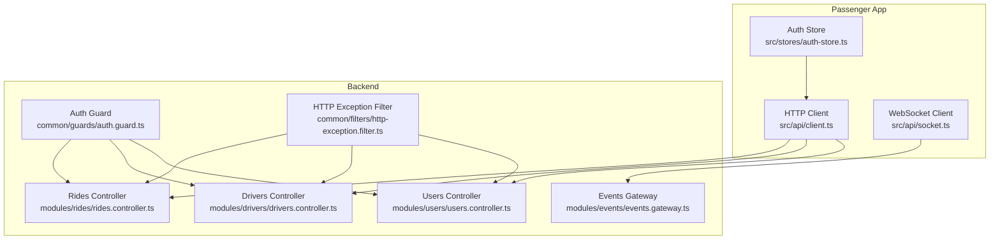
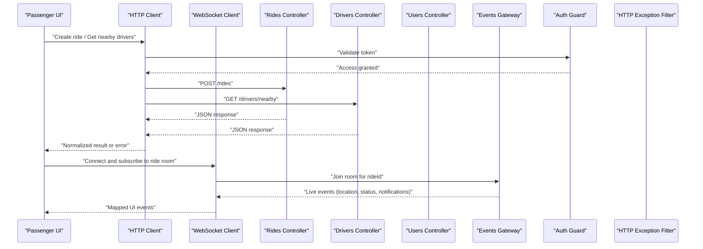
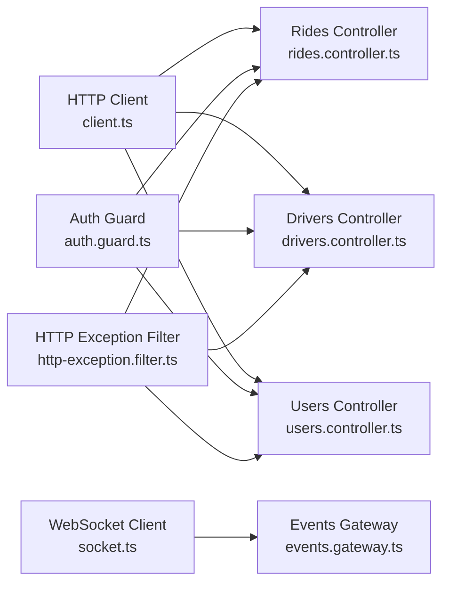

# API Integration & Real-time Communication

<cite>
**Referenced Files in This Document**
- [client.ts](file://apps/mobile-passenger/src/api/client.ts)
- [socket.ts](file://apps/mobile-passenger/src/api/socket.ts)
- [auth-store.ts](file://apps/mobile-passenger/src/stores/auth-store.ts)
- [events.gateway.ts](file://apps/backend/src/modules/events/events.gateway.ts)
- [rides.controller.ts](file://apps/backend/src/modules/rides/rides.controller.ts)
- [drivers.controller.ts](file://apps/backend/src/modules/drivers/drivers.controller.ts)
- [users.controller.ts](file://apps/backend/src/modules/users/users.controller.ts)
- [auth.guard.ts](file://apps/backend/src/common/guards/auth.guard.ts)
- [http-exception.filter.ts](file://apps/backend/src/common/filters/http-exception.filter.ts)
</cite>

## Table of Contents
1. [Introduction](#introduction)
2. [Project Structure](#project-structure)
3. [Core Components](#core-components)
4. [Architecture Overview](#architecture-overview)
5. [Detailed Component Analysis](#detailed-component-analysis)
6. [Dependency Analysis](#dependency-analysis)
7. [Performance Considerations](#performance-considerations)
8. [Troubleshooting Guide](#troubleshooting-guide)
9. [Conclusion](#conclusion)

## Introduction
This document explains the passenger app’s integration with the backend via HTTP and real-time WebSocket channels. It covers:
- HTTP client configuration, interceptors, error handling, and retry strategies
- WebSocket implementation for live driver tracking, ride status updates, push notifications, and chat
- Connection management, reconnection logic, message serialization, and event handling patterns
- Practical usage examples for key endpoints and events
- Network timeout settings and mobile performance optimizations

## Project Structure
The passenger app resides under apps/mobile-passenger and exposes two primary integration modules:
- HTTP client module for REST APIs
- WebSocket client module for real-time features

**Diagram sources**
- [client.ts](file://apps/mobile-passenger/src/api/client.ts)
- [socket.ts](file://apps/mobile-passenger/src/api/socket.ts)
- [auth-store.ts](file://apps/mobile-passenger/src/stores/auth-store.ts)
- [rides.controller.ts](file://apps/backend/src/modules/rides/rides.controller.ts)
- [drivers.controller.ts](file://apps/backend/src/modules/drivers/drivers.controller.ts)
- [users.controller.ts](file://apps/backend/src/modules/users/users.controller.ts)
- [events.gateway.ts](file://apps/backend/src/modules/events/events.gateway.ts)
- [auth.guard.ts](file://apps/backend/src/common/guards/auth.guard.ts)
- [http-exception.filter.ts](file://apps/backend/src/common/filters/http-exception.filter.ts)

**Section sources**
- [client.ts](file://apps/mobile-passenger/src/api/client.ts)
- [socket.ts](file://apps/mobile-passenger/src/api/socket.ts)
- [auth-store.ts](file://apps/mobile-passenger/src/stores/auth-store.ts)
- [rides.controller.ts](file://apps/backend/src/modules/rides/rides.controller.ts)
- [drivers.controller.ts](file://apps/backend/src/modules/drivers/drivers.controller.ts)
- [users.controller.ts](file://apps/backend/src/modules/users/users.controller.ts)
- [events.gateway.ts](file://apps/backend/src/modules/events/events.gateway.ts)
- [auth.guard.ts](file://apps/backend/src/common/guards/auth.guard.ts)
- [http-exception.filter.ts](file://apps/backend/src/common/filters/http-exception.filter.ts)

## Core Components
- HTTP client (REST): Centralized configuration for base URL, timeouts, headers, request/response transformation, and error normalization. Integrates with authentication tokens from the auth store.
- WebSocket client (real-time): Manages connection lifecycle, reconnection, message serialization/deserialization, and event subscriptions for ride tracking, status updates, notifications, and chat.
- Auth store: Provides access to user session and token used by both HTTP and WebSocket clients.

Key responsibilities:
- HTTP client: build requests, attach auth headers, transform payloads, normalize errors, and apply retries where appropriate.
- WebSocket client: connect/disconnect, subscribe/unsubscribe to rooms or channels, handle reconnect backoff, serialize messages, and dispatch UI events.

**Section sources**
- [client.ts](file://apps/mobile-passenger/src/api/client.ts)
- [socket.ts](file://apps/mobile-passenger/src/api/socket.ts)
- [auth-store.ts](file://apps/mobile-passenger/src/stores/auth-store.ts)

## Architecture Overview
The passenger app communicates with the backend through two channels:
- REST over HTTP for CRUD operations and one-off actions
- WebSocket for streaming updates and interactive features

**Diagram sources**
- [client.ts](file://apps/mobile-passenger/src/api/client.ts)
- [socket.ts](file://apps/mobile-passenger/src/api/socket.ts)
- [rides.controller.ts](file://apps/backend/src/modules/rides/rides.controller.ts)
- [drivers.controller.ts](file://apps/backend/src/modules/drivers/drivers.controller.ts)
- [users.controller.ts](file://apps/backend/src/modules/users/users.controller.ts)
- [events.gateway.ts](file://apps/backend/src/modules/events/events.gateway.ts)
- [auth.guard.ts](file://apps/backend/src/common/guards/auth.guard.ts)
- [http-exception.filter.ts](file://apps/backend/src/common/filters/http-exception.filter.ts)

## Detailed Component Analysis

### HTTP Client Configuration and Interceptors
Responsibilities:
- Base URL and environment-specific configuration
- Request headers injection (e.g., Authorization, Content-Type)
- Response normalization (data extraction, error mapping)
- Timeout and cancellation support
- Optional retry policy for idempotent requests

Interceptors:
- Request interceptor: attaches auth token from auth store, sets content type, adds correlation IDs if needed
- Response interceptor: unwraps payload, maps server error codes to a unified error shape, handles network failures and timeouts

Error handling strategy:
- Classify errors into network, server, and validation categories
- Provide user-friendly messages and actionable guidance
- Surface structured error objects for UI to display specific fields

Retry mechanisms:
- Apply exponential backoff for transient failures (network timeouts, 5xx)
- Limit max retries and only retry safe methods (GET, HEAD, OPTIONS)
- Expose a per-call override when necessary

Usage example (conceptual):
- Create a ride: POST /rides with passenger details and pickup location
- Fetch nearby drivers: GET /drivers/nearby with current coordinates
- Update profile: PATCH /users/me with new data

**Section sources**
- [client.ts](file://apps/mobile-passenger/src/api/client.ts)
- [auth-store.ts](file://apps/mobile-passenger/src/stores/auth-store.ts)
- [http-exception.filter.ts](file://apps/backend/src/common/filters/http-exception.filter.ts)

### WebSocket Client and Real-time Features
Responsibilities:
- Establish and maintain a persistent connection to the backend gateway
- Manage reconnection with jittered exponential backoff
- Serialize outgoing messages and deserialize incoming events
- Subscribe/unsubscribe to rooms or channels (e.g., per ride)
- Emit and listen to domain events: driver location, ride status, notifications, chat

Connection management:
- Auto-reconnect on disconnect with configurable delay and maximum attempts
- Graceful degradation when offline; queue non-critical messages if applicable
- Heartbeat/ping-pong to detect stale connections

Message serialization:
- Envelope format with event name, payload, and metadata (rideId, timestamp)
- Versioning for schema evolution
- Compression or batching for high-frequency events like location updates

Event handling patterns:
- Centralized event bus to route events to UI components
- Deduplication and throttling for frequent updates (e.g., map markers)
- Error propagation for invalid payloads or unauthorized access

Real-time feature coverage:
- Live driver tracking: subscribe to a ride room and render position updates
- Ride status updates: transition UI states based on server-pushed statuses
- Push notifications: lightweight alerts for important events
- Chat functionality: bidirectional messaging within a ride context

**Section sources**
- [socket.ts](file://apps/mobile-passenger/src/api/socket.ts)
- [events.gateway.ts](file://apps/backend/src/modules/events/events.gateway.ts)

### Authentication Integration
- The HTTP client reads the bearer token from the auth store and injects it into request headers.
- The WebSocket client includes an authentication handshake or token in the initial connection parameters.
- The backend enforces access control using an auth guard before controllers process requests.

Security considerations:
- Token refresh flow should be handled transparently without breaking active requests
- Avoid logging sensitive headers or payloads
- Validate token scope and expiration on the client side to reduce unnecessary calls

**Section sources**
- [client.ts](file://apps/mobile-passenger/src/api/client.ts)
- [socket.ts](file://apps/mobile-passenger/src/api/socket.ts)
- [auth-store.ts](file://apps/mobile-passenger/src/stores/auth-store.ts)
- [auth.guard.ts](file://apps/backend/src/common/guards/auth.guard.ts)

### Backend Controllers and Gateway
- Rides controller: endpoints for creating, retrieving, and updating rides; emits events via the gateway for state changes.
- Drivers controller: endpoints for listing nearby drivers and driver availability; may emit location-related events.
- Users controller: endpoints for profile management and preferences.
- Events gateway: manages WebSocket rooms, publishes ride-related events, and routes chat messages.

Access control and error formatting:
- Auth guard validates tokens and roles before controller execution.
- HTTP exception filter standardizes error responses across all endpoints.

**Section sources**
- [rides.controller.ts](file://apps/backend/src/modules/rides/rides.controller.ts)
- [drivers.controller.ts](file://apps/backend/src/modules/drivers/drivers.controller.ts)
- [users.controller.ts](file://apps/backend/src/modules/users/users.controller.ts)
- [events.gateway.ts](file://apps/backend/src/modules/events/events.gateway.ts)
- [auth.guard.ts](file://apps/backend/src/common/guards/auth.guard.ts)
- [http-exception.filter.ts](file://apps/backend/src/common/filters/http-exception.filter.ts)

## Dependency Analysis
The following diagram shows how the passenger app’s integration layer depends on backend services and guards.

**Diagram sources**
- [client.ts](file://apps/mobile-passenger/src/api/client.ts)
- [socket.ts](file://apps/mobile-passenger/src/api/socket.ts)
- [rides.controller.ts](file://apps/backend/src/modules/rides/rides.controller.ts)
- [drivers.controller.ts](file://apps/backend/src/modules/drivers/drivers.controller.ts)
- [users.controller.ts](file://apps/backend/src/modules/users/users.controller.ts)
- [events.gateway.ts](file://apps/backend/src/modules/events/events.gateway.ts)
- [auth.guard.ts](file://apps/backend/src/common/guards/auth.guard.ts)
- [http-exception.filter.ts](file://apps/backend/src/common/filters/http-exception.filter.ts)

**Section sources**
- [client.ts](file://apps/mobile-passenger/src/api/client.ts)
- [socket.ts](file://apps/mobile-passenger/src/api/socket.ts)
- [rides.controller.ts](file://apps/backend/src/modules/rides/rides.controller.ts)
- [drivers.controller.ts](file://apps/backend/src/modules/drivers/drivers.controller.ts)
- [users.controller.ts](file://apps/backend/src/modules/users/users.controller.ts)
- [events.gateway.ts](file://apps/backend/src/modules/events/events.gateway.ts)
- [auth.guard.ts](file://apps/backend/src/common/guards/auth.guard.ts)
- [http-exception.filter.ts](file://apps/backend/src/common/filters/http-exception.filter.ts)

## Performance Considerations
Mobile network optimization recommendations:
- Timeouts and retries
  - Set reasonable request timeouts to fail fast on poor connectivity
  - Use exponential backoff with jitter for retries to avoid thundering herds
- Throttling and debouncing
  - Throttle location updates to reduce bandwidth and CPU usage
  - Debounce rapid UI-triggered actions (e.g., search queries)
- Payload minimization
  - Send only required fields; use pagination and field selection where supported
  - Compress large payloads if the backend supports it
- Connection reuse
  - Keep HTTP connections alive when possible
  - Maintain a single WebSocket instance and reuse subscriptions
- Background processing
  - Defer non-critical tasks until the app is in the foreground
  - Batch notifications and merge similar events
- Memory management
  - Unsubscribe from rooms and remove listeners when navigating away
  - Clear caches and cancel pending requests on logout

[No sources needed since this section provides general guidance]

## Troubleshooting Guide
Common issues and resolutions:
- Authentication failures
  - Ensure the token is present and not expired; refresh if needed
  - Verify that the auth header is attached to every request
- WebSocket disconnections
  - Check reconnection backoff settings and maximum attempts
  - Confirm that the gateway is reachable and not rate-limiting
- High latency or dropped updates
  - Reduce update frequency for location events
  - Enable compression or batch messages if available
- Inconsistent state after reconnect
  - Re-sync critical state by requesting latest data from REST endpoints
  - Implement idempotent event handlers to avoid duplicate processing

Operational checks:
- Inspect normalized error responses from the HTTP exception filter
- Validate event envelope schemas and versions
- Monitor connection metrics (reconnect count, message throughput)

**Section sources**
- [http-exception.filter.ts](file://apps/backend/src/common/filters/http-exception.filter.ts)
- [socket.ts](file://apps/mobile-passenger/src/api/socket.ts)
- [client.ts](file://apps/mobile-passenger/src/api/client.ts)

## Conclusion
The passenger app integrates with the backend through a robust HTTP client and a resilient WebSocket client. Together they provide reliable REST operations and real-time experiences such as live tracking, status updates, notifications, and chat. By applying thoughtful error handling, retry policies, and mobile-focused performance techniques, the app delivers a smooth experience even under challenging network conditions.

[No sources needed since this section summarizes without analyzing specific files]