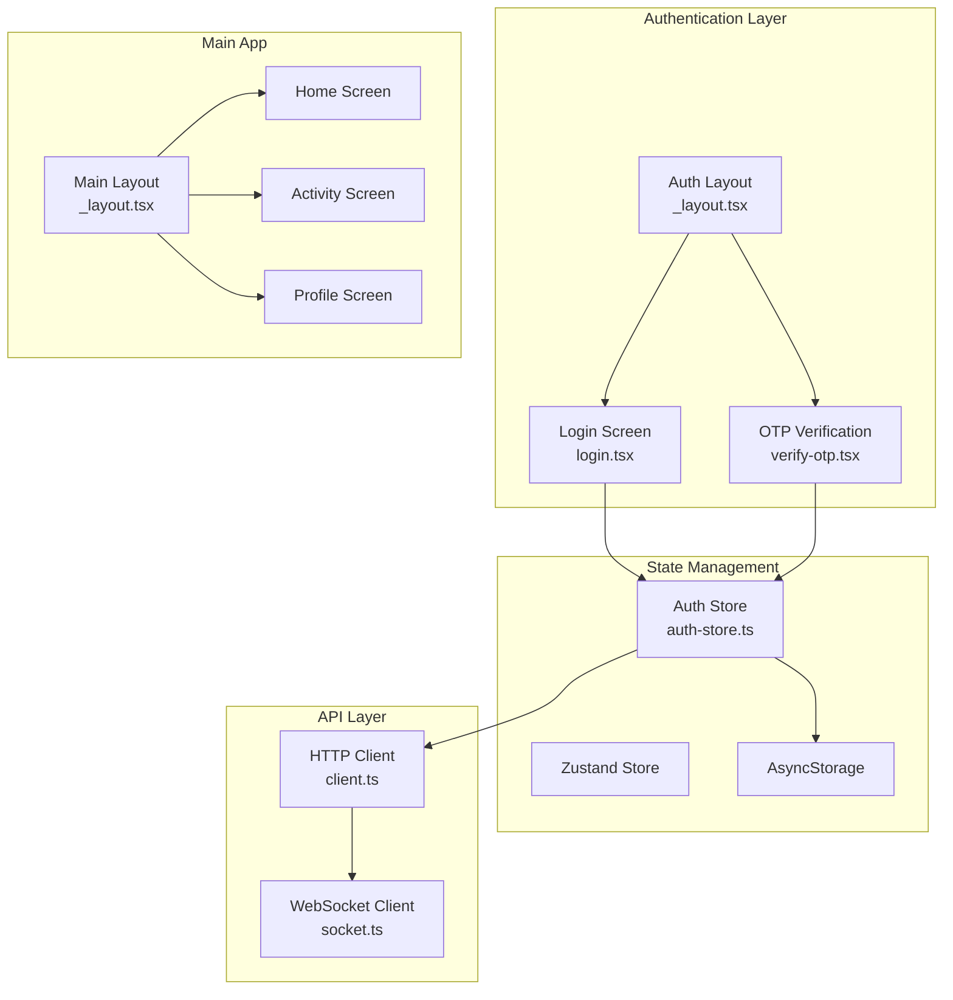
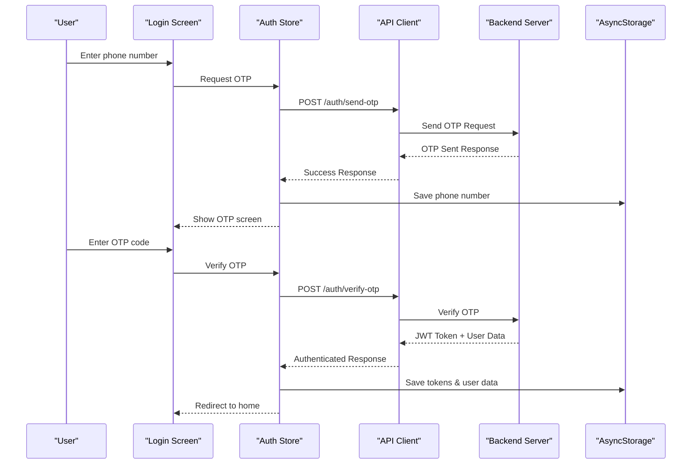
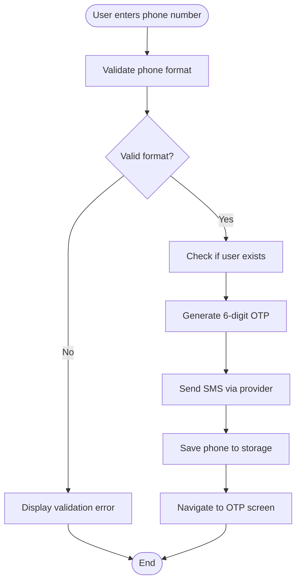
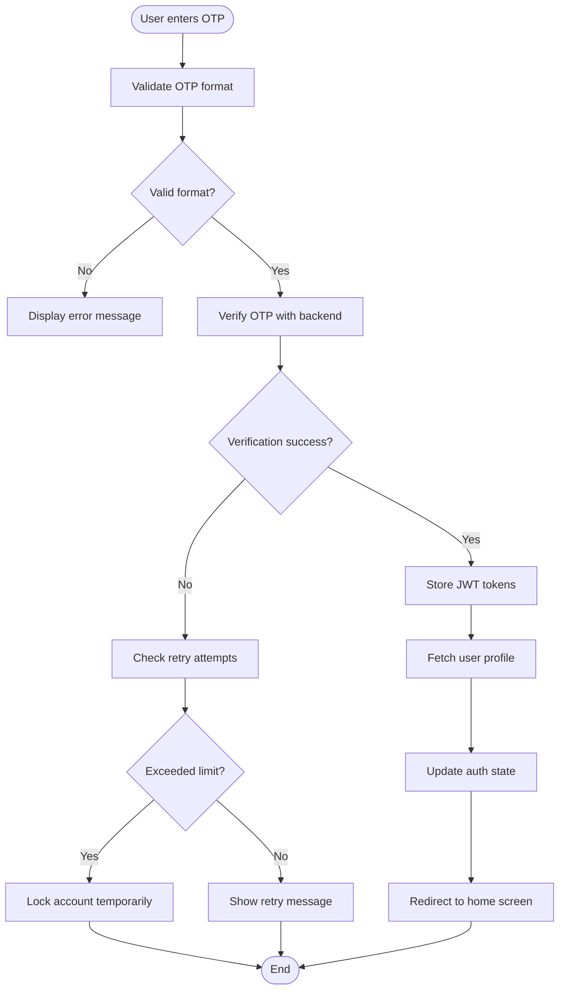
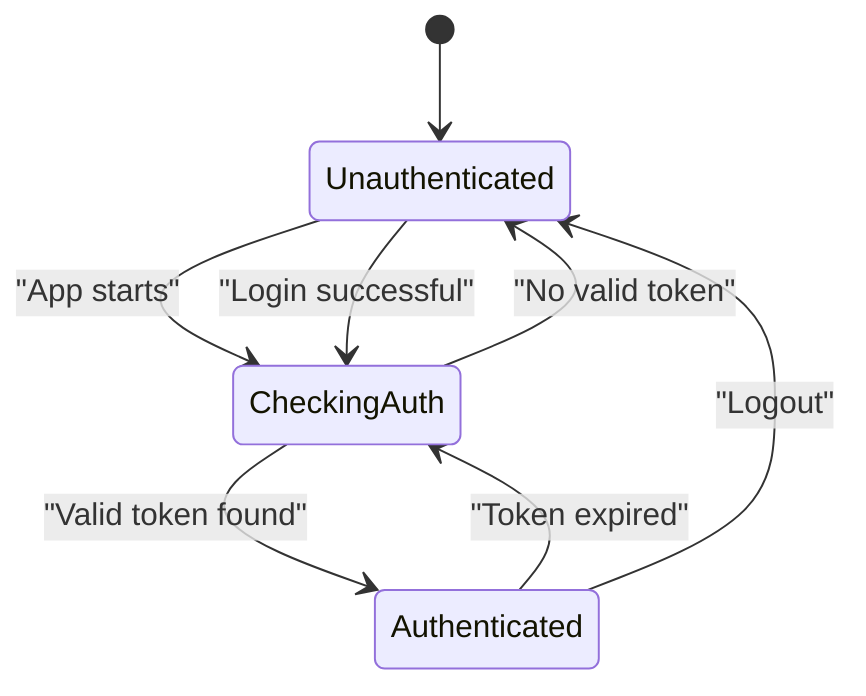
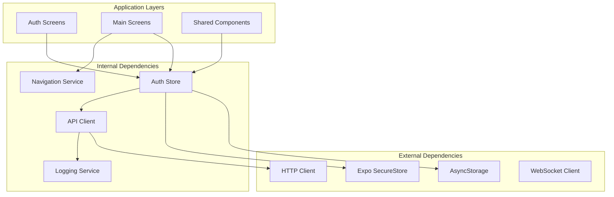

# Authentication & State Management

<cite>
**Referenced Files in This Document**
- [auth-store.ts](file://apps/mobile-passenger/src/stores/auth-store.ts)
- [login.tsx](file://apps/mobile-passenger/app/(auth)/login.tsx)
- [verify-otp.tsx](file://apps/mobile-passenger/app/(auth)/verify-otp.tsx)
- [_layout.tsx](file://apps/mobile-passenger/app/(auth)/_layout.tsx)
- [_layout.tsx](file://apps/mobile-passenger/app/_layout.tsx)
- [client.ts](file://apps/mobile-passenger/src/api/client.ts)
- [socket.ts](file://apps/mobile-passenger/src/api/socket.ts)
</cite>

## Table of Contents
1. [Introduction](#introduction)
2. [Project Structure](#project-structure)
3. [Core Components](#core-components)
4. [Architecture Overview](#architecture-overview)
5. [Detailed Component Analysis](#detailed-component-analysis)
6. [Dependency Analysis](#dependency-analysis)
7. [Performance Considerations](#performance-considerations)
8. [Security Considerations](#security-considerations)
9. [Troubleshooting Guide](#troubleshooting-guide)
10. [Conclusion](#conclusion)

## Introduction

This document provides comprehensive documentation for the passenger app's authentication system and state management architecture. The system implements OTP-based authentication with secure session persistence, Zustand store implementation for global state management, and robust error handling strategies. The architecture follows modern mobile app development patterns using React Native/Expo with TypeScript.

## Project Structure

The passenger app follows a feature-based organization with clear separation between authentication flows, main application screens, and shared state management:

**Diagram sources**
- [_layout.tsx](file://apps/mobile-passenger/app/(auth)/_layout.tsx)
- [login.tsx](file://apps/mobile-passenger/app/(auth)/login.tsx)
- [verify-otp.tsx](file://apps/mobile-passenger/app/(auth)/verify-otp.tsx)
- [auth-store.ts](file://apps/mobile-passenger/src/stores/auth-store.ts)
- [client.ts](file://apps/mobile-passenger/src/api/client.ts)
- [socket.ts](file://apps/mobile-passenger/src/api/socket.ts)

## Core Components

### Authentication Store (Zustand Implementation)

The authentication store serves as the central state management solution using Zustand, providing reactive state updates across the application. Key responsibilities include:

- **User Data Caching**: Persistent storage of user profile information and authentication tokens
- **Authentication State Synchronization**: Real-time sync between UI components and backend authentication status
- **Cross-Screen Data Sharing**: Seamless data flow between login, OTP verification, and main application screens
- **Session Management**: Automatic token refresh and session validation

### API Client Layer

The HTTP client handles all network requests with built-in authentication headers, error handling, and response interceptors. It manages token injection, request retry logic, and connection pooling for optimal performance.

### WebSocket Integration

Real-time communication is established through WebSocket connections for live features like ride tracking, notifications, and driver updates. The socket client handles reconnection logic and message queuing during offline periods.

**Section sources**
- [auth-store.ts](file://apps/mobile-passenger/src/stores/auth-store.ts)
- [client.ts](file://apps/mobile-passenger/src/api/client.ts)
- [socket.ts](file://apps/mobile-passenger/src/api/socket.ts)

## Architecture Overview

The authentication system follows a layered architecture pattern with clear separation of concerns:

**Diagram sources**
- [login.tsx](file://apps/mobile-passenger/app/(auth)/login.tsx)
- [verify-otp.tsx](file://apps/mobile-passenger/app/(auth)/verify-otp.tsx)
- [auth-store.ts](file://apps/mobile-passenger/src/stores/auth-store.ts)
- [client.ts](file://apps/mobile-passenger/src/api/client.ts)

## Detailed Component Analysis

### OTP-Based Authentication Flow

The authentication process implements a secure two-step verification system:

#### Step 1: Phone Number Validation and OTP Generation

**Diagram sources**
- [login.tsx](file://apps/mobile-passenger/app/(auth)/login.tsx)
- [auth-store.ts](file://apps/mobile-passenger/src/stores/auth-store.ts)

#### Step 2: OTP Verification and Token Exchange

**Diagram sources**
- [verify-otp.tsx](file://apps/mobile-passenger/app/(auth)/verify-otp.tsx)
- [auth-store.ts](file://apps/mobile-passenger/src/stores/auth-store.ts)

### Zustand Store Implementation

The authentication store implements several key patterns for efficient state management:

#### State Structure Design

The store maintains three primary state categories:

1. **Authentication State**: Login status, token validity, and user session info
2. **User Data**: Cached profile information, preferences, and settings
3. **UI State**: Loading indicators, error messages, and navigation flags

#### Persistence Strategy

Data persistence uses AsyncStorage with encryption at rest:

- **Sensitive Data**: JWT tokens encrypted before storage
- **User Preferences**: Plain text JSON serialization
- **Temporary State**: In-memory only for session-specific data

#### Cross-Component Communication

The store enables seamless communication between components through:

- **Reactive Updates**: Automatic UI re-rendering on state changes
- **Action Creators**: Centralized business logic methods
- **Selector Functions**: Optimized data access patterns

**Section sources**
- [auth-store.ts](file://apps/mobile-passenger/src/stores/auth-store.ts)

### Protected Route Implementation

Route protection ensures users cannot access protected screens without valid authentication:

#### Navigation Guard Pattern

**Diagram sources**
- [_layout.tsx](file://apps/mobile-passenger/app/(auth)/_layout.tsx)
- [_layout.tsx](file://apps/mobile-passenger/app/_layout.tsx)

#### Automatic Redirect Logic

The routing system automatically redirects unauthenticated users to login screens while preserving intended destination URLs for post-login navigation.

### Error Handling and Recovery Strategies

#### Network Error Recovery

The system implements exponential backoff retry logic with circuit breaker patterns:

- **Transient Errors**: Automatic retry with increasing delays
- **Permanent Errors**: Immediate failure with user feedback
- **Network Unavailable**: Queue requests for later execution

#### Authentication Error Handling

Specific handling for authentication failures includes:

- **Invalid Credentials**: Clear form fields and show specific error messages
- **Account Locked**: Display lockout duration and support contact
- **Server Down**: Graceful degradation with cached data display

**Section sources**
- [client.ts](file://apps/mobile-passenger/src/api/client.ts)
- [auth-store.ts](file://apps/mobile-passenger/src/stores/auth-store.ts)

## Dependency Analysis

The authentication system has well-defined dependencies that ensure loose coupling and testability:

**Diagram sources**
- [auth-store.ts](file://apps/mobile-passenger/src/stores/auth-store.ts)
- [client.ts](file://apps/mobile-passenger/src/api/client.ts)

**Section sources**
- [auth-store.ts](file://apps/mobile-passenger/src/stores/auth-store.ts)
- [client.ts](file://apps/mobile-passenger/src/api/client.ts)

## Performance Considerations

### State Management Optimization

- **Selective Subscriptions**: Components subscribe only to relevant state slices
- **Memoized Selectors**: Computed values are cached to prevent unnecessary recalculations
- **Batched Updates**: Multiple state changes are batched to minimize re-renders

### Network Efficiency

- **Request Deduplication**: Prevents duplicate concurrent requests for the same resource
- **Response Caching**: Frequently accessed data is cached with TTL expiration
- **Connection Pooling**: Reuses HTTP connections for better performance

### Memory Management

- **Lazy Loading**: Heavy components load only when needed
- **Cleanup Handlers**: Proper cleanup of event listeners and subscriptions
- **Garbage Collection**: Efficient memory usage through proper object disposal

## Security Considerations

### Token Management

- **Secure Storage**: JWT tokens stored in encrypted secure storage
- **Automatic Refresh**: Silent token refresh before expiration
- **Token Rotation**: Regular token rotation to minimize exposure window

### Input Validation

- **Client-side Validation**: Immediate feedback for invalid inputs
- **Server-side Validation**: Backend enforces all security constraints
- **Sanitization**: All user inputs sanitized to prevent injection attacks

### Session Security

- **Session Timeout**: Automatic logout after inactivity period
- **Concurrent Sessions**: Limit number of active sessions per user
- **Device Binding**: Optional device fingerprinting for enhanced security

### Data Encryption

- **At Rest**: Sensitive data encrypted using device-specific keys
- **In Transit**: All communications use HTTPS with certificate pinning
- **Local Cache**: Temporary data cleared on app termination

## Troubleshooting Guide

### Common Authentication Issues

#### OTP Not Received

**Symptoms**: User reports not receiving OTP codes
**Diagnosis Steps**:
1. Check phone number format validation
2. Verify SMS provider configuration
3. Review rate limiting policies
4. Inspect network connectivity

**Resolution**: Implement fallback delivery methods and provide manual resend options

#### Token Expiration Issues

**Symptoms**: Users randomly logged out or API calls fail
**Diagnosis Steps**:
1. Check token refresh logic
2. Verify server time synchronization
3. Review token lifetime configuration
4. Inspect storage persistence

**Resolution**: Implement proactive token refresh and handle edge cases gracefully

#### State Synchronization Problems

**Symptoms**: UI shows inconsistent authentication state
**Diagnosis Steps**:
1. Check store subscription patterns
2. Verify async operation completion
3. Review error boundary implementations
4. Inspect navigation guards

**Resolution**: Add state reconciliation logic and implement optimistic updates with rollback

### Debugging Tools

#### Logging Strategy

The system implements structured logging with different severity levels:

- **Debug**: Development-only detailed logs
- **Info**: Normal operational events
- **Warning**: Potential issues requiring attention
- **Error**: Critical failures needing immediate action

#### Monitoring Integration

Integration with monitoring services for:

- **Error Tracking**: Automated error collection and reporting
- **Performance Metrics**: Authentication flow timing analysis
- **User Analytics**: Anonymous usage pattern tracking

**Section sources**
- [client.ts](file://apps/mobile-passenger/src/api/client.ts)
- [auth-store.ts](file://apps/mobile-passenger/src/stores/auth-store.ts)

## Conclusion

The passenger app's authentication system and state management architecture provides a robust, secure, and user-friendly foundation for mobile ride-sharing functionality. The implementation leverages modern best practices including OTP-based authentication, Zustand for state management, comprehensive error handling, and strong security measures.

Key strengths of the architecture include:

- **Scalable State Management**: Zustand provides efficient cross-component communication
- **Secure Authentication**: Multi-layered security with token management and input validation
- **Resilient Error Handling**: Comprehensive error recovery and user feedback
- **Performance Optimization**: Caching, lazy loading, and efficient state updates
- **Maintainable Code Structure**: Clear separation of concerns and modular design

The system is designed to accommodate future enhancements such as biometric authentication, social login integration, and advanced analytics while maintaining backward compatibility and security standards.