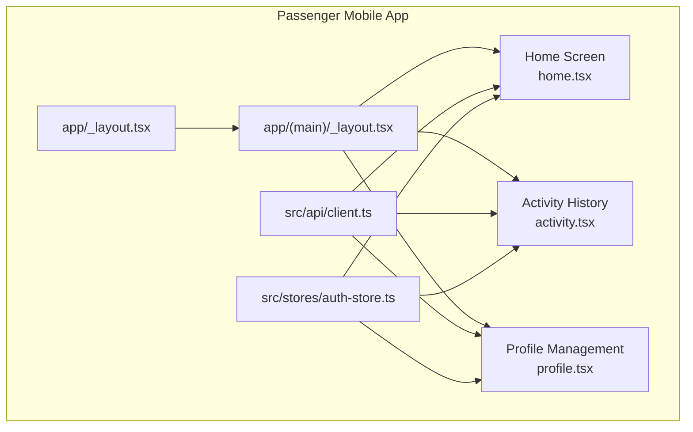
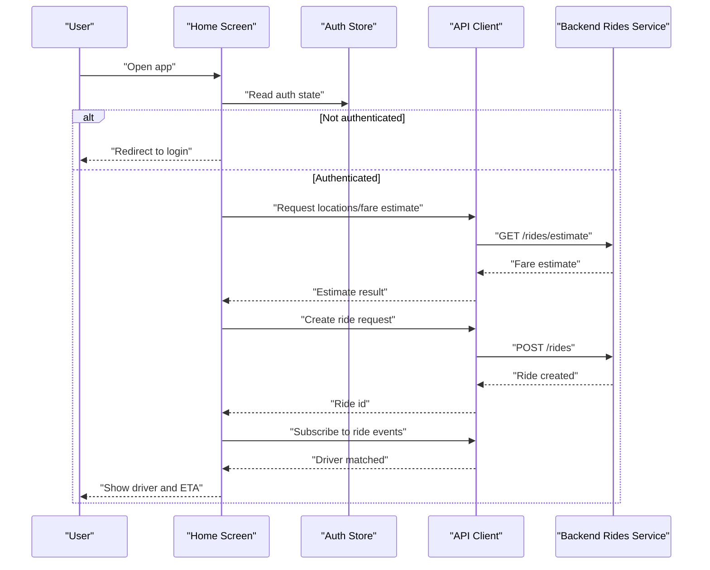
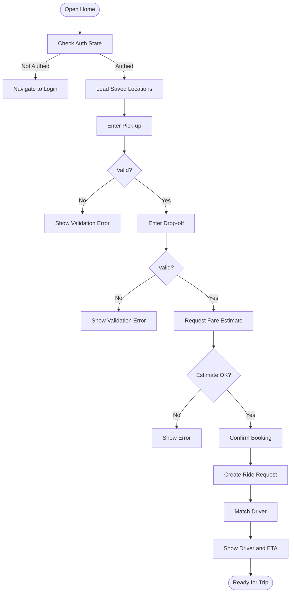
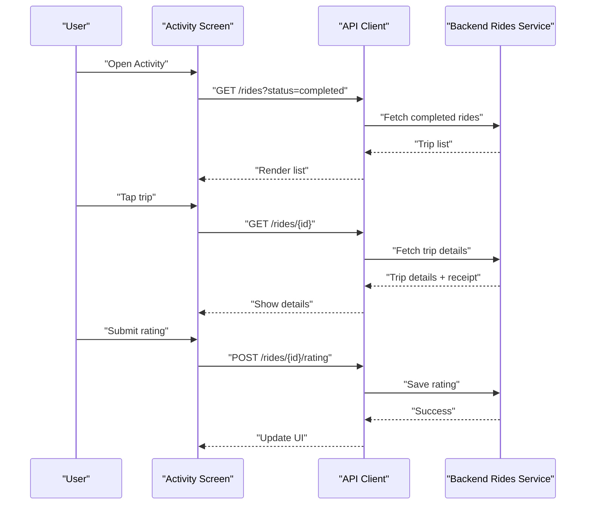
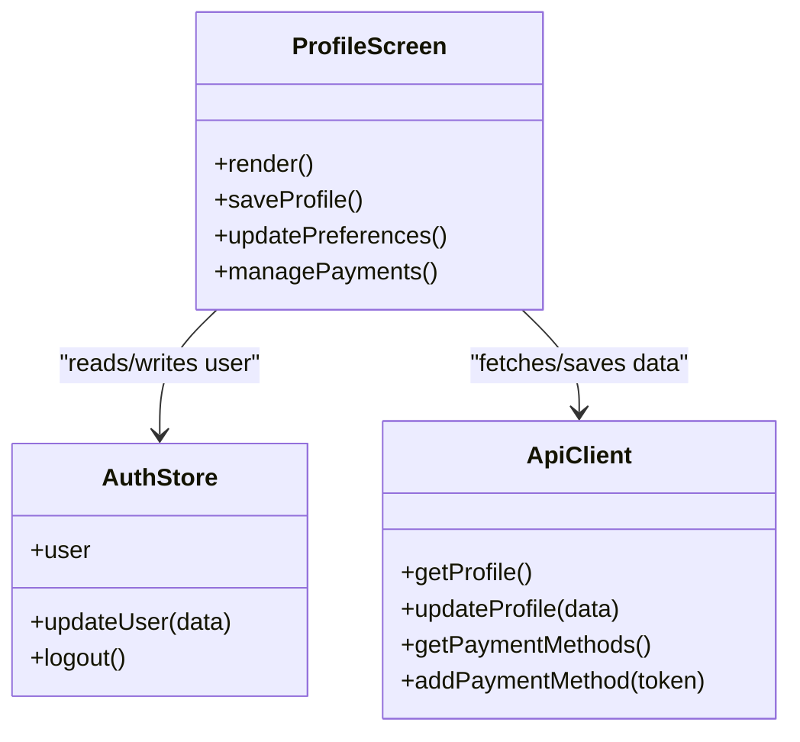
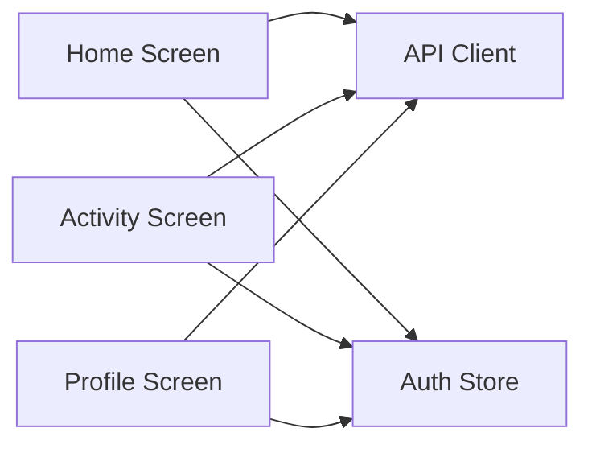

# Core Features & Screens

<cite>
**Referenced Files in This Document**
- [home.tsx](file://apps/mobile-passenger/app/(main)/home.tsx)
- [activity.tsx](file://apps/mobile-passenger/app/(main)/activity.tsx)
- [profile.tsx](file://apps/mobile-passenger/app/(main)/profile.tsx)
- [client.ts](file://apps/mobile-passenger/src/api/client.ts)
- [auth-store.ts](file://apps/mobile-passenger/src/stores/auth-store.ts)
- [_layout.tsx](file://apps/mobile-passenger/app/(main)/_layout.tsx)
- [index.tsx](file://apps/mobile-passenger/app/index.tsx)
</cite>

## Table of Contents
1. [Introduction](#introduction)
2. [Project Structure](#project-structure)
3. [Core Components](#core-components)
4. [Architecture Overview](#architecture-overview)
5. [Detailed Component Analysis](#detailed-component-analysis)
6. [Dependency Analysis](#dependency-analysis)
7. [Performance Considerations](#performance-considerations)
8. [Troubleshooting Guide](#troubleshooting-guide)
9. [Conclusion](#conclusion)

## Introduction
This document describes the core features and screen implementations of the Passenger Mobile App built within the monorepo. It focuses on:
- Home screen: ride booking interface, location selection, fare estimation, and driver matching
- Activity history screen: past trips, trip details, ratings, and receipts
- Profile management screen: user settings, payment methods, preferences, and account information
It also covers UI component structure, navigation patterns, state handling between screens, form validation, error handling, and user feedback mechanisms.

## Project Structure
The Passenger Mobile App is implemented as an Expo/React Native application using file-based routing under apps/mobile-passenger. The main screens are organized under app/(main), with shared API client and authentication store under src.

**Diagram sources**
- [_layout.tsx](file://apps/mobile-passenger/app/(main)/_layout.tsx)
- [home.tsx](file://apps/mobile-passenger/app/(main)/home.tsx)
- [activity.tsx](file://apps/mobile-passenger/app/(main)/activity.tsx)
- [profile.tsx](file://apps/mobile-passenger/app/(main)/profile.tsx)
- [client.ts](file://apps/mobile-passenger/src/api/client.ts)
- [auth-store.ts](file://apps/mobile-passenger/src/stores/auth-store.ts)

**Section sources**
- [index.tsx](file://apps/mobile-passenger/app/index.tsx)
- [_layout.tsx](file://apps/mobile-passenger/app/(main)/_layout.tsx)

## Core Components
- Navigation shell: Provides tab or stack layout for main screens and guards access based on authentication state.
- API client: Centralized HTTP client used across screens for requests (e.g., rides, users).
- Auth store: Shared reactive store for user session and profile data, consumed by screens.

Key responsibilities:
- Home screen orchestrates booking flow: pick-up/drop-off selection, fare estimate, and driver match.
- Activity screen lists past trips and shows details, ratings, and receipts.
- Profile screen manages settings, payment methods, preferences, and account info.

**Section sources**
- [client.ts](file://apps/mobile-passenger/src/api/client.ts)
- [auth-store.ts](file://apps/mobile-passenger/src/stores/auth-store.ts)
- [_layout.tsx](file://apps/mobile-passenger/app/(main)/_layout.tsx)

## Architecture Overview
The app follows a layered architecture:
- Presentation layer: React Native screens (Home, Activity, Profile)
- State layer: Zustand/Context store for auth and UI state
- Data layer: API client wrapping HTTP calls to backend services
- Real-time updates: Optional socket integration for live ride tracking

**Diagram sources**
- [home.tsx](file://apps/mobile-passenger/app/(main)/home.tsx)
- [client.ts](file://apps/mobile-passenger/src/api/client.ts)
- [auth-store.ts](file://apps/mobile-passenger/src/stores/auth-store.ts)

## Detailed Component Analysis

### Home Screen: Ride Booking Interface
Responsibilities:
- Location selection: pick-up and drop-off inputs with search suggestions
- Fare estimation: compute price range before confirming
- Driver matching: initiate ride request and show status updates
- Error handling and feedback: network errors, invalid locations, no drivers available

UI components typically include:
- Search input fields with autocomplete
- Map view for visual confirmation
- Summary card showing estimated fare and time
- Action buttons: Confirm, Cancel, Update locations

State handling:
- Local form state for addresses and selected points
- Global auth state for user identity
- Temporary ride state during booking lifecycle

Navigation patterns:
- Stay on home while editing locations
- Navigate to activity after successful booking
- Show modal or inline feedback for errors

Form validation:
- Required fields for both locations
- Address format checks
- Distance/time constraints

Error handling:
- Network failure retries with backoff
- User-friendly messages for service unavailability
- Graceful fallback when map or geocoding fails

User feedback:
- Loading indicators during estimate and booking
- Success banners on confirmed bookings
- Toasts for warnings and errors

**Diagram sources**
- [home.tsx](file://apps/mobile-passenger/app/(main)/home.tsx)
- [client.ts](file://apps/mobile-passenger/src/api/client.ts)
- [auth-store.ts](file://apps/mobile-passenger/src/stores/auth-store.ts)

**Section sources**
- [home.tsx](file://apps/mobile-passenger/app/(main)/home.tsx)
- [client.ts](file://apps/mobile-passenger/src/api/client.ts)
- [auth-store.ts](file://apps/mobile-passenger/src/stores/auth-store.ts)

### Activity History Screen: Past Trips and Details
Responsibilities:
- List past trips with summary info (date, route, fare)
- View trip details: timeline, driver info, route, receipt
- Rate completed trips
- Access receipts and export if supported

UI components typically include:
- Flat list of trips with pagination/infinite scroll
- Detail page or bottom sheet for trip specifics
- Rating stars and submit button
- Receipt viewer and download actions

State handling:
- Paginated list of trips
- Selected trip detail state
- Rating submission state

Navigation patterns:
- Tap item to open details
- Back navigation to list
- Deep link to specific trip if needed

Form validation:
- Rating value constraints (e.g., 1–5)
- Optional comment length limits

Error handling:
- Empty states when no trips exist
- Retry mechanism for failed loads
- Graceful handling of missing receipt data

User feedback:
- Skeleton loaders for list and details
- Success message after rating submission
- Error banners for failures

**Diagram sources**
- [activity.tsx](file://apps/mobile-passenger/app/(main)/activity.tsx)
- [client.ts](file://apps/mobile-passenger/src/api/client.ts)

**Section sources**
- [activity.tsx](file://apps/mobile-passenger/app/(main)/activity.tsx)
- [client.ts](file://apps/mobile-passenger/src/api/client.ts)

### Profile Management Screen: Settings, Payments, Preferences, Account
Responsibilities:
- Manage personal information and contact details
- Add/remove payment methods
- Toggle preferences (notifications, language, theme)
- View account status and security options

UI components typically include:
- Editable profile fields with validation
- Payment method cards with add/remove actions
- Preference toggles and selectors
- Security section (password change, logout)

State handling:
- Form state for profile edits
- Payment methods list and selection
- Preference flags persisted locally and synced with server

Navigation patterns:
- In-place editing with save/cancel
- Modal or separate screen for adding payment methods
- Confirmation dialogs for destructive actions

Form validation:
- Email format, phone number format
- Required fields for name and email
- Card number validation where applicable

Error handling:
- Network errors for sync operations
- Duplicate payment method detection
- Session expiration prompts

User feedback:
- Inline field-level errors
- Success toasts on saved changes
- Alerts for critical actions like logout

**Diagram sources**
- [profile.tsx](file://apps/mobile-passenger/app/(main)/profile.tsx)
- [auth-store.ts](file://apps/mobile-passenger/src/stores/auth-store.ts)
- [client.ts](file://apps/mobile-passenger/src/api/client.ts)

**Section sources**
- [profile.tsx](file://apps/mobile-passenger/app/(main)/profile.tsx)
- [auth-store.ts](file://apps/mobile-passenger/src/stores/auth-store.ts)
- [client.ts](file://apps/mobile-passenger/src/api/client.ts)

## Dependency Analysis
High-level dependencies among screens and shared modules:

**Diagram sources**
- [home.tsx](file://apps/mobile-passenger/app/(main)/home.tsx)
- [activity.tsx](file://apps/mobile-passenger/app/(main)/activity.tsx)
- [profile.tsx](file://apps/mobile-passenger/app/(main)/profile.tsx)
- [client.ts](file://apps/mobile-passenger/src/api/client.ts)
- [auth-store.ts](file://apps/mobile-passenger/src/stores/auth-store.ts)

**Section sources**
- [client.ts](file://apps/mobile-passenger/src/api/client.ts)
- [auth-store.ts](file://apps/mobile-passenger/src/stores/auth-store.ts)

## Performance Considerations
- Use pagination or infinite scrolling for activity lists to reduce memory footprint.
- Debounce location search inputs to minimize API calls.
- Cache recent ride estimates and profiles locally to improve perceived performance.
- Avoid re-renders by memoizing expensive computations and separating concerns into smaller components.
- Optimize image assets for receipts and driver photos; consider lazy loading.

[No sources needed since this section provides general guidance]

## Troubleshooting Guide
Common issues and resolutions:
- Authentication failures: Ensure token refresh logic is in place; redirect to login when expired.
- No drivers available: Provide clear messaging and allow retry after a delay.
- Location services disabled: Prompt user to enable permissions and guide them through OS settings.
- Payment method errors: Validate card details and provide actionable error messages.
- Network errors: Implement retry with exponential backoff and offline fallbacks where possible.

**Section sources**
- [auth-store.ts](file://apps/mobile-passenger/src/stores/auth-store.ts)
- [client.ts](file://apps/mobile-passenger/src/api/client.ts)

## Conclusion
The Passenger Mobile App’s core screens implement a cohesive booking experience, robust activity history, and flexible profile management. By centralizing API interactions and sharing authentication state, the app maintains consistent behavior across flows. Following the recommended patterns for validation, error handling, and user feedback ensures a reliable and user-friendly experience.