# Passenger Mobile App

<cite>
**Referenced Files in This Document**
- [apps/mobile-passenger/app.json](file://apps/mobile-passenger/app.json)
- [apps/mobile-passenger/package.json](file://apps/mobile-passenger/package.json)
- [apps/mobile-passenger/metro.config.js](file://apps/mobile-passenger/metro.config.js)
- [apps/mobile-passenger/tsconfig.json](file://apps/mobile-passenger/tsconfig.json)
- [apps/mobile-passenger/app/_layout.tsx](file://apps/mobile-passenger/app/_layout.tsx)
- [apps/mobile-passenger/app/index.tsx](file://apps/mobile-passenger/app/index.tsx)
- [apps/mobile-passenger/app/(auth)/_layout.tsx](file://apps/mobile-passenger/app/(auth)/_layout.tsx)
- [apps/mobile-passenger/app/(auth)/login.tsx](file://apps/mobile-passenger/app/(auth)/login.tsx)
- [apps/mobile-passenger/app/(auth)/verify-otp.tsx](file://apps/mobile-passenger/app/(auth)/verify-otp.tsx)
- [apps/mobile-passenger/app/(main)/_layout.tsx](file://apps/mobile-passenger/app/(main)/_layout.tsx)
- [apps/mobile-passenger/app/(main)/home.tsx](file://apps/mobile-passenger/app/(main)/home.tsx)
- [apps/mobile-passenger/app/(main)/activity.tsx](file://apps/mobile-passenger/app/(main)/activity.tsx)
- [apps/mobile-passenger/app/(main)/profile.tsx](file://apps/mobile-passenger/app/(main)/profile.tsx)
- [apps/mobile-passenger/src/api/client.ts](file://apps/mobile-passenger/src/api/client.ts)
- [apps/mobile-passenger/src/api/socket.ts](file://apps/mobile-passenger/src/api/socket.ts)
- [apps/mobile-passenger/src/stores/auth-store.ts](file://apps/mobile-passenger/src/stores/auth-store.ts)
</cite>

## Table of Contents
1. [Introduction](#introduction)
2. [Project Structure](#project-structure)
3. [Core Components](#core-components)
4. [Architecture Overview](#architecture-overview)
5. [Detailed Component Analysis](#detailed-component-analysis)
6. [Dependency Analysis](#dependency-analysis)
7. [Performance Considerations](#performance-considerations)
8. [Troubleshooting Guide](#troubleshooting-guide)
9. [Conclusion](#conclusion)
10. [Appendices](#appendices)

## Introduction
This document provides comprehensive documentation for the Passenger Mobile Application built with React Native and Expo. It covers the complete passenger journey including ride booking interface, real-time driver tracking, activity history, and profile management. It explains the home screen functionality for requesting rides, the activity dashboard for viewing past trips, profile settings, and account management. The authentication flow for passengers, ride booking workflow, real-time location sharing, payment processing integration, and rating system are detailed. Additionally, it includes user experience design patterns, state management approach, API client configuration, push notification handling, cross-platform compatibility, guidelines for enhancing passenger features, and app performance optimization strategies.

## Project Structure
The Passenger app is organized using Expo Router file-based routing under apps/mobile-passenger. Key directories:
- app: Screens and layouts (authentication, main tabs)
- src/api: HTTP client and WebSocket utilities
- src/stores: Global state stores (e.g., auth store)
- Configuration files: app.json, package.json, metro.config.js, tsconfig.json

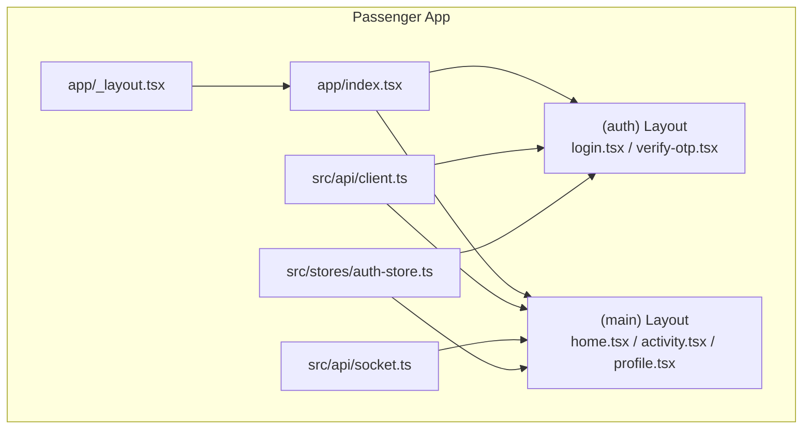

**Diagram sources**
- [apps/mobile-passenger/app/_layout.tsx](file://apps/mobile-passenger/app/_layout.tsx)
- [apps/mobile-passenger/app/index.tsx](file://apps/mobile-passenger/app/index.tsx)
- [apps/mobile-passenger/app/(auth)/_layout.tsx](file://apps/mobile-passenger/app/(auth)/_layout.tsx)
- [apps/mobile-passenger/app/(auth)/login.tsx](file://apps/mobile-passenger/app/(auth)/login.tsx)
- [apps/mobile-passenger/app/(auth)/verify-otp.tsx](file://apps/mobile-passenger/app/(auth)/verify-otp.tsx)
- [apps/mobile-passenger/app/(main)/_layout.tsx](file://apps/mobile-passenger/app/(main)/_layout.tsx)
- [apps/mobile-passenger/app/(main)/home.tsx](file://apps/mobile-passenger/app/(main)/home.tsx)
- [apps/mobile-passenger/app/(main)/activity.tsx](file://apps/mobile-passenger/app/(main)/activity.tsx)
- [apps/mobile-passenger/app/(main)/profile.tsx](file://apps/mobile-passenger/app/(main)/profile.tsx)
- [apps/mobile-passenger/src/api/client.ts](file://apps/mobile-passenger/src/api/client.ts)
- [apps/mobile-passenger/src/api/socket.ts](file://apps/mobile-passenger/src/api/socket.ts)
- [apps/mobile-passenger/src/stores/auth-store.ts](file://apps/mobile-passenger/src/stores/auth-store.ts)

**Section sources**
- [apps/mobile-passenger/app.json](file://apps/mobile-passenger/app.json)
- [apps/mobile-passenger/package.json](file://apps/mobile-passenger/package.json)
- [apps/mobile-passenger/metro.config.js](file://apps/mobile-passenger/metro.config.js)
- [apps/mobile-passenger/tsconfig.json](file://apps/mobile-passenger/tsconfig.json)
- [apps/mobile-passenger/app/_layout.tsx](file://apps/mobile-passenger/app/_layout.tsx)
- [apps/mobile-passenger/app/index.tsx](file://apps/mobile-passenger/app/index.tsx)

## Core Components
- Authentication screens: login and OTP verification
- Main layout and tabs: Home, Activity, Profile
- API client: centralized HTTP configuration and interceptors
- Socket client: real-time events for live tracking and updates
- Auth store: global authentication state and persistence

Key responsibilities:
- Navigation orchestration and route guards
- User session management and token handling
- Real-time communication for driver location and ride status
- Data fetching and caching for activities and profiles

**Section sources**
- [apps/mobile-passenger/app/(auth)/login.tsx](file://apps/mobile-passenger/app/(auth)/login.tsx)
- [apps/mobile-passenger/app/(auth)/verify-otp.tsx](file://apps/mobile-passenger/app/(auth)/verify-otp.tsx)
- [apps/mobile-passenger/app/(main)/home.tsx](file://apps/mobile-passenger/app/(main)/home.tsx)
- [apps/mobile-passenger/app/(main)/activity.tsx](file://apps/mobile-passenger/app/(main)/activity.tsx)
- [apps/mobile-passenger/app/(main)/profile.tsx](file://apps/mobile-passenger/app/(main)/profile.tsx)
- [apps/mobile-passenger/src/api/client.ts](file://apps/mobile-passenger/src/api/client.ts)
- [apps/mobile-passenger/src/api/socket.ts](file://apps/mobile-passenger/src/api/socket.ts)
- [apps/mobile-passenger/src/stores/auth-store.ts](file://apps/mobile-passenger/src/stores/auth-store.ts)

## Architecture Overview
The Passenger app follows a layered architecture:
- Presentation layer: Expo Router screens and layouts
- State layer: Auth store for session and UI state
- Integration layer: HTTP client and WebSocket client
- Backend services: REST APIs and event gateway for real-time updates

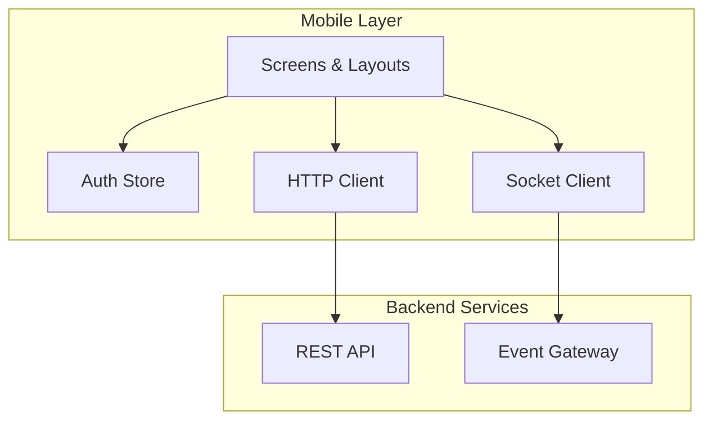

**Diagram sources**
- [apps/mobile-passenger/app/(main)/home.tsx](file://apps/mobile-passenger/app/(main)/home.tsx)
- [apps/mobile-passenger/app/(main)/activity.tsx](file://apps/mobile-passenger/app/(main)/activity.tsx)
- [apps/mobile-passenger/app/(main)/profile.tsx](file://apps/mobile-passenger/app/(main)/profile.tsx)
- [apps/mobile-passenger/src/api/client.ts](file://apps/mobile-passenger/src/api/client.ts)
- [apps/mobile-passenger/src/api/socket.ts](file://apps/mobile-passenger/src/api/socket.ts)
- [apps/mobile-passenger/src/stores/auth-store.ts](file://apps/mobile-passenger/src/stores/auth-store.ts)

## Detailed Component Analysis

### Authentication Flow
The authentication flow uses phone number login with OTP verification. After successful login, the app persists tokens and navigates to the main layout.

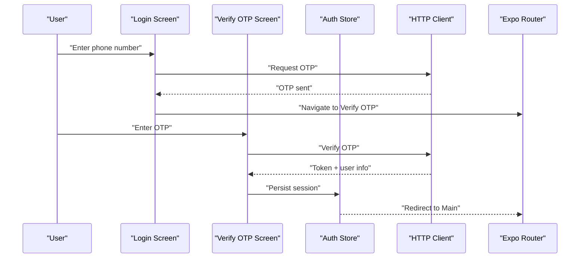

**Diagram sources**
- [apps/mobile-passenger/app/(auth)/login.tsx](file://apps/mobile-passenger/app/(auth)/login.tsx)
- [apps/mobile-passenger/app/(auth)/verify-otp.tsx](file://apps/mobile-passenger/app/(auth)/verify-otp.tsx)
- [apps/mobile-passenger/src/stores/auth-store.ts](file://apps/mobile-passenger/src/stores/auth-store.ts)
- [apps/mobile-passenger/src/api/client.ts](file://apps/mobile-passenger/src/api/client.ts)

**Section sources**
- [apps/mobile-passenger/app/(auth)/_layout.tsx](file://apps/mobile-passenger/app/(auth)/_layout.tsx)
- [apps/mobile-passenger/app/(auth)/login.tsx](file://apps/mobile-passenger/app/(auth)/login.tsx)
- [apps/mobile-passenger/app/(auth)/verify-otp.tsx](file://apps/mobile-passenger/app/(auth)/verify-otp.tsx)
- [apps/mobile-passenger/src/stores/auth-store.ts](file://apps/mobile-passenger/src/stores/auth-store.ts)
- [apps/mobile-passenger/src/api/client.ts](file://apps/mobile-passenger/src/api/client.ts)

### Ride Booking Workflow
The home screen enables users to request rides by selecting pickup and drop-off locations, confirming details, and receiving driver assignment. Real-time updates are delivered via WebSocket events.

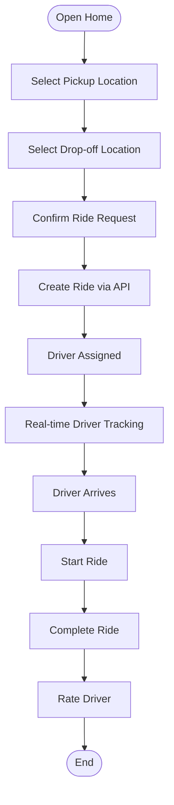

**Diagram sources**
- [apps/mobile-passenger/app/(main)/home.tsx](file://apps/mobile-passenger/app/(main)/home.tsx)
- [apps/mobile-passenger/src/api/client.ts](file://apps/mobile-passenger/src/api/client.ts)
- [apps/mobile-passenger/src/api/socket.ts](file://apps/mobile-passenger/src/api/socket.ts)

**Section sources**
- [apps/mobile-passenger/app/(main)/home.tsx](file://apps/mobile-passenger/app/(main)/home.tsx)
- [apps/mobile-passenger/src/api/client.ts](file://apps/mobile-passenger/src/api/client.ts)
- [apps/mobile-passenger/src/api/socket.ts](file://apps/mobile-passenger/src/api/socket.ts)

### Real-time Driver Tracking
Real-time tracking relies on WebSocket connections to receive driver location updates and ride status changes. The socket client manages connection lifecycle, reconnection logic, and event listeners.

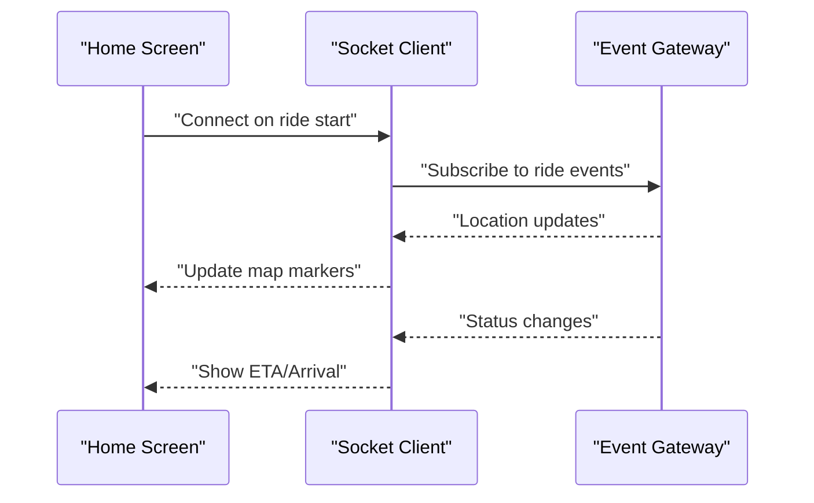

**Diagram sources**
- [apps/mobile-passenger/app/(main)/home.tsx](file://apps/mobile-passenger/app/(main)/home.tsx)
- [apps/mobile-passenger/src/api/socket.ts](file://apps/mobile-passenger/src/api/socket.ts)

**Section sources**
- [apps/mobile-passenger/src/api/socket.ts](file://apps/mobile-passenger/src/api/socket.ts)
- [apps/mobile-passenger/app/(main)/home.tsx](file://apps/mobile-passenger/app/(main)/home.tsx)

### Activity Dashboard
The activity screen lists past trips with details such as date, route, fare, and rating. Users can filter or search their history.

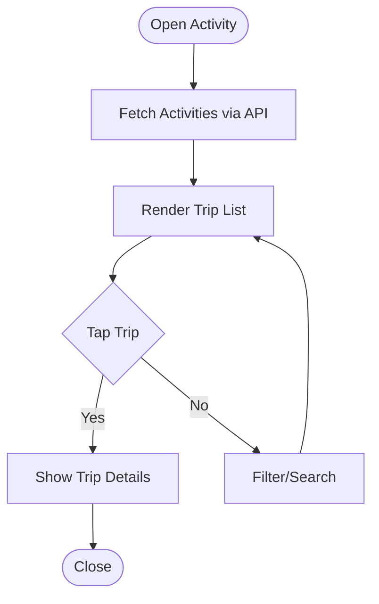

**Diagram sources**
- [apps/mobile-passenger/app/(main)/activity.tsx](file://apps/mobile-passenger/app/(main)/activity.tsx)
- [apps/mobile-passenger/src/api/client.ts](file://apps/mobile-passenger/src/api/client.ts)

**Section sources**
- [apps/mobile-passenger/app/(main)/activity.tsx](file://apps/mobile-passenger/app/(main)/activity.tsx)
- [apps/mobile-passenger/src/api/client.ts](file://apps/mobile-passenger/src/api/client.ts)

### Profile Management
The profile screen allows users to view and edit personal information, manage preferences, and handle account settings.

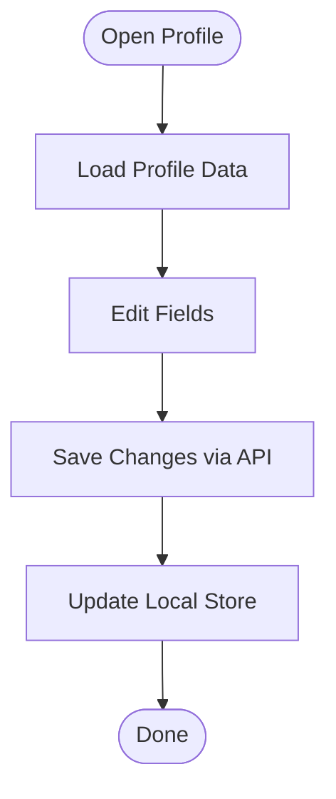

**Diagram sources**
- [apps/mobile-passenger/app/(main)/profile.tsx](file://apps/mobile-passenger/app/(main)/profile.tsx)
- [apps/mobile-passenger/src/api/client.ts](file://apps/mobile-passenger/src/api/client.ts)
- [apps/mobile-passenger/src/stores/auth-store.ts](file://apps/mobile-passenger/src/stores/auth-store.ts)

**Section sources**
- [apps/mobile-passenger/app/(main)/profile.tsx](file://apps/mobile-passenger/app/(main)/profile.tsx)
- [apps/mobile-passenger/src/api/client.ts](file://apps/mobile-passenger/src/api/client.ts)
- [apps/mobile-passenger/src/stores/auth-store.ts](file://apps/mobile-passenger/src/stores/auth-store.ts)

### Payment Processing Integration
Payment flows are integrated through the API client. Typical steps include initiating payment, processing via provider, and recording transaction results.

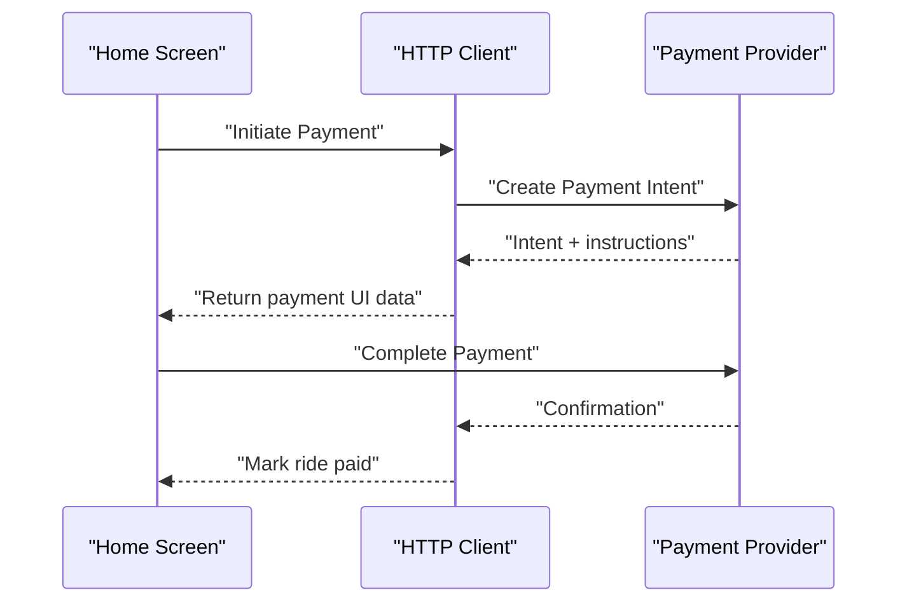

**Diagram sources**
- [apps/mobile-passenger/app/(main)/home.tsx](file://apps/mobile-passenger/app/(main)/home.tsx)
- [apps/mobile-passenger/src/api/client.ts](file://apps/mobile-passenger/src/api/client.ts)

**Section sources**
- [apps/mobile-passenger/app/(main)/home.tsx](file://apps/mobile-passenger/app/(main)/home.tsx)
- [apps/mobile-passenger/src/api/client.ts](file://apps/mobile-passenger/src/api/client.ts)

### Rating System
After completing a ride, passengers can rate drivers and optionally add feedback. Ratings are persisted via API and reflected in activity details.

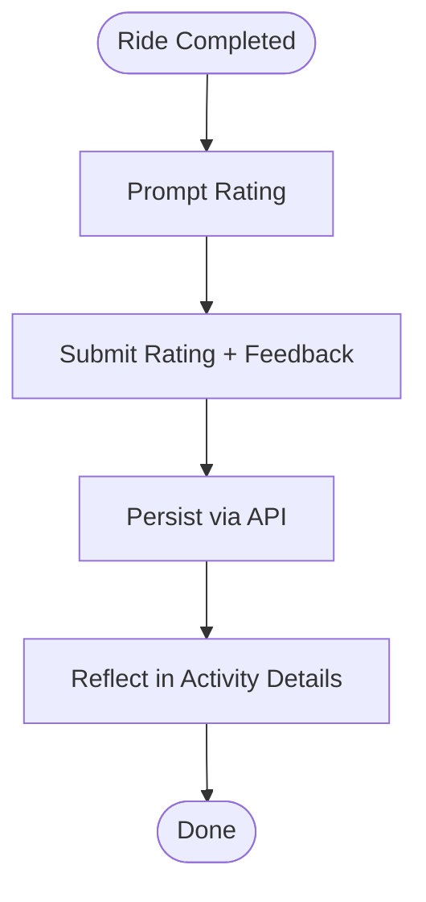

**Diagram sources**
- [apps/mobile-passenger/app/(main)/home.tsx](file://apps/mobile-passenger/app/(main)/home.tsx)
- [apps/mobile-passenger/app/(main)/activity.tsx](file://apps/mobile-passenger/app/(main)/activity.tsx)
- [apps/mobile-passenger/src/api/client.ts](file://apps/mobile-passenger/src/api/client.ts)

**Section sources**
- [apps/mobile-passenger/app/(main)/home.tsx](file://apps/mobile-passenger/app/(main)/home.tsx)
- [apps/mobile-passenger/app/(main)/activity.tsx](file://apps/mobile-passenger/app/(main)/activity.tsx)
- [apps/mobile-passenger/src/api/client.ts](file://apps/mobile-passenger/src/api/client.ts)

### Conceptual Overview
The following conceptual diagram illustrates the overall passenger journey from authentication to ride completion and post-ride actions.

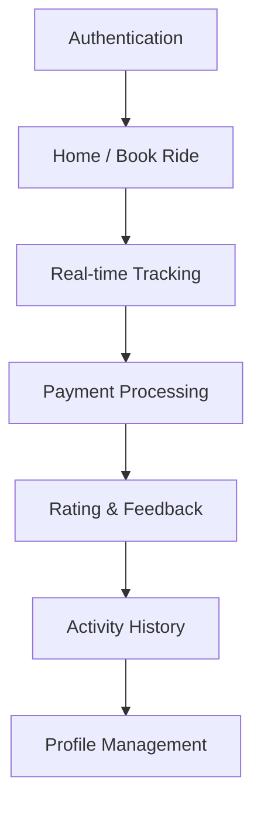

[No sources needed since this diagram shows conceptual workflow, not actual code structure]

## Dependency Analysis
The Passenger app depends on:
- Expo Router for navigation and layout composition
- Axios-like HTTP client for API calls
- WebSocket client for real-time events
- Auth store for session and UI state
- Metro bundler configuration for development and production builds

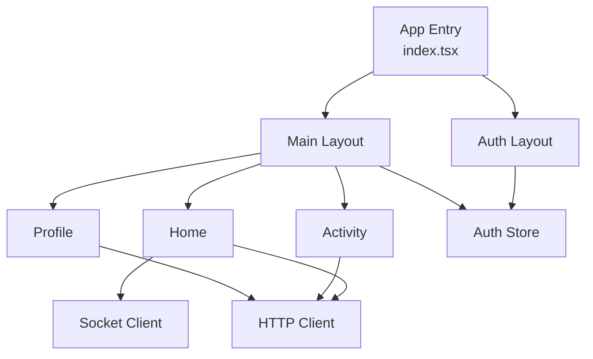

**Diagram sources**
- [apps/mobile-passenger/app/index.tsx](file://apps/mobile-passenger/app/index.tsx)
- [apps/mobile-passenger/app/(auth)/_layout.tsx](file://apps/mobile-passenger/app/(auth)/_layout.tsx)
- [apps/mobile-passenger/app/(main)/_layout.tsx](file://apps/mobile-passenger/app/(main)/_layout.tsx)
- [apps/mobile-passenger/app/(main)/home.tsx](file://apps/mobile-passenger/app/(main)/home.tsx)
- [apps/mobile-passenger/app/(main)/activity.tsx](file://apps/mobile-passenger/app/(main)/activity.tsx)
- [apps/mobile-passenger/app/(main)/profile.tsx](file://apps/mobile-passenger/app/(main)/profile.tsx)
- [apps/mobile-passenger/src/api/client.ts](file://apps/mobile-passenger/src/api/client.ts)
- [apps/mobile-passenger/src/api/socket.ts](file://apps/mobile-passenger/src/api/socket.ts)
- [apps/mobile-passenger/src/stores/auth-store.ts](file://apps/mobile-passenger/src/stores/auth-store.ts)

**Section sources**
- [apps/mobile-passenger/package.json](file://apps/mobile-passenger/package.json)
- [apps/mobile-passenger/metro.config.js](file://apps/mobile-passenger/metro.config.js)
- [apps/mobile-passenger/tsconfig.json](file://apps/mobile-passenger/tsconfig.json)

## Performance Considerations
- Minimize re-renders by memoizing components and selectors
- Use pagination and virtualization for long lists in Activity
- Debounce location updates and map interactions
- Implement optimistic UI for ride requests and ratings
- Cache API responses where appropriate
- Keep WebSocket subscriptions scoped to active screens
- Optimize images and assets; use platform-specific resources
- Monitor bundle size and lazy-load heavy modules

[No sources needed since this section provides general guidance]

## Troubleshooting Guide
Common issues and resolutions:
- Authentication failures: Validate phone format, ensure OTP expiry handling, refresh tokens if supported
- Network errors: Retry policies, offline fallbacks, clear error messages
- WebSocket disconnects: Reconnect logic, exponential backoff, graceful degradation
- Map rendering lag: Reduce marker updates, throttle location events
- Payment failures: Handle provider errors, retry flows, refund notifications
- Profile save conflicts: Conflict resolution, last-write-wins strategy

**Section sources**
- [apps/mobile-passenger/src/api/client.ts](file://apps/mobile-passenger/src/api/client.ts)
- [apps/mobile-passenger/src/api/socket.ts](file://apps/mobile-passenger/src/api/socket.ts)
- [apps/mobile-passenger/src/stores/auth-store.ts](file://apps/mobile-passenger/src/stores/auth-store.ts)

## Conclusion
The Passenger Mobile Application provides a robust foundation for the passenger journey, integrating authentication, ride booking, real-time tracking, payments, ratings, activity history, and profile management. By leveraging Expo Router, a centralized API client, and a WebSocket client, the app delivers responsive and reliable experiences across platforms. Following the recommended enhancements and performance optimizations will further improve usability and scalability.

[No sources needed since this section summarizes without analyzing specific files]

## Appendices

### API Client Configuration
- Base URL and environment variables
- Interceptors for headers, retries, and error mapping
- Token injection and refresh strategies

**Section sources**
- [apps/mobile-passenger/src/api/client.ts](file://apps/mobile-passenger/src/api/client.ts)

### Push Notification Handling
- Registration and permission prompts
- Message routing to relevant screens
- Background and foreground handlers

[No sources needed since this section provides general guidance]

### Cross-Platform Compatibility
- Platform-specific code paths
- Asset and font considerations
- Testing on iOS and Android emulators/devices

**Section sources**
- [apps/mobile-passenger/app.json](file://apps/mobile-passenger/app.json)
- [apps/mobile-passenger/metro.config.js](file://apps/mobile-passenger/metro.config.js)