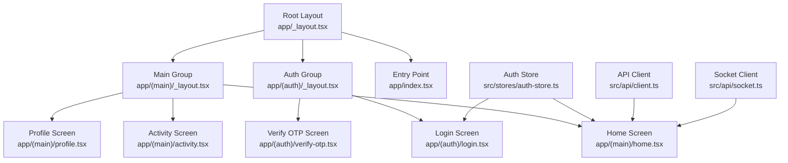
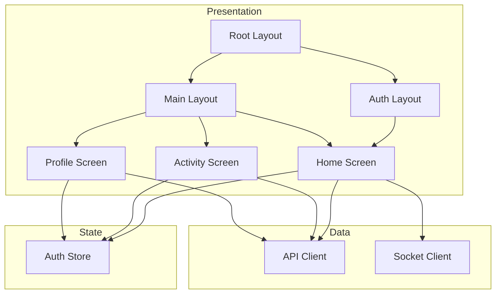
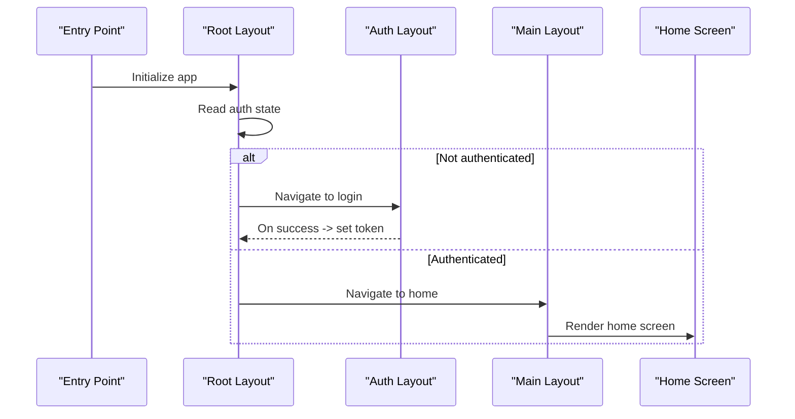
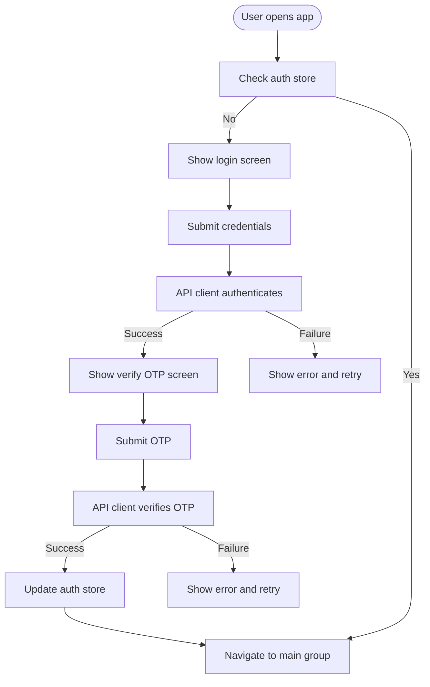
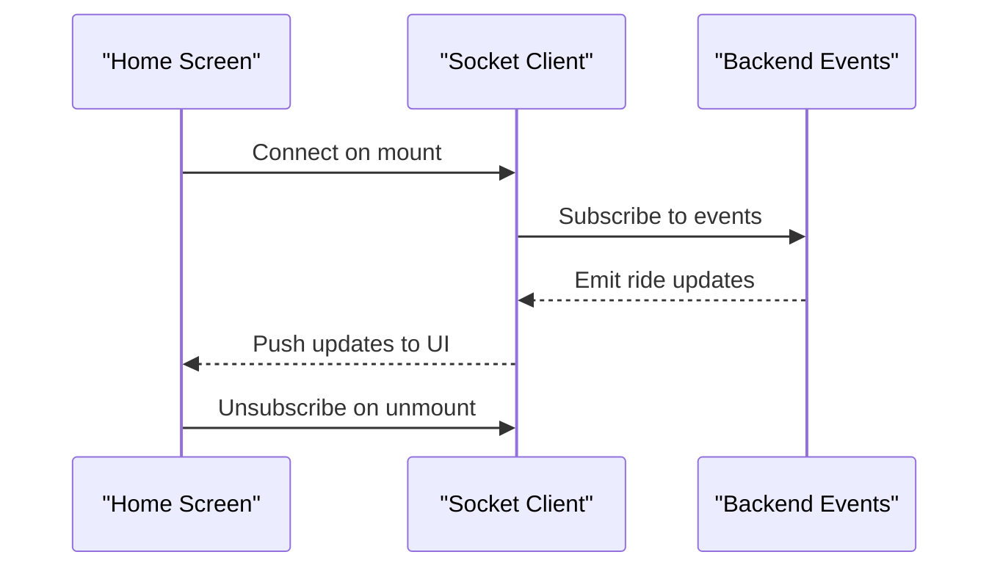
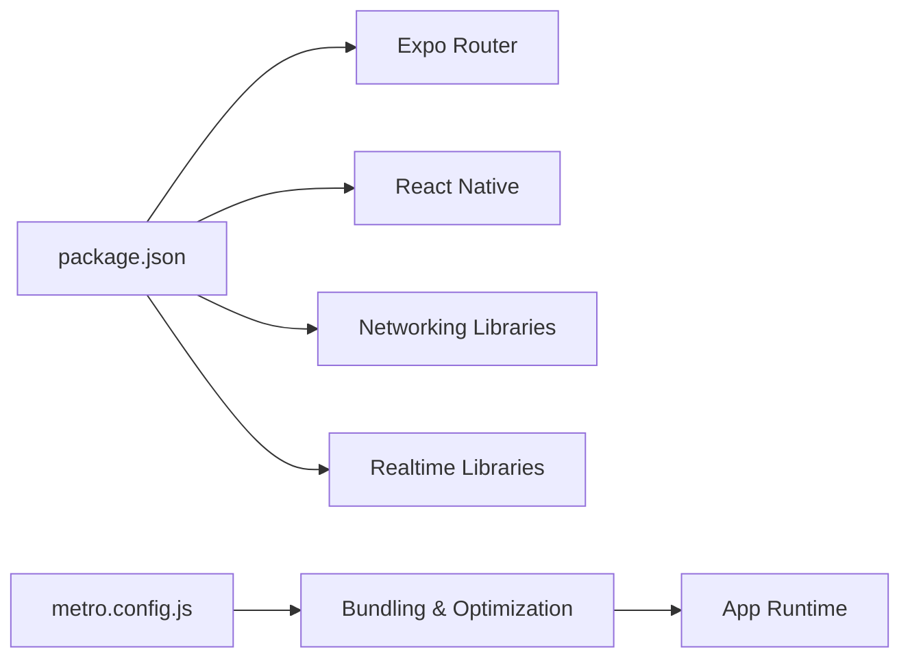

# User Experience & Design Patterns

<cite>
**Referenced Files in This Document**
- [apps/mobile-passenger/app/_layout.tsx](file://apps/mobile-passenger/app/_layout.tsx)
- [apps/mobile-passenger/app/index.tsx](file://apps/mobile-passenger/app/index.tsx)
- [apps/mobile-passenger/app/(auth)/_layout.tsx](file://apps/mobile-passenger/app/(auth)/_layout.tsx)
- [apps/mobile-passenger/app/(auth)/login.tsx](file://apps/mobile-passenger/app/(auth)/login.tsx)
- [apps/mobile-passenger/app/(auth)/verify-otp.tsx](file://apps/mobile-passenger/app/(auth)/verify-otp.tsx)
- [apps/mobile-passenger/app/(main)/_layout.tsx](file://apps/mobile-passenger/app/(main)/_layout.tsx)
- [apps/mobile-passenger/app/(main)/home.tsx](file://apps/mobile-passenger/app/(main)/home.tsx)
- [apps/mobile-passenger/app/(main)/activity.tsx](file://apps/mobile-passenger/app/(main)/activity.tsx)
- [apps/mobile-passenger/app/(main)/profile.tsx](file://apps/mobile-passenger/app/(main)/profile.tsx)
- [apps/mobile-passenger/src/stores/auth-store.ts](file://apps/mobile-passenger/src/stores/auth-store.ts)
- [apps/mobile-passenger/src/api/client.ts](file://apps/mobile-passenger/src/api/client.ts)
- [apps/mobile-passenger/src/api/socket.ts](file://apps/mobile-passenger/src/api/socket.ts)
- [apps/mobile-passenger/metro.config.js](file://apps/mobile-passenger/metro.config.js)
- [apps/mobile-passenger/package.json](file://apps/mobile-passenger/package.json)
</cite>

## Table of Contents
1. [Introduction](#introduction)
2. [Project Structure](#project-structure)
3. [Core Components](#core-components)
4. [Architecture Overview](#architecture-overview)
5. [Detailed Component Analysis](#detailed-component-analysis)
6. [Dependency Analysis](#dependency-analysis)
7. [Performance Considerations](#performance-considerations)
8. [Troubleshooting Guide](#troubleshooting-guide)
9. [Conclusion](#conclusion)

## Introduction
This document explains the passenger app’s user experience design patterns and architectural decisions with a focus on navigation, transitions, gestures, accessibility, responsive design, theming, loading states, error boundaries, configuration, build optimization, bundle splitting, performance monitoring, interaction feedback, haptics, platform-specific optimizations, memory management, image optimization, and battery efficiency. It is intended for both technical and non-technical readers to understand how the app is structured and how UX best practices are implemented.

## Project Structure
The passenger app follows Expo Router conventions under apps/mobile-passenger:
- App entry and root layout define global navigation and providers.
- Grouped routes organize authentication flows and main app screens.
- Shared stores and API clients centralize state and networking.
- Metro configuration controls bundling and performance settings.

**Diagram sources**
- [apps/mobile-passenger/app/_layout.tsx](file://apps/mobile-passenger/app/_layout.tsx)
- [apps/mobile-passenger/app/index.tsx](file://apps/mobile-passenger/app/index.tsx)
- [apps/mobile-passenger/app/(auth)/_layout.tsx](file://apps/mobile-passenger/app/(auth)/_layout.tsx)
- [apps/mobile-passenger/app/(auth)/login.tsx](file://apps/mobile-passenger/app/(auth)/login.tsx)
- [apps/mobile-passenger/app/(auth)/verify-otp.tsx](file://apps/mobile-passenger/app/(auth)/verify-otp.tsx)
- [apps/mobile-passenger/app/(main)/_layout.tsx](file://apps/mobile-passenger/app/(main)/_layout.tsx)
- [apps/mobile-passenger/app/(main)/home.tsx](file://apps/mobile-passenger/app/(main)/home.tsx)
- [apps/mobile-passenger/app/(main)/activity.tsx](file://apps/mobile-passenger/app/(main)/activity.tsx)
- [apps/mobile-passenger/app/(main)/profile.tsx](file://apps/mobile-passenger/app/(main)/profile.tsx)
- [apps/mobile-passenger/src/stores/auth-store.ts](file://apps/mobile-passenger/src/stores/auth-store.ts)
- [apps/mobile-passenger/src/api/client.ts](file://apps/mobile-passenger/src/api/client.ts)
- [apps/mobile-passenger/src/api/socket.ts](file://apps/mobile-passenger/src/api/socket.ts)

**Section sources**
- [apps/mobile-passenger/app/_layout.tsx](file://apps/mobile-passenger/app/_layout.tsx)
- [apps/mobile-passenger/app/index.tsx](file://apps/mobile-passenger/app/index.tsx)
- [apps/mobile-passenger/app/(auth)/_layout.tsx](file://apps/mobile-passenger/app/(auth)/_layout.tsx)
- [apps/mobile-passenger/app/(auth)/login.tsx](file://apps/mobile-passenger/app/(auth)/login.tsx)
- [apps/mobile-passenger/app/(auth)/verify-otp.tsx](file://apps/mobile-passenger/app/(auth)/verify-otp.tsx)
- [apps/mobile-passenger/app/(main)/_layout.tsx](file://apps/mobile-passenger/app/(main)/_layout.tsx)
- [apps/mobile-passenger/app/(main)/home.tsx](file://apps/mobile-passenger/app/(main)/home.tsx)
- [apps/mobile-passenger/app/(main)/activity.tsx](file://apps/mobile-passenger/app/(main)/activity.tsx)
- [apps/mobile-passenger/app/(main)/profile.tsx](file://apps/mobile-passenger/app/(main)/profile.tsx)
- [apps/mobile-passenger/src/stores/auth-store.ts](file://apps/mobile-passenger/src/stores/auth-store.ts)
- [apps/mobile-passenger/src/api/client.ts](file://apps/mobile-passenger/src/api/client.ts)
- [apps/mobile-passenger/src/api/socket.ts](file://apps/mobile-passenger/src/api/socket.ts)

## Core Components
- Root layout and entry point orchestrate navigation groups and initial route selection.
- Auth group manages login and OTP verification flows.
- Main group hosts primary screens (home, activity, profile).
- Auth store persists session state and guards protected routes.
- API client centralizes HTTP requests and error handling.
- Socket client enables real-time updates for ride status and notifications.

Key responsibilities:
- Navigation setup and deep linking via Expo Router.
- Route-level guards using auth store.
- Consistent screen composition and shared UI patterns.
- Centralized data fetching and real-time event subscriptions.

**Section sources**
- [apps/mobile-passenger/app/_layout.tsx](file://apps/mobile-passenger/app/_layout.tsx)
- [apps/mobile-passenger/app/index.tsx](file://apps/mobile-passenger/app/index.tsx)
- [apps/mobile-passenger/app/(auth)/_layout.tsx](file://apps/mobile-passenger/app/(auth)/_layout.tsx)
- [apps/mobile-passenger/app/(main)/_layout.tsx](file://apps/mobile-passenger/app/(main)/_layout.tsx)
- [apps/mobile-passenger/src/stores/auth-store.ts](file://apps/mobile-passenger/src/stores/auth-store.ts)
- [apps/mobile-passenger/src/api/client.ts](file://apps/mobile-passenger/src/api/client.ts)
- [apps/mobile-passenger/src/api/socket.ts](file://apps/mobile-passenger/src/api/socket.ts)

## Architecture Overview
The app uses a layered architecture:
- Presentation layer: Screens and layouts built with React Native and Expo Router.
- State layer: Auth store for session and user context.
- Data layer: API client for REST calls and socket client for live events.
- Infrastructure: Metro bundler configuration for performance tuning.

**Diagram sources**
- [apps/mobile-passenger/app/_layout.tsx](file://apps/mobile-passenger/app/_layout.tsx)
- [apps/mobile-passenger/app/(auth)/_layout.tsx](file://apps/mobile-passenger/app/(auth)/_layout.tsx)
- [apps/mobile-passenger/app/(main)/_layout.tsx](file://apps/mobile-passenger/app/(main)/_layout.tsx)
- [apps/mobile-passenger/app/(main)/home.tsx](file://apps/mobile-passenger/app/(main)/home.tsx)
- [apps/mobile-passenger/app/(main)/activity.tsx](file://apps/mobile-passenger/app/(main)/activity.tsx)
- [apps/mobile-passenger/app/(main)/profile.tsx](file://apps/mobile-passenger/app/(main)/profile.tsx)
- [apps/mobile-passenger/src/stores/auth-store.ts](file://apps/mobile-passenger/src/stores/auth-store.ts)
- [apps/mobile-passenger/src/api/client.ts](file://apps/mobile-passenger/src/api/client.ts)
- [apps/mobile-passenger/src/api/socket.ts](file://apps/mobile-passenger/src/api/socket.ts)

## Detailed Component Analysis

### Navigation Setup and Transitions
- Uses Expo Router with grouped routes for auth and main sections.
- Root layout configures navigation container and sets initial route based on auth state.
- Auth group protects login and OTP verification; main group provides tab or stack navigation for home, activity, and profile.
- Transitions leverage default Expo Router animations; custom transition configs can be applied per screen.

**Diagram sources**
- [apps/mobile-passenger/app/index.tsx](file://apps/mobile-passenger/app/index.tsx)
- [apps/mobile-passenger/app/_layout.tsx](file://apps/mobile-passenger/app/_layout.tsx)
- [apps/mobile-passenger/app/(auth)/_layout.tsx](file://apps/mobile-passenger/app/(auth)/_layout.tsx)
- [apps/mobile-passenger/app/(main)/_layout.tsx](file://apps/mobile-passenger/app/(main)/_layout.tsx)
- [apps/mobile-passenger/app/(main)/home.tsx](file://apps/mobile-passenger/app/(main)/home.tsx)

**Section sources**
- [apps/mobile-passenger/app/_layout.tsx](file://apps/mobile-passenger/app/_layout.tsx)
- [apps/mobile-passenger/app/index.tsx](file://apps/mobile-passenger/app/index.tsx)
- [apps/mobile-passenger/app/(auth)/_layout.tsx](file://apps/mobile-passenger/app/(auth)/_layout.tsx)
- [apps/mobile-passenger/app/(main)/_layout.tsx](file://apps/mobile-passenger/app/(main)/_layout.tsx)

### Gesture Handling
- Touch interactions are handled at the screen level using standard React Native gesture APIs.
- For complex gestures (swipe-to-dismiss, pull-to-refresh), integrate dedicated gesture handlers within each screen component.
- Ensure gestures do not conflict with system back navigation and safe areas.

Best practices:
- Use native driver for smooth animations when possible.
- Debounce rapid taps to prevent duplicate actions.
- Provide visual feedback for long-press and swipe actions.

[No sources needed since this section provides general guidance]

### Accessibility Features
- Assign meaningful accessibility labels to interactive elements.
- Support dynamic type scaling and high contrast modes.
- Ensure sufficient color contrast and keyboard navigation where applicable.
- Announce critical state changes via accessibility announcements.

Implementation tips:
- Wrap key components with accessibility hints and roles.
- Test with VoiceOver (iOS) and TalkBack (Android).
- Validate focus order and skip links for complex screens.

[No sources needed since this section provides general guidance]

### Responsive Design Approach
- Use relative units and flexbox to adapt to different screen sizes.
- Leverage SafeAreaView to avoid notches and system UI overlaps.
- Implement conditional layouts for portrait/landscape orientations.
- Prefer scalable typography and spacing scales.

[No sources needed since this section provides general guidance]

### Theme Management
- Centralize colors, typography, and spacing in a theme object.
- Expose theme-aware hooks to components for consistent styling.
- Support light/dark mode toggles and persist user preference.
- Ensure all assets and icons are available in multiple variants if needed.

[No sources needed since this section provides general guidance]

### Loading States and Error Boundaries
- Show skeleton loaders during data fetches to improve perceived performance.
- Display inline errors with retry actions for failed network requests.
- Wrap critical trees with error boundaries to catch rendering errors gracefully.
- Log errors to analytics and provide user-friendly messages.

[No sources needed since this section provides general guidance]

### Authentication Flow
- Login screen collects credentials and triggers API client to authenticate.
- Verify OTP screen validates one-time password and updates auth store.
- Protected routes check auth store before rendering main screens.

**Diagram sources**
- [apps/mobile-passenger/app/(auth)/login.tsx](file://apps/mobile-passenger/app/(auth)/login.tsx)
- [apps/mobile-passenger/app/(auth)/verify-otp.tsx](file://apps/mobile-passenger/app/(auth)/verify-otp.tsx)
- [apps/mobile-passenger/src/stores/auth-store.ts](file://apps/mobile-passenger/src/stores/auth-store.ts)
- [apps/mobile-passenger/src/api/client.ts](file://apps/mobile-passenger/src/api/client.ts)

**Section sources**
- [apps/mobile-passenger/app/(auth)/login.tsx](file://apps/mobile-passenger/app/(auth)/login.tsx)
- [apps/mobile-passenger/app/(auth)/verify-otp.tsx](file://apps/mobile-passenger/app/(auth)/verify-otp.tsx)
- [apps/mobile-passenger/src/stores/auth-store.ts](file://apps/mobile-passenger/src/stores/auth-store.ts)
- [apps/mobile-passenger/src/api/client.ts](file://apps/mobile-passenger/src/api/client.ts)

### Real-Time Updates
- Socket client connects to backend events for live ride status and notifications.
- Subscribe/unsubscribe lifecycle should align with screen visibility to reduce overhead.
- Handle reconnection logic and offline states gracefully.

**Diagram sources**
- [apps/mobile-passenger/app/(main)/home.tsx](file://apps/mobile-passenger/app/(main)/home.tsx)
- [apps/mobile-passenger/src/api/socket.ts](file://apps/mobile-passenger/src/api/socket.ts)

**Section sources**
- [apps/mobile-passenger/app/(main)/home.tsx](file://apps/mobile-passenger/app/(main)/home.tsx)
- [apps/mobile-passenger/src/api/socket.ts](file://apps/mobile-passenger/src/api/socket.ts)

### User Interaction Patterns and Feedback
- Provide immediate feedback for user actions (e.g., button press states).
- Use progress indicators for long-running operations.
- Offer clear error messages with actionable steps.
- Implement haptic responses for confirmations and destructive actions.

Platform-specific notes:
- iOS: Use Vibration API sparingly; prefer subtle haptics.
- Android: Align haptic intensity with system preferences.

[No sources needed since this section provides general guidance]

### Platform-Specific Optimizations
- iOS: Enable hardware acceleration for animations; respect safe areas and notch.
- Android: Use vector drawables and minimize layout depth.
- Cross-platform: Avoid heavy synchronous work on the UI thread.

[No sources needed since this section provides general guidance]

### Memory Management
- Unsubscribe from sockets and listeners on screen unmount.
- Cancel pending network requests when navigating away.
- Avoid retaining large objects in global state; use pagination and virtualization.

[No sources needed since this section provides general guidance]

### Image Optimization
- Use appropriate image formats (WebP/AVIF) and resolutions.
- Cache images locally and leverage CDN with resizing parameters.
- Defer offscreen images and implement placeholders.

[No sources needed since this section provides general guidance]

### Battery Efficiency
- Reduce background polling; rely on push notifications and websockets.
- Batch API calls and coalesce frequent updates.
- Throttle location updates and disable sensors when not needed.

[No sources needed since this section provides general guidance]

## Dependency Analysis
The passenger app depends on Expo Router for navigation, an auth store for state, and API/socket clients for data. Metro configuration impacts bundling and runtime performance.

**Diagram sources**
- [apps/mobile-passenger/package.json](file://apps/mobile-passenger/package.json)
- [apps/mobile-passenger/metro.config.js](file://apps/mobile-passenger/metro.config.js)

**Section sources**
- [apps/mobile-passenger/package.json](file://apps/mobile-passenger/package.json)
- [apps/mobile-passenger/metro.config.js](file://apps/mobile-passenger/metro.config.js)

## Performance Considerations
- Bundle splitting: Configure code splitting by route to reduce initial load.
- Tree shaking: Remove unused dependencies and enable production builds.
- Image caching: Implement robust caching strategies to avoid repeated downloads.
- Monitoring: Integrate performance metrics (navigation timing, FPS, memory usage) and log anomalies.
- Profiling: Use React DevTools and Flipper to identify bottlenecks.

[No sources needed since this section provides general guidance]

## Troubleshooting Guide
Common issues and resolutions:
- Navigation loops: Ensure auth guards correctly redirect and do not trigger infinite re-renders.
- Socket disconnects: Implement exponential backoff and reconnect handlers.
- Network failures: Surface user-friendly errors and allow retries.
- Memory leaks: Verify cleanup of listeners and timers on unmount.

Diagnostic steps:
- Inspect console logs and error boundaries.
- Review network requests and WebSocket frames.
- Profile memory snapshots to detect retained references.

[No sources needed since this section provides general guidance]

## Conclusion
The passenger app leverages Expo Router for intuitive navigation, centralized state via an auth store, and robust data layers through API and socket clients. By applying responsive design, accessible patterns, efficient theming, and careful performance tuning, the app delivers a smooth and reliable user experience across platforms. Continuous monitoring and disciplined memory management ensure long-term stability and battery efficiency.