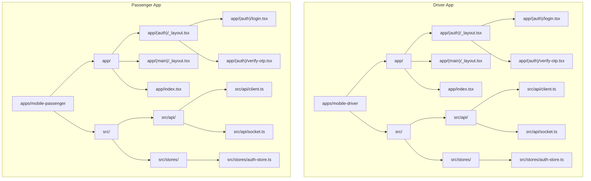
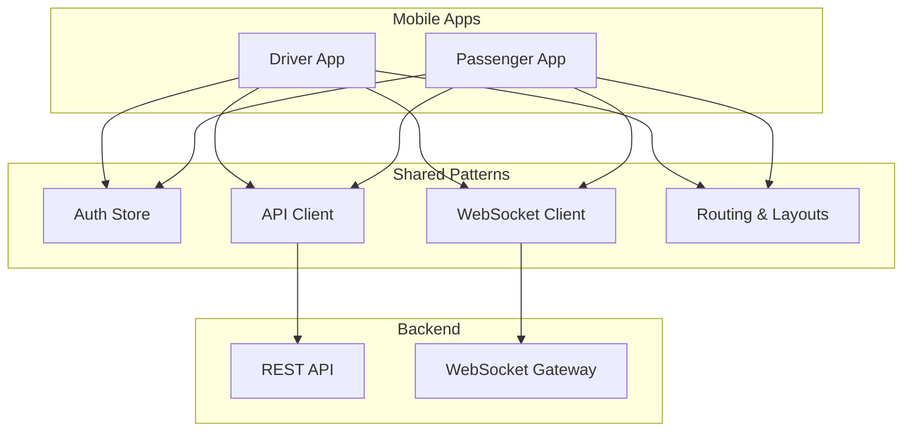
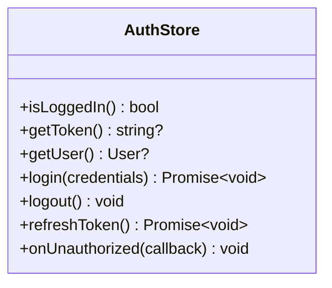
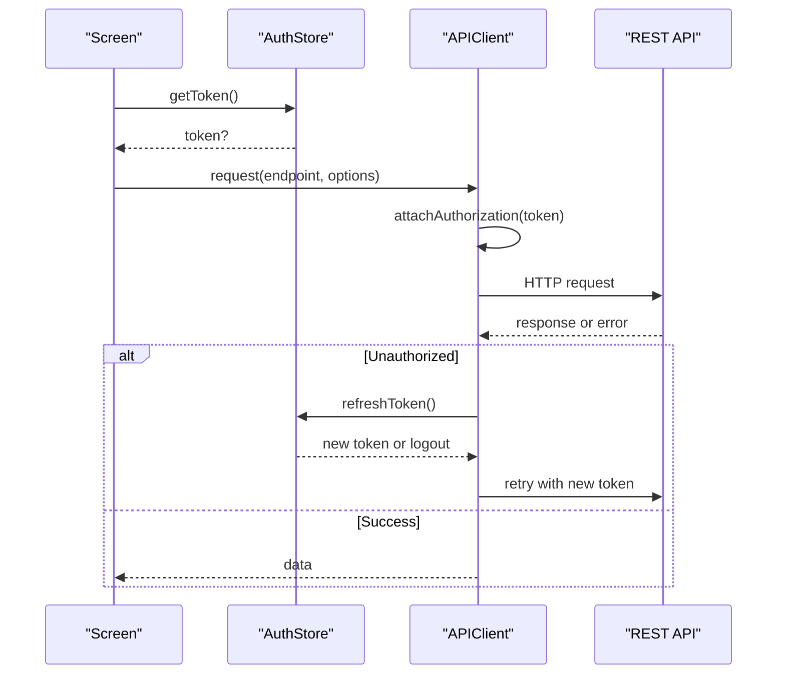
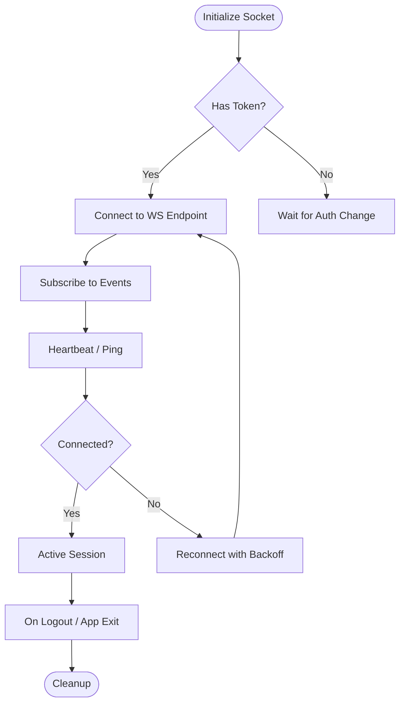
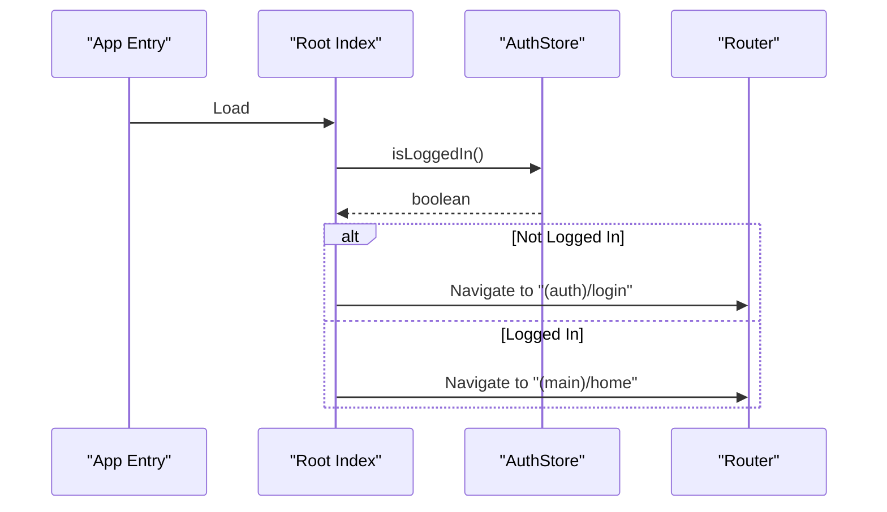
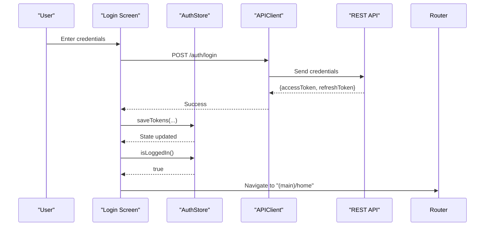
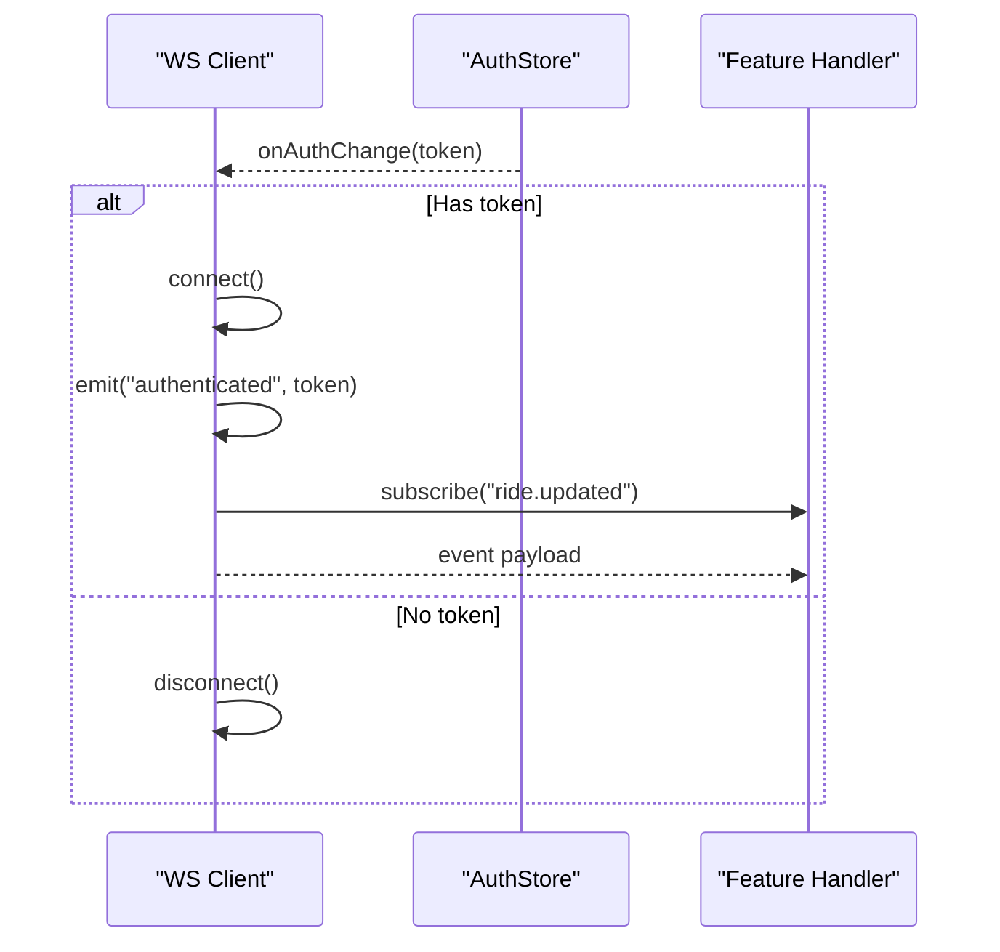
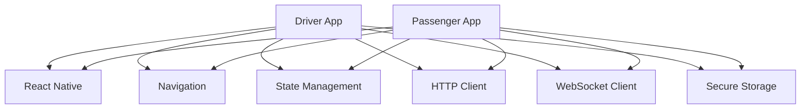

# Shared Mobile Patterns

<cite>
**Referenced Files in This Document**
- [auth-store.ts](file://apps/mobile-driver/src/stores/auth-store.ts)
- [client.ts](file://apps/mobile-driver/src/api/client.ts)
- [socket.ts](file://apps/mobile-driver/src/api/socket.ts)
- [auth-store.ts](file://apps/mobile-passenger/src/stores/auth-store.ts)
- [client.ts](file://apps/mobile-passenger/src/api/client.ts)
- [socket.ts](file://apps/mobile-passenger/src/api/socket.ts)
- [_layout.tsx](file://apps/mobile-driver/app/_layout.tsx)
- [_layout.tsx](file://apps/mobile-passenger/app/_layout.tsx)
- [index.tsx](file://apps/mobile-driver/app/index.tsx)
- [index.tsx](file://apps/mobile-passenger/app/index.tsx)
- [login.tsx](file://apps/mobile-driver/app/(auth)/login.tsx)
- [verify-otp.tsx](file://apps/mobile-driver/app/(auth)/verify-otp.tsx)
- [login.tsx](file://apps/mobile-passenger/app/(auth)/login.tsx)
- [verify-otp.tsx](file://apps/mobile-passenger/app/(auth)/verify-otp.tsx)
- [package.json](file://apps/mobile-driver/package.json)
- [package.json](file://apps/mobile-passenger/package.json)
</cite>

## Table of Contents
1. [Introduction](#introduction)
2. [Project Structure](#project-structure)
3. [Core Components](#core-components)
4. [Architecture Overview](#architecture-overview)
5. [Detailed Component Analysis](#detailed-component-analysis)
6. [Dependency Analysis](#dependency-analysis)
7. [Performance Considerations](#performance-considerations)
8. [Troubleshooting Guide](#troubleshooting-guide)
9. [Conclusion](#conclusion)

## Introduction
This document describes the shared mobile development patterns and architecture used consistently across both driver and passenger applications. It focuses on common authentication store implementation, WebSocket client configuration, API client setup, routing patterns, shared UI components, navigation structure, error handling strategies, state management approaches, authentication flow, token management, session handling, security best practices, real-time communication patterns, socket connection management, event handling, reconnection strategies, code organization principles, file structure conventions, testing strategies, and performance optimization techniques.

## Project Structure
Both mobile apps follow a similar layout:
- app directory with route groups for authentication and main flows
- src/api for HTTP and WebSocket clients
- src/stores for global state (authentication)
- package.json for dependencies and scripts

**Diagram sources**
- [_layout.tsx](file://apps/mobile-driver/app/_layout.tsx)
- [_layout.tsx](file://apps/mobile-passenger/app/_layout.tsx)
- [index.tsx](file://apps/mobile-driver/app/index.tsx)
- [index.tsx](file://apps/mobile-passenger/app/index.tsx)
- [login.tsx](file://apps/mobile-driver/app/(auth)/login.tsx)
- [verify-otp.tsx](file://apps/mobile-driver/app/(auth)/verify-otp.tsx)
- [login.tsx](file://apps/mobile-passenger/app/(auth)/login.tsx)
- [verify-otp.tsx](file://apps/mobile-passenger/app/(auth)/verify-otp.tsx)
- [client.ts](file://apps/mobile-driver/src/api/client.ts)
- [socket.ts](file://apps/mobile-driver/src/api/socket.ts)
- [auth-store.ts](file://apps/mobile-driver/src/stores/auth-store.ts)
- [client.ts](file://apps/mobile-passenger/src/api/client.ts)
- [socket.ts](file://apps/mobile-passenger/src/api/socket.ts)
- [auth-store.ts](file://apps/mobile-passenger/src/stores/auth-store.ts)

**Section sources**
- [_layout.tsx](file://apps/mobile-driver/app/_layout.tsx)
- [_layout.tsx](file://apps/mobile-passenger/app/_layout.tsx)
- [index.tsx](file://apps/mobile-driver/app/index.tsx)
- [index.tsx](file://apps/mobile-passenger/app/index.tsx)
- [client.ts](file://apps/mobile-driver/src/api/client.ts)
- [socket.ts](file://apps/mobile-driver/src/api/socket.ts)
- [auth-store.ts](file://apps/mobile-driver/src/stores/auth-store.ts)
- [client.ts](file://apps/mobile-passenger/src/api/client.ts)
- [socket.ts](file://apps/mobile-passenger/src/api/socket.ts)
- [auth-store.ts](file://apps/mobile-passenger/src/stores/auth-store.ts)

## Core Components
The following core components are implemented consistently across both apps:

- Authentication Store
  - Centralized user session and token state
  - Provides login, logout, refresh, and verification actions
  - Persists tokens securely and exposes reactive getters

- API Client
  - Configured base URL and headers
  - Interceptors for attaching tokens and handling errors
  - Typed request/response helpers

- WebSocket Client
  - Singleton socket instance per app
  - Connection lifecycle management (connect, disconnect, reconnect)
  - Event subscription/unsubscription utilities

- Routing and Layouts
  - Route groups for auth vs main flows
  - Root index to redirect based on auth state
  - Layouts that wrap screens with providers and guards

**Section sources**
- [auth-store.ts](file://apps/mobile-driver/src/stores/auth-store.ts)
- [auth-store.ts](file://apps/mobile-passenger/src/stores/auth-store.ts)
- [client.ts](file://apps/mobile-driver/src/api/client.ts)
- [client.ts](file://apps/mobile-passenger/src/api/client.ts)
- [socket.ts](file://apps/mobile-driver/src/api/socket.ts)
- [socket.ts](file://apps/mobile-passenger/src/api/socket.ts)
- [_layout.tsx](file://apps/mobile-driver/app/_layout.tsx)
- [_layout.tsx](file://apps/mobile-passenger/app/_layout.tsx)
- [index.tsx](file://apps/mobile-driver/app/index.tsx)
- [index.tsx](file://apps/mobile-passenger/app/index.tsx)

## Architecture Overview
High-level architecture shows how the apps interact with backend services via HTTP and WebSocket, while sharing consistent patterns for state, networking, and routing.

[No sources needed since this diagram shows conceptual workflow, not actual code structure]

## Detailed Component Analysis

### Authentication Store
Responsibilities:
- Manage user identity and token lifecycle
- Provide login/logout/refresh operations
- Persist tokens securely and expose reactive state
- Coordinate with API client to attach tokens and handle unauthorized responses

Key behaviors:
- On login success, persist tokens and update state
- On logout, clear persisted tokens and reset state
- On network errors indicating expired tokens, trigger refresh or logout
- Expose getters for current user and token presence

**Diagram sources**
- [auth-store.ts](file://apps/mobile-driver/src/stores/auth-store.ts)
- [auth-store.ts](file://apps/mobile-passenger/src/stores/auth-store.ts)

**Section sources**
- [auth-store.ts](file://apps/mobile-driver/src/stores/auth-store.ts)
- [auth-store.ts](file://apps/mobile-passenger/src/stores/auth-store.ts)

### API Client
Responsibilities:
- Configure base URL and default headers
- Attach authorization header using token from Auth Store
- Handle common errors (network, server, validation)
- Provide typed wrappers for endpoints

Interceptors:
- Request interceptor adds Authorization header when available
- Response interceptor handles 401 by triggering token refresh or logout
- Centralized error mapping to user-friendly messages

**Diagram sources**
- [client.ts](file://apps/mobile-driver/src/api/client.ts)
- [client.ts](file://apps/mobile-passenger/src/api/client.ts)
- [auth-store.ts](file://apps/mobile-driver/src/stores/auth-store.ts)
- [auth-store.ts](file://apps/mobile-passenger/src/stores/auth-store.ts)

**Section sources**
- [client.ts](file://apps/mobile-driver/src/api/client.ts)
- [client.ts](file://apps/mobile-passenger/src/api/client.ts)

### WebSocket Client
Responsibilities:
- Maintain a singleton socket connection
- Connect/disconnect based on app lifecycle and auth state
- Emit and subscribe to events
- Implement reconnection strategy with exponential backoff

Connection lifecycle:
- Initialize with endpoint and options
- On connect, emit authenticated event if token present
- On disconnect, schedule reconnection attempts
- On auth change, reconnect if necessary

Event handling:
- Centralized event registry per domain (e.g., rides, notifications)
- Safe unsubscription to prevent memory leaks

Reconnection strategy:
- Exponential backoff with jitter
- Max retries and timeout thresholds
- Graceful degradation when offline

**Diagram sources**
- [socket.ts](file://apps/mobile-driver/src/api/socket.ts)
- [socket.ts](file://apps/mobile-passenger/src/api/socket.ts)

**Section sources**
- [socket.ts](file://apps/mobile-driver/src/api/socket.ts)
- [socket.ts](file://apps/mobile-passenger/src/api/socket.ts)

### Routing and Navigation
Patterns:
- Route groups separate authentication flows from main app flows
- Root index redirects to appropriate group based on auth state
- Layouts provide consistent wrapping (providers, guards, navigation)

Navigation flow:
- If no token, navigate to login
- After successful login, navigate to main home
- Profile and settings accessible within main group

**Diagram sources**
- [index.tsx](file://apps/mobile-driver/app/index.tsx)
- [index.tsx](file://apps/mobile-passenger/app/index.tsx)
- [_layout.tsx](file://apps/mobile-driver/app/_layout.tsx)
- [_layout.tsx](file://apps/mobile-passenger/app/_layout.tsx)

**Section sources**
- [index.tsx](file://apps/mobile-driver/app/index.tsx)
- [index.tsx](file://apps/mobile-passenger/app/index.tsx)
- [_layout.tsx](file://apps/mobile-driver/app/_layout.tsx)
- [_layout.tsx](file://apps/mobile-passenger/app/_layout.tsx)

### Authentication Flow
End-to-end flow:
- User enters credentials on login screen
- API client sends login request with payload
- On success, Auth Store persists tokens and updates state
- Root index redirects to main flow
- On verify OTP, same pattern applies with additional verification step

Error handling:
- Network errors show retry prompts
- Invalid credentials display specific messages
- Expired sessions trigger logout and redirect to login

Security best practices:
- Tokens stored in secure storage
- Sensitive payloads never logged
- HTTPS enforced for all requests
- Refresh tokens handled securely

**Diagram sources**
- [login.tsx](file://apps/mobile-driver/app/(auth)/login.tsx)
- [login.tsx](file://apps/mobile-passenger/app/(auth)/login.tsx)
- [client.ts](file://apps/mobile-driver/src/api/client.ts)
- [client.ts](file://apps/mobile-passenger/src/api/client.ts)
- [auth-store.ts](file://apps/mobile-driver/src/stores/auth-store.ts)
- [auth-store.ts](file://apps/mobile-passenger/src/stores/auth-store.ts)

**Section sources**
- [login.tsx](file://apps/mobile-driver/app/(auth)/login.tsx)
- [login.tsx](file://apps/mobile-passenger/app/(auth)/login.tsx)
- [verify-otp.tsx](file://apps/mobile-driver/app/(auth)/verify-otp.tsx)
- [verify-otp.tsx](file://apps/mobile-passenger/app/(auth)/verify-otp.tsx)
- [client.ts](file://apps/mobile-driver/src/api/client.ts)
- [client.ts](file://apps/mobile-passenger/src/api/client.ts)
- [auth-store.ts](file://apps/mobile-driver/src/stores/auth-store.ts)
- [auth-store.ts](file://apps/mobile-passenger/src/stores/auth-store.ts)

### Real-Time Communication Patterns
Socket usage:
- Connect after authentication
- Subscribe to domain-specific events (rides, notifications)
- Unsubscribe on navigation away or logout
- Handle reconnection transparently

Event handling:
- Centralized event map per feature
- Error boundaries around handlers to prevent crashes
- Debounce frequent events (location updates)

Reconnection strategy:
- Exponential backoff with jitter
- Max retries before giving up
- Notify user on persistent failures

**Diagram sources**
- [socket.ts](file://apps/mobile-driver/src/api/socket.ts)
- [socket.ts](file://apps/mobile-passenger/src/api/socket.ts)
- [auth-store.ts](file://apps/mobile-driver/src/stores/auth-store.ts)
- [auth-store.ts](file://apps/mobile-passenger/src/stores/auth-store.ts)

**Section sources**
- [socket.ts](file://apps/mobile-driver/src/api/socket.ts)
- [socket.ts](file://apps/mobile-passenger/src/api/socket.ts)

### Code Organization Principles
- Feature-based grouping under src/api and src/stores
- Consistent naming conventions for files and functions
- Single responsibility per module
- Clear separation between UI, state, and networking layers

File structure conventions:
- app/ for routes and layouts
- src/api/ for HTTP and WebSocket clients
- src/stores/ for global state modules
- assets/ for static resources

**Section sources**
- [client.ts](file://apps/mobile-driver/src/api/client.ts)
- [socket.ts](file://apps/mobile-driver/src/api/socket.ts)
- [auth-store.ts](file://apps/mobile-driver/src/stores/auth-store.ts)
- [client.ts](file://apps/mobile-passenger/src/api/client.ts)
- [socket.ts](file://apps/mobile-passenger/src/api/socket.ts)
- [auth-store.ts](file://apps/mobile-passenger/src/stores/auth-store.ts)

### Testing Strategies
- Unit tests for Auth Store logic (login, logout, refresh)
- Mock API client responses for happy path and error cases
- Integration tests for WebSocket event flows
- E2E tests for authentication and navigation flows

Recommendations:
- Use in-memory stores for tests
- Mock network layer to avoid real calls
- Snapshot tests for critical UI states

[No sources needed since this section provides general guidance]

### Performance Optimization Techniques
- Lazy load heavy modules and screens
- Cache API responses where appropriate
- Debounce and throttle frequent events
- Minimize re-renders by memoizing selectors and derived state
- Use efficient list rendering for large datasets

[No sources needed since this section provides general guidance]

## Dependency Analysis
Common dependencies across both apps include:
- React Native framework
- Navigation library
- State management library
- HTTP client library
- WebSocket client library
- Secure storage for tokens

**Diagram sources**
- [package.json](file://apps/mobile-driver/package.json)
- [package.json](file://apps/mobile-passenger/package.json)

**Section sources**
- [package.json](file://apps/mobile-driver/package.json)
- [package.json](file://apps/mobile-passenger/package.json)

## Performance Considerations
- Prefer functional components and hooks for better tree-shaking
- Avoid unnecessary state updates by batching changes
- Use pagination and virtualization for large lists
- Optimize images and assets
- Monitor bundle size and remove unused dependencies

[No sources needed since this section provides general guidance]

## Troubleshooting Guide
Common issues and resolutions:
- Authentication failures: check token persistence and refresh logic
- WebSocket disconnections: verify reconnection strategy and network availability
- API errors: inspect interceptors and error mappings
- Navigation loops: ensure proper guards and state checks

Debugging tips:
- Enable verbose logging in development
- Use network inspector to validate requests
- Log socket events during development
- Add error boundaries around critical screens

**Section sources**
- [client.ts](file://apps/mobile-driver/src/api/client.ts)
- [client.ts](file://apps/mobile-passenger/src/api/client.ts)
- [socket.ts](file://apps/mobile-driver/src/api/socket.ts)
- [socket.ts](file://apps/mobile-passenger/src/api/socket.ts)
- [auth-store.ts](file://apps/mobile-driver/src/stores/auth-store.ts)
- [auth-store.ts](file://apps/mobile-passenger/src/stores/auth-store.ts)

## Conclusion
The driver and passenger applications share robust patterns for authentication, networking, real-time communication, and routing. By centralizing state management, configuring consistent API and WebSocket clients, and enforcing clear routing structures, both apps maintain high cohesion and low coupling. These patterns improve developer productivity, reduce duplication, and enhance reliability across platforms.