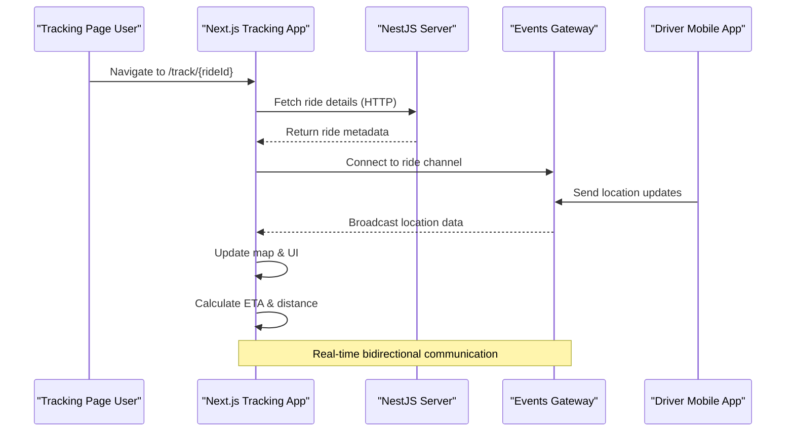
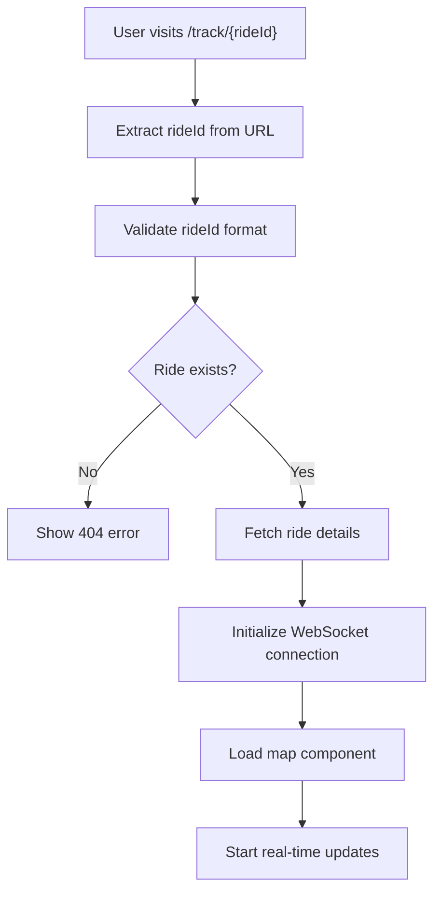
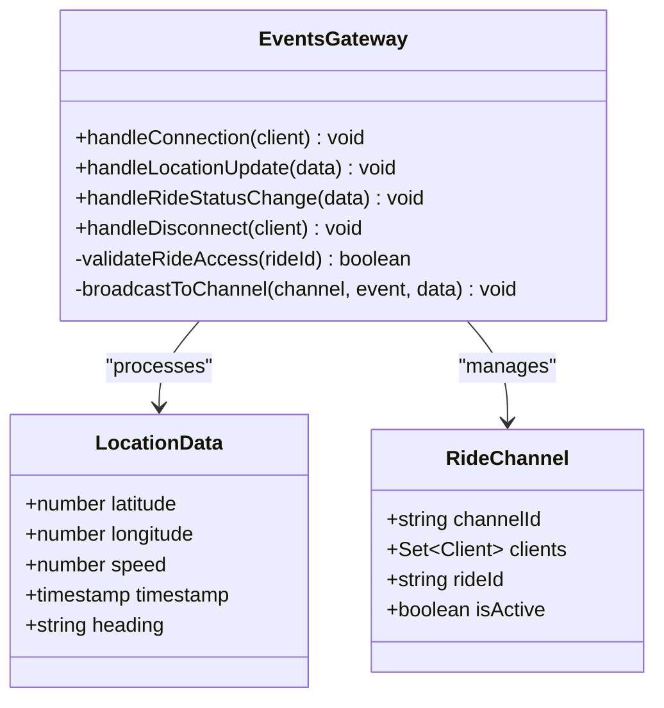
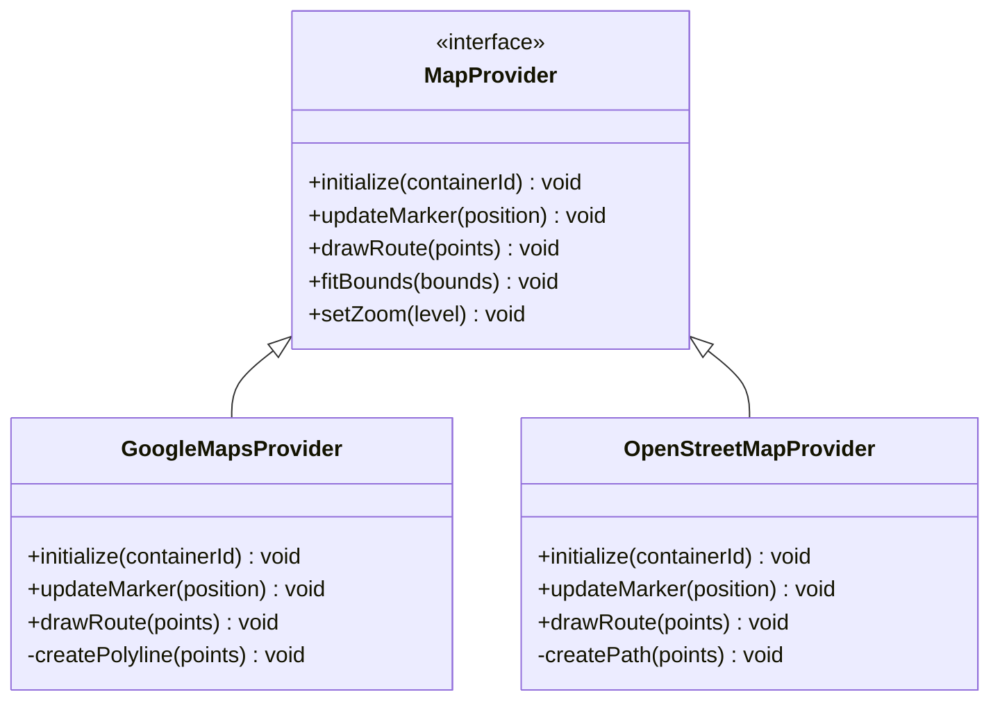
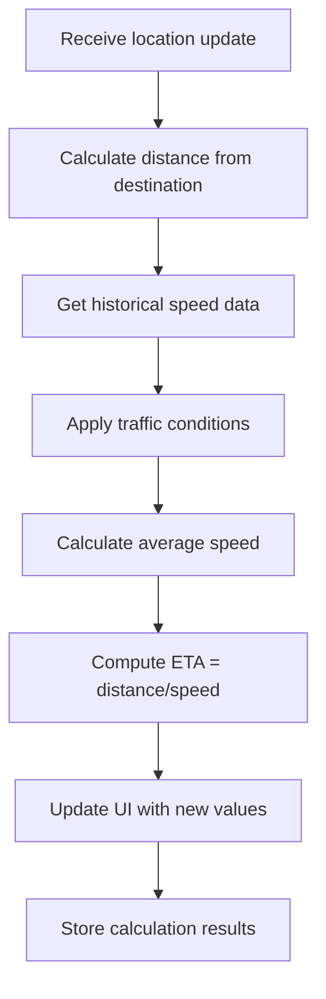
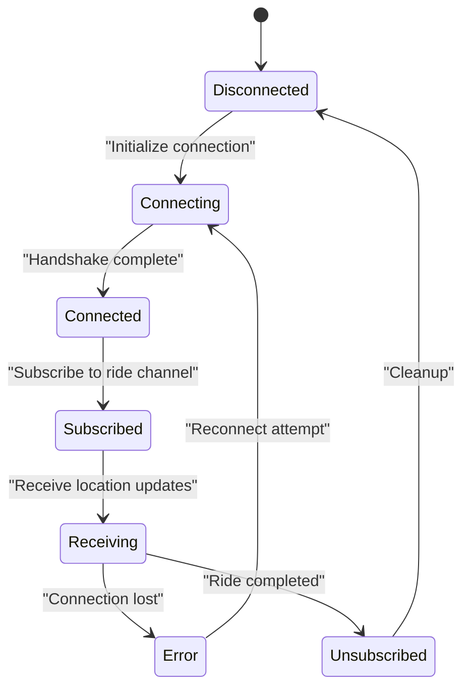

# Real-time Tracking Interface

<cite>
**Referenced Files in This Document**
- [tracking-web page.tsx](file://apps/tracking-web/src/app/page.tsx)
- [tracking-web layout.tsx](file://apps/tracking-web/src/app/layout.tsx)
- [tracking-web track/[rideId]/page.tsx](file://apps/tracking-web/src/app/track/[rideId]/page.tsx)
- [backend rides.controller.ts](file://apps/backend/src/modules/rides/rides.controller.ts)
- [backend rides.service.ts](file://apps/backend/src/modules/rides/rides.service.ts)
- [backend events.gateway.ts](file://apps/backend/src/modules/events/events.gateway.ts)
- [backend main.ts](file://apps/backend/src/main.ts)
- [mobile-driver socket.ts](file://apps/mobile-driver/src/api/socket.ts)
- [mobile-passenger socket.ts](file://apps/mobile-passenger/src/api/socket.ts)
</cite>

## Table of Contents
1. [Introduction](#introduction)
2. [Project Structure](#project-structure)
3. [Core Components](#core-components)
4. [Architecture Overview](#architecture-overview)
5. [Detailed Component Analysis](#detailed-component-analysis)
6. [Security and Privacy](#security-and-privacy)
7. [Real-time Communication](#real-time-communication)
8. [Map Integration](#map-integration)
9. [Customization Guidelines](#customization-guidelines)
10. [Performance Considerations](#performance-considerations)
11. [Troubleshooting Guide](#troubleshooting-guide)
12. [Conclusion](#conclusion)

## Introduction

The Real-time Tracking Interface is a public-facing web application that enables passengers, family members, and other stakeholders to monitor active rides in real-time. This system provides a seamless experience for tracking vehicle locations, viewing estimated arrival times, and understanding ride progress through an intuitive map-based interface.

The tracking interface serves as a bridge between the backend ride management system and end-users who need visibility into ongoing transportation services without requiring authentication or account creation.

## Project Structure

The tracking system follows a modern Next.js architecture with dynamic routing capabilities:

```mermaid
graph TB
subgraph "Tracking Web App"
A[Page Router] --> B[Static Pages]
A --> C[Dynamic Routes]
C --> D[Track/[rideId]]
D --> E[WebSocket Client]
D --> F[Map Component]
D --> G[Ride Data Fetcher]
end
subgraph "Backend Services"
H[NestJS API] --> I[Rides Controller]
H --> J[Events Gateway]
K[Mobile Apps] --> L[Socket Connection]
L --> J
end
E --> J
G --> I
```

**Diagram sources**
- [tracking-web page.tsx](file://apps/tracking-web/src/app/page.tsx)
- [tracking-web track/[rideId]/page.tsx](file://apps/tracking-web/src/app/track/[rideId]/page.tsx)
- [backend events.gateway.ts](file://apps/backend/src/modules/events/events.gateway.ts)

**Section sources**
- [tracking-web page.tsx](file://apps/tracking-web/src/app/page.tsx)
- [tracking-web layout.tsx](file://apps/tracking-web/src/app/layout.tsx)

## Core Components

### Dynamic Route System
The tracking interface uses Next.js dynamic routing to create unique URLs for each active ride. The route pattern `/track/[rideId]` generates individual tracking pages accessible via direct links.

### WebSocket Client Integration
Real-time location updates are handled through WebSocket connections, enabling live position updates without page refreshes.

### Map Visualization Layer
Interactive maps display driver locations, routes, and estimated paths using integrated mapping providers.

### Ride Data Management
Client-side state management handles ride information, location history, and calculated metrics like distance and ETA.

**Section sources**
- [tracking-web track/[rideId]/page.tsx](file://apps/tracking-web/src/app/track/[rideId]/page.tsx)
- [backend rides.controller.ts](file://apps/backend/src/modules/rides/rides.controller.ts)

## Architecture Overview

The real-time tracking system follows a client-server architecture with WebSocket communication:



**Diagram sources**
- [tracking-web track/[rideId]/page.tsx](file://apps/tracking-web/src/app/track/[rideId]/page.tsx)
- [backend events.gateway.ts](file://apps/backend/src/modules/events/events.gateway.ts)
- [mobile-driver socket.ts](file://apps/mobile-driver/src/api/socket.ts)

## Detailed Component Analysis

### Dynamic Route Implementation

The tracking system leverages Next.js file-based routing with dynamic segments. Each active ride gets a unique URL following the pattern `/track/{rideId}`, where `rideId` is extracted from the URL path and used to fetch corresponding ride data.

#### Route Processing Flow



**Diagram sources**
- [tracking-web track/[rideId]/page.tsx](file://apps/tracking-web/src/app/track/[rideId]/page.tsx)

### WebSocket Event Handling

The WebSocket gateway manages real-time communication channels for each active ride. Events include location updates, ride status changes, and system notifications.

#### Event Types and Handlers



**Diagram sources**
- [backend events.gateway.ts](file://apps/backend/src/modules/events/events.gateway.ts)

### Map Integration Layer

The tracking interface integrates with mapping providers to visualize driver locations and routes. The implementation supports multiple mapping backends through abstraction layers.

#### Map Provider Abstraction



**Diagram sources**
- [tracking-web track/[rideId]/page.tsx](file://apps/tracking-web/src/app/track/[rideId]/page.tsx)

### Distance and ETA Calculations

The system calculates distances between points and estimates arrival times using geographic algorithms and traffic-aware routing.

#### Calculation Algorithm



**Diagram sources**
- [tracking-web track/[rideId]/page.tsx](file://apps/tracking-web/src/app/track/[rideId]/page.tsx)

## Security and Privacy

### Public Access Controls

The tracking interface implements several security measures to protect user privacy while maintaining accessibility:

#### Ride ID Validation
- UUID format validation prevents enumeration attacks
- Expiration checks ensure temporary access only
- Status verification confirms ride is still active

#### Data Exposure Limits
- Only non-sensitive ride information is exposed
- Driver personal details are masked
- Exact pickup/dropoff locations are approximated

#### Rate Limiting
- WebSocket connection limits prevent abuse
- API request throttling protects backend resources
- Geographic coordinate precision is limited

**Section sources**
- [backend rides.controller.ts](file://apps/backend/src/modules/rides/rides.controller.ts)
- [backend events.gateway.ts](file://apps/backend/src/modules/events/events.gateway.ts)

## Real-time Communication

### WebSocket Connection Management

The tracking interface maintains persistent WebSocket connections for live updates:

#### Connection Lifecycle



**Diagram sources**
- [mobile-driver socket.ts](file://apps/mobile-driver/src/api/socket.ts)
- [mobile-passenger socket.ts](file://apps/mobile-passenger/src/api/socket.ts)

### Event Broadcasting Strategy

The backend efficiently broadcasts location updates to all connected tracking clients:

#### Channel-Based Broadcasting
- Each ride has a dedicated WebSocket channel
- Clients subscribe/unsubscribe based on ride lifecycle
- Message filtering ensures only relevant updates are sent
- Connection pooling optimizes resource usage

**Section sources**
- [backend events.gateway.ts](file://apps/backend/src/modules/events/events.gateway.ts)

## Map Integration

### Multi-Provider Support

The tracking interface abstracts mapping provider implementations to support different services:

#### Provider Configuration

| Provider | Features | Requirements | Performance |
|----------|----------|--------------|-------------|
| Google Maps | Advanced routing, traffic data | API key required | High performance |
| OpenStreetMap | Free alternative, customizable | No API key needed | Moderate performance |
| Mapbox | Custom styling, analytics | Account required | Good performance |

#### Integration Points
- Provider initialization through configuration
- Marker rendering with custom icons
- Route polyline drawing
- Bounds calculation for optimal viewport
- Zoom level management

**Section sources**
- [tracking-web track/[rideId]/page.tsx](file://apps/tracking-web/src/app/track/[rideId]/page.tsx)

## Customization Guidelines

### Theme and Styling

The tracking interface supports extensive customization through CSS variables and component props:

#### Style Overrides
- Color schemes for branding
- Custom marker icons and animations
- Route line styling and thickness
- Info panel layout and content

#### Component Props
- Map provider selection
- Update frequency configuration
- Display options for metrics
- Language and localization settings

### Feature Toggles

Enable/disable specific features based on deployment requirements:

#### Available Options
- Traffic data integration
- Historical route playback
- Share functionality
- Export capabilities
- Analytics tracking

**Section sources**
- [tracking-web layout.tsx](file://apps/tracking-web/src/app/layout.tsx)

## Performance Considerations

### Optimization Strategies

#### Client-Side Optimizations
- Debounced location updates to reduce processing load
- Efficient map rendering with viewport culling
- Memory management for long-running sessions
- Progressive loading of map tiles

#### Server-Side Optimizations
- Connection pooling for WebSocket clients
- Geographic indexing for fast queries
- Batch processing of location updates
- Cache warming for popular routes

### Scalability Patterns

#### Horizontal Scaling
- Stateless WebSocket servers behind load balancer
- Redis-backed session storage
- Geographic distribution of endpoints
- CDN integration for static assets

**Section sources**
- [backend main.ts](file://apps/backend/src/main.ts)

## Troubleshooting Guide

### Common Issues and Solutions

#### Connection Problems
- **Symptom**: Tracking page shows "Connecting..." indefinitely
- **Solution**: Check WebSocket server availability and firewall rules
- **Debug**: Verify browser console for connection errors

#### Location Updates Not Working
- **Symptom**: Map shows static driver position
- **Solution**: Ensure driver app is sending location updates
- **Debug**: Check WebSocket message logs

#### Map Rendering Issues
- **Symptom**: Blank map or missing tiles
- **Solution**: Verify API keys and network connectivity
- **Debug**: Inspect browser developer tools network tab

#### Performance Degradation
- **Symptom**: Slow updates or high memory usage
- **Solution**: Reduce update frequency or simplify map features
- **Debug**: Monitor browser performance metrics

**Section sources**
- [backend events.gateway.ts](file://apps/backend/src/modules/events/events.gateway.ts)
- [tracking-web track/[rideId]/page.tsx](file://apps/tracking-web/src/app/track/[rideId]/page.tsx)

## Conclusion

The real-time tracking interface provides a robust, scalable solution for public ride monitoring. Through its modular architecture, secure design, and flexible customization options, it serves as an effective bridge between backend ride management systems and end-users seeking transparency in transportation services.

The system's emphasis on security, performance, and user experience makes it suitable for production deployments across various ride-sharing scenarios. Its extensible design allows for easy integration with different mapping providers and customization to meet specific business requirements.