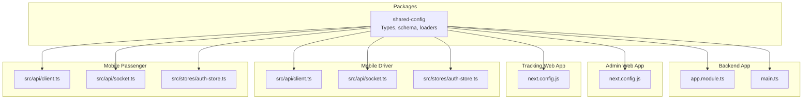
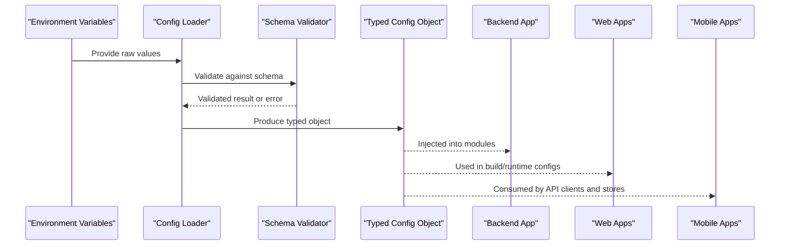
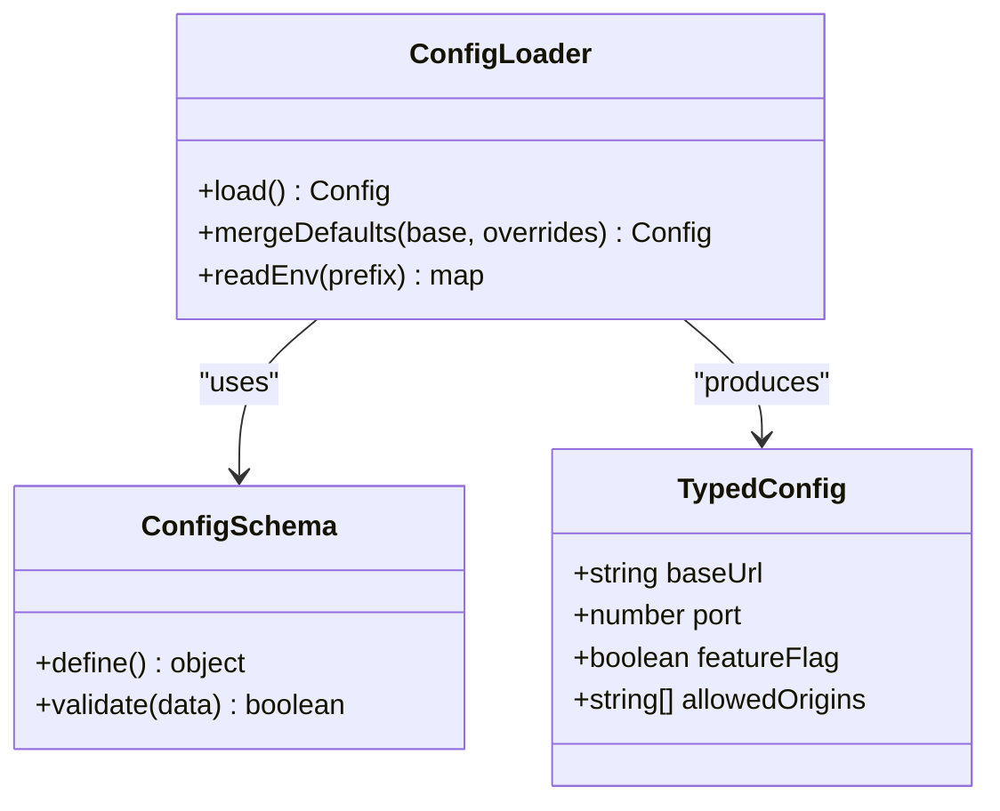
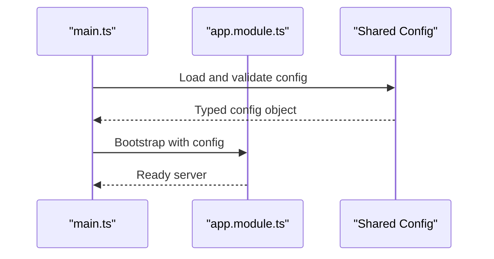
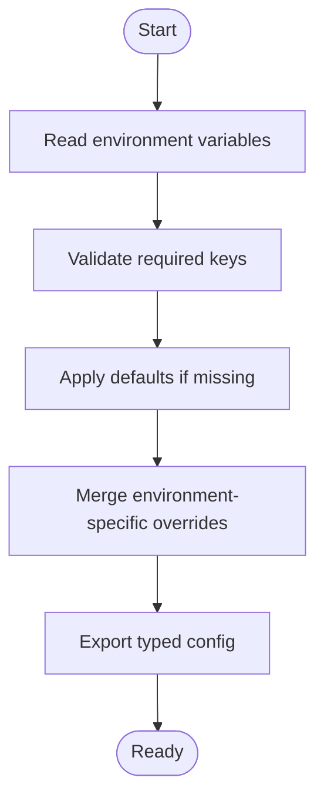
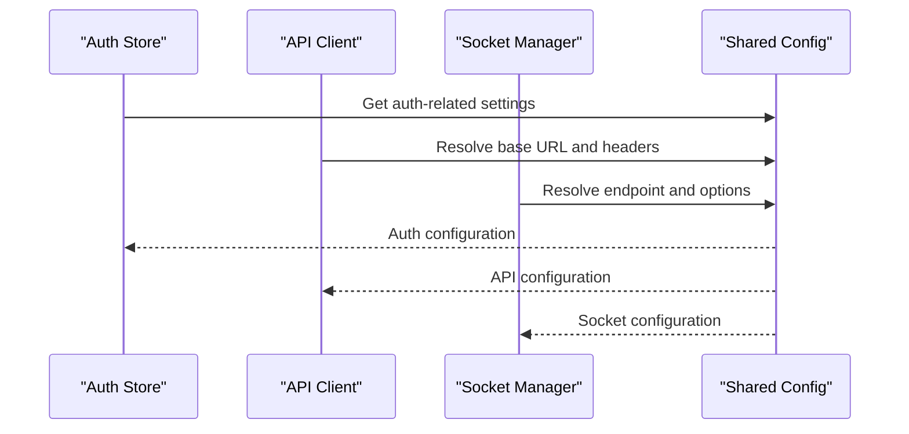
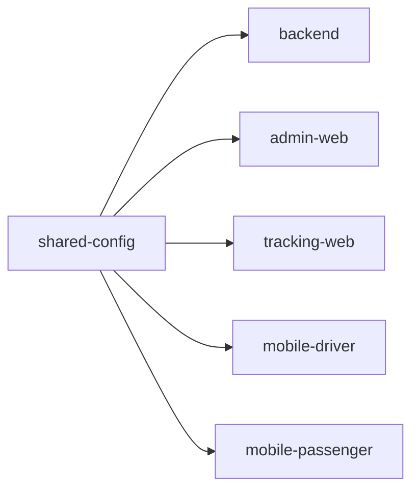

# Configuration Management

<cite>
**Referenced Files in This Document**
- [package.json](file://packages/shared-config/package.json)
- [tsconfig.json](file://packages/shared-config/tsconfig.json)
- [app.module.ts](file://apps/backend/src/app.module.ts)
- [main.ts](file://apps/backend/src/main.ts)
- [next.config.js](file://apps/admin-web/next.config.js)
- [next.config.js](file://apps/tracking-web/next.config.js)
- [client.ts](file://apps/mobile-driver/src/api/client.ts)
- [client.ts](file://apps/mobile-passenger/src/api/client.ts)
- [socket.ts](file://apps/mobile-driver/src/api/socket.ts)
- [socket.ts](file://apps/mobile-passenger/src/api/socket.ts)
- [auth-store.ts](file://apps/mobile-driver/src/stores/auth-store.ts)
- [auth-store.ts](file://apps/mobile-passenger/src/stores/auth-store.ts)
</cite>

## Table of Contents
1. [Introduction](#introduction)
2. [Project Structure](#project-structure)
3. [Core Components](#core-components)
4. [Architecture Overview](#architecture-overview)
5. [Detailed Component Analysis](#detailed-component-analysis)
6. [Dependency Analysis](#dependency-analysis)
7. [Performance Considerations](#performance-considerations)
8. [Troubleshooting Guide](#troubleshooting-guide)
9. [Conclusion](#conclusion)
10. [Appendices](#appendices)

## Introduction
This document describes the shared configuration management system used across the repository’s applications and packages. It explains how environment-specific configurations are structured, validated, and accessed in a type-safe manner. It also provides guidance for adding new configuration options, maintaining backward compatibility, and handling sensitive data securely.

The goal is to help developers understand:
- Where configuration lives and how it is organized per environment
- How validation ensures correctness at startup
- How different apps (backend, web, mobile) access configuration values safely
- How defaults and overrides work
- Security best practices for secrets and environment variables

## Project Structure
Configuration-related code and usage patterns are primarily located under the shared package and consumed by each application. The following diagram shows the high-level structure relevant to configuration:

**Diagram sources**
- [package.json](file://packages/shared-config/package.json)
- [tsconfig.json](file://packages/shared-config/tsconfig.json)
- [app.module.ts](file://apps/backend/src/app.module.ts)
- [main.ts](file://apps/backend/src/main.ts)
- [next.config.js](file://apps/admin-web/next.config.js)
- [next.config.js](file://apps/tracking-web/next.config.js)
- [client.ts](file://apps/mobile-driver/src/api/client.ts)
- [client.ts](file://apps/mobile-passenger/src/api/client.ts)
- [socket.ts](file://apps/mobile-driver/src/api/socket.ts)
- [socket.ts](file://apps/mobile-passenger/src/api/socket.ts)
- [auth-store.ts](file://apps/mobile-driver/src/stores/auth-store.ts)
- [auth-store.ts](file://apps/mobile-passenger/src/stores/auth-store.ts)

**Section sources**
- [package.json](file://packages/shared-config/package.json)
- [tsconfig.json](file://packages/shared-config/tsconfig.json)
- [app.module.ts](file://apps/backend/src/app.module.ts)
- [main.ts](file://apps/backend/src/main.ts)
- [next.config.js](file://apps/admin-web/next.config.js)
- [next.config.js](file://apps/tracking-web/next.config.js)
- [client.ts](file://apps/mobile-driver/src/api/client.ts)
- [client.ts](file://apps/mobile-passenger/src/api/client.ts)
- [socket.ts](file://apps/mobile-driver/src/api/socket.ts)
- [socket.ts](file://apps/mobile-passenger/src/api/socket.ts)
- [auth-store.ts](file://apps/mobile-driver/src/stores/auth-store.ts)
- [auth-store.ts](file://apps/mobile-passenger/src/stores/auth-store.ts)

## Core Components
The shared configuration system centers around a single package that defines:
- A typed configuration interface
- A schema for validation
- Loaders that read from environment variables and/or files
- Utilities to expose configuration to consumers

Key responsibilities:
- Type safety: Consumers import strongly-typed config objects
- Validation: Startup-time checks ensure required fields exist and have correct types
- Environment scoping: Defaults, development, staging, and production overrides
- Centralized access: Single source of truth for all configuration values

Typical entry points:
- Backend: Module initialization reads and validates configuration before starting services
- Web apps: Build-time or runtime configuration via framework config files
- Mobile apps: Runtime configuration via API clients and socket connections

**Section sources**
- [package.json](file://packages/shared-config/package.json)
- [tsconfig.json](file://packages/shared-config/tsconfig.json)
- [app.module.ts](file://apps/backend/src/app.module.ts)
- [main.ts](file://apps/backend/src/main.ts)

## Architecture Overview
The configuration architecture follows a layered approach:
- Schema layer: Defines the shape and constraints of configuration
- Loader layer: Reads environment variables and/or files, applies defaults, and merges overrides
- Consumer layer: Applications import typed configuration and use it throughout their modules

**Diagram sources**
- [app.module.ts](file://apps/backend/src/app.module.ts)
- [main.ts](file://apps/backend/src/main.ts)
- [next.config.js](file://apps/admin-web/next.config.js)
- [next.config.js](file://apps/tracking-web/next.config.js)
- [client.ts](file://apps/mobile-driver/src/api/client.ts)
- [client.ts](file://apps/mobile-passenger/src/api/client.ts)
- [socket.ts](file://apps/mobile-driver/src/api/socket.ts)
- [socket.ts](file://apps/mobile-passenger/src/api/socket.ts)
- [auth-store.ts](file://apps/mobile-driver/src/stores/auth-store.ts)
- [auth-store.ts](file://apps/mobile-passenger/src/stores/auth-store.ts)

## Detailed Component Analysis

### Shared Configuration Package
Responsibilities:
- Define the configuration interface with strict types
- Provide a validation schema to enforce presence and format of keys
- Implement loaders that merge defaults, environment variables, and optional file-based overrides
- Export a singleton or factory function to retrieve configuration consistently

Design considerations:
- Prefer environment variables for runtime configuration
- Use optional file-based overrides only when necessary (e.g., local dev)
- Fail fast on invalid configuration during startup
- Keep secrets out of version control; rely on secure secret managers or platform-provided env injection

**Diagram sources**
- [package.json](file://packages/shared-config/package.json)
- [tsconfig.json](file://packages/shared-config/tsconfig.json)

**Section sources**
- [package.json](file://packages/shared-config/package.json)
- [tsconfig.json](file://packages/shared-config/tsconfig.json)

### Backend Application Configuration
The backend initializes configuration early in its bootstrap process and injects it into NestJS modules. Typical flow:
- Read environment variables
- Validate against schema
- Initialize app with configuration-dependent settings (ports, CORS, logging)

**Diagram sources**
- [main.ts](file://apps/backend/src/main.ts)
- [app.module.ts](file://apps/backend/src/app.module.ts)

**Section sources**
- [main.ts](file://apps/backend/src/main.ts)
- [app.module.ts](file://apps/backend/src/app.module.ts)

### Web Applications Configuration
Next.js apps typically consume configuration through environment variables and framework config files. Patterns include:
- Build-time constants injected via Next.js config
- Runtime values read from process.env where appropriate
- Centralized base URL and feature flags for consistent behavior across environments

**Diagram sources**
- [next.config.js](file://apps/admin-web/next.config.js)
- [next.config.js](file://apps/tracking-web/next.config.js)

**Section sources**
- [next.config.js](file://apps/admin-web/next.config.js)
- [next.config.js](file://apps/tracking-web/next.config.js)

### Mobile Applications Configuration
Mobile apps consume configuration at runtime for API endpoints, sockets, and feature toggles. Common consumption points:
- API client base URLs and headers
- Socket connection parameters
- Auth store initialization with environment-aware tokens and endpoints

**Diagram sources**
- [auth-store.ts](file://apps/mobile-driver/src/stores/auth-store.ts)
- [auth-store.ts](file://apps/mobile-passenger/src/stores/auth-store.ts)
- [client.ts](file://apps/mobile-driver/src/api/client.ts)
- [client.ts](file://apps/mobile-passenger/src/api/client.ts)
- [socket.ts](file://apps/mobile-driver/src/api/socket.ts)
- [socket.ts](file://apps/mobile-passenger/src/api/socket.ts)

**Section sources**
- [auth-store.ts](file://apps/mobile-driver/src/stores/auth-store.ts)
- [auth-store.ts](file://apps/mobile-passenger/src/stores/auth-store.ts)
- [client.ts](file://apps/mobile-driver/src/api/client.ts)
- [client.ts](file://apps/mobile-passenger/src/api/client.ts)
- [socket.ts](file://apps/mobile-driver/src/api/socket.ts)
- [socket.ts](file://apps/mobile-passenger/src/api/socket.ts)

## Dependency Analysis
The shared configuration package is a dependency of multiple applications. The following diagram illustrates direct dependencies:

**Diagram sources**
- [package.json](file://packages/shared-config/package.json)
- [app.module.ts](file://apps/backend/src/app.module.ts)
- [next.config.js](file://apps/admin-web/next.config.js)
- [next.config.js](file://apps/tracking-web/next.config.js)
- [client.ts](file://apps/mobile-driver/src/api/client.ts)
- [client.ts](file://apps/mobile-passenger/src/api/client.ts)
- [socket.ts](file://apps/mobile-driver/src/api/socket.ts)
- [socket.ts](file://apps/mobile-passenger/src/api/socket.ts)
- [auth-store.ts](file://apps/mobile-driver/src/stores/auth-store.ts)
- [auth-store.ts](file://apps/mobile-passenger/src/stores/auth-store.ts)

**Section sources**
- [package.json](file://packages/shared-config/package.json)
- [app.module.ts](file://apps/backend/src/app.module.ts)
- [next.config.js](file://apps/admin-web/next.config.js)
- [next.config.js](file://apps/tracking-web/next.config.js)
- [client.ts](file://apps/mobile-driver/src/api/client.ts)
- [client.ts](file://apps/mobile-passenger/src/api/client.ts)
- [socket.ts](file://apps/mobile-driver/src/api/socket.ts)
- [socket.ts](file://apps/mobile-passenger/src/api/socket.ts)
- [auth-store.ts](file://apps/mobile-driver/src/stores/auth-store.ts)
- [auth-store.ts](file://apps/mobile-passenger/src/stores/auth-store.ts)

## Performance Considerations
- Validate once at startup to avoid repeated checks
- Cache configuration after initial load to prevent redundant parsing
- Avoid heavy I/O during configuration loading; prefer lightweight environment variable reads
- Minimize configuration size by splitting concerns (e.g., separate feature flags from secrets)

[No sources needed since this section provides general guidance]

## Troubleshooting Guide
Common issues and resolutions:
- Missing required environment variables: Ensure all mandatory keys are present in the target environment
- Type mismatches: Verify that environment values match expected types (strings, numbers, booleans, arrays)
- Override precedence: Confirm that environment variables override defaults correctly and that file-based overrides are applied last if used
- Secret exposure: Audit logs and responses to ensure secrets are never printed or returned to clients

Operational tips:
- Log configuration summary without sensitive values
- Add health checks that verify critical configuration availability
- Use CI pipelines to validate configuration schemas against sample environments

**Section sources**
- [app.module.ts](file://apps/backend/src/app.module.ts)
- [main.ts](file://apps/backend/src/main.ts)
- [next.config.js](file://apps/admin-web/next.config.js)
- [next.config.js](file://apps/tracking-web/next.config.js)
- [client.ts](file://apps/mobile-driver/src/api/client.ts)
- [client.ts](file://apps/mobile-passenger/src/api/client.ts)
- [socket.ts](file://apps/mobile-driver/src/api/socket.ts)
- [socket.ts](file://apps/mobile-passenger/src/api/socket.ts)
- [auth-store.ts](file://apps/mobile-driver/src/stores/auth-store.ts)
- [auth-store.ts](file://apps/mobile-passenger/src/stores/auth-store.ts)

## Conclusion
A robust configuration management system improves reliability, security, and developer experience. By centralizing schema definitions, enforcing validation, and providing type-safe access patterns, teams can confidently manage environment-specific settings across backend, web, and mobile applications. Following the guidelines here will help maintain consistency, reduce errors, and streamline deployments.

[No sources needed since this section summarizes without analyzing specific files]

## Appendices

### Environment-Specific Configuration Guidelines
- Development: Local overrides via environment variables or optional local files; enable verbose logging
- Staging: Mirror production settings with non-sensitive test data; disable debug features
- Production: Enforce strict validation; restrict log verbosity; use secret managers for sensitive values

### Adding New Configuration Options
Steps:
- Extend the configuration interface with the new field and type
- Update the validation schema to include presence and format checks
- Provide sensible defaults where applicable
- Document the option and update consumer apps to use the new value
- Test across environments to ensure overrides behave as expected

### Backward Compatibility
- Mark deprecated fields with clear migration notes
- Maintain default values for legacy keys during transition periods
- Introduce deprecation warnings in logs before removing old options
- Version configuration changes when necessary to support gradual rollout

### Security Considerations
- Never commit secrets to version control
- Use platform secret injection mechanisms (e.g., environment variables provided by hosting platforms)
- Rotate secrets regularly and audit access
- Avoid logging sensitive configuration values
- Restrict configuration access to necessary components only

[No sources needed since this section provides general guidance]