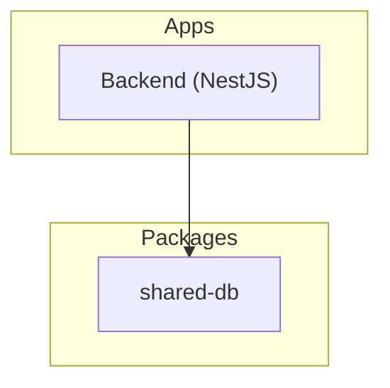
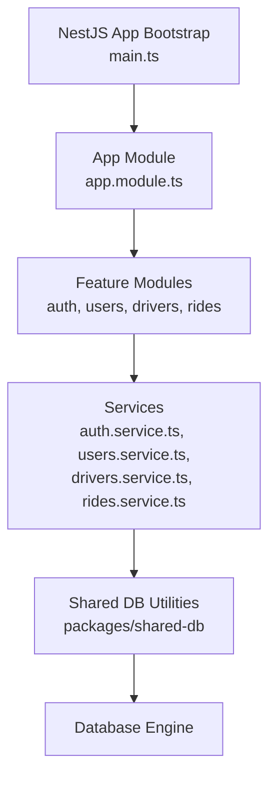
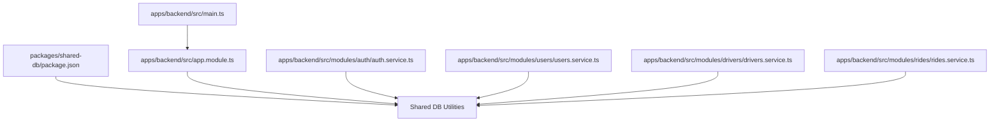

# Database Utilities

<cite>
**Referenced Files in This Document**
- [package.json](file://packages/shared-db/package.json)
- [app.module.ts](file://apps/backend/src/app.module.ts)
- [main.ts](file://apps/backend/src/main.ts)
- [auth.service.ts](file://apps/backend/src/modules/auth/auth.service.ts)
- [drivers.service.ts](file://apps/backend/src/modules/drivers/drivers.service.ts)
- [rides.service.ts](file://apps/backend/src/modules/rides/rides.service.ts)
- [users.service.ts](file://apps/backend/src/modules/users/users.service.ts)
</cite>

## Table of Contents
1. [Introduction](#introduction)
2. [Project Structure](#project-structure)
3. [Core Components](#core-components)
4. [Architecture Overview](#architecture-overview)
5. [Detailed Component Analysis](#detailed-component-analysis)
6. [Dependency Analysis](#dependency-analysis)
7. [Performance Considerations](#performance-considerations)
8. [Troubleshooting Guide](#troubleshooting-guide)
9. [Conclusion](#conclusion)
10. [Appendices](#appendices)

## Introduction
This document describes the shared database utilities and helpers used across the application, focusing on connection management, query patterns, transaction handling, schema versioning, backup procedures, data integrity constraints, logging, error handling, and performance optimization. It also provides guidance for using these utilities within NestJS modules and other applications.

## Project Structure
The repository is a monorepo with multiple apps and shared packages. The database-related code is primarily located under:
- Shared package: packages/shared-db (database utilities and helpers)
- Backend app: apps/backend (NestJS application that consumes the shared-db package)

[No sources needed since this diagram shows conceptual structure]

## Core Components
- Connection management: centralized configuration and lifecycle hooks to initialize and close connections.
- Query builders: reusable abstractions for constructing queries safely and consistently.
- Migration helpers: utilities to apply and track schema migrations.
- Transaction management: wrappers to execute operations within transactions with proper commit/rollback semantics.
- Logging and error handling: structured logging around DB operations and consistent error propagation.

Key usage points in the backend:
- Application bootstrap wires up the database module and global interceptors/filters.
- Feature modules consume services that use the shared-db utilities for persistence.

**Section sources**
- [app.module.ts](file://apps/backend/src/app.module.ts)
- [main.ts](file://apps/backend/src/main.ts)

## Architecture Overview
The backend depends on the shared-db package for all database interactions. Services in feature modules call into shared-db helpers to perform CRUD operations, manage transactions, and handle errors.

**Diagram sources**
- [main.ts](file://apps/backend/src/main.ts)
- [app.module.ts](file://apps/backend/src/app.module.ts)
- [auth.service.ts](file://apps/backend/src/modules/auth/auth.service.ts)
- [users.service.ts](file://apps/backend/src/modules/users/users.service.ts)
- [drivers.service.ts](file://apps/backend/src/modules/drivers/drivers.service.ts)
- [rides.service.ts](file://apps/backend/src/modules/rides/rides.service.ts)

## Detailed Component Analysis

### Connection Management
- Centralized configuration: environment-based settings for host, port, credentials, and pool options are provided by the shared-db package.
- Lifecycle hooks: initialization occurs during application startup; graceful shutdown closes connections and releases resources.
- Pooling: connection pooling is configured via shared-db to optimize throughput and resource utilization.

Usage in NestJS:
- Import and configure the database module in the root application module.
- Ensure the app bootstrap process initializes the database before serving requests.

**Section sources**
- [app.module.ts](file://apps/backend/src/app.module.ts)
- [main.ts](file://apps/backend/src/main.ts)

### Query Builders
- Purpose: provide type-safe, composable APIs to build SELECT, INSERT, UPDATE, DELETE statements.
- Safety: parameterization prevents SQL injection and ensures consistent formatting.
- Composition: builders support chaining filters, joins, pagination, and sorting.

Common patterns:
- Build base query once, then add optional clauses based on request parameters.
- Use explicit column selection to reduce payload size.
- Prefer indexed columns in WHERE clauses and avoid functions on indexed columns.

**Section sources**
- [auth.service.ts](file://apps/backend/src/modules/auth/auth.service.ts)
- [users.service.ts](file://apps/backend/src/modules/users/users.service.ts)
- [drivers.service.ts](file://apps/backend/src/modules/drivers/drivers.service.ts)
- [rides.service.ts](file://apps/backend/src/modules/rides/rides.service.ts)

### Migration Helpers
- Apply migrations at startup or via CLI commands.
- Track migration state to ensure idempotent runs.
- Rollback strategies for development and staging environments.

Guidelines:
- Keep migrations small and focused.
- Always test migrations against a representative dataset.
- Avoid destructive changes in production without backups.

**Section sources**
- [app.module.ts](file://apps/backend/src/app.module.ts)

### Transaction Management
- Wrappers to begin, commit, and rollback transactions.
- Automatic cleanup on exceptions to prevent partial writes.
- Nested transaction support where applicable.

Best practices:
- Scope transactions to the smallest necessary unit of work.
- Avoid long-running transactions to reduce lock contention.
- Log transaction boundaries for observability.

**Section sources**
- [auth.service.ts](file://apps/backend/src/modules/auth/auth.service.ts)
- [users.service.ts](file://apps/backend/src/modules/users/users.service.ts)
- [drivers.service.ts](file://apps/backend/src/modules/drivers/drivers.service.ts)
- [rides.service.ts](file://apps/backend/src/modules/rides/rides.service.ts)

### Logging and Error Handling
- Structured logs include operation context, timing, and result status.
- Errors are normalized and propagated with actionable messages.
- Sensitive data is redacted from logs.

Integration points:
- Global HTTP exception filter centralizes error responses.
- Interceptors log request/response metadata and DB timings.

**Section sources**
- [main.ts](file://apps/backend/src/main.ts)
- [app.module.ts](file://apps/backend/src/app.module.ts)

### Entity Relationships and Schema Versioning
- Entities are modeled with clear relationships enforced by foreign keys and indexes.
- Schema versioning is managed through migrations applied by shared-db helpers.
- Data integrity constraints (unique, not null, check) are defined in migration scripts.

Guidelines:
- Normalize data to reduce redundancy while balancing read performance.
- Add indexes selectively based on query patterns.
- Enforce referential integrity at the database level.

**Section sources**
- [app.module.ts](file://apps/backend/src/app.module.ts)

### Backup Procedures
- Automated snapshots scheduled outside the application.
- Point-in-time recovery enabled where supported.
- Restore drills performed regularly to validate backups.

Operational notes:
- Backups should exclude temporary tables and large blobs when possible.
- Encrypt backups at rest and in transit.
- Retain backups according to compliance requirements.

[No sources needed since this section provides general guidance]

### Performance Optimization Techniques
- Connection pooling tuned to workload characteristics.
- Query plans analyzed and optimized using EXPLAIN.
- Pagination and cursor-based navigation for large datasets.
- Read replicas for read-heavy workloads.

Monitoring:
- Track slow queries and connection saturation.
- Alert on high latency and error rates.

[No sources needed since this section provides general guidance]

### Using Database Utilities in NestJS Modules
- Inject services that encapsulate business logic and use shared-db helpers.
- Configure modules to depend on the database provider.
- Use guards and interceptors to enforce security and logging around DB calls.

Example integration points:
- Root module imports and configures the database provider.
- Feature modules register controllers and services that rely on shared-db.

**Section sources**
- [app.module.ts](file://apps/backend/src/app.module.ts)
- [auth.service.ts](file://apps/backend/src/modules/auth/auth.service.ts)
- [users.service.ts](file://apps/backend/src/modules/users/users.service.ts)
- [drivers.service.ts](file://apps/backend/src/modules/drivers/drivers.service.ts)
- [rides.service.ts](file://apps/backend/src/modules/rides/rides.service.ts)

### Using Database Utilities in Other Applications
- Initialize the shared-db client with environment variables.
- Wrap critical operations in transaction helpers.
- Apply migrations before starting the service.
- Enable structured logging and metrics collection.

[No sources needed since this section provides general guidance]

## Dependency Analysis
The backend depends on the shared-db package for database functionality. The package’s presence is declared in its own package manifest.

**Diagram sources**
- [package.json](file://packages/shared-db/package.json)
- [app.module.ts](file://apps/backend/src/app.module.ts)
- [main.ts](file://apps/backend/src/main.ts)
- [auth.service.ts](file://apps/backend/src/modules/auth/auth.service.ts)
- [users.service.ts](file://apps/backend/src/modules/users/users.service.ts)
- [drivers.service.ts](file://apps/backend/src/modules/drivers/drivers.service.ts)
- [rides.service.ts](file://apps/backend/src/modules/rides/rides.service.ts)

**Section sources**
- [package.json](file://packages/shared-db/package.json)
- [app.module.ts](file://apps/backend/src/app.module.ts)
- [main.ts](file://apps/backend/src/main.ts)
- [auth.service.ts](file://apps/backend/src/modules/auth/auth.service.ts)
- [users.service.ts](file://apps/backend/src/modules/users/users.service.ts)
- [drivers.service.ts](file://apps/backend/src/modules/drivers/drivers.service.ts)
- [rides.service.ts](file://apps/backend/src/modules/rides/rides.service.ts)

## Performance Considerations
- Tune connection pool size based on CPU cores and expected concurrency.
- Use prepared statements and parameterized queries to reduce parsing overhead.
- Batch inserts/updates where appropriate.
- Monitor and cache frequently accessed, rarely changing data.
- Avoid N+1 queries by eager loading related entities.

[No sources needed since this section provides general guidance]

## Troubleshooting Guide
- Connection failures: verify credentials, network reachability, and pool limits.
- Slow queries: analyze execution plans, add missing indexes, and refactor queries.
- Deadlocks: shorten transactions, order locks consistently, and retry transient errors.
- Migration issues: review migration history, ensure idempotency, and restore from backup if needed.
- Logging gaps: confirm structured logging is enabled and sensitive fields are redacted.

**Section sources**
- [main.ts](file://apps/backend/src/main.ts)
- [app.module.ts](file://apps/backend/src/app.module.ts)

## Conclusion
The shared-db package centralizes database concerns, providing robust connection management, safe query construction, migration support, and transaction utilities. By following the guidelines in this document—especially around indexing, transaction scoping, logging, and backups—you can maintain high performance, reliability, and data integrity across the application.

## Appendices

### Common Query Patterns
- Filtered reads with pagination and sorting.
- Aggregations with GROUP BY and HAVING.
- Upsert operations using conflict resolution.
- Soft deletes with active flags and audit timestamps.

[No sources needed since this section provides general guidance]

### Guidelines for Efficient Queries
- Select only required columns.
- Use WHERE clauses on indexed columns.
- Avoid SELECT * in loops.
- Leverage covering indexes for frequent queries.
- Prefer JOINs over multiple round-trips.

[No sources needed since this section provides general guidance]