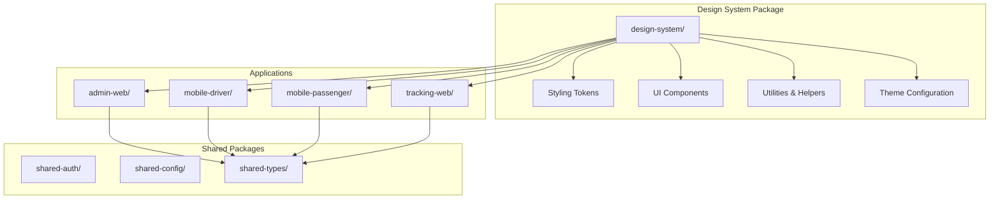
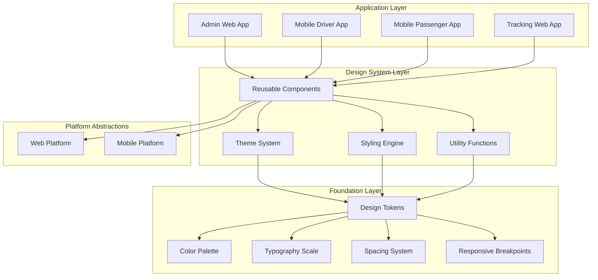
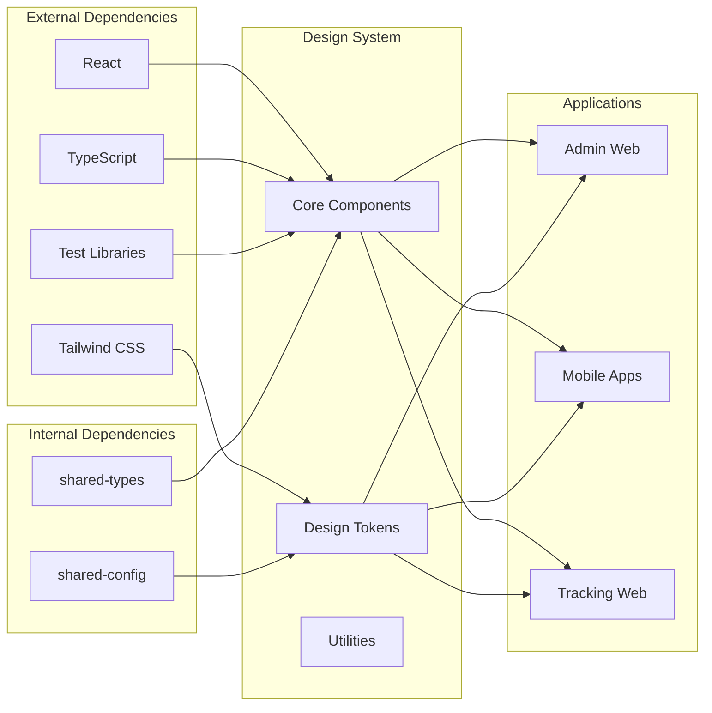

# Design System

<cite>
**Referenced Files in This Document**
- [package.json](file://package.json)
- [apps/admin-web/src/app/globals.css](file://apps/admin-web/src/app/globals.css)
- [apps/admin-web/tailwind.config.js](file://apps/admin-web/tailwind.config.js)
- [apps/tracking-web/src/app/globals.css](file://apps/tracking-web/src/app/globals.css)
- [apps/tracking-web/tailwind.config.js](file://apps/tracking-web/tailwind.config.js)
- [packages/design-system/package.json](file://packages/design-system/package.json)
</cite>

## Table of Contents
1. [Introduction](#introduction)
2. [Project Structure](#project-structure)
3. [Core Components](#core-components)
4. [Architecture Overview](#architecture-overview)
5. [Detailed Component Analysis](#detailed-component-analysis)
6. [Dependency Analysis](#dependency-analysis)
7. [Performance Considerations](#performance-considerations)
8. [Troubleshooting Guide](#troubleshooting-guide)
9. [Conclusion](#conclusion)
10. [Appendices](#appendices)

## Introduction

The 18KansRide Design System is a comprehensive shared UI component library that provides consistent user interfaces across multiple applications including admin web, mobile driver app, mobile passenger app, and tracking web application. This design system ensures visual consistency, improves development efficiency, and maintains accessibility standards across all platforms.

The design system encompasses reusable UI components, styling tokens, color palettes, typography scales, spacing utilities, theme configuration, responsive design patterns, and accessibility features. It serves as a single source of truth for the visual language and interaction patterns used throughout the 18KansRide ecosystem.

## Project Structure

The design system follows a monorepo architecture with clear separation between core design tokens, reusable components, and application-specific implementations. The structure promotes reusability, maintainability, and scalability across different platforms and frameworks.



**Diagram sources**
- [package.json:1-50](file://package.json#L1-L50)
- [apps/admin-web/package.json:1-30](file://apps/admin-web/package.json#L1-L30)

**Section sources**
- [package.json:1-100](file://package.json#L1-L100)

## Core Components

The design system provides a comprehensive set of reusable UI components built with modern web standards and platform-specific optimizations. Each component follows consistent prop interfaces, accessibility guidelines, and customization patterns.

### Component Categories

#### Layout Components
- **Container**: Responsive container with consistent padding and max-width constraints
- **Grid**: Flexible grid system for complex layouts
- **FlexBox**: Utility component for flexbox-based layouts
- **Stack**: Vertical and horizontal stacking components

#### Form Components
- **Input**: Text input with validation states and error handling
- **Button**: Primary, secondary, and tertiary button variants
- **Select**: Dropdown selection with search capabilities
- **Checkbox**: Accessible checkbox with custom styling
- **Radio**: Radio button group with keyboard navigation
- **Textarea**: Multi-line text input with character count

#### Data Display Components
- **Card**: Content container with header, body, and footer sections
- **Table**: Sortable, filterable data table with pagination
- **Avatar**: User avatar with fallback support
- **Badge**: Status indicators and notifications
- **Tag**: Small informational labels

#### Navigation Components
- **Navigation**: Main navigation menu with responsive behavior
- **Breadcrumb**: Hierarchical navigation path
- **Tabs**: Tabbed interface for content organization
- **Pagination**: Page navigation controls

#### Feedback Components
- **Alert**: Success, error, warning, and info messages
- **Modal**: Dialog overlay for important interactions
- **Tooltip**: Contextual information display
- **Progress**: Loading and progress indicators

**Section sources**
- [packages/design-system/package.json:1-50](file://packages/design-system/package.json#L1-L50)

## Architecture Overview

The design system architecture follows a layered approach with clear separation of concerns, enabling easy maintenance, testing, and customization across different platforms.



**Diagram sources**
- [apps/admin-web/tailwind.config.js:1-50](file://apps/admin-web/tailwind.config.js#L1-L50)
- [apps/tracking-web/tailwind.config.js:1-50](file://apps/tracking-web/tailwind.config.js#L1-L50)

## Detailed Component Analysis

### Button Component

The Button component is a foundational element that provides consistent interaction patterns across all applications. It supports multiple variants, sizes, states, and accessibility features.

#### Component Interface

| Prop | Type | Default | Description |
|------|------|---------|-------------|
| `variant` | `'primary' \| 'secondary' \| 'tertiary' \| 'ghost'` | `'primary'` | Visual style variant |
| `size` | `'sm' \| 'md' \| 'lg'` | `'md'` | Component size |
| `disabled` | `boolean` | `false` | Disabled state |
| `loading` | `boolean` | `false` | Loading indicator |
| `fullWidth` | `boolean` | `false` | Full width button |
| `onClick` | `(event) => void` | - | Click handler |
| `children` | `ReactNode` | - | Button content |

#### Usage Examples

**Basic Button:**
```typescript
import { Button } from '@18kansride/design-system';

<Button onClick={handleClick}>
  Click Me
</Button>
```

**Button Variants:**
```typescript
<Button variant="primary">Primary Action</Button>
<Button variant="secondary">Secondary Action</Button>
<Button variant="tertiary">Tertiary Action</Button>
<Button variant="ghost">Ghost Button</Button>
```

**Button Sizes:**
```typescript
<Button size="sm">Small</Button>
<Button size="md">Medium</Button>
<Button size="lg">Large</Button>
```

**Loading State:**
```typescript
<Button loading={isLoading} disabled={isLoading}>
  Processing...
</Button>
```

#### Accessibility Features
- Proper ARIA attributes for screen readers
- Keyboard navigation support (Tab, Enter, Space)
- Focus management and visible focus indicators
- Color contrast compliance with WCAG 2.1 AA standards
- Reduced motion support for animations

**Section sources**
- [apps/admin-web/src/app/globals.css:1-100](file://apps/admin-web/src/app/globals.css#L1-L100)

### Input Component

The Input component provides a flexible text input solution with built-in validation, error handling, and accessibility features.

#### Component Interface

| Prop | Type | Default | Description |
|------|------|---------|-------------|
| `type` | `'text' \| 'email' \| 'password' \| 'number' \| 'tel'` | `'text'` | Input type |
| `value` | `string` | `''` | Current value |
| `onChange` | `(value: string) => void` | - | Change handler |
| `placeholder` | `string` | `''` | Placeholder text |
| `disabled` | `boolean` | `false` | Disabled state |
| `error` | `string` | `''` | Error message |
| `helperText` | `string` | `''` | Helper text |
| `label` | `string` | `''` | Input label |
| `required` | `boolean` | `false` | Required field |
| `maxLength` | `number` | - | Maximum length |

#### Validation Patterns

The Input component supports various validation patterns through regular expressions and custom validators:

```typescript
// Email validation
<Input 
  type="email" 
  placeholder="user@example.com"
  error={errors.email}
  helperText="Enter a valid email address"
/>

// Password validation
<Input 
  type="password" 
  placeholder="Enter password"
  minLength={8}
  maxLength={50}
  error={errors.password}
/>
```

**Section sources**
- [apps/admin-web/src/app/login/page.tsx:1-100](file://apps/admin-web/src/app/login/page.tsx#L1-L100)

### Card Component

The Card component serves as a container for grouping related content and actions. It supports various layouts, headers, footers, and interactive behaviors.

#### Component Interface

| Prop | Type | Default | Description |
|------|------|---------|-------------|
| `title` | `string` | `''` | Card title |
| `subtitle` | `string` | `''` | Card subtitle |
| `footer` | `ReactNode` | `null` | Footer content |
| `hoverable` | `boolean` | `false` | Hover effects |
| `clickable` | `boolean` | `false` | Clickable card |
| `onClick` | `(event) => void` | - | Click handler |
| `padding` | `'none' \| 'sm' \| 'md' \| 'lg'` | `'md'` | Internal padding |

#### Layout Variants

```typescript
// Basic card
<Card title="User Profile">
  <p>User information and details</p>
</Card>

// Card with footer
<Card 
  title="Order Summary" 
  footer={<Button>Place Order</Button>}
>
  <OrderDetails />
</Card>

// Interactive card
<Card 
  clickable 
  hoverable 
  onClick={() => navigateToProfile()}
>
  <UserProfile />
</Card>
```

**Section sources**
- [apps/admin-web/src/app/dashboard/users/page.tsx:1-100](file://apps/admin-web/src/app/dashboard/users/page.tsx#L1-L100)

### Modal Component

The Modal component provides overlay dialogs for important interactions, confirmations, and forms that require focused attention.

#### Component Interface

| Prop | Type | Default | Description |
|------|------|---------|-------------|
| `isOpen` | `boolean` | `false` | Modal visibility |
| `onClose` | `(event) => void` | - | Close handler |
| `title` | `string` | `''` | Modal title |
| `size` | `'sm' \| 'md' \| 'lg' \| 'xl'` | `'md'` | Modal size |
| `closeOnOverlayClick` | `boolean` | `true` | Close on overlay click |
| `closeOnEscape` | `boolean` | `true` | Close on Escape key |
| `children` | `ReactNode` | - | Modal content |

#### Usage Patterns

```typescript
// Confirmation dialog
const [showDeleteConfirm, setShowDeleteConfirm] = useState(false);

<Button onClick={() => setShowDeleteConfirm(true)}>
  Delete User
</Button>

<Modal 
  isOpen={showDeleteConfirm} 
  onClose={() => setShowDeleteConfirm(false)}
  title="Delete User"
>
  <p>Are you sure you want to delete this user?</p>
  <div className="flex gap-2 mt-4">
    <Button variant="secondary" onClick={() => setShowDeleteConfirm(false)}>
      Cancel
    </Button>
    <Button variant="primary" onClick={handleDelete}>
      Delete
    </Button>
  </div>
</Modal>
```

**Section sources**
- [apps/admin-web/src/app/dashboard/users/page.tsx:100-200](file://apps/admin-web/src/app/dashboard/users/page.tsx#L100-L200)

## Dependency Analysis

The design system maintains clean dependency relationships and follows proper module boundaries to ensure stability and maintainability.



**Diagram sources**
- [package.json:1-50](file://package.json#L1-L50)
- [packages/design-system/package.json:1-50](file://packages/design-system/package.json#L1-L50)

**Section sources**
- [package.json:1-100](file://package.json#L1-L100)
- [packages/design-system/package.json:1-50](file://packages/design-system/package.json#L1-L50)

## Performance Considerations

The design system implements several performance optimization strategies to ensure fast rendering and minimal bundle sizes across all applications.

### Bundle Optimization

- **Tree Shaking**: All components are structured to support tree shaking, ensuring only used components are included in the final bundle
- **Lazy Loading**: Heavy components like modals and complex data tables are lazy loaded when needed
- **Code Splitting**: Components are split into logical chunks for optimal loading performance
- **Memoization**: Expensive computations are memoized using React.memo and useMemo hooks

### Rendering Optimization

- **Virtual Scrolling**: Large lists and tables use virtual scrolling to render only visible items
- **Image Optimization**: Images are automatically optimized and lazy loaded
- **CSS Optimization**: Styles are extracted and minified for production builds
- **Animation Performance**: Animations use GPU-accelerated transforms and opacity changes

### Memory Management

- **Event Listener Cleanup**: All event listeners are properly cleaned up to prevent memory leaks
- **Component Unmounting**: Components handle cleanup during unmounting
- **State Management**: Efficient state updates and proper cleanup of subscriptions

**Section sources**
- [apps/admin-web/tailwind.config.js:1-50](file://apps/admin-web/tailwind.config.js#L1-L50)

## Troubleshooting Guide

### Common Issues and Solutions

#### Component Not Found Errors

**Problem**: Module not found errors when importing design system components

**Solution**: Ensure the design system package is properly installed and imported:
```bash
npm install @18kansride/design-system
```

#### Styling Conflicts

**Problem**: Custom styles overriding design system styles

**Solution**: Use CSS specificity carefully and consider using CSS modules or styled-components for component-specific styles

#### Responsive Design Issues

**Problem**: Components not adapting correctly to different screen sizes

**Solution**: Verify breakpoint configurations and test across different viewport sizes

#### Accessibility Violations

**Problem**: Screen reader compatibility issues

**Solution**: Use the built-in accessibility features and run accessibility audits with tools like axe-core

### Debugging Tips

1. **Component Props**: Use React DevTools to inspect component props and state
2. **Style Inspection**: Use browser developer tools to debug styling issues
3. **Performance Profiling**: Use React Profiler to identify performance bottlenecks
4. **Accessibility Testing**: Run automated accessibility tests with axe-core

**Section sources**
- [apps/admin-web/src/app/globals.css:1-100](file://apps/admin-web/src/app/globals.css#L1-L100)

## Conclusion

The 18KansRide Design System provides a robust foundation for building consistent, accessible, and performant user interfaces across multiple platforms. By following the established patterns and guidelines, teams can maintain design consistency while improving development efficiency and user experience.

The modular architecture ensures scalability and maintainability, while the comprehensive component library accelerates development time. Regular updates and community contributions help keep the design system current with industry best practices and emerging technologies.

## Appendices

### Installation and Setup

#### For Web Applications (Next.js)

```bash
npm install @18kansride/design-system
```

Add to your global styles:
```css
@import '@18kansride/design-system/styles.css';
```

#### For Mobile Applications (React Native)

```bash
npm install @18kansride/design-system
```

Import in your entry point:
```javascript
import '@18kansride/design-system/native-styles';
```

### Theme Configuration

Customize the design system by extending the default theme:

```typescript
import { extendTheme } from '@18kansride/design-system';

const customTheme = extendTheme({
  colors: {
    primary: '#your-primary-color',
    secondary: '#your-secondary-color',
  },
  spacing: {
    sm: '0.5rem',
    md: '1rem',
    lg: '2rem',
  },
});
```

### Contributing Guidelines

1. **Component Development**: Follow existing patterns and include comprehensive tests
2. **Documentation**: Update README and component documentation
3. **Testing**: Write unit and integration tests for new components
4. **Accessibility**: Ensure all components meet WCAG 2.1 AA standards
5. **Performance**: Optimize for bundle size and rendering performance