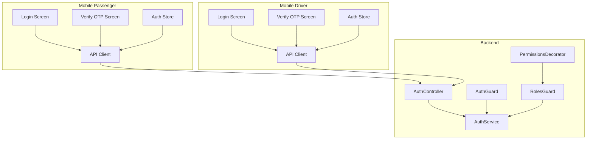
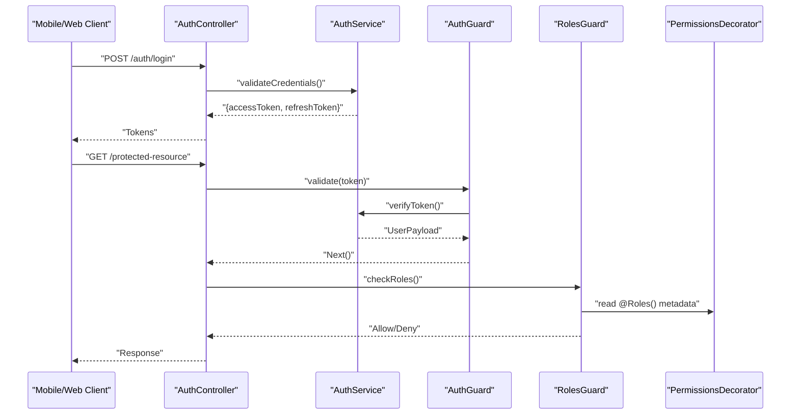
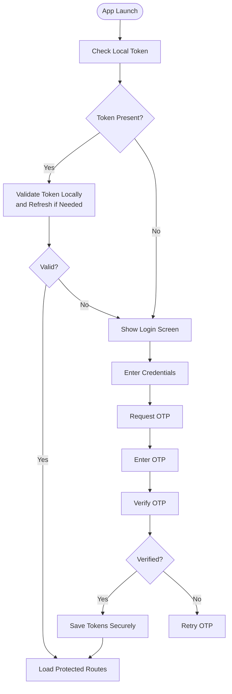
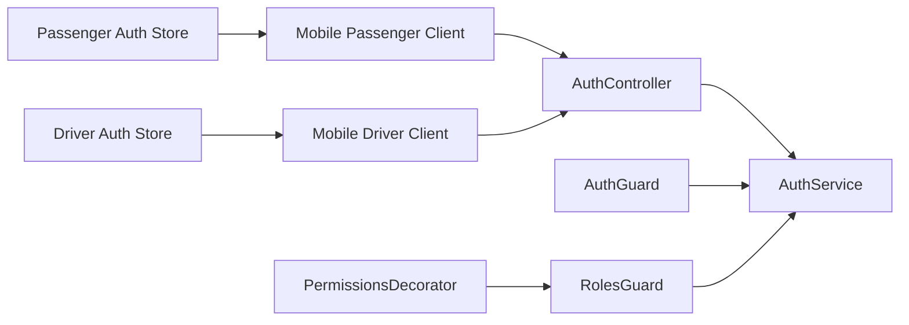

# Shared Authentication

<cite>
**Referenced Files in This Document**
- [auth.guard.ts](file://apps/backend/src/common/guards/auth.guard.ts)
- [roles.guard.ts](file://apps/backend/src/common/guards/roles.guard.ts)
- [permissions.decorator.ts](file://apps/backend/src/common/decorators/permissions.decorator.ts)
- [auth.controller.ts](file://apps/backend/src/modules/auth/auth.controller.ts)
- [auth.service.ts](file://apps/backend/src/modules/auth/auth.service.ts)
- [auth.module.ts](file://apps/backend/src/modules/auth/auth.module.ts)
- [client.ts (mobile-passenger)](file://apps/mobile-passenger/src/api/client.ts)
- [auth-store.ts (mobile-passenger)](file://apps/mobile-passenger/src/stores/auth-store.ts)
- [login.tsx (mobile-passenger)](file://apps/mobile-passenger/app/(auth)/login.tsx)
- [verify-otp.tsx (mobile-passenger)](file://apps/mobile-passenger/app/(auth)/verify-otp.tsx)
- [client.ts (mobile-driver)](file://apps/mobile-driver/src/api/client.ts)
- [auth-store.ts (mobile-driver)](file://apps/mobile-driver/src/stores/auth-store.ts)
- [login.tsx (mobile-driver)](file://apps/mobile-driver/app/(auth)/login.tsx)
- [verify-otp.tsx (mobile-driver)](file://apps/mobile-driver/app/(auth)/verify-otp.tsx)
</cite>

## Table of Contents
1. [Introduction](#introduction)
2. [Project Structure](#project-structure)
3. [Core Components](#core-components)
4. [Architecture Overview](#architecture-overview)
5. [Detailed Component Analysis](#detailed-component-analysis)
6. [Dependency Analysis](#dependency-analysis)
7. [Performance Considerations](#performance-considerations)
8. [Troubleshooting Guide](#troubleshooting-guide)
9. [Conclusion](#conclusion)
10. [Appendices](#appendices)

## Introduction
This document describes the shared authentication module and its usage across web and mobile applications. It covers JWT token handling, user session management, role-based access control, OTP verification logic, guards, decorators, middleware patterns, security best practices, token refresh mechanisms, error handling, backend integration, and client-side state management. The goal is to provide a clear, actionable guide for implementing consistent authentication flows in both web and mobile apps.

## Project Structure
The repository organizes authentication-related code into:
- Backend NestJS modules for auth endpoints, services, guards, and decorators
- Mobile apps with API clients and local stores for managing tokens and sessions
- Web apps that integrate with the same backend auth service

[No sources needed since this diagram shows conceptual workflow, not actual code structure]

## Core Components
- Auth Controller: Exposes login and OTP verification endpoints used by all clients.
- Auth Service: Implements business logic for issuing tokens, validating credentials, and verifying OTPs.
- Guards:
  - Auth Guard: Validates JWT on incoming requests and attaches user context.
  - Roles Guard: Enforces role-based access based on roles attached to the token or route metadata.
- Permissions Decorator: Provides declarative role checks at controller method level.
- Mobile Clients: HTTP clients configured to attach JWT and handle responses; stores manage token lifecycle and UI state.

Key responsibilities:
- Token issuance and validation
- Role extraction and enforcement
- OTP generation and verification
- Centralized error mapping for consistent client behavior

**Section sources**
- [auth.controller.ts](file://apps/backend/src/modules/auth/auth.controller.ts)
- [auth.service.ts](file://apps/backend/src/modules/auth/auth.service.ts)
- [auth.guard.ts](file://apps/backend/src/common/guards/auth.guard.ts)
- [roles.guard.ts](file://apps/backend/src/common/guards/roles.guard.ts)
- [permissions.decorator.ts](file://apps/backend/src/common/decorators/permissions.decorator.ts)
- [client.ts (mobile-passenger)](file://apps/mobile-passenger/src/api/client.ts)
- [auth-store.ts (mobile-passenger)](file://apps/mobile-passenger/src/stores/auth-store.ts)
- [client.ts (mobile-driver)](file://apps/mobile-driver/src/api/client.ts)
- [auth-store.ts (mobile-driver)](file://apps/mobile-driver/src/stores/auth-store.ts)

## Architecture Overview
The authentication architecture follows a standard pattern:
- Clients authenticate via login and OTP verification endpoints.
- On success, clients receive JWT tokens and persist them securely.
- Subsequent requests include the JWT in the Authorization header.
- Backend validates tokens using the Auth Guard and enforces roles via Roles Guard and Permissions Decorator.

**Diagram sources**
- [auth.controller.ts](file://apps/backend/src/modules/auth/auth.controller.ts)
- [auth.service.ts](file://apps/backend/src/modules/auth/auth.service.ts)
- [auth.guard.ts](file://apps/backend/src/common/guards/auth.guard.ts)
- [roles.guard.ts](file://apps/backend/src/common/guards/roles.guard.ts)
- [permissions.decorator.ts](file://apps/backend/src/common/decorators/permissions.decorator.ts)

## Detailed Component Analysis

### Backend Auth Module
Responsibilities:
- Define routes for login and OTP verification
- Compose guards and decorators for protected routes
- Integrate with AuthService for token operations and OTP logic

Implementation highlights:
- Controllers expose minimal endpoints and delegate to service layer
- Service encapsulates token creation/validation and OTP verification
- Module wires up guards, decorators, and service dependencies

Security considerations:
- Tokens are short-lived access tokens with optional refresh flow
- Secrets and expiration settings should be environment-configured
- Input validation and rate limiting recommended for login/OTP endpoints

**Section sources**
- [auth.module.ts](file://apps/backend/src/modules/auth/auth.module.ts)
- [auth.controller.ts](file://apps/backend/src/modules/auth/auth.controller.ts)
- [auth.service.ts](file://apps/backend/src/modules/auth/auth.service.ts)

### JWT Handling and Validation
- Access tokens are included in the Authorization header as Bearer tokens
- Auth Guard extracts and verifies tokens before allowing request processing
- User payload from token is attached to request context for downstream use

Best practices:
- Use strong signing algorithms and rotate secrets periodically
- Keep token payloads minimal; avoid sensitive data
- Validate token issuer and audience if applicable

Error handling:
- Unauthorized responses when tokens are missing, expired, or invalid
- Consistent error shapes returned to clients for predictable handling

**Section sources**
- [auth.guard.ts](file://apps/backend/src/common/guards/auth.guard.ts)
- [auth.service.ts](file://apps/backend/src/modules/auth/auth.service.ts)

### Role-Based Access Control (RBAC)
- RolesGuard reads roles from the token or request context
- PermissionsDecorator declares required roles per endpoint
- Requests without sufficient roles are denied early

Usage patterns:
- Apply decorator at controller method level to restrict access
- Combine multiple roles where necessary
- Maintain canonical role names centrally to avoid drift

**Section sources**
- [roles.guard.ts](file://apps/backend/src/common/guards/roles.guard.ts)
- [permissions.decorator.ts](file://apps/backend/src/common/decorators/permissions.decorator.ts)

### OTP Verification Logic
Flow:
- Client initiates login with identifier (e.g., phone/email)
- Server generates OTP and sends it via chosen channel
- Client submits OTP for verification
- On success, server issues tokens; on failure, returns appropriate errors

Security considerations:
- Limit OTP attempts and enforce cooldowns
- Bind OTP to session or request context to prevent reuse
- Ensure secure transmission and storage of OTP metadata

**Section sources**
- [auth.controller.ts](file://apps/backend/src/modules/auth/auth.controller.ts)
- [auth.service.ts](file://apps/backend/src/modules/auth/auth.service.ts)

### Mobile Client Integration (Passenger and Driver)
HTTP Client:
- Configured to attach JWT to outgoing requests
- Handles response codes and redirects to login on unauthorized
- Optionally implements token refresh retry logic

Auth Store:
- Persists tokens securely (platform-specific secure storage)
- Manages login state and exposes methods for sign-in/sign-out
- Updates UI state reactively

Screens:
- Login screen collects credentials and triggers login flow
- Verify OTP screen handles OTP entry and finalization

**Diagram sources**
- [client.ts (mobile-passenger)](file://apps/mobile-passenger/src/api/client.ts)
- [auth-store.ts (mobile-passenger)](file://apps/mobile-passenger/src/stores/auth-store.ts)
- [login.tsx (mobile-passenger)](file://apps/mobile-passenger/app/(auth)/login.tsx)
- [verify-otp.tsx (mobile-passenger)](file://apps/mobile-passenger/app/(auth)/verify-otp.tsx)
- [client.ts (mobile-driver)](file://apps/mobile-driver/src/api/client.ts)
- [auth-store.ts (mobile-driver)](file://apps/mobile-driver/src/stores/auth-store.ts)
- [login.tsx (mobile-driver)](file://apps/mobile-driver/app/(auth)/login.tsx)
- [verify-otp.tsx (mobile-driver)](file://apps/mobile-driver/app/(auth)/verify-otp.tsx)

**Section sources**
- [client.ts (mobile-passenger)](file://apps/mobile-passenger/src/api/client.ts)
- [auth-store.ts (mobile-passenger)](file://apps/mobile-passenger/src/stores/auth-store.ts)
- [login.tsx (mobile-passenger)](file://apps/mobile-passenger/app/(auth)/login.tsx)
- [verify-otp.tsx (mobile-passenger)](file://apps/mobile-passenger/app/(auth)/verify-otp.tsx)
- [client.ts (mobile-driver)](file://apps/mobile-driver/src/api/client.ts)
- [auth-store.ts (mobile-driver)](file://apps/mobile-driver/src/stores/auth-store.ts)
- [login.tsx (mobile-driver)](file://apps/mobile-driver/app/(auth)/login.tsx)
- [verify-otp.tsx (mobile-driver)](file://apps/mobile-driver/app/(auth)/verify-otp.tsx)

### Web App Integration
- Next.js pages can protect routes by checking token presence and redirecting to login
- API calls should include Authorization header via a centralized fetch wrapper
- State persistence can mirror mobile patterns using secure storage or httpOnly cookies on the server side

[No sources needed since this section provides general guidance]

## Dependency Analysis
The following diagram maps key dependencies between backend components and mobile clients.

**Diagram sources**
- [auth.controller.ts](file://apps/backend/src/modules/auth/auth.controller.ts)
- [auth.service.ts](file://apps/backend/src/modules/auth/auth.service.ts)
- [auth.guard.ts](file://apps/backend/src/common/guards/auth.guard.ts)
- [roles.guard.ts](file://apps/backend/src/common/guards/roles.guard.ts)
- [permissions.decorator.ts](file://apps/backend/src/common/decorators/permissions.decorator.ts)
- [client.ts (mobile-passenger)](file://apps/mobile-passenger/src/api/client.ts)
- [auth-store.ts (mobile-passenger)](file://apps/mobile-passenger/src/stores/auth-store.ts)
- [client.ts (mobile-driver)](file://apps/mobile-driver/src/api/client.ts)
- [auth-store.ts (mobile-driver)](file://apps/mobile-driver/src/stores/auth-store.ts)

**Section sources**
- [auth.controller.ts](file://apps/backend/src/modules/auth/auth.controller.ts)
- [auth.service.ts](file://apps/backend/src/modules/auth/auth.service.ts)
- [auth.guard.ts](file://apps/backend/src/common/guards/auth.guard.ts)
- [roles.guard.ts](file://apps/backend/src/common/guards/roles.guard.ts)
- [permissions.decorator.ts](file://apps/backend/src/common/decorators/permissions.decorator.ts)
- [client.ts (mobile-passenger)](file://apps/mobile-passenger/src/api/client.ts)
- [auth-store.ts (mobile-passenger)](file://apps/mobile-passenger/src/stores/auth-store.ts)
- [client.ts (mobile-driver)](file://apps/mobile-driver/src/api/client.ts)
- [auth-store.ts (mobile-driver)](file://apps/mobile-driver/src/stores/auth-store.ts)

## Performance Considerations
- Minimize token payload size to reduce network overhead
- Cache user profile data after initial load to avoid repeated lookups
- Implement token refresh only when necessary to avoid extra round-trips
- Use connection pooling and keep-alive for HTTP clients
- Debounce rapid re-authentication attempts during OTP retries

[No sources needed since this section provides general guidance]

## Troubleshooting Guide
Common issues and resolutions:
- 401 Unauthorized:
  - Missing or malformed Authorization header
  - Expired or invalid token; trigger refresh or re-login
- 403 Forbidden:
  - Insufficient roles; verify @Roles() metadata and user roles
- OTP failures:
  - Incorrect OTP or expired; prompt retry and show cooldown
- Network errors:
  - Handle timeouts and retries; surface user-friendly messages
- State inconsistencies:
  - Clear stale tokens on logout; ensure store updates propagate to UI

Operational tips:
- Log request IDs for correlation
- Normalize error responses across clients
- Add health checks for auth endpoints

**Section sources**
- [auth.controller.ts](file://apps/backend/src/modules/auth/auth.controller.ts)
- [auth.service.ts](file://apps/backend/src/modules/auth/auth.service.ts)
- [auth.guard.ts](file://apps/backend/src/common/guards/auth.guard.ts)
- [roles.guard.ts](file://apps/backend/src/common/guards/roles.guard.ts)
- [client.ts (mobile-passenger)](file://apps/mobile-passenger/src/api/client.ts)
- [auth-store.ts (mobile-passenger)](file://apps/mobile-passenger/src/stores/auth-store.ts)
- [client.ts (mobile-driver)](file://apps/mobile-driver/src/api/client.ts)
- [auth-store.ts (mobile-driver)](file://apps/mobile-driver/src/stores/auth-store.ts)

## Conclusion
The shared authentication module provides a cohesive foundation for securing web and mobile applications through JWT-based authentication, RBAC, and OTP verification. By centralizing guards, decorators, and service logic on the backend and mirroring robust client patterns on mobile, teams can implement consistent, secure, and maintainable authentication flows. Adhering to the security best practices and troubleshooting strategies outlined here will help ensure reliable operation and a smooth user experience.

## Appendices

### Security Best Practices
- Use short-lived access tokens and secure refresh mechanisms
- Store tokens in platform-secure storage on mobile; prefer httpOnly cookies on web backends
- Enforce HTTPS everywhere and validate certificates
- Rotate signing secrets regularly and monitor for leaks
- Apply input validation and rate limiting on login and OTP endpoints
- Avoid logging sensitive data such as tokens or OTPs

[No sources needed since this section provides general guidance]

### Token Refresh Mechanism
Recommended approach:
- Include a refresh token alongside the access token
- On receiving 401, attempt silent refresh using stored refresh token
- If refresh fails, redirect to login and clear local state
- Re-attempt original request upon successful refresh

[No sources needed since this section provides general guidance]

### Usage Examples

#### Web Application Flow
- On app start, check for existing token and validate
- Protect routes by verifying token presence and redirecting to login if absent
- Attach Authorization header to all API calls via a centralized fetch wrapper
- Handle 401 by refreshing token or prompting re-login

[No sources needed since this section provides general guidance]

#### Mobile Application Flow
- Use the API client to call login and OTP verification endpoints
- Persist tokens securely and update the auth store
- Navigate to protected screens only when authenticated
- Implement automatic token refresh on 401 responses

**Section sources**
- [client.ts (mobile-passenger)](file://apps/mobile-passenger/src/api/client.ts)
- [auth-store.ts (mobile-passenger)](file://apps/mobile-passenger/src/stores/auth-store.ts)
- [login.tsx (mobile-passenger)](file://apps/mobile-passenger/app/(auth)/login.tsx)
- [verify-otp.tsx (mobile-passenger)](file://apps/mobile-passenger/app/(auth)/verify-otp.tsx)
- [client.ts (mobile-driver)](file://apps/mobile-driver/src/api/client.ts)
- [auth-store.ts (mobile-driver)](file://apps/mobile-driver/src/stores/auth-store.ts)
- [login.tsx (mobile-driver)](file://apps/mobile-driver/app/(auth)/login.tsx)
- [verify-otp.tsx (mobile-driver)](file://apps/mobile-driver/app/(auth)/verify-otp.tsx)