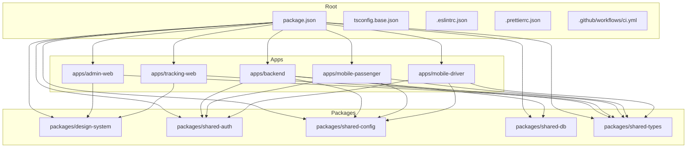
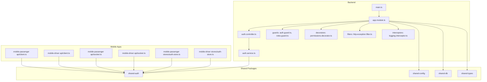
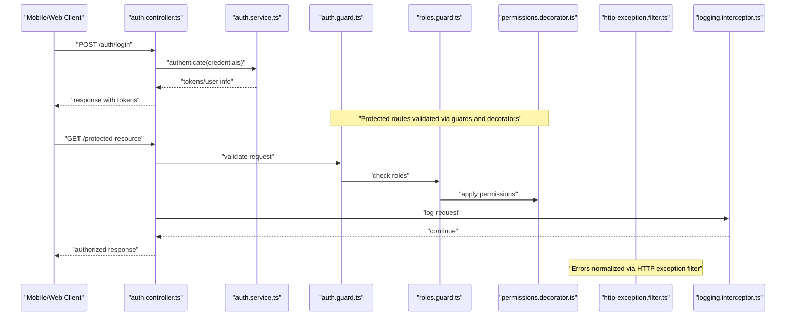
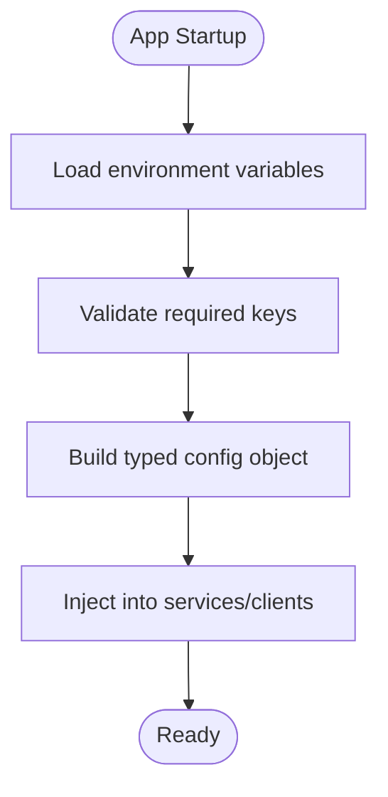
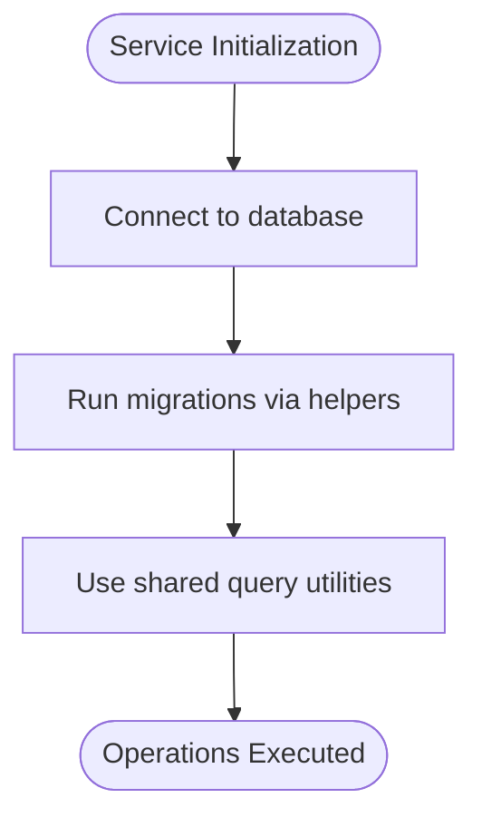
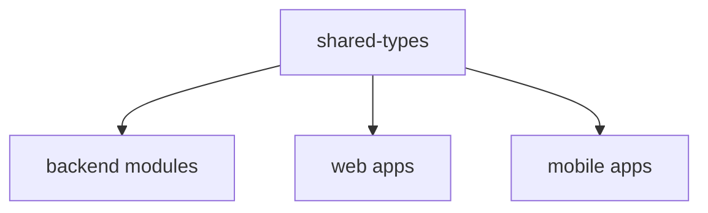
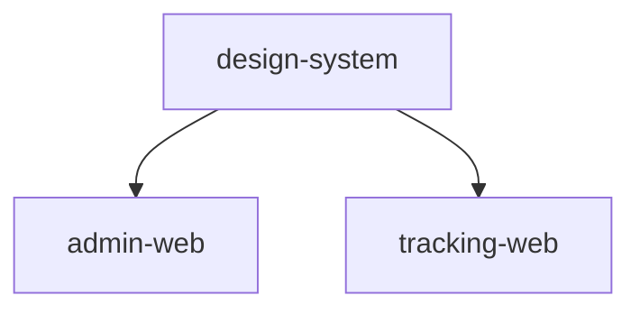
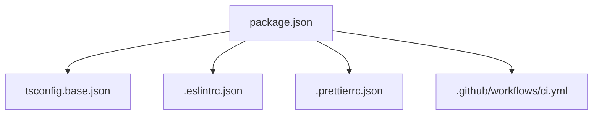

# Shared Packages & Libraries

<cite>
**Referenced Files in This Document**
- [package.json](file://package.json)
- [tsconfig.base.json](file://tsconfig.base.json)
- [.eslintrc.json](file://.eslintrc.json)
- [.prettierrc.json](file://.prettierrc.json)
- [ci.yml](file://.github/workflows/ci.yml)
- [README.md](file://README.md)
- [auth.guard.ts](file://apps/backend/src/common/guards/auth.guard.ts)
- [roles.guard.ts](file://apps/backend/src/common/guards/roles.guard.ts)
- [permissions.decorator.ts](file://apps/backend/src/common/decorators/permissions.decorator.ts)
- [http-exception.filter.ts](file://apps/backend/src/common/filters/http-exception.filter.ts)
- [logging.interceptor.ts](file://apps/backend/src/common/interceptors/logging.interceptor.ts)
- [auth.controller.ts](file://apps/backend/src/modules/auth/auth.controller.ts)
- [auth.service.ts](file://apps/backend/src/modules/auth/auth.service.ts)
- [app.module.ts](file://apps/backend/src/app.module.ts)
- [main.ts](file://apps/backend/src/main.ts)
- [client.ts (mobile-passenger)](file://apps/mobile-passenger/src/api/client.ts)
- [client.ts (mobile-driver)](file://apps/mobile-driver/src/api/client.ts)
- [socket.ts (mobile-passenger)](file://apps/mobile-passenger/src/api/socket.ts)
- [socket.ts (mobile-driver)](file://apps/mobile-driver/src/api/socket.ts)
- [auth-store.ts (mobile-passenger)](file://apps/mobile-passenger/src/stores/auth-store.ts)
- [auth-store.ts (mobile-driver)](file://apps/mobile-driver/src/stores/auth-store.ts)
</cite>

## Table of Contents
1. [Introduction](#introduction)
2. [Project Structure](#project-structure)
3. [Core Components](#core-components)
4. [Architecture Overview](#architecture-overview)
5. [Detailed Component Analysis](#detailed-component-analysis)
6. [Dependency Analysis](#dependency-analysis)
7. [Performance Considerations](#performance-considerations)
8. [Troubleshooting Guide](#troubleshooting-guide)
9. [Conclusion](#conclusion)
10. [Appendices](#appendices)

## Introduction
This document describes the shared packages and libraries used across the 18KansRide monorepo, focusing on design system components, styling tokens, reusable UI elements, shared authentication logic, configuration management, database utilities, common queries, migration helpers, and TypeScript type definitions. It also provides usage examples, contribution guidelines, versioning strategies, dependency management, and package publishing workflows. Where applicable, it references concrete source files to ground the guidance in the actual codebase.

## Project Structure
The repository is a monorepo with multiple applications under apps/ and shared packages under packages/. The root contains tooling and configuration shared by all apps and packages.

**Diagram sources**
- [package.json](file://package.json)
- [tsconfig.base.json](file://tsconfig.base.json)
- [ci.yml](file://.github/workflows/ci.yml)

**Section sources**
- [package.json](file://package.json)
- [tsconfig.base.json](file://tsconfig.base.json)
- [README.md](file://README.md)

## Core Components
This section outlines the shared packages and their responsibilities:

- Design System (packages/design-system): Centralized UI components, tokens, and theming for consistent user experiences across web apps.
- Shared Auth (packages/shared-auth): Common authentication logic, guards, and utilities for both backend and mobile clients.
- Shared Config (packages/shared-config): Environment-specific settings and configuration loaders.
- Shared DB (packages/shared-db): Database utilities, common queries, and migration helpers.
- Shared Types (packages/shared-types): TypeScript types and interfaces consumed by all apps and packages.

Usage patterns:
- Backend consumes shared-auth, shared-config, shared-db, and shared-types.
- Web apps consume design-system and shared-types; they may also use shared-config for environment variables.
- Mobile apps consume shared-auth, shared-config, and shared-types for API client setup and state management.

**Section sources**
- [package.json](file://package.json)
- [tsconfig.base.json](file://tsconfig.base.json)

## Architecture Overview
The shared packages provide cross-cutting concerns that are reused by multiple applications. The following diagram shows how the backend integrates with shared modules and how mobile apps interact with shared auth and config.

**Diagram sources**
- [main.ts](file://apps/backend/src/main.ts)
- [app.module.ts](file://apps/backend/src/app.module.ts)
- [auth.controller.ts](file://apps/backend/src/modules/auth/auth.controller.ts)
- [auth.service.ts](file://apps/backend/src/modules/auth/auth.service.ts)
- [auth.guard.ts](file://apps/backend/src/common/guards/auth.guard.ts)
- [roles.guard.ts](file://apps/backend/src/common/guards/roles.guard.ts)
- [permissions.decorator.ts](file://apps/backend/src/common/decorators/permissions.decorator.ts)
- [http-exception.filter.ts](file://apps/backend/src/common/filters/http-exception.filter.ts)
- [logging.interceptor.ts](file://apps/backend/src/common/interceptors/logging.interceptor.ts)
- [client.ts (mobile-passenger)](file://apps/mobile-passenger/src/api/client.ts)
- [client.ts (mobile-driver)](file://apps/mobile-driver/src/api/client.ts)
- [socket.ts (mobile-passenger)](file://apps/mobile-passenger/src/api/socket.ts)
- [socket.ts (mobile-driver)](file://apps/mobile-driver/src/api/socket.ts)
- [auth-store.ts (mobile-passenger)](file://apps/mobile-passenger/src/stores/auth-store.ts)
- [auth-store.ts (mobile-driver)](file://apps/mobile-driver/src/stores/auth-store.ts)

## Detailed Component Analysis

### Shared Authentication Module
Responsibilities:
- Provide common authentication flows (login, token handling).
- Implement guards and decorators for authorization.
- Offer utilities for token validation and session management.

Backend integration points:
- Guards enforce authentication and role-based access control.
- Decorators simplify permission checks on controllers.
- Filters standardize HTTP exception responses.
- Interceptors add cross-cutting behavior like logging.

**Diagram sources**
- [auth.controller.ts](file://apps/backend/src/modules/auth/auth.controller.ts)
- [auth.service.ts](file://apps/backend/src/modules/auth/auth.service.ts)
- [auth.guard.ts](file://apps/backend/src/common/guards/auth.guard.ts)
- [roles.guard.ts](file://apps/backend/src/common/guards/roles.guard.ts)
- [permissions.decorator.ts](file://apps/backend/src/common/decorators/permissions.decorator.ts)
- [http-exception.filter.ts](file://apps/backend/src/common/filters/http-exception.filter.ts)
- [logging.interceptor.ts](file://apps/backend/src/common/interceptors/logging.interceptor.ts)

**Section sources**
- [auth.guard.ts](file://apps/backend/src/common/guards/auth.guard.ts)
- [roles.guard.ts](file://apps/backend/src/common/guards/roles.guard.ts)
- [permissions.decorator.ts](file://apps/backend/src/common/decorators/permissions.decorator.ts)
- [http-exception.filter.ts](file://apps/backend/src/common/filters/http-exception.filter.ts)
- [logging.interceptor.ts](file://apps/backend/src/common/interceptors/logging.interceptor.ts)
- [auth.controller.ts](file://apps/backend/src/modules/auth/auth.controller.ts)
- [auth.service.ts](file://apps/backend/src/modules/auth/auth.service.ts)

### Configuration Management System
Purpose:
- Load environment-specific settings for backend and mobile apps.
- Provide typed configuration objects consumed by services and clients.

Integration points:
- Backend module initialization uses configuration values.
- Mobile apps configure API clients and sockets using environment variables.

[No sources needed since this diagram shows conceptual workflow, not actual code structure]

**Section sources**
- [app.module.ts](file://apps/backend/src/app.module.ts)
- [client.ts (mobile-passenger)](file://apps/mobile-passenger/src/api/client.ts)
- [client.ts (mobile-driver)](file://apps/mobile-driver/src/api/client.ts)
- [socket.ts (mobile-passenger)](file://apps/mobile-passenger/src/api/socket.ts)
- [socket.ts (mobile-driver)](file://apps/mobile-driver/src/api/socket.ts)

### Database Utilities and Migration Helpers
Purpose:
- Provide reusable database operations and query builders.
- Standardize migrations and schema evolution.

Integration points:
- Backend services import shared-db utilities for common queries.
- Migrations are executed through shared helpers to ensure consistency.

[No sources needed since this diagram shows conceptual workflow, not actual code structure]

**Section sources**
- [app.module.ts](file://apps/backend/src/app.module.ts)

### TypeScript Type Definitions
Purpose:
- Centralize shared types consumed by backend, web, and mobile apps.
- Ensure consistent contracts between services and clients.

Integration points:
- Backend modules import shared-types for DTOs and entities.
- Mobile apps import shared-types for API payloads and store models.

[No sources needed since this diagram shows conceptual workflow, not actual code structure]

**Section sources**
- [tsconfig.base.json](file://tsconfig.base.json)

### Design System Components and Styling Tokens
Purpose:
- Provide reusable UI components, tokens, and theming for consistent visuals.
- Reduce duplication across admin-web and tracking-web.

Integration points:
- Web apps import design-system components and tokens.
- Tailwind configurations reference shared tokens where applicable.

[No sources needed since this diagram shows conceptual workflow, not actual code structure]

**Section sources**
- [tsconfig.base.json](file://tsconfig.base.json)

## Dependency Analysis
Monorepo-level dependencies and tooling:
- Root package.json defines workspace packages and scripts.
- tsconfig.base.json centralizes TypeScript compiler options.
- ESLint and Prettier configs standardize linting and formatting.
- CI pipeline automates builds and tests.

**Diagram sources**
- [package.json](file://package.json)
- [tsconfig.base.json](file://tsconfig.base.json)
- [.eslintrc.json](file://.eslintrc.json)
- [.prettierrc.json](file://.prettierrc.json)
- [ci.yml](file://.github/workflows/ci.yml)

**Section sources**
- [package.json](file://package.json)
- [tsconfig.base.json](file://tsconfig.base.json)
- [.eslintrc.json](file://.eslintrc.json)
- [.prettierrc.json](file://.prettierrc.json)
- [ci.yml](file://.github/workflows/ci.yml)

## Performance Considerations
- Prefer lazy loading of heavy shared packages in mobile apps to reduce bundle size.
- Cache frequently accessed configuration values at startup to avoid repeated IO.
- Use connection pooling and prepared statements in database utilities to minimize overhead.
- Apply memoization or caching layers around expensive shared computations.
- Keep shared-types minimal and focused to reduce compile times and bundle sizes.

[No sources needed since this section provides general guidance]

## Troubleshooting Guide
Common issues and resolutions:
- Authentication failures: Verify guard and decorator wiring; ensure tokens are present and valid. Check HTTP exception filter for standardized error messages.
- Configuration errors: Validate environment variables at startup; confirm required keys exist and have correct formats.
- Database connectivity: Confirm connection parameters and run migrations before starting services.
- Type mismatches: Align shared-types with API contracts; update shared-types when backend schemas evolve.

Operational hooks:
- Logging interceptor can help trace request/response cycles.
- HTTP exception filter normalizes error responses for easier debugging.

**Section sources**
- [auth.guard.ts](file://apps/backend/src/common/guards/auth.guard.ts)
- [roles.guard.ts](file://apps/backend/src/common/guards/roles.guard.ts)
- [permissions.decorator.ts](file://apps/backend/src/common/decorators/permissions.decorator.ts)
- [http-exception.filter.ts](file://apps/backend/src/common/filters/http-exception.filter.ts)
- [logging.interceptor.ts](file://apps/backend/src/common/interceptors/logging.interceptor.ts)

## Conclusion
The shared packages form the backbone of the 18KansRide monorepo, providing consistent authentication, configuration, database utilities, types, and UI components. By centralizing these concerns, the team ensures maintainability, reduces duplication, and accelerates feature development across backend, web, and mobile applications. Adhering to the contribution and publishing guidelines will keep the ecosystem stable and scalable.

[No sources needed since this section summarizes without analyzing specific files]

## Appendices

### Usage Examples
- Backend:
  - Import shared-auth guards and decorators to protect endpoints.
  - Use shared-config to load environment-specific settings.
  - Leverage shared-db utilities for common queries and migrations.
- Mobile:
  - Configure API client and socket with shared-config values.
  - Manage auth state using shared-auth utilities and stores.
- Web:
  - Consume design-system components and tokens for consistent UI.
  - Use shared-types for payload shapes and store models.

[No sources needed since this section provides general guidance]

### Contribution Guidelines
- Follow monorepo conventions: place shared logic in packages/, app-specific code in apps/.
- Maintain strict typing: define and export types from shared-types.
- Keep configuration centralized: add new env keys to shared-config and validate at startup.
- Write tests for shared utilities and guards to prevent regressions.
- Update documentation when introducing new shared APIs.

[No sources needed since this section provides general guidance]

### Versioning Strategies
- Semantic versioning for each shared package.
- Coordinate breaking changes across apps consuming shared packages.
- Publish changelogs and tag releases in CI.

[No sources needed since this section provides general guidance]

### Dependency Management and Publishing Workflows
- Define workspace dependencies in root package.json.
- Use CI pipeline to build, test, and publish packages.
- Pin versions in apps/packages to ensure reproducibility.
- Automate release notes and tags during publishing.

**Section sources**
- [package.json](file://package.json)
- [ci.yml](file://.github/workflows/ci.yml)