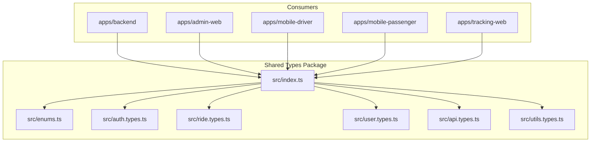
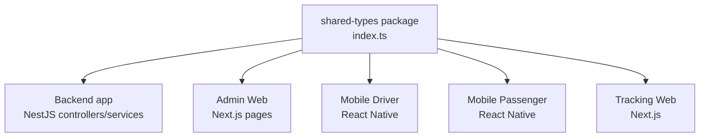
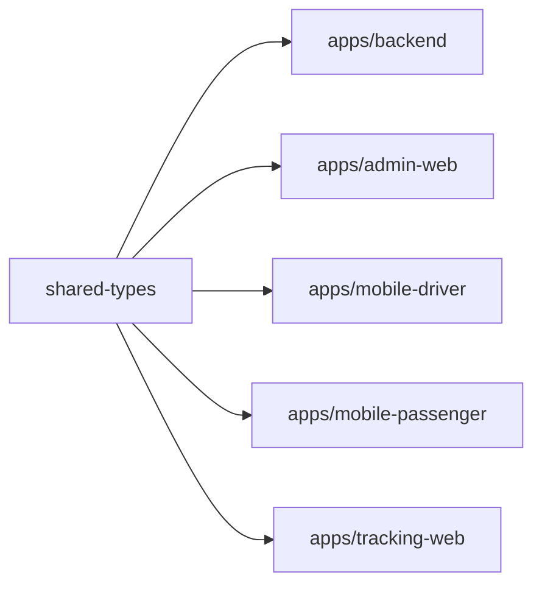

# TypeScript Type Definitions

<cite>
**Referenced Files in This Document**
- [package.json](file://packages/shared-types/package.json)
- [tsconfig.json](file://packages/shared-types/tsconfig.json)
- [index.ts](file://packages/shared-types/src/index.ts)
- [auth.types.ts](file://packages/shared-types/src/auth.types.ts)
- [ride.types.ts](file://packages/shared-types/src/ride.types.ts)
- [user.types.ts](file://packages/shared-types/src/user.types.ts)
- [api.types.ts](file://packages/shared-types/src/api.types.ts)
- [enums.ts](file://packages/shared-types/src/enums.ts)
- [utils.types.ts](file://packages/shared-types/src/utils.types.ts)
- [backend tsconfig.json](file://apps/backend/tsconfig.json)
- [admin-web tsconfig.json](file://apps/admin-web/tsconfig.json)
- [mobile-driver tsconfig.json](file://apps/mobile-driver/tsconfig.json)
- [mobile-passenger tsconfig.json](file://apps/mobile-passenger/tsconfig.json)
- [tracking-web tsconfig.json](file://apps/tracking-web/tsconfig.json)
</cite>

## Table of Contents
1. [Introduction](#introduction)
2. [Project Structure](#project-structure)
3. [Core Components](#core-components)
4. [Architecture Overview](#architecture-overview)
5. [Detailed Component Analysis](#detailed-component-analysis)
6. [Dependency Analysis](#dependency-analysis)
7. [Performance Considerations](#performance-considerations)
8. [Troubleshooting Guide](#troubleshooting-guide)
9. [Conclusion](#conclusion)
10. [Appendices](#appendices)

## Introduction
This document describes the shared TypeScript type definitions used across all applications in the monorepo. It covers core domain models, API request/response types, enums, and utility types. It also explains type safety patterns, generic usage, interface composition strategies, import and usage examples across apps, evolution and versioning strategies, breaking change management, inference benefits, compile-time error prevention, and guidelines for adding new types while maintaining consistency.

## Project Structure
The shared types are centralized in a dedicated package to ensure consistent contracts between backend services and frontend/mobile clients. The package exposes a single public entry point that re-exports all types consumed by other packages and apps.

**Diagram sources**
- [index.ts](file://packages/shared-types/src/index.ts)
- [enums.ts](file://packages/shared-types/src/enums.ts)
- [auth.types.ts](file://packages/shared-types/src/auth.types.ts)
- [ride.types.ts](file://packages/shared-types/src/ride.types.ts)
- [user.types.ts](file://packages/shared-types/src/user.types.ts)
- [api.types.ts](file://packages/shared-types/src/api.types.ts)
- [utils.types.ts](file://packages/shared-types/src/utils.types.ts)

**Section sources**
- [package.json](file://packages/shared-types/package.json)
- [tsconfig.json](file://packages/shared-types/tsconfig.json)
- [index.ts](file://packages/shared-types/src/index.ts)

## Core Components
- Domain models: Entities such as users, rides, and authentication-related structures are defined in dedicated files to keep concerns separated and improve discoverability.
- API contracts: Request and response shapes for endpoints are modeled centrally to enforce consistency across consumers.
- Enums: Shared enumerations (e.g., roles, statuses) are defined once and reused everywhere to prevent string drift.
- Utility types: Reusable generics and helper types support common patterns like paginated responses, optional fields, and discriminated unions.

Key responsibilities:
- Single source of truth for cross-app contracts
- Strong typing for API payloads and WebSocket events
- Centralized enum values to avoid inconsistencies
- Composable interfaces to reduce duplication

**Section sources**
- [auth.types.ts](file://packages/shared-types/src/auth.types.ts)
- [ride.types.ts](file://packages/shared-types/src/ride.types.ts)
- [user.types.ts](file://packages/shared-types/src/user.types.ts)
- [api.types.ts](file://packages/shared-types/src/api.types.ts)
- [enums.ts](file://packages/shared-types/src/enums.ts)
- [utils.types.ts](file://packages/shared-types/src/utils.types.ts)

## Architecture Overview
The shared types package is consumed by both server-side and client-side applications. Consumers import from the package’s public entry point. The package configuration ensures strict compilation and clean exports.

**Diagram sources**
- [index.ts](file://packages/shared-types/src/index.ts)
- [backend tsconfig.json](file://apps/backend/tsconfig.json)
- [admin-web tsconfig.json](file://apps/admin-web/tsconfig.json)
- [mobile-driver tsconfig.json](file://apps/mobile-driver/tsconfig.json)
- [mobile-passenger tsconfig.json](file://apps/mobile-passenger/tsconfig.json)
- [tracking-web tsconfig.json](file://apps/tracking-web/tsconfig.json)

## Detailed Component Analysis

### Authentication Types
Purpose:
- Define user identity, roles, tokens, and session-related structures.
- Provide request/response shapes for login, registration, OTP verification, and profile updates.

Type safety patterns:
- Discriminated unions for different auth flows.
- Strict field requirements for sensitive operations.
- Optional fields for partial updates.

Usage examples:
- Backend guards and decorators validate roles using shared enums and user types.
- Frontend forms bind inputs to typed request shapes.
- Mobile stores persist typed user sessions.

**Section sources**
- [auth.types.ts](file://packages/shared-types/src/auth.types.ts)
- [enums.ts](file://packages/shared-types/src/enums.ts)

### Ride Types
Purpose:
- Model ride lifecycle, locations, pricing, and status transitions.
- Define request/response schemas for creating, updating, and listing rides.
- Support real-time event payloads via shared types.

Type safety patterns:
- Enumerated statuses to constrain state transitions.
- Geolocation coordinates represented with precise numeric types.
- Paginated list responses using utility types.

Usage examples:
- Backend controllers accept typed DTOs and return typed responses.
- Admin dashboard lists rides with typed filters and pagination.
- Tracking web displays live ride updates using typed socket messages.

**Section sources**
- [ride.types.ts](file://packages/shared-types/src/ride.types.ts)
- [api.types.ts](file://packages/shared-types/src/api.types.ts)
- [enums.ts](file://packages/shared-types/src/enums.ts)

### User Types
Purpose:
- Represent user profiles, preferences, and account metadata.
- Define request/response shapes for CRUD operations and profile updates.

Type safety patterns:
- Required fields for immutable identifiers.
- Optional fields for non-critical profile data.
- Consistent naming aligned with database schema.

Usage examples:
- Backend services validate and transform user inputs.
- Admin UI renders user details with strong typing.
- Mobile apps display user info safely without runtime checks.

**Section sources**
- [user.types.ts](file://packages/shared-types/src/user.types.ts)

### API Contracts
Purpose:
- Standardize request/response envelopes across endpoints.
- Include common headers, query parameters, and body shapes.
- Provide reusable pagination and filtering types.

Type safety patterns:
- Generic pagination wrapper to avoid repetition.
- Union types for different response variants.
- Strict nullability rules enforced by compiler settings.

Usage examples:
- HTTP clients use typed request builders.
- Controllers map DTOs to response envelopes.
- Frontend components consume typed data directly.

**Section sources**
- [api.types.ts](file://packages/shared-types/src/api.types.ts)
- [utils.types.ts](file://packages/shared-types/src/utils.types.ts)

### Enums
Purpose:
- Centralize constant sets such as roles, ride statuses, and feature flags.
- Prevent string literals from drifting across apps.

Type safety patterns:
- String enums for explicit serialization.
- Exhaustive checks in switch statements.

Usage examples:
- Guards and decorators assert permissions based on role enums.
- UI conditionally renders features based on status enums.

**Section sources**
- [enums.ts](file://packages/shared-types/src/enums.ts)

### Utility Types
Purpose:
- Provide reusable building blocks like paginated results, optionals, and mapped types.
- Simplify complex generic constraints.

Type safety patterns:
- Generics with default constraints for ergonomic usage.
- Conditional types for flexible shape derivation.

Usage examples:
- API responses wrapped in a standard paginated type.
- Partial update requests derived from base entities.

**Section sources**
- [utils.types.ts](file://packages/shared-types/src/utils.types.ts)

### Public Entry Point
Purpose:
- Re-export all shared types under a single namespace.
- Ensure stable consumer imports.

Best practices:
- Group exports by domain or feature.
- Avoid leaking internal-only types.

**Section sources**
- [index.ts](file://packages/shared-types/src/index.ts)

## Dependency Analysis
The shared types package has no runtime dependencies and is consumed by multiple apps. Each app configures its TypeScript settings to resolve the package correctly.

**Diagram sources**
- [package.json](file://packages/shared-types/package.json)
- [backend tsconfig.json](file://apps/backend/tsconfig.json)
- [admin-web tsconfig.json](file://apps/admin-web/tsconfig.json)
- [mobile-driver tsconfig.json](file://apps/mobile-driver/tsconfig.json)
- [mobile-passenger tsconfig.json](file://apps/mobile-passenger/tsconfig.json)
- [tracking-web tsconfig.json](file://apps/tracking-web/tsconfig.json)

**Section sources**
- [package.json](file://packages/shared-types/package.json)
- [backend tsconfig.json](file://apps/backend/tsconfig.json)
- [admin-web tsconfig.json](file://apps/admin-web/tsconfig.json)
- [mobile-driver tsconfig.json](file://apps/mobile-driver/tsconfig.json)
- [mobile-passenger tsconfig.json](file://apps/mobile-passenger/tsconfig.json)
- [tracking-web tsconfig.json](file://apps/tracking-web/tsconfig.json)

## Performance Considerations
- Keep the shared types package small and focused to minimize bundle impact on client apps.
- Prefer narrow exports; avoid barrel files that re-export large unused modules when possible.
- Use conditional exports if supporting both Node and browser environments.
- Leverage TypeScript’s incremental builds to speed up compilation across the monorepo.

[No sources needed since this section provides general guidance]

## Troubleshooting Guide
Common issues and resolutions:
- Import path errors: Ensure apps reference the correct package name and that tsconfig paths or module resolution are configured properly.
- Version mismatches: Align shared types versions across apps to avoid contract drift.
- Circular dependencies: Keep the types package free of circular imports; split into focused modules if needed.
- Strict mode violations: Enable strict compiler options in the shared package to catch potential issues early.

Validation checklist:
- Run type checks for each app after changing shared types.
- Verify that all consumers build successfully.
- Confirm that linting and formatting pass.

**Section sources**
- [package.json](file://packages/shared-types/package.json)
- [tsconfig.json](file://packages/shared-types/tsconfig.json)

## Conclusion
Centralizing TypeScript types in a dedicated package enforces strong contracts, improves developer experience, and reduces runtime errors. By following the guidelines for adding and evolving types, teams can maintain consistency and reliability across the entire monorepo.

[No sources needed since this section summarizes without analyzing specific files]

## Appendices

### Importing and Using Shared Types Across Apps
- Backend: Import domain and API types for controllers, services, and guards.
- Admin Web: Import types for page data fetching and form handling.
- Mobile Drivers/Passengers: Import types for API calls and local store state.
- Tracking Web: Import types for live updates and route tracking.

Guidelines:
- Always import from the package’s public entry point.
- Prefer specific named imports over wildcard imports.
- Use utility types to derive request/response shapes where appropriate.

**Section sources**
- [index.ts](file://packages/shared-types/src/index.ts)

### Type Safety Patterns and Best Practices
- Use discriminated unions to model variant payloads.
- Apply strict null checks and forbid implicit any.
- Prefer enums over string literals for fixed sets.
- Compose interfaces rather than duplicating fields.
- Use generics for reusable patterns like pagination and result wrappers.

**Section sources**
- [api.types.ts](file://packages/shared-types/src/api.types.ts)
- [utils.types.ts](file://packages/shared-types/src/utils.types.ts)
- [enums.ts](file://packages/shared-types/src/enums.ts)

### Type Evolution and Versioning Strategy
- Follow semantic versioning for the shared types package.
- Introduce new fields as optional to avoid breaking changes.
- Deprecate old fields gradually with clear migration notes.
- Maintain a changelog documenting breaking changes and migration steps.
- Coordinate major version bumps across consumers during planned releases.

**Section sources**
- [package.json](file://packages/shared-types/package.json)

### Compile-Time Error Prevention and Inference Benefits
- Rely on TypeScript inference to reduce boilerplate.
- Use function signatures with explicit input/output types.
- Leverage mapped and conditional types to derive shapes automatically.
- Configure strict compiler options to catch issues at build time.

**Section sources**
- [tsconfig.json](file://packages/shared-types/tsconfig.json)

### Guidelines for Adding New Types
- Place new types in the most relevant file (auth, ride, user, api, utils).
- Export only what consumers need from the public entry point.
- Add tests or usage examples in the consuming app if necessary.
- Update documentation and changelog accordingly.
- Run full type checks across all apps before merging.

**Section sources**
- [index.ts](file://packages/shared-types/src/index.ts)
- [auth.types.ts](file://packages/shared-types/src/auth.types.ts)
- [ride.types.ts](file://packages/shared-types/src/ride.types.ts)
- [user.types.ts](file://packages/shared-types/src/user.types.ts)
- [api.types.ts](file://packages/shared-types/src/api.types.ts)
- [enums.ts](file://packages/shared-types/src/enums.ts)
- [utils.types.ts](file://packages/shared-types/src/utils.types.ts)